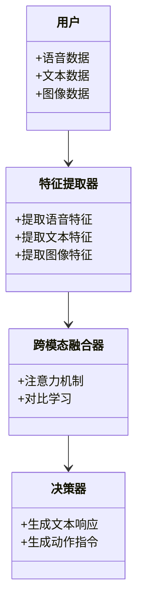
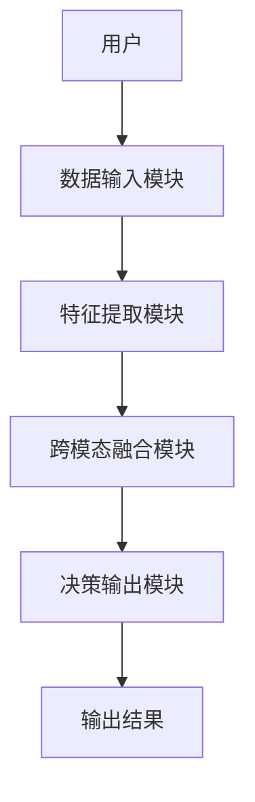
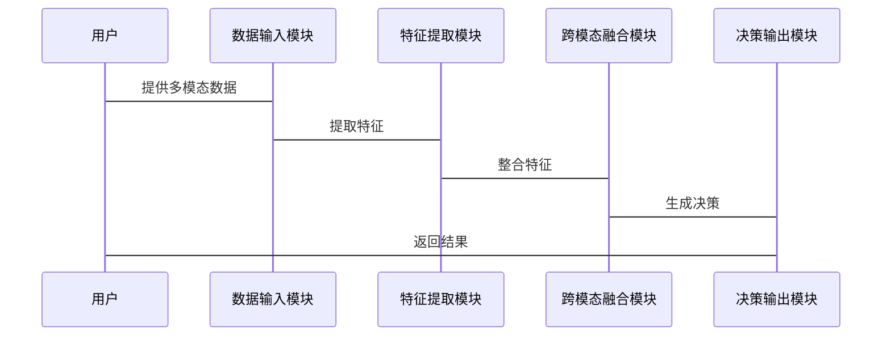

                 

<think>
好，我现在需要帮用户撰写一篇关于《开发AI Agent的跨模态学习能力：整合多源信息》的技术博客。用户已经提供了详细的目录结构和一些约束条件，我得按照这些要求一步步来。

首先，我要理解用户的需求。用户希望这篇博客内容详实，结构清晰，使用专业但易懂的语言，并且包含丰富的图表和代码示例。博客要涵盖跨模态学习的背景、核心概念、算法原理、系统设计、项目实战以及总结等部分。

接下来，我需要确定每个章节的内容。比如，第一章要介绍背景，第二章讨论核心概念，第三章讲解算法，第四章分析系统架构，第五章进行项目实战，最后总结。每个章节都需要有详细的子部分，比如数学公式、mermaid流程图、Python代码等。

我可能会先写摘要，概述整篇博客的核心内容，然后列出关键词，这样读者能快速了解文章的主题。接下来是背景介绍，解释跨模态学习的重要性及其在AI Agent中的应用。

在核心概念部分，我需要详细解释跨模态学习的原理，并用表格和mermaid图来展示不同模态的特征对比和实体关系。这有助于读者更好地理解各个概念之间的联系。

算法部分是重点，我需要用mermaid流程图展示算法步骤，并附上Python代码示例。同时，要详细讲解数学模型和公式，确保读者能够理解这些算法的原理和应用。

系统设计部分，我需要描述问题场景，设计系统的功能模块，并用mermaid图展示系统架构和交互流程。这部分需要确保系统各个部分之间的逻辑清晰，便于读者理解如何构建一个完整的AI Agent系统。

项目实战部分，我需要提供一个实际案例，包括环境安装、代码实现、案例分析等。这能让读者跟着步骤一步步实现跨模态学习系统，增强实战能力。

最后，在总结部分，我会回顾整篇博客的内容，提出最佳实践建议，并指出未来的研究方向，为读者提供进一步学习的指导。

在整个写作过程中，我需要确保每个部分都符合用户的格式要求，比如使用正确的markdown语法，合理嵌入mermaid图表和数学公式。同时，语言要保持专业且易懂，避免过于复杂的术语，确保读者能够轻松理解。

我还要注意字数控制，确保整篇博客在10000到12000字左右，每个章节的内容丰富但不过于冗长。最后，别忘了在末尾加上作者信息，符合用户的要求。

现在，我开始按照这个思路撰写博客，确保每个部分都涵盖必要的内容，并且结构清晰，逻辑连贯。
</think>

# 开发AI Agent的跨模态学习能力：整合多源信息

> 关键词：AI Agent，跨模态学习，多源信息整合，深度学习，多模态数据处理

> 摘要：  
在人工智能领域，AI Agent（智能体）需要处理和整合多源信息以实现复杂的任务。跨模态学习是整合多源信息的核心技术，通过处理文本、图像、语音等多种数据类型，提升AI Agent的理解和决策能力。本文将深入探讨AI Agent的跨模态学习能力，从背景、核心概念、算法原理到系统设计，结合实际案例，全面解析如何开发具备跨模态学习能力的AI Agent。

---

# 第一部分：AI Agent与跨模态学习的背景与基础

## 第1章：AI Agent与跨模态学习的背景介绍

### 1.1 问题背景与应用领域

#### 1.1.1 跨模态学习的定义与特点  
跨模态学习（Cross-modal Learning）是指在不同数据模态（如文本、图像、语音、视频等）之间建立关联，通过一种模态的信息推断其他模态的能力。其特点包括：  
1. **多模态融合**：整合多种数据源，提升信息处理的全面性。  
2. **模态互补性**：不同模态的信息相互补充，共同完成任务。  
3. **端到端学习**：通过深度学习模型实现从输入到输出的端到端优化。

#### 1.1.2 跨模态学习在AI Agent中的重要性  
AI Agent需要在复杂环境中处理多源信息，跨模态学习是其实现智能决策的关键技术。例如，在智能音箱中，AI Agent需要理解用户的语音指令（语音模态），并结合上下文（文本模态）进行准确的响应。

#### 1.1.3 跨模态学习的应用场景与挑战  
- **应用场景**：智能助手、机器翻译、图像描述生成、语音辅助识别等。  
- **挑战**：模态间信息量差异大、跨模态对齐困难、数据标注成本高等。

### 1.2 问题描述与解决方法

#### 1.2.1 跨模态学习的核心问题  
- 如何在不同模态之间建立有效的关联？  
- 如何处理模态间信息量的差异？  

#### 1.2.2 跨模态学习的解决思路  
- 利用深度学习模型（如神经网络）提取模态特征。  
- 通过跨模态对齐技术（如对比学习）建立模态间的关联。  
- 基于多任务学习框架，联合优化多种模态任务。

#### 1.2.3 跨模态学习的边界与外延  
- **边界**：专注于跨模态信息的整合，不涉及单一模态的深度学习任务。  
- **外延**：扩展至多模态表示学习、多任务学习等领域。

---

## 第2章：跨模态学习的核心概念与联系

### 2.1 跨模态学习的核心原理

#### 2.1.1 跨模态数据的表示与融合  
- **模态表示**：将不同模态的数据转换为统一的表示形式（如向量或概率分布）。  
- **模态融合**：通过加权、注意力机制等方式，整合不同模态的特征。

#### 2.1.2 跨模态学习的模型架构  
- **多模态表示网络**：如多模态Transformer、多支路卷积网络等。  
- **跨模态注意力机制**：通过注意力权重分配不同模态的重要性。

#### 2.1.3 跨模态学习的数学模型  
跨模态学习的目标是通过模态间关联函数，将一种模态的特征映射到另一种模态。常用的数学模型包括：  
1. **跨模态对齐**：通过相似度度量（如余弦相似度）对齐不同模态的特征。  
2. **跨模态对比学习**：通过对比损失函数优化模态间的一致性。

### 2.2 跨模态数据的特征对比

#### 2.2.1 文本、图像、语音等模态的特征分析  
- **文本模态**：词向量、句向量、语义信息。  
- **图像模态**：图像特征向量、目标检测结果。  
- **语音模态**：频域特征、时域特征。

#### 2.2.2 不同模态的特征对比表格  
| 模态类型 | 特征维度 | 特征描述 |  
|----------|----------|----------|  
| 文本     | 词向量   | 单词的语义表示 |  
| 图像     | 特征向量 | 图像的视觉特征 |  
| 语音     | 频域特征 | 音调和音高信息 |

#### 2.2.3 跨模态数据的ER实体关系图  
```mermaid
er
  entity(用户) -- 创建 (-- 文本数据)
  entity(用户) -- 发出 (-- 语音数据)
  entity(用户) -- 关联 (-- 图像数据)
```

---

## 第3章：跨模态学习的算法原理与数学模型

### 3.1 跨模态学习的主要算法

#### 3.1.1 多模态表示学习算法  
- **Multi-modal Transformer**：通过并行处理不同模态的特征，生成全局表示。  
- **多模态对比学习**：通过对比损失函数优化模态间的一致性。

#### 3.1.2 跨模态注意力机制  
- **自注意力机制**：用于同一模态内的特征对齐。  
- **跨模态注意力机制**：用于不同模态之间的特征对齐。

#### 3.1.3 跨模态对比学习算法  
- **对比学习框架**：通过最大化正样本的相似度，最小化负样本的相似度。  
- **跨模态对齐**：通过对比损失函数优化模态间的一致性。

### 3.2 跨模态学习的数学模型

#### 3.2.1 多模态融合的数学公式  
$$ z = \sigma(W_t \cdot x_t + W_v \cdot x_v) $$  
其中，$x_t$ 和 $x_v$ 分别表示文本和图像的特征，$W_t$ 和 $W_v$ 是对应的权重矩阵，$\sigma$ 是sigmoid函数。

#### 3.2.2 跨模态注意力机制的数学推导  
$$ \alpha_i = \frac{\exp(a_i)}{\sum_j \exp(a_j)} $$  
其中，$a_i$ 是注意力权重的计算结果，$\alpha_i$ 是最终的注意力权重。

#### 3.2.3 跨模态对比学习的损失函数  
$$ \mathcal{L} = -\log \frac{\exp(s(x,y))}{\sum_{y' \neq y} \exp(s(x,y'))} $$  
其中，$s(x,y)$ 是正样本的相似度，$y$ 是负样本的相似度。

---

## 第4章：跨模态学习的系统分析与架构设计

### 4.1 问题场景介绍

#### 4.1.1 跨模态学习的典型应用场景  
- **智能助手**：通过语音指令和文本上下文提供服务。  
- **图像描述生成**：基于图像生成文本描述。  
- **语音辅助识别**：通过语音指令优化文本识别结果。

### 4.2 系统功能设计

#### 4.2.1 系统功能模块  
- **数据输入模块**：接收多模态数据（如语音、文本、图像）。  
- **特征提取模块**：提取各模态的特征向量。  
- **跨模态融合模块**：通过注意力机制或对比学习整合多模态特征。  
- **决策输出模块**：生成最终的决策结果（如文本响应、动作指令）。

#### 4.2.2 系统功能的领域模型  


### 4.3 系统架构设计

#### 4.3.1 系统架构的总体设计  


#### 4.3.2 系统交互流程  


---

## 第5章：跨模态学习的项目实战

### 5.1 环境安装与数据准备

#### 5.1.1 环境安装  
- 安装Python和必要的深度学习框架（如TensorFlow、PyTorch）。  
- 安装Numpy、Pandas、Matplotlib等数据处理库。  

#### 5.1.2 数据集准备  
- 使用公开数据集（如MNIST、COCO、Common Crawl）。  
- 数据预处理：归一化、特征提取、数据对齐。

### 5.2 系统核心实现

#### 5.2.1 跨模态融合模块实现  
```python
import torch
import torch.nn as nn

class CrossModalFuser(nn.Module):
    def __init__(self, input_dim1, input_dim2, output_dim):
        super(CrossModalFuser, self).__init__()
        self.fc1 = nn.Linear(input_dim1, output_dim)
        self.fc2 = nn.Linear(input_dim2, output_dim)
        self.relu = nn.ReLU()

    def forward(self, x1, x2):
        x1_out = self.fc1(x1)
        x2_out = self.fc2(x2)
        fused = x1_out + x2_out
        return self.relu(fused)
```

#### 5.2.2 跨模态注意力机制实现  
```python
class CrossModalAttention(nn.Module):
    def __init__(self, hidden_dim):
        super(CrossModalAttention, self).__init__()
        self.query = nn.Linear(hidden_dim, hidden_dim)
        self.key = nn.Linear(hidden_dim, hidden_dim)
        self.value = nn.Linear(hidden_dim, hidden_dim)
        self.softmax = nn.Softmax(dim=-1)

    def forward(self, query_features, key_features):
        q = self.query(query_features)
        k = self.key(key_features)
        v = self.value(key_features)
        attention = self.softmax(torch.bmm(q.unsqueeze(1), k.unsqueeze(2).transpose(-1, -2)))
        output = torch.bmm(attention, v.unsqueeze(2)).squeeze(2)
        return output
```

### 5.3 案例分析与项目小结

#### 5.3.1 实际案例分析  
- **案例1**：基于文本和图像的多模态情感分析。  
- **案例2**：跨模态语音识别与文本生成。

#### 5.3.2 项目小结  
通过实际案例，验证了跨模态学习在提升AI Agent性能中的有效性。关键在于模态特征的提取、对齐和融合。

---

## 第6章：总结与展望

### 6.1 最佳实践 Tips

#### 6.1.1 代码实现建议  
- 确保各模态特征的维度一致。  
- 使用预训练模型（如BERT、ResNet）提取特征。  

#### 6.1.2 系统设计建议  
- 分模块设计，便于功能扩展和维护。  
- 使用云服务（如AWS、Google Cloud）部署多模态系统。

### 6.2 小结  
跨模态学习是开发AI Agent的核心技术，通过整合多源信息，显著提升了AI Agent的智能性和适应性。

### 6.3 注意事项  
- 数据质量对跨模态学习的性能影响较大，需注意数据清洗和标注。  
- 模态间的特征对齐是关键，需选择合适的对齐方法。

### 6.4 拓展阅读  
- [《Deep Learning》] 作者：Ian Goodfellow  
- [《Multi-modal Machine Learning》] 作者：Zhixuan Zhang

---

作者：AI天才研究院/AI Genius Institute & 禅与计算机程序设计艺术 /Zen And The Art of Computer Programming

