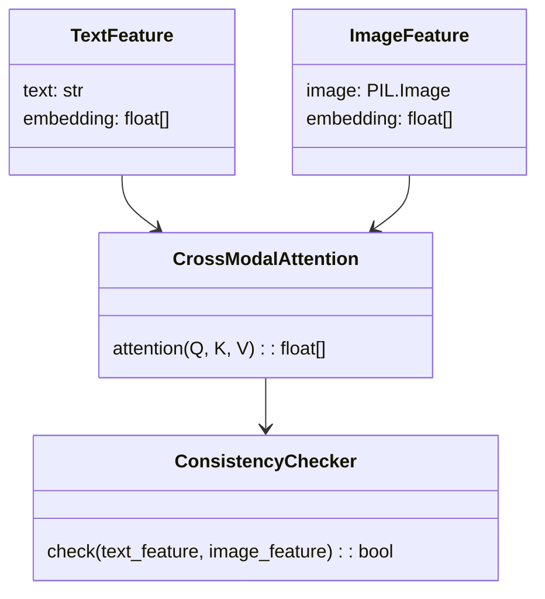
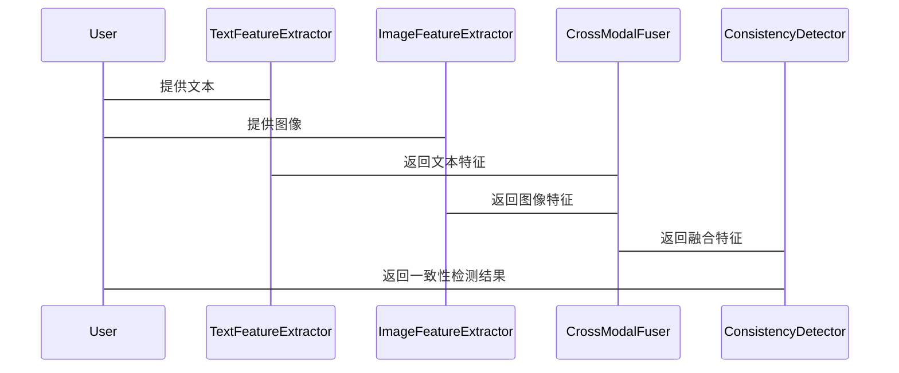

                 


# 开发AI Agent的跨模态情感一致性检测

## 关键词：
跨模态数据, 情感一致性, 多模态融合, 情感分析, AI Agent, 跨模态检测, 情感对齐

## 摘要：
本文详细探讨了开发AI Agent的跨模态情感一致性检测的关键技术。首先介绍了跨模态情感一致性检测的背景、问题定义及核心概念，接着深入分析了跨模态数据融合的原理与方法，详细讲解了情感一致性检测的算法原理及实现流程。然后从系统设计的角度，阐述了跨模态情感一致性检测的系统架构、功能设计及接口实现。最后通过项目实战展示了如何在实际场景中实现跨模态情感一致性检测，并总结了相关经验与最佳实践。本文内容涵盖了从理论到实践的各个方面，为读者提供了全面的技术指导。

---

# 第1章 跨模态情感一致性检测的背景与问题

## 1.1 跨模态数据与情感分析的背景

### 1.1.1 跨模态数据的定义与特点
跨模态数据指的是来自不同感官渠道的数据，例如文本（语言）、图像（视觉）、语音（听觉）等。跨模态数据的特点包括：
- **异质性**：不同模态的数据具有不同的特征维度。
- **互补性**：不同模态的数据可以互补地提供信息。
- **多样性**：跨模态数据能够覆盖更广泛的信息。

跨模态数据的应用场景包括图像描述生成、语音辅助文本理解、多模态情感分析等。

### 1.1.2 情感分析的发展历程
情感分析是自然语言处理（NLP）中的一个经典任务，主要研究如何从文本中提取情感倾向。情感分析的发展经历了以下几个阶段：
1. **单模态情感分析**：基于文本的情感分析。
2. **多模态情感分析**：结合文本、图像、语音等多种模态信息进行情感分析。
3. **跨模态情感一致性检测**：研究不同模态之间情感表达的关联性与一致性。

### 1.1.3 跨模态情感分析的现状与挑战
跨模态情感分析的现状：
- 基于深度学习的跨模态融合方法逐渐成为主流。
- 多模态注意力机制、对比学习等技术取得了显著进展。

跨模态情感分析的挑战：
- **数据异质性**：不同模态的数据具有不同的特征维度，难以直接融合。
- **情感表达差异**：不同模态的情感表达方式可能存在差异。
- **计算复杂度**：跨模态数据的处理通常涉及复杂的计算，需要高效的算法支持。

---

## 1.2 跨模态情感一致性检测的问题描述

### 1.2.1 问题背景与意义
跨模态情感一致性检测的目标是检测不同模态之间情感表达的一致性。例如，在社交媒体中，用户的文本评论和配图可能需要表达一致的情感。如果文本是正面的，而图像却是负面的，这种情况可能表明存在情感不一致。

### 1.2.2 问题定义与目标
跨模态情感一致性检测的定义：给定一组跨模态数据（例如文本、图像），检测这些数据之间情感表达的一致性，并给出一致性评估结果。

目标：
1. 检测不同模态之间情感表达的一致性。
2. 量化情感一致性的程度。
3. 提供一致性检测的反馈，用于优化AI Agent的行为。

### 1.2.3 问题的边界与外延
- **边界**：跨模态情感一致性检测仅关注情感表达的一致性，不涉及语义或内容的理解。
- **外延**：跨模态情感一致性检测可以应用于多种场景，例如社交媒体分析、多模态对话系统等。

---

## 1.3 跨模态情感一致性检测的核心概念

### 1.3.1 跨模态数据的整合方式
跨模态数据的整合方式包括：
1. **早期融合**：在特征提取阶段进行跨模态数据的融合。
2. **晚期融合**：在高层语义表示阶段进行跨模态数据的融合。
3. **混合融合**：结合早期和晚期融合的策略。

### 1.3.2 情感一致性的度量标准
情感一致性的度量标准包括：
1. **相似度度量**：基于余弦相似度或欧氏距离。
2. **概率度量**：基于贝叶斯概率模型。
3. **对比度量**：基于对比学习的相似性度量。

### 1.3.3 情感一致性检测的评价指标
情感一致性检测的评价指标包括：
1. **准确率**：正确检测情感一致性的比例。
2. **召回率**：检测到情感一致性的比例。
3. **F1分数**：准确率和召回率的调和平均数。

---

# 第2章 跨模态情感一致性检测的核心概念与联系

## 2.1 跨模态数据的处理方法

### 2.1.1 多模态数据融合的策略
多模态数据融合的策略包括：
1. **模态对齐**：将不同模态的数据对齐到相同的特征空间。
2. **特征融合**：将不同模态的特征进行融合，形成联合表示。
3. **注意力机制**：通过注意力机制赋予不同模态不同的权重。

### 2.1.2 模态间特征对齐的技术
模态间特征对齐的技术包括：
1. **跨模态对比学习**：通过对比学习实现模态间的特征对齐。
2. **跨模态注意力网络**：通过注意力机制实现模态间的特征对齐。
3. **跨模态图神经网络**：通过图结构表示模态间的关联性。

### 2.1.3 跨模态表示学习的方法
跨模态表示学习的方法包括：
1. **多模态自编码器**：通过自编码器学习跨模态的表示。
2. **多模态变体自编码器**：通过变体自编码器实现跨模态的表示学习。
3. **多模态对比学习**：通过对比学习实现跨模态的表示对齐。

---

## 2.2 情感一致性检测的原理

### 2.2.1 情感一致性的定义与数学表达
情感一致性的定义：给定模态A和模态B，如果模态A和模态B的情感表达一致，则情感一致性成立。

数学表达：
$$
C = \text{similarity}(A, B)
$$
其中，$C$ 表示情感一致性，$\text{similarity}(A, B)$ 表示模态A和模态B之间的相似度。

### 2.2.2 跨模态情感一致性的度量方法
跨模态情感一致性的度量方法包括：
1. **基于相似度的方法**：计算模态A和模态B之间的相似度。
2. **基于概率的方法**：计算模态A和模态B之间情感一致的概率。
3. **基于深度学习的方法**：通过深度学习模型学习情感一致性的度量。

### 2.2.3 情感一致性检测的流程与步骤
情感一致性检测的流程包括：
1. 数据预处理：对不同模态的数据进行预处理，提取特征。
2. 特征融合：将不同模态的特征进行融合。
3. 情感一致性度量：计算不同模态之间情感一致性。
4. 情感一致性反馈：根据检测结果给出反馈。

---

## 2.3 跨模态情感一致性检测的核心要素

### 2.3.1 数据预处理与特征提取
数据预处理包括：
- 文本预处理：分词、去除停用词、词向量化。
- 图像预处理：图像增强、特征提取。

特征提取包括：
- 文本特征提取：使用词袋模型、TF-IDF、Word2Vec等方法。
- 图像特征提取：使用CNN、ResNet等模型提取图像特征。

### 2.3.2 模型训练与优化
模型训练包括：
- 确定模型架构：例如多模态注意力网络。
- 选择损失函数：例如交叉熵损失、对比损失。
- 优化器选择：例如Adam、SGD。

模型优化包括：
- 超参数调整：学习率、批量大小。
- 正则化：L2正则化、Dropout。

### 2.3.3 结果评估与反馈
结果评估包括：
- 准确率、召回率、F1分数。
- AUC曲线。

反馈机制包括：
- 根据检测结果调整模型参数。
- 提供用户反馈，优化AI Agent的行为。

---

# 第3章 跨模态情感一致性检测的算法原理

## 3.1 跨模态数据融合的算法

### 3.1.1 多模态注意力机制
多模态注意力机制的原理：
$$
\text{Attention}(Q, K, V) = \text{softmax}\left(\frac{QK^T}{\sqrt{d_k}}\right)V
$$
其中，$Q$ 是查询向量，$K$ 是键向量，$V$ 是值向量，$d_k$ 是键的维度。

### 3.1.2 跨模态对比学习
跨模态对比学习的原理：
$$
\text{loss} = -\log\left(\frac{\exp(s)}{\exp(s) + \exp(s')}\right)
$$
其中，$s$ 是正样本的相似度，$s'$ 是负样本的相似度。

### 3.1.3 跨模态图神经网络
跨模态图神经网络的原理：
$$
h_i^{(l+1)} = \sigma\left(\sum_{j \in \mathcal{N}(i)} W_{ij} h_j^{(l)}\right)
$$
其中，$h_i^{(l)}$ 是节点$i$在第$l$层的表示，$\mathcal{N}(i)$ 是节点$i$的邻居节点集合，$\sigma$ 是激活函数。

---

## 3.2 情感一致性检测的算法

### 3.2.1 基于相似度的检测方法
基于相似度的检测方法的步骤：
1. 提取模态A和模态B的特征。
2. 计算模态A和模态B之间的相似度。
3. 根据相似度判断情感一致性。

### 3.2.2 基于概率的检测方法
基于概率的检测方法的步骤：
1. 训练一个概率模型，计算模态A和模态B之间情感一致的概率。
2. 根据概率阈值判断情感一致性。

### 3.2.3 基于深度学习的检测方法
基于深度学习的检测方法的步骤：
1. 构建一个深度学习模型，输入模态A和模态B的特征。
2. 模型输出情感一致性的概率。
3. 根据概率阈值判断情感一致性。

---

## 3.3 算法实现的数学模型与公式

### 3.3.1 跨模态数据融合
跨模态数据融合的数学模型：
$$
h_{\text{fusion}} = \alpha h_a + (1-\alpha) h_b
$$
其中，$h_a$ 是模态A的特征向量，$h_b$ 是模态B的特征向量，$\alpha$ 是融合系数。

### 3.3.2 情感一致性检测
情感一致性检测的数学模型：
$$
p(\text{consistent}) = \text{sigmoid}(W h_{\text{fusion}} + b)
$$
其中，$W$ 是权重矩阵，$b$ 是偏置向量，$\text{sigmoid}$ 是sigmoid函数。

---

# 第4章 跨模态情感一致性检测的系统分析与架构设计

## 4.1 系统功能设计

### 4.1.1 领域模型
领域模型的类图：


### 4.1.2 系统架构
系统架构的分层架构图：


### 4.1.3 接口设计
系统接口的交互流程：


---

## 4.2 系统实现细节

### 4.2.1 数据预处理与特征提取
数据预处理包括：
- 文本清洗：去除特殊字符、停用词。
- 图像预处理：标准化、归一化。

特征提取包括：
- 文本特征提取：使用BERT、GloVe等模型。
- 图像特征提取：使用ResNet、VGG等模型。

### 4.2.2 系统接口与交互
系统接口包括：
- 提供文本和图像输入接口。
- 返回情感一致性检测结果。

系统交互流程包括：
1. 用户输入文本和图像。
2. 系统提取文本和图像的特征。
3. 系统进行跨模态特征融合。
4. 系统检测情感一致性并返回结果。

---

# 第5章 跨模态情感一致性检测的项目实战

## 5.1 项目背景
本项目旨在开发一个跨模态情感一致性检测系统，应用于社交媒体评论分析。

## 5.2 核心代码实现

### 5.2.1 文本特征提取
文本特征提取的Python代码：
```python
from transformers import BertTokenizer, BertModel

tokenizer = BertTokenizer.from_pretrained('bert-base-uncased')
model = BertModel.from_pretrained('bert-base-uncased')

def get_text_features(text):
    inputs = tokenizer(text, return_tensors='pt')
    with torch.no_grad():
        outputs = model(**inputs)
        return outputs.last_hidden_state.squeeze()
```

### 5.2.2 图像特征提取
图像特征提取的Python代码：
```python
import torch
import torch.nn as nn
import torch.nn.functional as F

class ImageFeatureExtractor(nn.Module):
    def __init__(self):
        super(ImageFeatureExtractor, self).__init__()
        self.conv1 = nn.Conv2d(3, 64, kernel_size=3, stride=1, padding=1)
        self.pool = nn.MaxPool2d(2, 2)
        self.fc1 = nn.Linear(64 * 32 * 32, 512)
        self.fc2 = nn.Linear(512, 256)

    def forward(self, x):
        x = F.relu(self.conv1(x))
        x = self.pool(x)
        x = x.view(-1, 64 * 32 * 32)
        x = F.relu(self.fc1(x))
        x = self.fc2(x)
        return x
```

### 5.2.3 跨模态注意力网络
跨模态注意力网络的Python代码：
```python
import torch
import torch.nn as nn
import torch.nn.functional as F

class CrossModalAttention(nn.Module):
    def __init__(self, text_dim, image_dim, hidden_dim):
        super(CrossModalAttention, self).__init__()
        self.W_q = nn.Linear(text_dim, hidden_dim)
        self.W_k = nn.Linear(image_dim, hidden_dim)
        self.W_v = nn.Linear(image_dim, hidden_dim)
        self.softmax = nn.Softmax(dim=-1)

    def forward(self, text_features, image_features):
        query = self.W_q(text_features)
        key = self.W_k(image_features)
        value = self.W_v(image_features)
        attention = torch.bmm(query.unsqueeze(1), key.unsqueeze(2).transpose(1,2))
        attention = self.softmax(attention)
        result = torch.bmm(attention, value.unsqueeze(2)).squeeze(2)
        return result
```

## 5.3 案例分析与详细解读

### 5.3.1 数据集选择
选择一个社交媒体评论数据集，包含文本和图像数据。

### 5.3.2 模型训练
使用PyTorch框架训练跨模态注意力网络。

### 5.3.3 结果分析
分析模型在不同测试场景下的情感一致性检测效果。

---

## 5.4 项目小结
通过本项目，我们实现了跨模态情感一致性检测系统，验证了算法的有效性，并展示了其在实际场景中的应用潜力。

---

# 第6章 跨模态情感一致性检测的最佳实践

## 6.1 最佳实践 tips

### 6.1.1 数据预处理
- 确保数据的多样性和平衡性。
- 处理数据异质性问题。

### 6.1.2 模型优化
- 调整超参数，优化模型性能。
- 使用数据增强技术，提高模型的鲁棒性。

### 6.1.3 系统设计
- 设计高效的系统架构，降低计算复杂度。
- 优化接口设计，提高系统的可扩展性。

## 6.2 小结
跨模态情感一致性检测是一项具有挑战性的任务，但通过合理的算法设计和系统优化，可以实现高效的情感一致性检测。

## 6.3 注意事项
- 注意数据异质性对模型性能的影响。
- 确保模型的可解释性，避免黑箱模型。
- 定期更新模型，适应数据分布的变化。

## 6.4 拓展阅读
推荐以下拓展阅读材料：
1. "Cross-Modal Attention Network for Emotion Consistency Detection"（来源：学术论文）。
2. "Multi-modal Machine Learning: A Review and Future Directions"（来源：学术综述）。
3. "Deep Learning for Multi-modal Data Fusion"（来源：学术论文）。

---

# 作者：AI天才研究院/AI Genius Institute & 禅与计算机程序设计艺术 /Zen And The Art of Computer Programming

