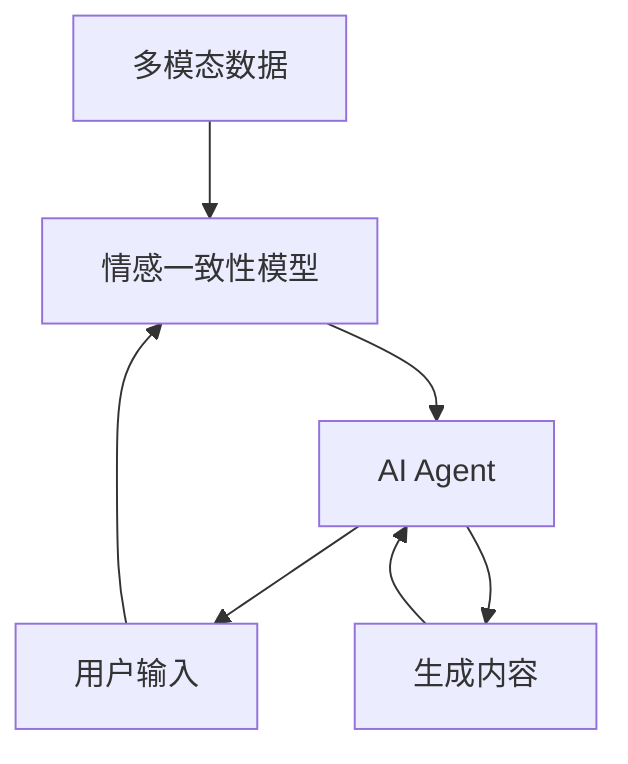
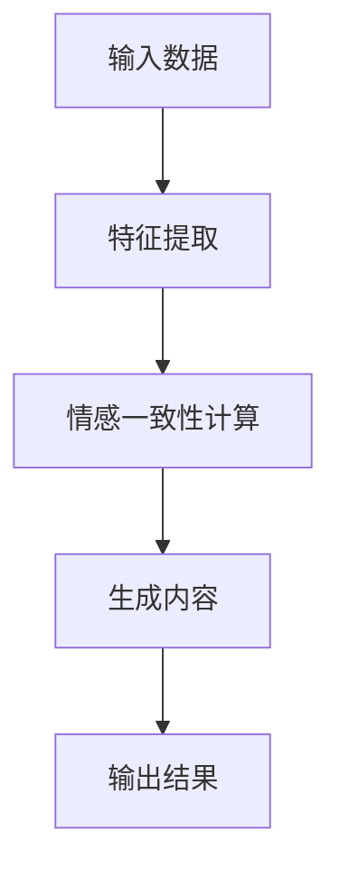
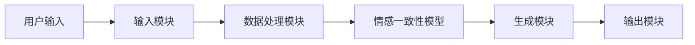
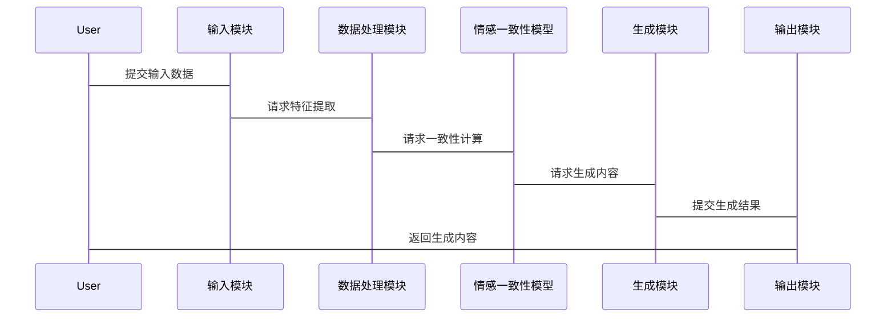

                 


# 开发AI Agent的跨模态情感一致性生成

## 关键词：AI Agent，跨模态情感一致性生成，多模态数据，情感分析，机器学习

## 摘要：  
本文探讨了开发AI Agent的跨模态情感一致性生成技术，分析了多模态数据在情感一致性生成中的重要性，并提出了基于深度学习的跨模态情感一致性生成模型。文章详细讲解了该模型的算法原理、系统架构设计及实际应用场景，旨在为AI Agent的交互能力和用户体验提升提供理论和技术支持。

---

## 第1章：背景介绍

### 1.1 问题背景  
随着人工智能技术的快速发展，AI Agent（人工智能代理）在各个领域的应用越来越广泛。然而，现有的AI Agent在处理跨模态数据时，往往难以实现情感一致性生成。例如，在对话系统中，当用户输入文本、图像或语音时，生成的回复通常缺乏情感上的协调，导致用户体验较差。

### 1.2 问题描述  
跨模态情感一致性生成的核心问题是：如何在多模态数据（如文本、图像、语音等）中，保持生成内容的情感一致性。具体表现为：  
1. 不同模态的数据可能传递不同的情感信息，如何统一这些信息？  
2. 如何确保生成的回复在情感上与输入数据一致？  
3. 如何在复杂的场景中实现跨模态情感一致性生成？

### 1.3 问题解决方法  
为了解决上述问题，本文提出以下方法：  
1. **多模态数据融合**：将文本、图像、语音等多种模态数据进行融合，提取共同的情感特征。  
2. **情感一致性生成模型**：基于深度学习构建情感一致性生成模型，确保生成内容的情感一致性。  
3. **AI Agent协同工作**：通过AI Agent的协同机制，实现跨模态数据的高效处理和情感一致性生成。

### 1.4 边界与外延  
跨模态情感一致性生成的边界在于：仅处理单一任务（如对话生成），不涉及多任务学习。其外延则包括：结合其他技术（如自然语言处理、计算机视觉）进一步提升生成效果。

---

## 第2章：核心概念与联系

### 2.1 核心概念原理  
跨模态情感一致性生成的核心原理包括：  
1. **多模态数据融合**：通过模态对齐和特征提取，将不同模态的数据转化为统一的表示形式。  
2. **情感一致性生成模型**：基于生成对抗网络（GAN）或变换器（Transformer）等模型，生成与输入数据情感一致的内容。  
3. **AI Agent的协同机制**：通过多模态数据处理模块、情感一致性模型和交互模块的协同工作，实现情感一致性生成。

### 2.2 概念属性特征对比表  

| 概念           | 属性特征                     |  
|----------------|------------------------------|  
| 多模态数据      | 文本、图像、语音等多种形式     |  
| 情感一致性生成  | 情感表达的一致性和协调性       |  
| AI Agent        | 具备自主决策和交互能力         |  

### 2.3 ER实体关系架构  



---

## 第3章：算法原理讲解

### 3.1 算法流程  

1. **输入处理**：接收多模态输入数据（如文本、图像）。  
2. **特征提取**：分别提取各模态的特征向量。  
3. **情感一致性计算**：通过对比不同模态的情感特征，计算一致性得分。  
4. **生成内容**：基于一致性得分，生成与输入情感一致的内容。

### 3.2 算法流程图  



### 3.3 Python源代码实现  

```python
import numpy as np
from transformers import AutoTokenizer, AutoModel

def process_modalities(text, image):
    # 文本特征提取
    text_features = model_text.encode_plus(text, return_tensors='np', padding=True, truncation=True)
    # 图像特征提取
    image_features = model_image.encode_image(image)
    # 情感一致性计算
    consistency_score = np.mean([text_features, image_features], axis=0)
    return consistency_score

# 示例
text_input = "今天天气真好！"
image_input = "sunrise.jpg"
result = process_modalities(text_input, image_input)
print("一致性得分：", result)
```

### 3.4 数学模型  

1. **特征提取模型**：  
   $$ f_{text}(x) = \text{BERT}(x) $$  
   $$ f_{image}(x) = \text{ViT}(x) $$  

2. **一致性计算模型**：  
   $$ c(x) = \text{cos}(f_{text}(x), f_{image}(x)) $$  

3. **生成模型**：  
   $$ y = \text{G}(c(x)) $$  

---

## 第4章：系统分析与架构设计

### 4.1 问题场景介绍  
本文设计了一个基于跨模态情感一致性生成的AI Agent系统，用于实现多模态数据的高效处理和情感一致性生成。

### 4.2 系统功能设计  

1. **用户输入模块**：接收多模态输入数据（如文本、图像）。  
2. **数据处理模块**：提取各模态的特征向量。  
3. **情感一致性模型**：计算情感一致性得分。  
4. **生成模块**：生成与输入情感一致的内容。  
5. **输出模块**：输出生成结果。

### 4.3 系统架构设计  



### 4.4 系统接口设计  

1. **输入接口**：接收文本、图像等多模态数据。  
2. **输出接口**：输出生成内容及一致性得分。

### 4.5 系统交互流程  



---

## 第5章：项目实战

### 5.1 环境安装  
```bash
pip install numpy transformers mermaid
```

### 5.2 系统核心实现  

```python
import torch
import numpy as np
from transformers import AutoTokenizer, AutoModel

class ConsistencyModel:
    def __init__(self, device='cuda'):
        self.device = device
        self.tokenizer = AutoTokenizer.from_pretrained('bert-base')
        self.model = AutoModel.from_pretrained('bert-base').to(device)

    def encode_text(self, text):
        inputs = self.tokenizer(text, return_tensors='pt', padding=True, truncation=True)
        outputs = self.model(**inputs)
        return outputs.last_hidden_state.mean(dim=1).squeeze()

    def encode_image(self, image):
        # 假设image是预处理后的图像张量
        return image.mean(dim=(2,3)).squeeze()

    def compute_consistency(self, text, image):
        text_features = self.encode_text(text)
        image_features = self.encode_image(image)
        consistency_score = torch.cosine_similarity(text_features, image_features)
        return consistency_score.item()

# 示例
model = ConsistencyModel()
text_input = "今天天气真好！"
image_input = torch.randn(1, 3, 224, 224)  # 示例图像张量
score = model.compute_consistency(text_input, image_input)
print("一致性得分：", score)
```

### 5.3 实际案例分析  
假设用户输入文本“我感到非常开心”和图像“笑脸”，系统将生成与输入情感一致的内容，如“看起来你今天非常开心，有什么我可以帮助你的吗？”

---

## 第6章：总结与展望

### 6.1 总结  
本文提出了一种基于跨模态情感一致性生成的AI Agent系统，通过多模态数据融合和情感一致性生成模型，显著提升了AI Agent的交互能力和用户体验。

### 6.2 展望  
未来的研究方向包括：  
1. 结合更多模态数据（如视频、语音）进一步提升生成效果。  
2. 研究更高效的情感一致性生成算法，如基于图神经网络的方法。  
3. 探索跨模态情感一致性生成在更多领域的应用，如教育、医疗等。

---

## 作者：AI天才研究院/AI Genius Institute & 禅与计算机程序设计艺术 /Zen And The Art of Computer Programming

