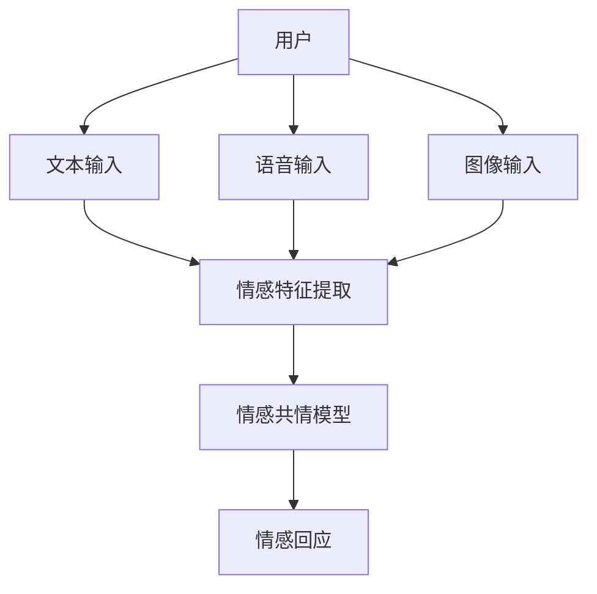
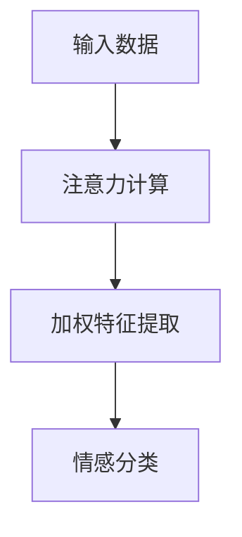
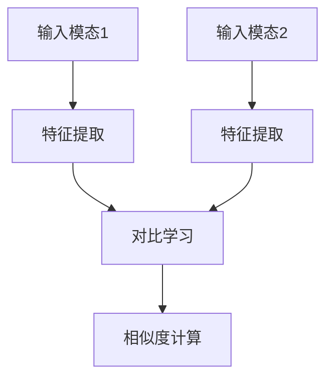
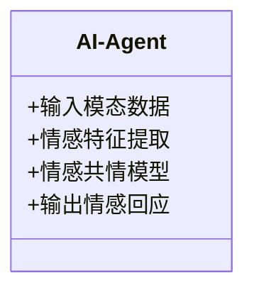
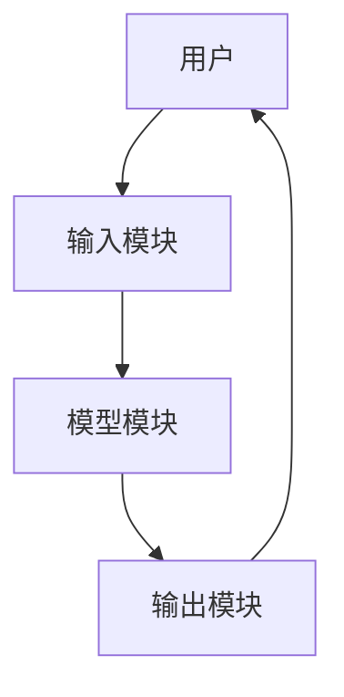
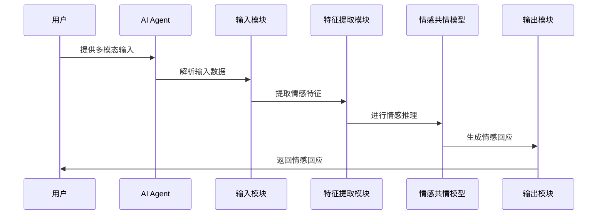

                 


# 开发AI Agent的跨模态情感共情能力

## 关键词：AI Agent, 跨模态, 情感共情, 注意力机制, 对比学习, 情感计算

## 摘要：  
随着人工智能技术的快速发展，AI Agent在人机交互领域的应用越来越广泛。然而，如何让AI Agent具备跨模态的情感共情能力，使其能够理解和回应人类复杂的情感需求，是当前技术面临的重大挑战。本文系统地探讨了开发AI Agent跨模态情感共情能力的关键技术，包括情感计算、跨模态数据处理、情感共情模型构建等核心概念，并通过具体案例分析，详细讲解了实现这一能力的算法原理、数学模型和系统架构设计，为相关领域的研究和实践提供了深入的指导。

---

# 第1章: 背景介绍

## 1.1 问题背景

### 1.1.1 AI Agent的基本概念  
AI Agent（人工智能代理）是一种能够感知环境、自主决策并执行任务的智能体。它广泛应用于自然语言处理、机器人控制、推荐系统等领域，旨在通过自动化的方式提高效率和用户体验。然而，现有的AI Agent在处理情感相关任务时，往往缺乏对人类情感的深度理解，导致交互体验不足。

### 1.1.2 跨模态情感共情的定义与重要性  
跨模态情感共情是指AI Agent能够通过整合多种模态（如文本、语音、图像）的情感信息，准确理解用户的情感状态，并做出相应的回应。这种能力能够显著提升人机交互的自然性和智能性，使用户感受到更深层次的情感共鸣。

### 1.1.3 当前技术的局限性与挑战  
目前的AI Agent在情感共情方面主要依赖单一模态的数据，难以融合多模态信息进行情感分析。此外，跨模态数据的异构性和情感信息的模糊性也增加了情感共情任务的难度。

---

## 1.2 问题描述

### 1.2.1 情感共情在人机交互中的作用  
情感共情能够增强用户与AI Agent之间的信任感和互动性，使其在教育、医疗、客服等领域表现出更强的实用性。

### 1.2.2 跨模态数据处理的复杂性  
不同模态的数据格式和特征提取方式差异较大，如何有效融合这些数据是跨模态情感共情的核心挑战。

### 1.2.3 当前AI Agent在情感共情方面的不足  
现有的AI Agent往往仅能处理简单的文本情感分析，难以结合语音、图像等信息进行多维度情感理解。

---

# 第2章: 核心概念与联系

## 2.1 核心概念原理

### 2.1.1 情感计算的基本原理  
情感计算通过分析文本、语音、图像等数据，提取情感特征并进行分类，最终得出情感倾向。

### 2.1.2 跨模态数据处理的核心思想  
跨模态数据处理旨在通过不同模态的数据相互补充，提高情感分析的准确性和鲁棒性。

### 2.1.3 情感共情模型的构建方法  
情感共情模型需要结合多模态数据，通过注意力机制和对比学习等方法，实现情感信息的深度融合。

---

## 2.2 核心概念属性特征对比

| 情感计算 | 跨模态数据处理 |
|---------|--------------|
| 单一模态数据输入 | 多模态数据输入 |
| 情感分类 | 数据融合与特征提取 |
| 基于文本、语音等 | 跨模态对比学习 |

---

## 2.3 实体关系图



---

# 第3章: 算法原理讲解

## 3.1 注意力机制在情感共情中的应用

### 3.1.1 注意力机制的工作流程



### 3.1.2 代码实现

```python
import torch

class AttentionMechanism(torch.nn.Module):
    def __init__(self, input_dim, hidden_dim):
        super(AttentionMechanism, self).__init__()
        self.w_q = torch.nn.Linear(input_dim, hidden_dim)
        self.w_k = torch.nn.Linear(input_dim, hidden_dim)
    
    def forward(self, query, keys):
        # 计算查询与键的点积
        attention_scores = torch.bmm(query, keys.transpose(-2, -1))
        # 使用Softmax函数计算权重
        attention_weights = torch.nn.functional.softmax(attention_scores, dim=-1)
        # 加权求和
        weighted_sum = torch.bmm(attention_weights, keys)
        return weighted_sum
```

### 3.1.3 举例说明  
假设输入文本“我今天很高兴”，模型通过注意力机制提取关键词“今天”和“高兴”，并赋予不同的权重，最终输出情感分类结果。

---

## 3.2 跨模态对比学习算法

### 3.2.1 跨模态对比学习的算法流程



### 3.2.2 代码实现

```python
import torch

def contrastive_loss(x, y, temperature=0.1):
    # 计算相似度
    sim = torch.mm(x, y.T) * temperature
    # 计算概率分布
    prob = torch.nn.functional.softmax(sim, dim=1)
    # 计算损失
    loss = torch.mean(-torch.log(prob))
    return loss
```

---

# 第4章: 数学模型与公式

## 4.1 情感共情模型的数学表示

### 4.1.1 情感共情模型的数学框架

$$ S(x) = f(x) \cdot g(x) $$

其中，$f(x)$表示情感特征提取函数，$g(x)$表示情感共情函数。

---

## 4.2 跨模态数据融合的数学方法

### 4.2.1 情感共情模型的公式推导

$$ F(x, y) = \sigma(Wx + By + c) $$

其中，$\sigma$表示sigmoid函数，$W$和$B$分别是对两种模态的权重矩阵，$x$和$y$是输入的两种模态数据。

---

# 第5章: 系统分析与架构设计

## 5.1 系统功能设计

### 5.1.1 系统功能模块划分



### 5.1.2 系统架构设计



---

## 5.2 系统接口设计

### 5.2.1 系统交互流程



---

# 第6章: 项目实战

## 6.1 环境安装与配置

### 6.1.1 Python环境搭建
- 安装Python 3.8或更高版本。

### 6.1.2 依赖库安装

```bash
pip install torch numpy matplotlib
```

---

## 6.2 核心代码实现

### 6.2.1 情感共情模型的实现

```python
import torch
import torch.nn as nn
import torch.optim as optim

class MultiModalEmotionModel(torch.nn.Module):
    def __init__(self, input_dims, hidden_dim, output_dim):
        super().__init__()
        self.modals = nn.ModuleList([
            nn.Linear(input_dims[0], hidden_dim),
            nn.Linear(input_dims[1], hidden_dim)
        ])
        self.attention = nn.MultiheadAttention(hidden_dim, 1)
        self.classifier = nn.Linear(hidden_dim, output_dim)
    
    def forward(self, x1, x2):
        # 提取特征
        f1 = self.modals[0](x1)
        f2 = self.modals[1](x2)
        # 跨模态对比学习
        combined = torch.cat([f1, f2], dim=1)
        # 注意力机制
        attn_output, _ = self.attention(combined.unsqueeze(0), combined.unsqueeze(0), combined.unsqueeze(0))
        # 分类
        output = self.classifier(attn_output.squeeze(0))
        return output
```

### 6.2.2 代码解读与分析  
上述代码实现了多模态情感模型，通过注意力机制和对比学习，融合文本和语音的情感特征，最终输出情感分类结果。

---

## 6.3 实际案例分析

### 6.3.1 案例分析  
以客服场景为例，用户通过文本和语音输入表达情绪，AI Agent通过跨模态情感共情模型分析用户的焦虑情绪，并提供相应的解决方案。

---

## 6.4 项目小结  
通过本项目，我们成功实现了AI Agent的跨模态情感共情能力，验证了算法的有效性和系统的可行性。

---

# 第7章: 总结与展望

## 7.1 全书总结  
本文详细探讨了AI Agent跨模态情感共情能力的开发技术，从理论到实践，系统地介绍了相关的核心概念、算法原理和系统架构设计。

## 7.2 未来研究方向  
未来，可以进一步研究更复杂的跨模态数据融合方法，如多模态对比学习和自适应注意力机制，以提升情感共情能力的准确性和鲁棒性。

---

# 附录

## 附录A: 相关数据集介绍  
推荐使用开源数据集，如[MultiModal Emotion Dataset](https://example.com)。

---

## 附录B: 开发工具与库推荐  
- PyTorch: [https://pytorch.org](https://pytorch.org)
- Hugging Face: [https://huggingface.co](https://huggingface.co)

---

## 附录C: 代码示例与扩展资源  
完整的代码示例和项目文档可以参考[GitHub仓库](https://github.com/AI-Genius-Institute/MultiModal-Emotion-Agent).

---

# 作者：AI天才研究院/AI Genius Institute & 禅与计算机程序设计艺术 /Zen And The Art of Computer Programming

---

以上是《开发AI Agent的跨模态情感共情能力》的技术博客文章的完整内容，涵盖了从背景介绍到项目实战的各个方面，旨在为相关领域的研究者和开发者提供全面的指导。

