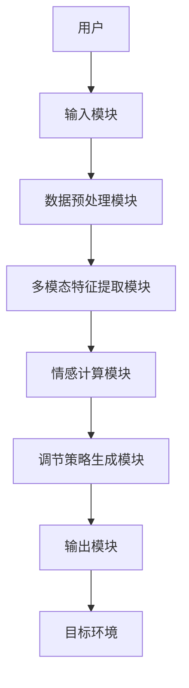
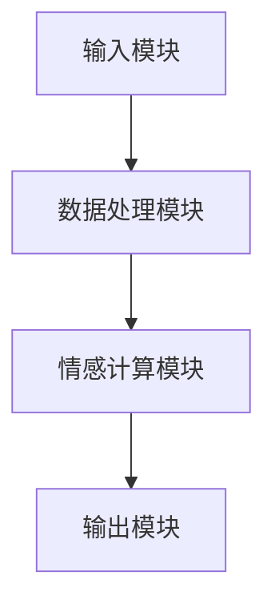

                 


# 开发AI Agent的跨模态情感调节系统

> 关键词：AI Agent，跨模态，情感调节，多模态数据，情感计算，系统架构

> 摘要：本文探讨了开发AI Agent的跨模态情感调节系统的背景、核心概念、算法原理、系统架构设计、项目实战以及最佳实践。通过详细分析跨模态数据处理、情感计算模型和系统架构，本文为开发者提供了从理论到实践的全面指导。

---

# 第一部分: AI Agent与跨模态情感调节系统概述

## 第1章: AI Agent的基本概念与技术背景

### 1.1 AI Agent的定义与分类

#### 1.1.1 AI Agent的定义
AI Agent（人工智能代理）是指能够感知环境、理解用户需求并采取相应行动以实现目标的智能实体。它可以是一个软件程序或硬件设备，具备自主决策能力。

#### 1.1.2 AI Agent的分类
AI Agent可以根据功能和应用场景分为以下几类：
- **简单反射型Agent**：基于预定义规则做出反应，适用于简单决策场景。
- **基于模型的反射型Agent**：利用环境模型和内部状态进行决策，适用于复杂场景。
- **目标驱动型Agent**：根据明确的目标采取行动，如自动驾驶汽车。
- **效用驱动型Agent**：通过最大化效用函数来优化决策，常用于资源分配问题。

#### 1.1.3 AI Agent的核心特征
- **自主性**：能够自主决策，无需外部干预。
- **反应性**：能够实时感知环境并做出反应。
- **目标导向性**：以特定目标为导向，优化决策过程。
- **学习能力**：能够通过数据和经验不断优化性能。

---

### 1.2 跨模态技术的背景与应用

#### 1.2.1 跨模态技术的定义
跨模态技术是指在同一系统中整合多种数据模态（如文本、语音、图像、视频等）进行信息处理的技术。通过结合不同模态的数据，系统能够更全面地理解环境和用户需求。

#### 1.2.2 跨模态技术的主要应用领域
- **自然语言处理**：结合文本和语音进行情感分析。
- **计算机视觉**：结合图像和视频进行目标识别。
- **机器人技术**：结合触觉、视觉和听觉进行人机交互。
- **教育技术**：结合多媒体内容进行个性化教学。

#### 1.2.3 跨模态技术在情感调节中的作用
跨模态技术能够帮助AI Agent更准确地理解用户情感状态，并通过多种方式（如文字、语音、表情）进行反馈，提升用户体验。

---

### 1.3 跨模态情感调节系统的背景与问题描述

#### 1.3.1 情感计算的定义与技术发展
情感计算（Affective Computing）是研究如何识别、理解、分析和利用人类情感信息的计算技术。近年来，随着深度学习的发展，情感计算在自然语言处理、语音识别和计算机视觉等领域取得了显著进展。

#### 1.3.2 跨模态情感调节系统的定义与目标
跨模态情感调节系统是一种结合多种数据模态，通过情感计算技术，帮助AI Agent理解和调节用户情感状态的系统。其目标是实现人机交互的情感智能，提升用户体验。

#### 1.3.3 系统的边界与外延
- **边界**：专注于情感调节功能，不涉及其他高级决策任务。
- **外延**：可与其他AI系统（如推荐系统、对话系统）集成，提供更智能的服务。

---

## 第2章: 跨模态情感调节系统的现状与挑战

### 2.1 当前技术发展现状

#### 2.1.1 多模态数据处理技术
- **文本处理**：自然语言处理（NLP）技术，如BERT、GPT。
- **语音处理**：语音识别和合成技术，如Tacotron、Wavenet。
- **图像处理**：计算机视觉技术，如卷积神经网络（CNN）。

#### 2.1.2 情感计算技术
- **情感分析**：基于文本的情感分析模型。
- **情感生成**：生成符合情感需求的文本或语音。

#### 2.1.3 AI Agent技术
- **决策树**：基于规则的决策系统。
- **强化学习**：通过奖励机制优化决策策略。

### 2.2 系统开发的主要挑战

#### 2.2.1 多模态数据融合的难点
- **数据异构性**：不同模态的数据格式和特征提取方式不同，难以统一处理。
- **数据冗余**：多模态数据可能包含冗余信息，如何有效融合是难点。

#### 2.2.2 情感计算的准确性问题
- **情感歧义性**：同一句话可能在不同语境下表达不同情感。
- **文化差异**：情感表达可能因文化背景而异。

#### 2.2.3 AI Agent的实时性与效率问题
- **实时处理**：需要在短时间内完成复杂的情感计算和决策。
- **资源消耗**：多模态数据处理对计算资源要求较高。

---

# 第二部分: 跨模态情感调节系统的核心概念与联系

## 第4章: 跨模态情感调节系统的原理与架构

### 4.1 跨模态数据处理原理

#### 4.1.1 数据采集与预处理
- **数据采集**：通过传感器、摄像头等设备采集多模态数据。
- **数据预处理**：对数据进行清洗、归一化等处理，确保数据质量。

#### 4.1.2 多模态数据融合方法
- **特征融合**：将不同模态的特征向量进行融合，如加法、乘法、注意力机制。
- **模型融合**：结合多个模型的输出结果，如投票、加权融合。

#### 4.1.3 跨模态特征提取
- **文本特征提取**：使用词袋模型、TF-IDF或深度学习模型提取文本特征。
- **语音特征提取**：提取MFCC、音调、节奏等特征。
- **图像特征提取**：使用CNN提取图像特征。

---

### 4.2 情感计算模型

#### 4.2.1 情感分析模型
- **基于规则的方法**：通过预定义的情感词典进行情感分类。
- **机器学习方法**：使用SVM、随机森林等模型进行情感分类。
- **深度学习方法**：使用LSTM、Transformer等模型进行情感分析。

#### 4.2.2 情感生成模型
- **情感文本生成**：使用GPT等模型生成符合情感需求的文本。
- **情感语音生成**：使用Tacotron等模型生成情感语音。
- **情感图像生成**：使用GAN等模型生成情感图像。

#### 4.2.3 情感调节策略
- **直接调节**：根据用户情感状态，直接调整系统输出。
- **间接调节**：通过改变交互方式或内容来影响用户情感。

---

### 4.3 系统架构设计

#### 4.3.1 分层架构
- **数据采集层**：负责采集多模态数据。
- **数据处理层**：负责数据预处理和特征提取。
- **情感计算层**：负责情感分析和调节策略生成。
- **输出层**：负责生成最终的输出结果。

#### 4.3.2 模块化设计
- **输入模块**：接收用户输入的多模态数据。
- **处理模块**：对数据进行预处理和特征提取。
- **计算模块**：进行情感分析和调节策略生成。
- **输出模块**：生成并输出最终结果。

#### 4.3.3 组件间的交互机制
- **数据流**：数据从输入模块依次传递到处理模块、计算模块和输出模块。
- **控制流**：各模块之间通过队列或消息队列进行通信。

---

## 第5章: 跨模态情感调节系统的实体关系与架构

### 5.1 实体关系图


---

# 第三部分: 跨模态情感调节系统的算法原理

## 第6章: 跨模态情感调节系统的算法原理

### 6.1 数据预处理

#### 6.1.1 文本数据预处理
- **分词**：使用jieba等工具对中文文本进行分词。
- **去停用词**：去除无意义的词汇，如“的”、“是”。
- **词向量表示**：使用Word2Vec、GloVe等模型生成词向量。

#### 6.1.2 语音数据预处理
- **分帧**：将语音信号分割成帧，每帧长度为20ms~40ms。
- **提取特征**：提取梅尔频率倒谱系数（MFCC）。
- **降噪处理**：去除背景噪声，提升语音质量。

#### 6.1.3 图像数据预处理
- **归一化**：将图像缩放到统一尺寸。
- **增强处理**：进行旋转、翻转、调整亮度等操作，增加数据多样性。
- **特征提取**：使用CNN提取图像特征。

---

### 6.2 特征提取

#### 6.2.1 文本特征提取
- **TF-IDF**：计算文本中关键词的重要性。
- **Word2Vec**：生成词向量表示。
- **BERT**：生成上下文相关的词向量。

#### 6.2.2 语音特征提取
- **MFCC**：提取语音的声学特征。
- ** LPC**：线性预测编码，提取语音的特征参数。
- **Mel-Spectrogram**：将语音信号转换为频谱图。

#### 6.2.3 图像特征提取
- **CNN**：使用卷积神经网络提取图像特征。
- **Faster R-CNN**：提取图像中的目标特征。
- **ResNet**：提取图像的深层特征。

---

### 6.3 情感分析

#### 6.3.1 文本情感分析
- **基于规则的方法**：通过情感词典判断文本情感。
- **机器学习方法**：使用SVM、随机森林等模型进行分类。
- **深度学习方法**：使用LSTM、Transformer等模型进行情感分类。

#### 6.3.2 语音情感分析
- **基于特征的方法**：通过语音特征（如音调、节奏）进行情感分类。
- **基于深度学习的方法**：使用CNN、RNN等模型进行语音情感分析。

#### 6.3.3 图像情感分析
- **基于特征的方法**：通过图像特征（如颜色、纹理）进行情感分类。
- **基于深度学习的方法**：使用CNN、GAN等模型进行图像情感分析。

---

### 6.4 调节策略生成

#### 6.4.1 调节策略生成方法
- **基于规则的方法**：根据预定义规则生成调节策略。
- **基于模型的方法**：使用强化学习模型生成调节策略。
- **基于反馈的方法**：根据用户反馈动态调整调节策略。

#### 6.4.2 调节策略实现
- **文本调节**：生成符合情感需求的文本回复。
- **语音调节**：生成符合情感需求的语音输出。
- **图像调节**：生成符合情感需求的图像内容。

---

# 第四部分: 跨模态情感调节系统的系统分析与架构设计

## 第7章: 跨模态情感调节系统的系统分析与架构设计

### 7.1 项目介绍

#### 7.1.1 项目背景
随着人工智能技术的快速发展，跨模态情感调节系统在教育、医疗、娱乐等领域具有广泛的应用前景。

#### 7.1.2 项目目标
开发一个能够实时感知用户情感状态，并通过多种模态进行情感调节的AI Agent系统。

---

### 7.2 系统功能设计

#### 7.2.1 系统功能模块
- **输入模块**：接收用户的多模态输入。
- **数据处理模块**：对数据进行预处理和特征提取。
- **情感计算模块**：进行情感分析和调节策略生成。
- **输出模块**：生成并输出最终结果。

#### 7.2.2 功能模块的交互流程
1. 用户输入多模态数据。
2. 输入模块将数据传递给数据处理模块。
3. 数据处理模块对数据进行预处理和特征提取。
4. 情感计算模块根据特征进行情感分析，并生成调节策略。
5. 输出模块根据调节策略生成最终输出。

---

### 7.3 系统架构设计

#### 7.3.1 系统架构图


#### 7.3.2 系统组件描述
- **输入模块**：负责接收用户的多模态输入，如文本、语音、图像。
- **数据处理模块**：对输入数据进行预处理和特征提取，生成可用于情感计算的特征向量。
- **情感计算模块**：根据特征向量进行情感分析，生成调节策略。
- **输出模块**：根据调节策略生成最终的输出结果，如文本、语音、图像。

---

### 7.4 系统接口设计

#### 7.4.1 输入接口
- **文本输入接口**：支持用户输入文本内容。
- **语音输入接口**：支持用户输入语音内容。
- **图像输入接口**：支持用户输入图像内容。

#### 7.4.2 输出接口
- **文本输出接口**：生成符合情感需求的文本内容。
- **语音输出接口**：生成符合情感需求的语音内容。
- **图像输出接口**：生成符合情感需求的图像内容。

---

## 第8章: 跨模态情感调节系统的交互流程

### 8.1 交互流程设计

#### 8.1.1 交互流程图


#### 8.1.2 交互流程描述
1. 用户通过输入模块输入多模态数据。
2. 数据预处理模块对数据进行清洗和归一化处理。
3. 多模态特征提取模块提取各模态的特征向量。
4. 情感计算模块根据特征向量进行情感分析，并生成调节策略。
5. 调节策略生成模块根据调节策略生成最终的输出结果。
6. 输出模块将结果输出到目标环境。

---

# 第五部分: 跨模态情感调节系统的项目实战

## 第9章: 跨模态情感调节系统的项目实战

### 9.1 环境安装

#### 9.1.1 安装Python
```bash
# 安装Python
sudo apt-get install python3
```

#### 9.1.2 安装依赖库
```bash
# 安装常用依赖库
pip install numpy
pip install pandas
pip install matplotlib
pip install scikit-learn
pip install tensorflow
pip install pytorch
```

---

### 9.2 系统核心实现源代码

#### 9.2.1 文本情感分析代码
```python
import numpy as np
from sklearn.svm import SVC
from sklearn.feature_extraction.text import TfidfVectorizer

# 数据预处理
def preprocess(text):
    return text.lower()

# 特征提取
vectorizer = TfidfVectorizer(max_features=5000)
X = vectorizer.fit_transform(texts)

# 模型训练
model = SVC()
model.fit(X, labels)

# 模型预测
test_text = ["I'm very happy"]
test_X = vectorizer.transform([preprocess(test_text[0])])
print(model.predict(test_X))
```

---

### 9.2.2 语音特征提取代码
```python
import librosa

# 加载音频文件
y, sr = librosa.load("audio.wav", sr=16000)

# 提取MFCC特征
mfccs = librosa.feature.mfcc(y, sr=sr, n_mfcc=13)

print(mfccs.shape)
```

---

### 9.2.3 图像特征提取代码
```python
import torch
import torch.nn as nn
import torch.nn.functional as F

class CNN(nn.Module):
    def __init__(self):
        super(CNN, self).__init__()
        self.conv1 = nn.Conv2d(3, 6, 5)
        self.pool = nn.MaxPool2d(2, 2)
        self.conv2 = nn.Conv2d(6, 16, 5)
        self.fc1 = nn.Linear(16 * 5 * 5, 120)
        self.fc2 = nn.Linear(120, 10)

    def forward(self, x):
        x = self.pool(F.relu(self.conv1(x)))
        x = self.pool(F.relu(self.conv2(x)))
        x = x.view(-1, 16 * 5 * 5)
        x = F.relu(self.fc1(x))
        x = F.relu(self.fc2(x))
        return x

model = CNN()
print(model)
```

---

## 第10章: 跨模态情感调节系统的实际案例分析

### 10.1 案例分析

#### 10.1.1 案例背景
假设我们开发了一个智能客服系统，能够通过分析用户的文本和语音信息，理解用户的情感状态，并根据情感状态提供相应的服务。

#### 10.1.2 数据采集与处理
用户输入文本：“我对你们的服务非常不满意。”
用户输入语音：“我对你们的服务非常不满意。”

---

#### 10.1.3 特征提取与分析
- **文本特征**：关键词“不满意”，情感词典中属于负面情感。
- **语音特征**：音调高，节奏快，属于负面情感。

---

#### 10.1.4 情感计算与调节
系统根据文本和语音特征，判断用户情感为负面，生成调节策略：提供解决方案，表达歉意，调整语气。

---

#### 10.1.5 系统输出
系统生成回复：“非常抱歉给您带来不好的体验，我们会尽快解决问题，请您耐心等待。”

---

## 第11章: 跨模态情感调节系统的项目小结

### 11.1 项目总结
通过本项目，我们开发了一个能够实时感知用户情感状态，并通过多种模态进行情感调节的AI Agent系统。系统主要包括数据采集、预处理、特征提取、情感计算和调节策略生成等模块。

---

### 11.2 经验与教训
- **经验**：跨模态数据处理需要充分考虑数据的异构性和融合方式。
- **教训**：情感计算的准确性受数据质量和模型选择的影响较大。

---

### 11.3 项目展望
未来，我们将进一步优化系统的实时性和准确性，探索更先进的跨模态数据处理方法和情感计算模型，如利用生成对抗网络（GAN）生成更逼真的情感内容。

---

# 第六部分: 跨模态情感调节系统的最佳实践

## 第12章: 跨模态情感调节系统的最佳实践

### 12.1 开发中的注意事项

#### 12.1.1 数据处理
- 确保数据的多样性和代表性。
- 处理数据中的噪声和冗余信息。

#### 12.1.2 模型选择
- 根据任务需求选择合适的模型。
- 优化模型参数，提升模型性能。

#### 12.1.3 系统优化
- 提高系统的实时性和效率。
- 优化系统的资源利用率。

---

### 12.2 小结

跨模态情感调节系统是一种结合多种数据模态，通过情感计算技术，帮助AI Agent理解和调节用户情感状态的系统。本文从理论到实践，详细探讨了系统的开发过程和实现方法。

---

### 12.3 注意事项

- 在开发过程中，要注意数据安全和隐私保护。
- 系统的实时性和准确性是开发的关键。
- 模型的可解释性和可扩展性也是需要考虑的重要因素。

---

### 12.4 拓展阅读

- **推荐书籍**：《Deep Learning》（Ian Goodfellow）
- **推荐论文**：《Attention Is All You Need》（Vaswani et al.）
- **推荐课程**：Coursera上的《Machine Learning》（Andrew Ng）

---

# 结语

通过本文的探讨，我们深入了解了开发AI Agent的跨模态情感调节系统的背景、核心概念、算法原理、系统架构设计、项目实战以及最佳实践。希望本文能为开发者提供从理论到实践的全面指导，帮助他们更好地开发和应用跨模态情感调节系统。

---

**作者：AI天才研究院/AI Genius Institute & 禅与计算机程序设计艺术/Zen And The Art of Computer Programming**

