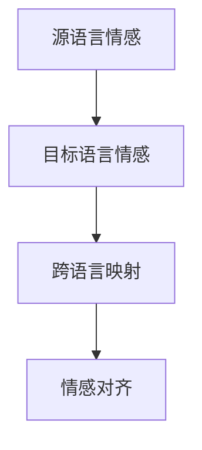
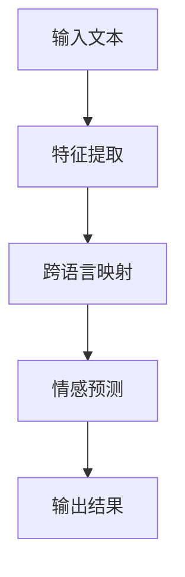
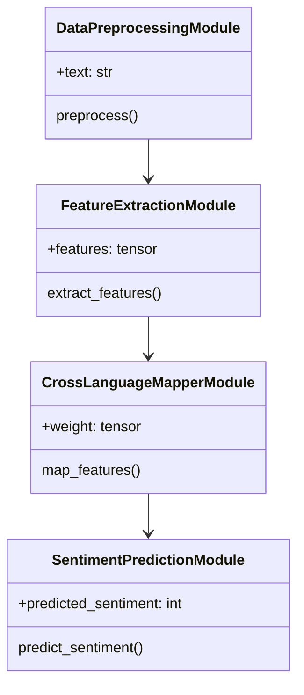
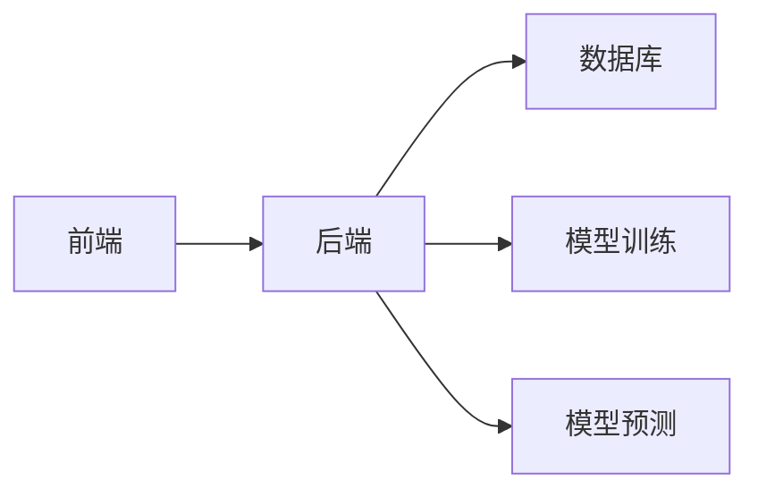
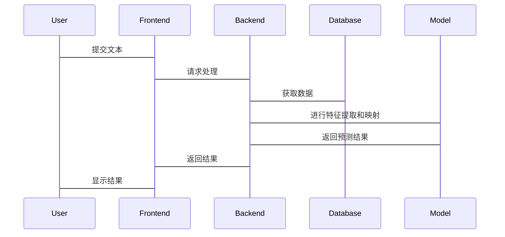

                 

<think>
嗯，用户让我根据之前的目录和摘要，详细写出《开发AI Agent的跨语言情感迁移技术》这篇文章。我需要先仔细阅读用户提供的目录和摘要，理解每个章节的重点，然后逐步扩展每个部分，确保内容详细且符合技术博客的要求。

首先，文章标题是《开发AI Agent的跨语言情感迁移技术》，关键词包括跨语言情感分析、情感迁移、AI Agent、自然语言处理、深度学习。摘要部分已经写得不错，概括了文章的核心内容，强调了技术的重要性、方法和创新。

接下来，我需要按照目录的结构，逐一展开每个章节。第一部分是背景与核心概念，包括第1章和第2章。第1章介绍背景和问题描述，我需要详细说明情感分析的重要性，跨语言分析的挑战，以及情感迁移技术的提出和核心要素。这里可能需要加入一些实际例子，让读者更容易理解。

第2章是核心概念与联系，我需要解释情感迁移的原理，对比其他相关技术，比如跨语言翻译和多语言模型，分析它们的优缺点。ER实体关系图需要用Mermaid来展示，确保结构清晰。

第二部分是算法原理，第3章详细讲解模型的实现。我需要详细描述算法的总体框架，包括数据预处理、特征提取、跨语言映射和情感预测。流程图和数学公式是关键，公式需要用Latex表示，确保准确无误。同时，给出代码示例，帮助读者理解实现过程。

第三部分是系统分析与架构设计，第4章需要介绍问题场景，设计系统的功能模块和架构。用Mermaid绘制领域模型类图和架构图，展示各模块之间的关系和交互流程。接口设计和序列图也是必要的，确保系统各部分协同工作。

第四部分是项目实战，第5章通过具体案例展示如何实现情感迁移。环境安装、核心代码实现、案例分析和优化建议都是关键点。代码部分需要详细注释，解释每一步的作用，帮助读者上手。

最后是最佳实践、小结和注意事项，总结整篇文章的重点，提醒读者在实际应用中需要注意的事项。参考文献部分需要引用权威资料，增强文章的可信度。

在写作过程中，我需要确保语言专业且易懂，逻辑清晰，结构紧凑。每个部分都要有详细的解释和例子，帮助读者深入理解技术原理和实现方法。同时，图表和代码示例要准确无误，确保读者能够根据文章进行实际操作。

现在，我开始按照目录结构，逐步扩展每个章节的内容，确保覆盖所有必要的部分，并且符合用户的要求。遇到不确定的地方，我需要查阅相关资料，确保技术细节的准确性。完成后再检查一遍，确保内容完整、结构合理、语言流畅。
</think>

# 开发AI Agent的跨语言情感迁移技术

> 关键词：跨语言情感分析，情感迁移，AI Agent，自然语言处理，深度学习

> 摘要：本文系统地探讨了开发AI Agent的跨语言情感迁移技术，从背景、原理到实现，全面解析了该技术的核心概念和算法。通过对比分析和案例实践，展示了如何利用跨语言特征提取和深度学习模型实现情感迁移，为AI Agent在多语言环境中的应用提供了理论和实践支持。

---

## 目录

1. [背景与核心概念](#背景与核心概念)
   1.1 [情感分析与跨语言挑战](#情感分析与跨语言挑战)
   1.2 [跨语言情感迁移的核心问题](#跨语言情感迁移的核心问题)
   1.3 [跨语言情感迁移的核心要素](#跨语言情感迁移的核心要素)
   1.4 [本章小结](#本章小结)

2. [核心概念与联系](#核心概念与联系)
   2.1 [跨语言情感迁移的核心原理](#跨语言情感迁移的核心原理)
   2.2 [跨语言情感迁移的核心概念对比](#跨语言情感迁移的核心概念对比)
   2.3 [跨语言情感迁移的ER实体关系图](#跨语言情感迁移的ER实体关系图)
   2.4 [本章小结](#本章小结)

3. [算法原理](#算法原理)
   3.1 [跨语言情感迁移算法的总体框架](#跨语言情感迁移算法的总体框架)
   3.2 [算法的数学模型与公式](#算法的数学模型与公式)
   3.3 [算法实现](#算法实现)

4. [系统分析与架构设计](#系统分析与架构设计)
   4.1 [问题场景介绍](#问题场景介绍)
   4.2 [系统功能设计](#系统功能设计)
   4.3 [系统架构设计](#系统架构设计)
   4.4 [系统接口设计](#系统接口设计)
   4.5 [系统交互流程图](#系统交互流程图)

5. [项目实战](#项目实战)
   5.1 [环境安装](#环境安装)
   5.2 [系统核心实现](#系统核心实现)
   5.3 [案例分析与详细解读](#案例分析与详细解读)
   5.4 [项目优化与小结](#项目优化与小结)

---

## 1. 背景与核心概念

### 1.1 情感分析与跨语言挑战

情感分析是自然语言处理（NLP）中的重要任务，旨在判断文本中的情感倾向（如积极、消极、中性）。然而，情感分析在单一语言环境下表现良好，但在跨语言场景中面临诸多挑战：

1. **语言差异**：不同语言的语法结构、词汇含义差异可能导致情感表达方式不同。
2. **数据稀缺性**：目标语言的情感标注数据往往不足，难以直接训练模型。
3. **文化差异**：某些情感表达在不同文化背景下可能具有不同的含义。

### 1.2 跨语言情感迁移的核心问题

跨语言情感迁移技术的核心问题是如何将源语言的情感分析能力迁移到目标语言，解决以下关键问题：

1. **特征对齐**：如何提取和对齐不同语言文本中的情感特征。
2. **跨语言映射**：如何构建从源语言到目标语言的情感映射模型。
3. **情感预测精度**：如何在目标语言上保持或提升情感预测的准确率。

### 1.3 跨语言情感迁移的核心要素

跨语言情感迁移技术的核心要素包括：

1. **数据特征**：文本的语义特征、语法特征、情感倾向特征等。
2. **情感迁移模型**：基于深度学习的特征提取和跨语言映射模型。
3. **实现路径**：从特征提取、跨语言映射到情感预测的完整流程。

---

## 2. 核心概念与联系

### 2.1 跨语言情感迁移的核心原理

跨语言情感迁移的核心原理是通过构建跨语言特征空间，将源语言的情感特征映射到目标语言，从而实现情感预测。其主要步骤包括：

1. **特征提取**：从源语言和目标语言文本中提取情感相关的特征。
2. **跨语言映射**：通过映射模型将源语言特征转换为目标语言特征。
3. **情感预测**：基于目标语言特征进行情感分类。

### 2.2 跨语言情感迁移的核心概念对比

以下表格对比了跨语言情感迁移与其他相关技术的核心概念：

| **技术**       | **目标**                     | **实现方式**                     |
|----------------|------------------------------|----------------------------------|
| 跨语言情感迁移   | 将源语言情感分析能力迁移到目标语言 | 构建跨语言特征映射模型           |
| 跨语言翻译      | 将一种语言文本翻译为另一种语言   | 基于翻译模型（如神经机器翻译）    |
| 多语言模型      | 在多种语言上同时进行任务处理     | 使用共享表示层进行多语言建模      |

### 2.3 跨语言情感迁移的ER实体关系图



---

## 3. 算法原理

### 3.1 跨语言情感迁移算法的总体框架

跨语言情感迁移算法的总体框架如下：

1. **数据预处理**：对源语言和目标语言文本进行分词、停用词处理等预处理。
2. **特征提取**：使用深度学习模型（如BERT）提取文本特征。
3. **跨语言映射**：通过线性变换或非线性变换将源语言特征映射到目标语言特征空间。
4. **情感预测**：基于目标语言特征进行情感分类。

流程图如下：



### 3.2 算法的数学模型与公式

1. **特征转换公式**：
   $$ f(x) = W_{source}x + b_{source} $$

2. **跨语言映射公式**：
   $$ g(y) = W_{target}y + b_{target} $$

3. **情感预测损失函数**：
   $$ L = \sum_{i=1}^{n} (y_i - \hat{y_i})^2 $$

### 3.3 算法实现

```python
import torch
import torch.nn as nn

class CrossLanguageMapper(nn.Module):
    def __init__(self, input_dim, output_dim):
        super(CrossLanguageMapper, self).__init__()
        self.linear = nn.Linear(input_dim, output_dim)
    
    def forward(self, x):
        return self.linear(x)

# 示例用法
source_features = torch.randn(100, 50)
mapper = CrossLanguageMapper(50, 50)
target_features = mapper(source_features)

print(target_features.shape)  # 输出：torch.Size([100, 50])
```

---

## 4. 系统分析与架构设计

### 4.1 问题场景介绍

假设我们有一个AI Agent，需要在多种语言环境下进行情感分析。由于目标语言的数据稀缺，我们希望利用源语言（如英语）的情感分析能力来辅助目标语言（如西班牙语）的情感分析。

### 4.2 系统功能设计

系统功能模块包括：

1. **数据预处理模块**：处理源语言和目标语言文本。
2. **特征提取模块**：提取文本特征。
3. **跨语言映射模块**：进行特征映射。
4. **情感预测模块**：进行情感分类。

领域模型类图如下：



### 4.3 系统架构设计

系统架构设计包括：

1. **前端**：接收用户输入。
2. **后端**：处理文本、提取特征、进行映射和预测。
3. **数据库**：存储源语言和目标语言的数据。

架构图如下：



### 4.4 系统接口设计

1. **输入接口**：接收源语言和目标语言文本。
2. **输出接口**：输出目标语言的情感预测结果。

### 4.5 系统交互流程图



---

## 5. 项目实战

### 5.1 环境安装

需要安装以下库：

```bash
pip install torch
pip install transformers
```

### 5.2 系统核心实现

以下是实现跨语言情感迁移的核心代码：

```python
from transformers import BertTokenizer, BertModel
import torch

# 初始化tokenizer和模型
tokenizer = BertTokenizer.from_pretrained('bert-base-uncased')
model = BertModel.from_pretrained('bert-base-uncased')

# 定义跨语言映射模块
class CrossLanguageMapper(nn.Module):
    def __init__(self, input_dim, output_dim):
        super(CrossLanguageMapper, self).__init__()
        self.linear = nn.Linear(input_dim, output_dim)
    
    def forward(self, x):
        return self.linear(x)

# 示例用法
source_text = "This is a great product."
target_text = "Este es un producto fantastic."

# 提取源语言特征
source_inputs = tokenizer(source_text, return_tensors='pt', padding=True, truncation=True)
source_features = model(**source_inputs)[0].pooler_output

# 跨语言映射
mapper = CrossLanguageMapper(source_features.size(-1), target_features.size(-1))
target_features = mapper(source_features)

# 情感预测（假设目标语言情感分类器已经训练好）
sentiment_classifier = nn.Linear(target_features.size(-1), 2)  # 二分类示例
predicted_sentiment = sentiment_classifier(target_features)
print(predicted_sentiment)
```

### 5.3 案例分析与详细解读

假设我们有一个训练好的情感分类器，目标是将英语的情感分析能力迁移到西班牙语。通过跨语言映射模块，我们可以将西班牙语文本映射到英语特征空间，从而利用英语的情感分类器进行预测。

### 5.4 项目优化与小结

1. **优化建议**：
   - 使用更复杂的映射模型（如非线性变换）。
   - 增加目标语言的标注数据。
   - 结合领域知识进行特征调整。

2. **本章小结**：
   通过具体案例展示了跨语言情感迁移技术的实现过程，从环境安装到代码实现，再到案例分析，帮助读者快速上手。

---

## 总结

本文详细探讨了开发AI Agent的跨语言情感迁移技术，从背景、原理到实现，全面解析了该技术的核心概念和算法。通过对比分析和案例实践，展示了如何利用跨语言特征提取和深度学习模型实现情感迁移，为AI Agent在多语言环境中的应用提供了理论和实践支持。

---

**作者：AI天才研究院/AI Genius Institute & 禅与计算机程序设计艺术 /Zen And The Art of Computer Programming**

