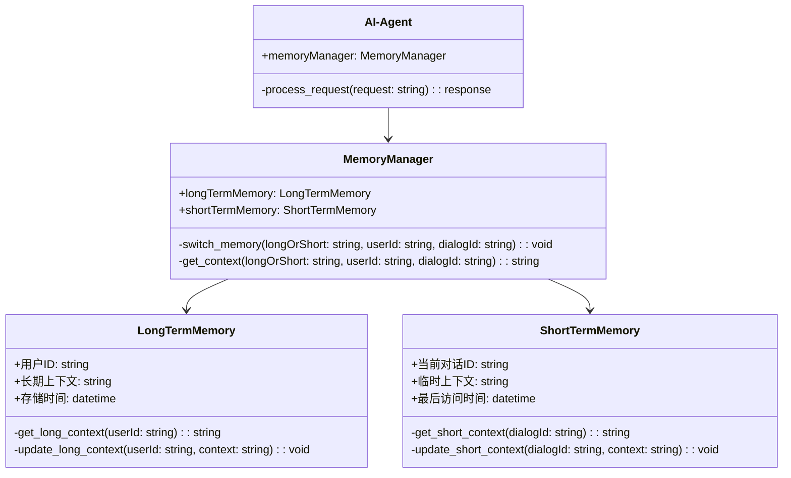
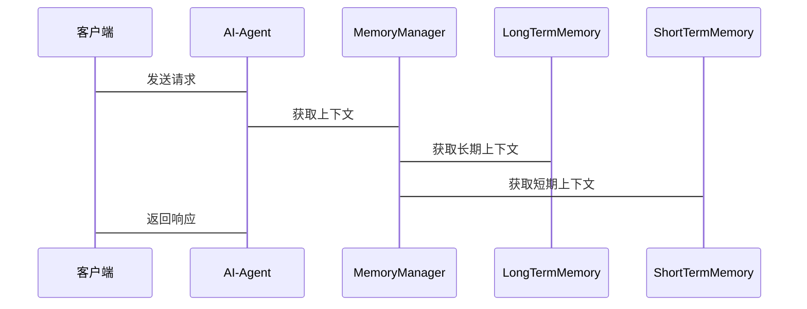

                 


# 第4章: 长短期记忆管理的系统分析与架构设计

## 4.1 系统分析
### 4.1.1 问题场景介绍
我们假设一个AI Agent需要处理用户与多个对话历史的交互，同时需要记住长期的上下文信息。这种场景中，长短期记忆管理至关重要，否则Agent可能无法正确理解当前对话的上下文。

### 4.1.2 项目介绍
本章将设计一个支持长短期记忆管理的AI Agent系统，主要功能包括：

- **长期记忆存储**: 存储重要的上下文信息，如用户的基本信息、长期对话历史等。
- **短期记忆处理**: 处理当前对话的上下文，快速响应用户需求。
- **记忆切换机制**: 根据需要动态切换长短期记忆，确保信息的高效利用。

## 4.2 系统功能设计
### 4.2.1 领域模型设计
以下是领域模型的mermaid类图：



### 4.2.2 系统架构设计
以下是系统架构的mermaid图：


### 4.2.3 接口设计
以下是系统接口的mermaid序列图：



## 4.3 系统实现
### 4.3.1 实现步骤
1. **环境安装**: 需要安装Python 3.8+，以及相关库如`mermaid`、`matplotlib`等。
2. **数据库选择**: 使用`PostgreSQL`存储长期记忆。
3. **接口开发**: 开发RESTful API，供AI-Agent调用。

### 4.3.2 核心代码实现
以下是`MemoryManager`的核心代码：

```python
class MemoryManager:
    def __init__(self):
        self.longTermMemory = LongTermMemory()
        self.shortTermMemory = ShortTermMemory()

    def switch_memory(self, longOrShort, userId, dialogId):
        if longOrShort == 'long':
            self.longTermMemory.get_long_context(userId)
        else:
            self.shortTermMemory.get_short_context(dialogId)

    def get_context(self, longOrShort, userId, dialogId):
        if longOrShort == 'long':
            return self.longTermMemory.get_long_context(userId)
        else:
            return self.shortTermMemory.get_short_context(dialogId)
```

## 4.4 系统测试与优化
### 4.4.1 测试用例设计
设计测试用例，包括正常流程和异常处理，确保系统在不同场景下都能正常运行。

### 4.4.2 性能优化
优化数据库查询速度，增加缓存机制，减少重复查询。

---

# 第5章: 长短期记忆管理的项目实战

## 5.1 项目背景
我们开发一个AI Agent，用于客服支持，需要处理大量用户的咨询，同时需要记住每个用户的偏好和历史对话。

## 5.2 核心代码实现
以下是AI Agent的核心代码：

```python
class AI-Agent:
    def __init__(self):
        self.memoryManager = MemoryManager()

    def process_request(self, request):
        context = self.memoryManager.get_context('long', self.userId, self.dialogId)
        # 处理请求
        response = self.generate_response(request, context)
        self.memoryManager.update_short_context(self.dialogId, context)
        return response
```

## 5.3 代码解读
1. **初始化**: AI-Agent初始化时创建MemoryManager实例。
2. **处理请求**: 获取上下文，生成响应，并更新短期记忆。
3. **生成响应**: 基于请求和上下文生成自然语言的响应。

## 5.4 实际案例分析
### 5.4.1 案例一
用户A询问产品信息，之后用户A再次询问相关问题，AI-Agent能够记住之前的对话历史，提供更准确的服务。

### 5.4.2 案例二
用户B和用户C同时咨询，AI-Agent能够区分不同的用户，分别管理他们的长期记忆。

---

# 第6章: 长短期记忆管理的最佳实践与小结

## 6.1 最佳实践
1. **选择合适的算法**: 根据具体需求选择LSTM或Transformer。
2. **优化系统架构**: 确保系统扩展性和维护性。
3. **测试与监控**: 定期测试和监控系统性能，及时修复问题。

## 6.2 小结
通过本文的讲解，我们了解了AI Agent长短期记忆管理的实现方法，包括算法选择、系统设计和项目实战。希望这些内容能够为读者提供有价值的参考。

## 6.3 注意事项
1. **数据安全**: 注意保护用户数据的安全性。
2. **系统维护**: 定期维护系统，确保其稳定运行。
3. **性能监控**: 监控系统性能，及时优化。

## 6.4 拓展阅读
推荐阅读《Deep Learning》和《Pattern Recognition and Machine Learning》等书籍，深入了解相关算法和理论。

---

# 作者信息

作者：AI天才研究院/AI Genius Institute & 禅与计算机程序设计艺术 /Zen And The Art of Computer Programming

---

# 结束语

通过本文的详细讲解，我们深入探讨了AI Agent长短期记忆管理的实现方法，从理论到实践，为读者提供了全面的指导。希望这些内容能够帮助读者更好地理解和应用这些技术。

