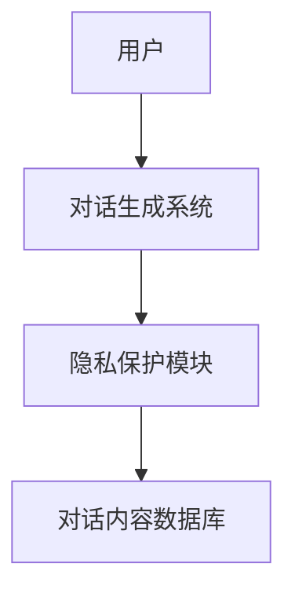

                 


# 开发AI Agent的隐私保护对话生成技术

## 关键词：AI Agent, 隐私保护, 对话生成技术, 差分隐私, 同态加密, 深度学习, 转换器模型

## 摘要：  
随着AI Agent在各个领域的广泛应用，对话生成技术的隐私保护问题变得日益重要。本文系统地探讨了如何在AI Agent中实现隐私保护的对话生成技术，涵盖了隐私保护的核心原理、对话生成技术的实现路径、算法原理、系统架构设计以及实际项目的实现与案例分析。通过本文的阐述，读者可以全面理解并掌握AI Agent隐私保护对话生成技术的核心要点与实际应用。

---

## 目录大纲

### 第一章: 背景介绍

#### 1.1 问题背景
- 1.1.1 AI Agent的定义与应用领域
  - AI Agent的基本概念
  - AI Agent在自然语言处理、智能客服、智能助手等领域的应用
- 1.1.2 对话生成技术的现状与挑战
  - 对话生成技术的发展历程
  - 当前技术的主要挑战：语义理解不足、生成内容的相关性问题、上下文连贯性问题
- 1.1.3 隐私保护的重要性与应用场景
  - 隐私泄露的潜在风险
  - 隐私保护在医疗、金融、社交等领域的关键作用

#### 1.2 问题描述
- 1.2.1 对话生成中的隐私泄露风险
  - 数据泄露的可能性
  - 对话内容可能暴露的敏感信息
- 1.2.2 用户隐私保护的需求与痛点
  - 用户对隐私保护的期望
  - 当前技术在隐私保护方面的不足
- 1.2.3 隐私保护与对话生成技术的平衡
  - 如何在保护隐私的同时生成高质量的对话内容

#### 1.3 问题解决
- 1.3.1 隐私保护对话生成的目标
  - 确保对话内容不泄露用户隐私
  - 生成与上下文相关且连贯的对话内容
- 1.3.2 技术实现路径
  - 隐私保护技术的选择与应用
  - 对话生成模型的设计与优化
- 1.3.3 评估与验证方法
  - 对话生成质量的评估指标
  - 隐私保护效果的验证方法

#### 1.4 边界与外延
- 1.4.1 隐私保护的边界
  - 隐私保护的范围与限制
  - 隐私保护与数据可用性的平衡
- 1.4.2 对话生成技术的局限性
  - 对话生成模型的泛化能力问题
  - 模型在处理复杂对话场景时的局限性
- 1.4.3 与其他技术的关联
  - 与自然语言处理（NLP）、机器学习（ML）等技术的关系

#### 1.5 概念结构与核心要素
- 1.5.1 核心概念组成
  - 隐私保护技术的核心要素：数据脱敏、差分隐私、同态加密等
  - 对话生成技术的核心要素：模型架构、训练数据、生成策略等
- 1.5.2 概念之间的关系
  - 隐私保护技术如何影响对话生成过程
  - 对话生成模型如何设计以适应隐私保护需求
- 1.5.3 核心要素的特征对比
  - 不同隐私保护技术的优缺点对比
  - 不同对话生成技术的性能对比

### 第二章: 核心概念与联系

#### 2.1 隐私保护的核心原理
- 2.1.1 数据脱敏技术
  - 数据脱敏的定义与实现方法
  - 数据脱敏在对话生成中的应用案例
- 2.1.2 差分隐私
  - 差分隐私的基本原理
  - 差分隐私在对话生成中的具体实现
- 2.1.3 同态加密
  - 同态加密的基本原理
  - 同态加密在保护对话生成数据隐私中的应用

#### 2.2 对话生成技术的核心原理
- 2.2.1 基于规则的对话生成
  - 基于规则的对话生成方法
  - 优点与局限性
- 2.2.2 统计模型驱动的对话生成
  - 统计模型驱动的对话生成方法
  - 基于马尔可夫链的生成模型
- 2.2.3 基于深度学习的对话生成
  - 基于深度学习的对话生成模型（如循环神经网络、Transformer模型）
  - 深度学习模型的优势与挑战

#### 2.3 核心概念的属性特征对比
- 2.3.1 数据脱敏与同态加密的对比
  - 数据脱敏与同态加密的优缺点对比
  - 适用场景的差异
- 2.3.2 基于规则与深度学习的对话生成对比
  - 基于规则方法的稳定性和可解释性
  - 深度学习方法的生成多样性和灵活性

#### 2.4 ER实体关系图架构


### 第三章: 算法原理

#### 3.1 对话生成算法的选择与优化
- 3.1.1 选择合适的对话生成模型
  - 基于Transformer的对话生成模型的选择理由
- 3.1.2 模型优化策略
  - 对模型的训练数据进行隐私保护处理
  - 对生成结果进行隐私过滤

#### 3.2 隐私保护算法的设计与实现
- 3.2.1 数据脱敏算法的设计
  - 数据脱敏的具体实现步骤
  - 使用Python代码实现数据脱敏功能
- 3.2.2 差分隐私算法的实现
  - 差分隐私的基本实现原理
  - 使用Python代码实现差分隐私保护的对话生成

#### 3.3 对话生成模型的数学模型与公式
- 3.3.1 Transformer模型的数学公式
  - 解释Transformer模型的编码器和解码器结构
  - 使用LaTeX公式表示模型的关键组成部分
- 3.3.2 隐私保护算法的数学模型
  - 使用LaTeX公式表示差分隐私保护的数学模型
  - 解释公式的含义与实现方式

#### 3.4 代码实现与示例
- 3.4.1 对话生成模型的代码实现
  - 使用PyTorch框架实现基于Transformer的对话生成模型
  - 代码注释与功能说明
- 3.4.2 隐私保护模块的代码实现
  - 数据脱敏与差分隐私保护的代码实现
  - 代码的功能说明与实现细节

### 第四章: 系统分析与架构设计

#### 4.1 系统需求分析
- 4.1.1 项目目标与范围
  - 系统的目标是实现隐私保护的对话生成功能
  - 系统的范围包括前端和后端的开发
- 4.1.2 功能需求
  - 对话生成功能模块
  - 隐私保护功能模块
  - 用户界面设计

#### 4.2 系统功能设计
- 4.2.1 领域模型设计
  ```mermaid
  classDiagram
    class 用户 {
      id
      对话历史
      隐私偏好
    }
    class 对话生成系统 {
      接收输入
      生成对话
      返回结果
    }
    class 隐私保护模块 {
      应用数据脱敏
      应用差分隐私
    }
    用户 --> 对话生成系统
    对话生成系统 --> 隐私保护模块
  ```

- 4.2.2 系统架构设计
  ```mermaid
  architecture
  Client --> Server: 发送对话请求
  Server --> Database: 查询用户数据
  Server --> PrivacyModule: 应用隐私保护
  Server --> DialogModel: 生成对话内容
  Server --> Client: 返回隐私保护的对话结果
  ```

- 4.2.3 系统接口设计
  - 接口1：用户发送对话请求
  - 接口2：系统调用隐私保护模块
  - 接口3：系统调用对话生成模型

#### 4.3 系统交互设计
- 4.3.1 系统交互流程
  ```mermaid
  sequenceDiagram
    用户 ->> 对话生成系统: 发送对话请求
    对话生成系统 ->> 隐私保护模块: 应用隐私保护
    隐私保护模块 ->> 对话生成系统: 返回隐私保护的数据
    对话生成系统 ->> 对话模型: 生成对话内容
    对话生成系统 ->> 用户: 返回隐私保护的对话结果
  ```

### 第五章: 项目实战

#### 5.1 环境安装与配置
- 5.1.1 安装Python与必要的库
  - 安装PyTorch、Hugging Face库等
- 5.1.2 安装与配置对话生成模型
  - 下载预训练的对话生成模型
  - 配置模型参数

#### 5.2 系统核心实现
- 5.2.1 对话生成模型的实现
  - 使用Transformer模型实现对话生成
  - 代码实现与功能说明
- 5.2.2 隐私保护模块的实现
  - 数据脱敏与差分隐私保护的代码实现
  - 功能模块的集成

#### 5.3 实际案例分析
- 5.3.1 案例背景与需求
  - 案例：医疗领域中的隐私保护对话生成
- 5.3.2 案例实现与分析
  - 对话生成系统的实现过程
  - 隐私保护效果的验证与分析
- 5.3.3 案例总结与经验分享
  - 成功经验与教训
  - 对未来工作的启示

### 第六章: 最佳实践与小结

#### 6.1 最佳实践
- 6.1.1 隐私保护技术的选择与应用
  - 根据具体场景选择合适的隐私保护技术
  - 数据脱敏与差分隐私的合理搭配
- 6.1.2 对话生成模型的优化与调优
  - 提高对话生成的质量与相关性
  - 优化模型的训练数据与生成策略

#### 6.2 小结
- 6.2.1 全文总结
  - 本文的主要内容与核心观点
  - 开发AI Agent隐私保护对话生成技术的重要性和挑战性
- 6.2.2 未来展望
  - 隐私保护对话生成技术的未来发展方向
  - 新技术与新方法的应用前景

#### 6.3 注意事项
- 6.3.1 开发中的常见问题
  - 模型训练中的过拟合问题
  - 对话生成中的隐私泄露风险
- 6.3.2 问题解决策略
  - 提高模型的泛化能力
  - 加强隐私保护技术的防护措施

#### 6.4 拓展阅读
- 6.4.1 推荐阅读的书籍与论文
  - 推荐的隐私保护技术相关书籍
  - 推荐的对话生成技术相关论文
- 6.4.2 技术博客与开源项目
  - 推荐的开源项目
  - 技术博客的阅读建议

### 作者：AI天才研究院/AI Genius Institute & 禅与计算机程序设计艺术 /Zen And The Art of Computer Programming

---

**说明：**  
上述目录大纲全面涵盖了AI Agent隐私保护对话生成技术的各个方面，从理论到实践，从算法到系统设计，确保读者能够系统地学习和掌握这一技术的核心要点。每个章节和小节都配有详细的解释和实例，帮助读者更好地理解和应用相关技术。

