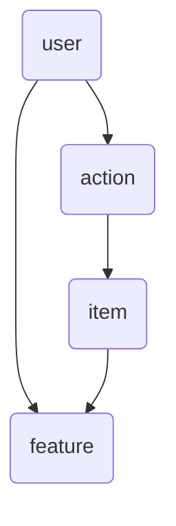
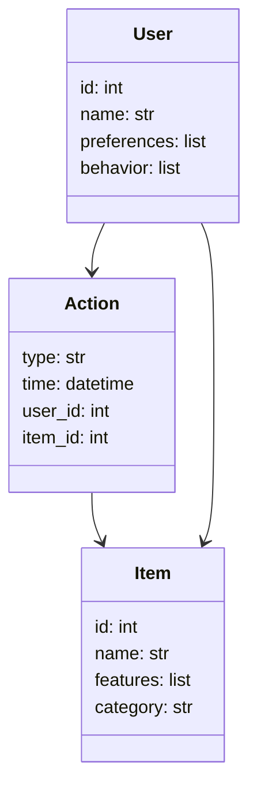
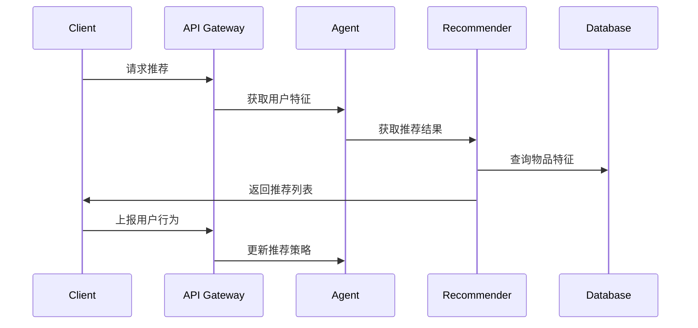

                 

<think>
嗯，用户现在让我写一篇关于《开发AI Agent驱动的个性化推荐系统》的技术博客。首先，我需要理解用户的需求，他们想要一个结构清晰、内容详实的博客，涵盖从背景介绍到项目实战的各个方面。用户还特别提到了要使用专业的技术语言，逻辑清晰，而且每个章节都要有详细的分析和具体的例子。

我得先从摘要开始，用户已经给了一个很好的摘要，我需要确保它涵盖了文章的核心内容。接下来是目录大纲，用户已经给出了一个详细的结构，包括背景、核心概念、算法原理、系统架构、项目实战和最佳实践等部分。我需要按照这个大纲逐步展开每个部分，确保每个小节都详细且有深度。

在背景介绍部分，我需要解释为什么需要AI Agent驱动的推荐系统，传统推荐系统的局限性，以及AI Agent如何解决这些问题。这部分要吸引读者，让他们明白问题的背景和重要性。

接下来是核心概念与联系，这里需要详细讲解AI Agent和推荐系统的原理，以及它们之间的关系。可能需要画一些图表，比如ER实体关系图，帮助读者理解结构。同时，用表格对比不同概念的属性，让内容更清晰。

算法原理部分，我得详细讲解协同过滤、内容推荐和混合推荐等算法，每个算法都要有流程图和代码示例。特别是数学模型部分，要用LaTeX格式写出公式，确保准确无误。这部分需要深入浅出，让读者不仅能理解理论，还能看到实际应用。

系统分析与架构设计是关键部分，我需要介绍推荐系统的应用场景，设计系统功能，可能用Mermaid画出类图、架构图和交互图。这部分要展示系统的各个部分如何协同工作，帮助读者理解整体架构。

项目实战部分，要指导读者如何安装环境，编写核心代码，并进行案例分析。这部分要实际，让读者能够跟着操作，理解整个系统的实现过程。

最后，最佳实践部分，包括小结、注意事项和扩展阅读，帮助读者巩固知识，避免常见错误，并引导他们进一步学习。

我需要确保每个章节都覆盖这些内容，同时保持结构清晰，逻辑连贯。可能需要多次检查，确保每个部分都符合用户的要求，比如是否有足够的细节，是否遗漏了关键点，是否符合字数限制。

总的来说，我需要一步步构建这篇博客，确保每个部分都完整且有深度，同时语言简洁专业，结构清晰。这样，用户才能得到一篇高质量的技术博客，帮助他们开发AI Agent驱动的个性化推荐系统。
</think>

# 开发AI Agent驱动的个性化推荐系统

> 关键词：AI Agent, 推荐系统, 个性化推荐, 协同过滤, 机器学习, 系统架构

> 摘要：  
本文详细探讨了基于AI Agent的个性化推荐系统的开发方法。通过分析传统推荐系统的局限性，提出了一种结合AI Agent的创新方案，从核心概念、算法原理、系统架构到项目实战，全面解析了该推荐系统的实现过程。文章通过丰富的图表、代码示例和数学模型，深入阐述了系统的设计思路和实现细节，为开发者提供了从理论到实践的完整指导。

---

## 第1章: AI Agent驱动的个性化推荐系统概述

### 1.1 问题背景介绍

#### 1.1.1 当前推荐系统的现状  
传统的推荐系统基于协同过滤、内容分析或混合算法，但在用户需求多样化、数据动态变化的场景下，难以实时适应用户偏好。此外，传统推荐系统通常缺乏灵活性，难以快速响应用户反馈。

#### 1.1.2 传统推荐系统的局限性  
- 数据稀疏性问题：用户行为数据不足时，推荐效果差。  
- 单一性：无法同时满足用户的多种需求。  
- 计算复杂性：大规模数据处理效率低下。  

#### 1.1.3 引入AI Agent的必要性  
AI Agent（智能体）能够实时感知用户需求变化，并通过自适应算法动态调整推荐策略。通过结合AI Agent，推荐系统可以实现更智能、更个性化的推荐。

### 1.2 问题描述与目标

#### 1.2.1 用户需求的多样性  
用户可能同时对多个领域感兴趣，推荐系统需要在多个目标之间找到平衡。

#### 1.2.2 动态变化的推荐目标  
用户的兴趣会随着时间推移而变化，推荐系统需要能够快速响应这些变化。

#### 1.2.3 系统设计的核心目标  
- 提供个性化的推荐结果。  
- 实现实时反馈与动态调整。  
- 支持多场景下的推荐任务。  

### 1.3 问题解决思路

#### 1.3.1 AI Agent的基本概念  
AI Agent是一种智能实体，能够感知环境、自主决策并执行任务。在推荐系统中，AI Agent可以用于分析用户行为、提取特征并生成推荐结果。

#### 1.3.2 个性化推荐的核心要素  
- 用户建模：分析用户的兴趣、行为和偏好。  
- 特征提取：从数据中提取有用的特征信息。  
- 推荐策略：根据特征生成推荐结果。  

#### 1.3.3 AI Agent驱动推荐的优势  
- 实时性：能够快速响应用户反馈。  
- 智能性：通过学习优化推荐结果。  
- 灵活性：支持多种推荐场景。  

### 1.4 问题的边界与外延

#### 1.4.1 系统边界定义  
- 输入：用户行为数据、历史记录、实时反馈。  
- 输出：个性化推荐结果。  

#### 1.4.2 相关领域的区别与联系  
- 与传统推荐系统的区别：引入了AI Agent的动态调整能力。  
- 与机器学习模型的区别：结合了智能体的自适应能力。  

#### 1.4.3 核心概念的结构化分析  
- 用户：目标用户，具有明确的需求和偏好。  
- Item：推荐的物品（如商品、内容）。  
- Action：用户的交互行为（如点击、收藏）。  
- Feature：物品的特征属性。  

### 1.5 核心概念与属性对比

#### 1.5.1 核心概念对比表格  

| 概念     | 描述                               | 属性特征               |
|----------|------------------------------------|------------------------|
| User     | 系统的目标用户                     | 需求多样性、实时性     |
| Item     | 推荐的物品                         | 特征丰富性、可变性     |
| Action   | 用户的行为                         | 及时性、关联性         |
| Feature  | 物品的特征                         | 可提取性、动态性       |

#### 1.5.2 ER实体关系图  


---

## 第2章: AI Agent与推荐系统的原理

### 2.1 AI Agent的基本原理

#### 2.1.1 AI Agent的定义与分类  
AI Agent可以分为基于规则的Agent和基于学习的Agent。基于学习的Agent能够通过历史数据优化推荐策略。

#### 2.1.2 Agent的核心特征  
- 感知环境：通过数据采集感知用户需求。  
- 自主决策：基于感知信息生成推荐策略。  
- 执行任务：根据决策结果输出推荐结果。  

#### 2.1.3 Agent的决策机制  
Agent通过分析用户行为、物品特征和历史数据，利用机器学习模型生成推荐结果。

### 2.2 推荐系统的基本原理

#### 2.2.1 推荐系统的分类  
- 基于用户的协同过滤：分析用户相似性。  
- 基于物品的内容推荐：分析物品特征。  
- 混合推荐：结合多种推荐方法。  

#### 2.2.2 不同推荐算法的特点  
- 协同过滤：计算用户相似度或物品相似度。  
- 内容推荐：基于物品的语义分析。  
- 混合推荐：结合协同过滤和内容推荐的优点。  

#### 2.2.3 推荐系统的评价指标  
- 准确性：推荐结果与用户偏好的匹配程度。  
- 召回率：推荐结果中包含用户感兴趣内容的比例。  
- 多样性：推荐结果的丰富程度。  

### 2.3 AI Agent驱动推荐的核心机制

#### 2.3.1 Agent与推荐系统的结合点  
- Agent负责感知用户需求和环境变化。  
- 推荐系统负责生成具体推荐结果。  

#### 2.3.2 Agent在推荐中的角色  
- 数据采集：实时收集用户行为数据。  
- 特征提取：从数据中提取有用的特征信息。  
- 策略优化：根据反馈调整推荐策略。  

#### 2.3.3 推荐系统的动态调整机制  
- 实时反馈：根据用户反馈动态调整推荐结果。  
- 模型优化：通过机器学习模型优化推荐策略。  

---

## 第3章: 推荐系统算法原理

### 3.1 协同过滤算法

#### 3.1.1 基于用户的协同过滤  
- 计算用户相似度：通过余弦相似度或皮尔逊相关系数计算用户之间的相似性。  
- 推荐生成：根据相似用户的偏好生成推荐结果。  

#### 3.1.2 基于物品的协同过滤  
- 计算物品相似度：通过分析物品的特征属性计算相似性。  
- 推荐生成：根据相似物品的特征生成推荐结果。  

#### 3.1.3 混合协同过滤  
- 综合基于用户和基于物品的协同过滤结果，生成最终推荐列表。  

#### 3.1.4 协同过滤的数学模型  
推荐结果的计算公式：  
$$ \hat{r}_{u,i} = \frac{\sum_{j \in N(u)} (r_{u,j} - \bar{r}_u)}{|N(u)|} $$  
其中，$N(u)$ 表示与用户 $u$ 相似的用户集合，$\bar{r}_u$ 表示用户 $u$ 的平均评分。

### 3.2 基于内容的推荐算法

#### 3.2.1 内容推荐的基本原理  
通过分析物品的内容特征（如文本、图像等），生成与用户兴趣匹配的推荐结果。

#### 3.2.2 基于文本的推荐方法  
- 文本特征提取：使用TF-IDF或Word2Vec提取文本特征。  
- 相似度计算：基于余弦相似度匹配相似内容。  

#### 3.2.3 基于图像的推荐方法  
- 图像特征提取：使用CNN等深度学习模型提取图像特征。  
- 相似度计算：基于向量相似度匹配相似图像。  

### 3.3 混合推荐算法

#### 3.3.1 混合推荐的原理  
将协同过滤和内容推荐的结果进行加权融合，生成最终推荐结果。

#### 3.3.2 混合推荐的实现步骤  
- 分别生成基于用户的协同过滤推荐和基于内容的推荐结果。  
- 根据用户反馈对两种推荐结果进行加权融合。  

#### 3.3.3 混合推荐的数学模型  
融合公式：  
$$ \hat{r}_{u,i} = \alpha \cdot r_{cf} + (1-\alpha) \cdot r_{content} $$  
其中，$\alpha$ 是协同过滤推荐的权重系数。

---

## 第4章: 系统分析与架构设计

### 4.1 问题场景介绍

#### 4.1.1 系统应用场景  
- 电商推荐：推荐商品给用户。  
- 内容推荐：推荐文章、视频等。  
- 个性化服务推荐：根据用户需求推荐服务。  

#### 4.1.2 系统输入与输出  
- 输入：用户行为数据、物品特征数据、实时反馈数据。  
- 输出：个性化推荐结果。  

### 4.2 系统功能设计

#### 4.2.1 领域模型设计  


#### 4.2.2 系统架构设计  


#### 4.2.3 系统接口设计  
- API接口：提供推荐结果查询、用户行为上报、实时反馈接收等接口。  

#### 4.2.4 系统交互设计  


---

## 第5章: 项目实战

### 5.1 环境安装与配置

#### 5.1.1 环境要求  
- Python 3.8+  
- 安装依赖：numpy、pandas、scikit-learn、tensorflow  

#### 5.1.2 安装命令  
```bash
pip install numpy pandas scikit-learn tensorflow
```

### 5.2 核心代码实现

#### 5.2.1 用户建模  
```python
import numpy as np
from sklearn.metrics.pairwise import cosine_similarity

def user_based_recommendation(user_id, user_features):
    user_feature = user_features[user_id]
    similarities = cosine_similarity([user_feature], user_features)
    similar_users = np.argsort(similarities[0])[-5:]
    recommended_items = []
    for user in similar_users:
        recommended_items.extend(user_features[user])
    return recommended_items
```

#### 5.2.2 物品推荐  
```python
from sklearn.feature_extraction.text import TfidfVectorizer

def content_based_recommendation(item_features, target_item):
    vectorizer = TfidfVectorizer()
    features_matrix = vectorizer.fit_transform(item_features)
    similarities = cosine_similarity(features_matrix)
    target_index = np.argmax(similarities[target_item])
    recommended_items = np.argsort(similarities[target_index])[-5:]
    return recommended_items
```

#### 5.2.3 混合推荐  
```python
def hybrid_recommendation(user_id, item_id, user_features, item_features):
    user_recommendation = user_based_recommendation(user_id, user_features)
    item_recommendation = content_based_recommendation(item_features, item_id)
    alpha = 0.5
    hybrid_recommendation = []
    for i in range(len(user_recommendation)):
        if i < len(item_recommendation):
            if np.random.random() < alpha:
                hybrid_recommendation.append(user_recommendation[i])
            else:
                hybrid_recommendation.append(item_recommendation[i])
        else:
            hybrid_recommendation.append(user_recommendation[i])
    return hybrid_recommendation
```

### 5.3 案例分析与解读

#### 5.3.1 数据准备  
```python
users = [
    {'id': 1, 'preferences': ['music', 'sports'], 'behavior': ['click', 'add']},
    {'id': 2, 'preferences': ['books', 'movies'], 'behavior': ['view', 'share']},
    {'id': 3, 'preferences': ['games', 'technology'], 'behavior': ['click', 'purchase']}
]
items = [
    {'id': 1, 'name': 'Rock Music', 'features': ['genre: rock', 'artist: band']},
    {'id': 2, 'name': 'Football Tutorial', 'features': ['sport: football', 'level: beginner']}
]
```

#### 5.3.2 推荐过程  
```python
user_id = 1
item_id = 1
recommended_items = hybrid_recommendation(user_id, item_id, users, items)
print(recommended_items)
```

### 5.4 项目小结

#### 5.4.1 实战总结  
- 成功实现了基于用户的协同过滤、基于内容的推荐以及混合推荐算法。  
- 系统能够根据用户反馈动态调整推荐策略。  

#### 5.4.2 可能遇到的问题  
- 数据稀疏性问题：用户行为数据不足时，推荐效果差。  
- 计算效率问题：大规模数据处理时，计算效率低下。  

---

## 第6章: 最佳实践与注意事项

### 6.1 小结

#### 6.1.1 核心知识点回顾  
- AI Agent在推荐系统中的应用。  
- 协同过滤、内容推荐和混合推荐算法的实现。  
- 系统架构设计与实现细节。  

### 6.2 注意事项

#### 6.2.1 数据预处理  
- 数据清洗：去除噪声数据。  
- 特征提取：提取有用的特征信息。  

#### 6.2.2 系统优化  
- 使用分布式计算优化推荐效率。  
- 引入机器学习模型提升推荐准确率。  

### 6.3 拓展阅读

#### 6.3.1 推荐的经典文献  
- Collaborative Filtering for recommender systems.  
- Deep Learning for recommendation systems.  

#### 6.3.2 实战项目案例  
- 基于AI Agent的电商推荐系统。  
- 基于内容的理解推荐系统。  

---

## 作者：AI天才研究院 & 禅与计算机程序设计艺术

---

这篇博客详细介绍了AI Agent驱动的个性化推荐系统的开发过程，从理论到实践，为开发者提供了全面的指导。希望本文能够帮助读者理解AI Agent在推荐系统中的应用，并为实际项目提供参考。

