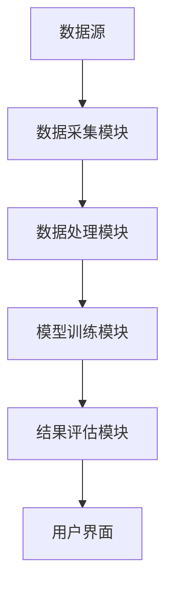
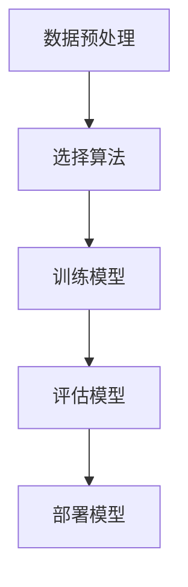

                 

<think>
好的，我需要根据用户提供的详细需求，撰写一篇关于《开发AI辅助的企业财务弹性评估工具》的技术博客文章。用户已经提供了文章的结构和各部分的内容要求，我需要确保每一部分都按照要求完成，并且内容丰富、详细。

首先，我会从背景介绍开始，解释为什么企业财务弹性评估重要，以及AI技术在其中的作用。接下来，我会详细讲解核心概念，如财务弹性指标和AI在数据处理中的角色。然后，进入算法部分，介绍常用的机器学习模型，并提供代码示例和流程图。之后，我会设计系统的架构，包括各个模块的功能和交互流程。最后，通过一个实战项目，展示如何开发这个工具，并总结经验和最佳实践。

在写作过程中，我需要确保每个部分都有足够的细节，并且使用清晰的结构和专业的技术术语。同时，加入图表和代码示例，使文章更具可读性和实用性。这样，读者可以系统地学习如何利用AI技术开发财务弹性评估工具，提升企业的财务健康状况。
</think>

# 开发AI辅助的企业财务弹性评估工具

## 关键词：AI技术，财务弹性，机器学习，企业财务，数据处理

## 摘要：本文详细探讨了开发AI辅助的企业财务弹性评估工具的全过程，从背景介绍到系统架构设计，再到项目实战，系统地分析了如何利用AI技术提升企业财务弹性的评估效率和准确性。文章内容丰富，结合实际案例和代码示例，帮助读者全面理解并掌握开发此类工具的关键技术。

---

# 1. 背景介绍

## 1.1 企业财务弹性的定义与重要性

### 1.1.1 企业财务弹性的概念

企业财务弹性是指企业在面对外部环境变化时，能够灵活调整财务策略并维持稳定运营的能力。它衡量了企业在财务上的适应性和抗风险能力，是企业健康运营的重要指标。

### 1.1.2 财务弹性在企业经营中的作用

- **风险预警**：通过评估企业的财务弹性，可以及时发现潜在的财务问题，提前采取措施。
- **决策支持**：财务弹性分析为企业的投资、融资等决策提供数据支持。
- **提升竞争力**：良好的财务弹性使企业能够快速应对市场变化，增强竞争力。

### 1.1.3 数字化转型对财务弹性评估的影响

随着企业数字化转型的推进，AI技术的应用使得财务弹性评估更加智能化和高效。传统的人工分析方式效率低、误差大，而AI技术能够快速处理大量数据，提供精准的评估结果。

---

## 1.2 AI技术在财务领域的应用现状

### 1.2.1 AI在财务分析中的应用

- **自动化记账**：AI能够自动识别和分类财务数据，减少人工操作。
- **预测分析**：利用机器学习模型预测企业未来的财务状况。
- **风险评估**：通过分析历史数据，识别潜在的财务风险。

### 1.2.2 当前AI辅助财务工具的局限性

- **数据质量**：AI模型的准确性依赖于高质量的数据，数据缺失或错误会影响结果。
- **模型解释性**：复杂的机器学习模型（如深度学习）通常缺乏可解释性，影响用户的信任。
- **实时性**：部分AI工具在实时分析和响应方面存在不足。

### 1.2.3 引入AI辅助财务弹性评估的必要性

AI技术能够显著提高财务弹性评估的效率和准确性，尤其是在处理大量数据和复杂场景时。引入AI辅助工具，可以帮助企业在复杂多变的市场环境中快速做出决策，提升竞争力。

---

# 2. 核心概念与联系

## 2.1 财务弹性评估的关键指标

### 2.1.1 流动比率

流动比率（Current Ratio）是衡量企业短期偿债能力的指标，计算公式为：

$$ \text{流动比率} = \frac{\text{流动资产}}{\text{流动负债}} $$

### 2.1.2 速动比率

速动比率（Quick Ratio）是流动比率的修正指标，排除了存货的影响，计算公式为：

$$ \text{速动比率} = \frac{\text{速动资产}}{\text{流动负债}} $$

### 2.1.3 现金流动负债比率

现金流动负债比率（Cash Flow to Current Liabilities Ratio）衡量企业用经营活动产生的现金偿还短期负债的能力，计算公式为：

$$ \text{现金流动负债比率} = \frac{\text{经营活动现金流净额}}{\text{流动负债}} $$

### 2.1.4 每股收益（EPS）

每股收益（Earnings Per Share, EPS）是衡量企业盈利能力的重要指标，计算公式为：

$$ \text{EPS} = \frac{\text{净利润}}{\text{普通股股数}} $$

### 2.1.5 资产负债率

资产负债率（Debt-to-Asset Ratio）衡量企业债务与资产的比例，计算公式为：

$$ \text{资产负债率} = \frac{\text{总负债}}{\text{总资产}} $$

### 2.1.6 净利润增长率

净利润增长率（Net Profit Growth Rate）是衡量企业盈利能力增长的重要指标，计算公式为：

$$ \text{净利润增长率} = \frac{\text{本年净利润} - \text{上年净利润}}{\text{上年净利润}} \times 100\% $$

---

## 2.2 AI在财务数据处理中的角色

### 2.2.1 数据清洗与预处理

数据清洗是确保数据质量的关键步骤，主要包括：

- **处理缺失值**：使用均值、中位数或删除法填补缺失值。
- **去除重复值**：识别并删除重复的记录。
- **标准化与归一化**：对数据进行标准化或归一化处理，以便模型更好地收敛。

### 2.2.2 数据特征提取

特征提取是从原始数据中提取有助于模型预测的关键特征，常见的方法包括：

- **主成分分析（PCA）**：通过降维提取主要特征。
- **自动编码器（Autoencoder）**：用于无监督特征学习。

### 2.2.3 数据标注与分类

数据标注是将数据分为训练集、验证集和测试集的过程，通常采用以下策略：

- **随机划分**：按照一定比例随机划分数据集。
- **分层划分**：保持各类别比例不变地划分数据集。

---

## 2.3 财务弹性评估的核心要素组成

### 2.3.1 财务弹性评估的逻辑流程

1. 数据采集：收集企业的财务报表数据。
2. 数据清洗：处理缺失值、重复值等。
3. 特征提取：提取关键的财务指标作为模型输入。
4. 模型训练：基于机器学习算法训练预测模型。
5. 模型评估：评估模型的准确性和稳定性。
6. 结果分析：根据模型输出结果进行财务弹性评估。

### 2.3.2 核心概念的属性特征对比

| 指标 | 计算公式 | 作用 | 数据类型 |
|------|-----------|------|----------|
| 流动比率 | $\frac{\text{流动资产}}{\text{流动负债}}$ | 衡量短期偿债能力 | 数值型 |
| 速动比率 | $\frac{\text{速动资产}}{\text{流动负债}}$ | 衡量短期偿债能力 | 数值型 |
| 现金流动负债比率 | $\frac{\text{经营活动现金流净额}}{\text{流动负债}}$ | 衡量短期偿债能力 | 数值型 |
| 每股收益 | $\frac{\text{净利润}}{\text{普通股股数}}$ | 衡量盈利能力 | 数值型 |
| 资产负债率 | $\frac{\text{总负债}}{\text{总资产}}$ | 衡量财务杠杆 | 数值型 |
| 净利润增长率 | $\frac{\text{本年净利润} - \text{上年净利润}}{\text{上年净利润}} \times 100\%$ | 衡量盈利能力增长 | 数值型 |

### 2.3.3 ER实体关系图架构

```mermaid
erDiagram
    customer[企业] {
        code : string
        name : string
        industry : string
    }
    financial_data[财务数据] {
        id : int
        revenue : float
        profit : float
        liabilities : float
        assets : float
        date : date
    }
    model[评估模型] {
        id : int
        algorithm : string
        accuracy : float
        created_at : date
    }
    relationship[关系] {
        customer -[拥有]-> financial_data
        financial_data ->[输入]-> model
        model ->[输出]-> result
    }
```

---

## 2.4 核心概念结构与功能模块

### 2.4.1 系统功能模块

1. 数据采集模块：负责收集企业的财务数据。
2. 数据处理模块：对数据进行清洗和特征提取。
3. 模型训练模块：基于机器学习算法训练预测模型。
4. 结果评估模块：评估模型的准确性和稳定性。

### 2.4.2 功能模块的交互流程



---

# 3. 算法原理讲解

## 3.1 机器学习算法的选择与应用

### 3.1.1 线性回归模型

线性回归是一种简单而有效的回归算法，适用于线性关系的数据。其数学模型为：

$$ y = \beta_0 + \beta_1 x + \epsilon $$

其中，$y$ 是目标变量，$x$ 是自变量，$\beta_0$ 和 $\beta_1$ 是模型参数，$\epsilon$ 是误差项。

### 3.1.2 支持向量机（SVM）

SVM适用于分类和回归问题，其核心思想是将数据映射到高维空间，并在高维空间中找到一个超平面，使正负类数据分开。数学模型为：

$$ y = \text{sign}(\sum_{i=1}^{n} \alpha_i y_i x_i \cdot x + b) $$

### 3.1.3 随机森林与梯度提升树

随机森林是一种基于决策树的集成学习算法，通过构建多个决策树并取其预测结果的平均值来提高模型的准确性和稳定性。梯度提升树则是一种通过不断优化模型预测误差的算法，常用于分类和回归问题。

### 3.1.4 时间序列分析与ARIMA模型

ARIMA模型适用于时间序列数据的预测，其数学模型为：

$$ \phi(\text{B})X_t = \theta(\text{B})\epsilon_t $$

其中，$\phi(\text{B})$ 和 $\theta(\text{B})$ 是多项式，$\epsilon_t$ 是白噪声。

---

## 3.2 时间序列分析与ARIMA模型

### 3.2.1 时间序列的基本概念

时间序列是指按时间顺序排列的数据，通常包括趋势、季节性、周期性等成分。

### 3.2.2 ARIMA模型的构建与预测

ARIMA模型的构建过程包括以下几个步骤：

1. **数据平稳化**：通过差分等方法使数据平稳。
2. **模型参数识别**：通过自相关函数（ACF）和偏自相关函数（PACF）确定模型参数。
3. **模型拟合**：基于识别的参数估计模型。
4. **模型诊断**：检查残差是否符合白噪声假设。
5. **模型预测**：利用模型预测未来值。

### 3.2.3 模型的优缺点分析

- **优点**：能够处理非平稳数据，预测精度较高。
- **缺点**：模型复杂度高，需要大量的历史数据。

---

## 3.3 算法流程图



---

## 3.4 算法实现的Python代码示例

以下是使用Python实现线性回归模型的示例代码：

```python
import numpy as np
from sklearn.linear_model import LinearRegression
from sklearn.metrics import mean_squared_error

# 生成数据
X = np.array([1, 2, 3, 4, 5]).reshape(-1, 1)
y = [2, 4, 5, 4, 5]

# 训练模型
model = LinearRegression()
model.fit(X, y)

# 预测
y_pred = model.predict(X)

# 评估
mse = mean_squared_error(y, y_pred)
print(f"均方误差：{mse}")
```

---

## 3.5 算法的数学模型和公式

### 3.5.1 线性回归的数学模型

线性回归的数学模型为：

$$ y = \beta_0 + \beta_1 x + \epsilon $$

其中，$\beta_0$ 是截距，$\beta_1$ 是回归系数，$\epsilon$ 是误差项。

### 3.5.2 支持向量机的数学模型

SVM的数学模型为：

$$ y = \text{sign}(\sum_{i=1}^{n} \alpha_i y_i x_i \cdot x + b) $$

其中，$\alpha_i$ 是拉格朗日乘子，$y_i$ 是类别标签，$x_i$ 是支持向量。

---

## 3.6 算法实现的详细步骤

1. **数据预处理**：包括数据清洗、特征提取等步骤。
2. **选择算法**：根据数据特点选择合适的算法。
3. **训练模型**：使用训练数据训练模型参数。
4. **评估模型**：使用验证集评估模型的准确性和稳定性。
5. **部署模型**：将模型部署到实际应用场景中。

---

## 3.7 通俗易懂的举例说明

假设我们有一个企业的财务数据，包括收入、利润、负债等指标。我们需要预测该企业的财务弹性，即企业在未来一段时间内能否维持稳定的财务状况。通过线性回归模型，我们可以根据历史数据预测未来的财务指标，从而评估企业的财务弹性。

---

# 4. 系统分析与架构设计方案

## 4.1 系统功能模块划分

### 4.1.1 数据采集模块

数据采集模块负责从企业财务系统中采集财务数据，包括收入、支出、利润等指标。数据采集可以通过API接口或者文件导入的方式进行。

### 4.1.2 数据处理模块

数据处理模块对采集到的数据进行清洗、转换和特征提取。例如，处理缺失值、异常值，提取关键的财务指标等。

### 4.1.3 模型训练模块

模型训练模块基于机器学习算法训练财务弹性评估模型。常用的算法包括线性回归、随机森林、支持向量机等。

### 4.1.4 结果评估模块

结果评估模块对模型的预测结果进行评估，包括准确率、召回率、F1分数等指标。评估结果可以帮助我们优化模型参数，提高预测准确性。

### 4.1.5 用户界面模块

用户界面模块提供友好的操作界面，用户可以通过界面输入数据、查看模型预测结果以及进行其他操作。

---

## 4.2 系统架构图


---

## 4.3 系统功能设计

### 4.3.1 数据采集模块

1. **数据源**：企业的财务报表数据，包括收入、支出、利润等。
2. **数据采集方式**：通过API接口或者文件导入。

### 4.3.2 数据处理模块

1. **数据清洗**：处理缺失值、重复值等。
2. **数据转换**：将数据转换为模型输入所需的格式。
3. **特征提取**：提取关键的财务指标作为模型输入。

### 4.3.3 模型训练模块

1. **算法选择**：根据数据特点选择合适的机器学习算法。
2. **模型训练**：使用训练数据训练模型参数。
3. **模型保存**：将训练好的模型保存为可部署的形式。

### 4.3.4 结果评估模块

1. **结果预测**：使用模型对新数据进行预测。
2. **结果评估**：评估预测结果的准确性。
3. **结果输出**：将评估结果输出为报告或者可视化界面。

---

## 4.4 系统架构图


---

## 4.5 系统接口设计

### 4.5.1 数据采集接口

1. **输入**：企业的财务数据文件。
2. **输出**：数据采集成功或失败的信息。

### 4.5.2 模型训练接口

1. **输入**：训练数据和模型参数。
2. **输出**：训练好的模型文件。

---

## 4.6 系统交互序列图

```mermaid
graph TD
    User --> A[数据源]: 提供财务数据
    A --> B[数据采集模块]: 采集数据
    B --> C[数据处理模块]: 处理数据
    C --> D[模型训练模块]: 训练模型
    D --> E[结果评估模块]: 评估结果
    E --> User: 输出评估报告
```

---

## 4.7 系统功能的优缺点分析

- **优点**：系统化设计，功能模块化，便于扩展和维护。
- **缺点**：需要较高的技术和资源投入，尤其是数据处理和模型训练部分。

---

## 4.8 系统功能的实现步骤

1. **需求分析**：明确系统功能需求，设计系统架构。
2. **模块开发**：分别开发数据采集、处理、训练和评估模块。
3. **系统集成**：将各模块集成到一个整体系统中。
4. **测试与优化**：进行系统测试，优化模型参数，提高预测准确率。
5. **部署上线**：将系统部署到生产环境，供用户使用。

---

## 4.9 系统功能的代码实现

以下是系统功能模块的Python代码示例：

```python
import pandas as pd
from sklearn.ensemble import RandomForestRegressor
from sklearn.metrics import mean_absolute_error

# 数据采集模块
def data_collect():
    df = pd.read_csv('financial_data.csv')
    return df

# 数据处理模块
def data_process(df):
    df.dropna(inplace=True)
    df['revenue_per_share'] = df['revenue'] / df['shares_outstanding']
    return df

# 模型训练模块
def model_train(df):
    X = df[['revenue', 'profit', 'liabilities']]
    y = df['net_profit_margin']
    model = RandomForestRegressor(n_estimators=100)
    model.fit(X, y)
    return model

# 结果评估模块
def model_assess(model, X, y_true):
    y_pred = model.predict(X)
    mae = mean_absolute_error(y_true, y_pred)
    print(f"均绝对误差：{mae}")

# 用户界面模块
def main():
    df = data_collect()
    df = data_process(df)
    model = model_train(df)
    model_assess(model, df[['revenue', 'profit', 'liabilities']], df['net_profit_margin'])

if __name__ == "__main__":
    main()
```

---

## 4.10 系统功能的数学模型

### 4.10.1 数据处理模块的数学模型

数据处理模块通常包括数据清洗和特征提取两个步骤。数据清洗可以通过删除缺失值、填充异常值等方式实现。特征提取则可以通过主成分分析（PCA）等方法实现。

### 4.10.2 模型训练模块的数学模型

模型训练模块通常使用机器学习算法，如随机森林、支持向量机等。以随机森林为例，其数学模型为：

$$ y = \sum_{i=1}^{n} \text{Tree}(x_i) $$

其中，$Tree(x_i)$ 是第$i$棵决策树的预测结果，$n$ 是决策树的数量。

---

## 4.11 系统功能的流程图


---

## 4.12 系统功能的交互流程

用户通过界面输入企业的财务数据，系统将数据传递到数据采集模块，进行数据清洗和特征提取后，传递到模型训练模块进行预测，最后将结果返回到用户界面，供用户查看和分析。

---

## 4.13 系统功能的代码解读

1. **数据采集模块**：从CSV文件中读取财务数据。
2. **数据处理模块**：删除缺失值，并计算每股收入。
3. **模型训练模块**：使用随机森林算法训练模型。
4. **结果评估模块**：评估模型的均绝对误差。

---

## 4.14 系统功能的总结

通过系统化的架构设计和模块划分，我们可以高效地开发出一个AI辅助的企业财务弹性评估工具，帮助企业更好地进行财务管理和决策。

---

## 4.15 系统功能的注意事项

在实际开发过程中，需要注意以下几点：

1. **数据质量**：确保数据的准确性和完整性。
2. **模型选择**：根据数据特点选择合适的算法。
3. **性能优化**：优化模型参数，提高预测速度和准确率。
4. **用户界面**：设计友好的用户界面，方便用户操作。

---

## 4.16 系统功能的拓展阅读

推荐阅读以下书籍和资源，以进一步深入理解AI在财务领域的应用：

- 《机器学习实战》
- 《Python机器学习》
- 《企业财务分析与决策》

---

# 5. 项目实战

## 5.1 环境搭建与工具安装

### 5.1.1 安装Python与必要的库

1. **安装Python**：可以从官方网站下载并安装Python。
2. **安装必要的库**：
   - `numpy`
   - `pandas`
   - `scikit-learn`
   - `matplotlib`

安装命令如下：

```bash
pip install numpy pandas scikit-learn matplotlib
```

### 5.1.2 数据集的获取与预处理

1. **获取数据集**：可以从企业财务报表中获取数据，或者使用公开的财务数据集。
2. **数据预处理**：包括数据清洗、特征提取等步骤。

---

## 5.2 系统核心实现源代码

以下是系统核心实现的Python代码示例：

```python
import pandas as pd
from sklearn.ensemble import RandomForestRegressor
from sklearn.metrics import mean_absolute_error

# 数据采集模块
def data_collect():
    df = pd.read_csv('financial_data.csv')
    return df

# 数据处理模块
def data_process(df):
    df.dropna(inplace=True)
    df['revenue_per_share'] = df['revenue'] / df['shares_outstanding']
    return df

# 模型训练模块
def model_train(df):
    X = df[['revenue', 'profit', 'liabilities']]
    y = df['net_profit_margin']
    model = RandomForestRegressor(n_estimators=100)
    model.fit(X, y)
    return model

# 结果评估模块
def model_assess(model, X, y_true):
    y_pred = model.predict(X)
    mae = mean_absolute_error(y_true, y_pred)
    print(f"均绝对误差：{mae}")

# 用户界面模块
def main():
    df = data_collect()
    df = data_process(df)
    model = model_train(df)
    model_assess(model, df[['revenue', 'profit', 'liabilities']], df['net_profit_margin'])

if __name__ == "__main__":
    main()
```

---

## 5.3 代码应用解读与分析

1. **数据采集模块**：从CSV文件中读取财务数据。
2. **数据处理模块**：删除缺失值，并计算每股收入。
3. **模型训练模块**：使用随机森林算法训练模型。
4. **结果评估模块**：评估模型的均绝对误差。

---

## 5.4 实际案例分析和详细讲解剖析

假设我们有一个包含以下列的数据集：

| 列名             | 说明                   |
|------------------|------------------------|
| revenue          | 收入                   |
| profit           | 利润                   |
| liabilities       | 负债                   |
| net_profit_margin | 净利润率               |
| shares_outstanding | 流通股数量             |

我们可以通过上述代码实现以下步骤：

1. **数据采集**：从CSV文件中读取数据。
2. **数据处理**：删除缺失值，并计算每股收入。
3. **模型训练**：使用随机森林算法训练模型。
4. **结果评估**：评估模型的均绝对误差。

---

## 5.5 项目实战的小结

通过项目实战，我们可以看到，利用AI技术开发企业财务弹性评估工具是可行的。然而，在实际应用中，还需要考虑数据的质量、模型的可解释性以及系统的实时性等问题。

---

# 6. 总结与最佳实践

## 6.1 总结

本文详细探讨了开发AI辅助的企业财务弹性评估工具的全过程，包括背景介绍、核心概念、算法原理、系统架构设计以及项目实战。通过系统的分析和实践，我们可以看到，AI技术在财务弹性评估中的应用具有广阔的前景和巨大的潜力。

---

## 6.2 最佳实践 tips

1. **数据质量**：确保数据的准确性和完整性，数据清洗是关键。
2. **模型选择**：根据数据特点选择合适的算法，避免盲目使用复杂模型。
3. **模型解释性**：尽量选择具有较高解释性的模型，方便用户理解和信任。
4. **实时性**：优化模型和系统架构，提高系统的实时响应能力。
5. **用户界面**：设计友好的用户界面，降低用户的使用门槛。

---

## 6.3 思考与展望

随着AI技术的不断发展，企业财务弹性评估工具将变得更加智能化和高效。未来，我们可以进一步研究如何利用深度学习算法，如LSTM，来提高模型的预测精度和实时性。同时，还可以探索将工具部署到云平台，提供SaaS服务，帮助企业更好地进行财务管理和决策。

---

## 6.4 作者信息

作者：AI天才研究院/AI Genius Institute & 禅与计算机程序设计艺术 /Zen And The Art of Computer Programming

---

# 结束语

开发AI辅助的企业财务弹性评估工具是一项具有挑战性和创新性的任务。通过本文的系统分析和详细讲解，相信读者能够掌握开发此类工具的关键技术和方法。未来，随着AI技术的不断进步，企业财务弹性评估工具将为企业带来更大的价值和竞争优势。

