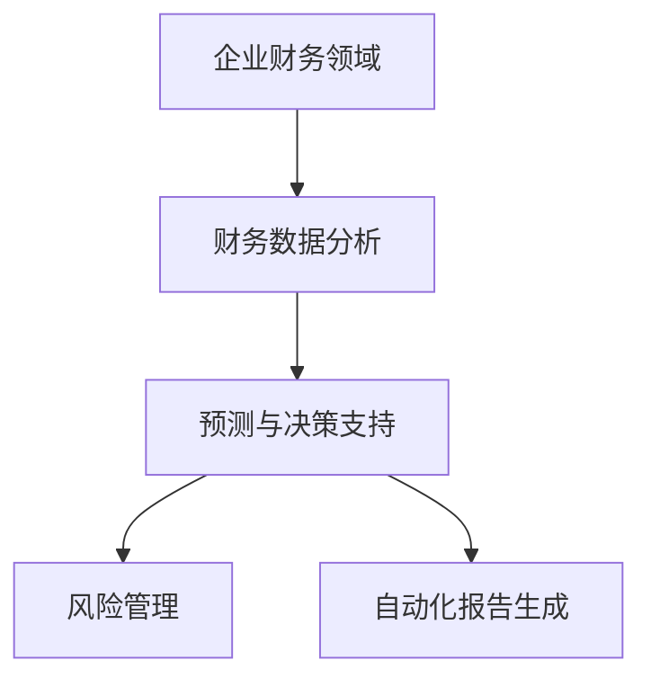
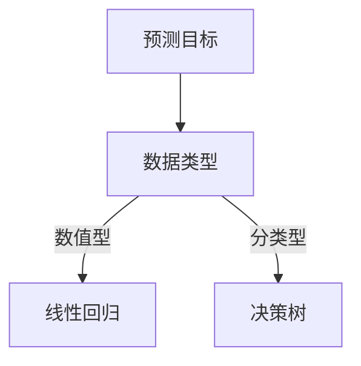
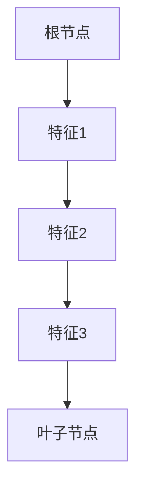

                 


# 开发AI辅助的企业财务战略规划工具

> 关键词：AI辅助工具、企业财务、战略规划、机器学习、算法实现、系统架构

> 摘要：本文详细探讨了开发AI辅助的企业财务战略规划工具的过程，从背景分析到技术实现，再到系统架构设计和项目实战。文章首先介绍了企业财务战略规划的重要性以及AI技术在这一领域的应用潜力。接着，深入分析了AI辅助工具的核心概念与技术基础，包括机器学习算法的选择与实现。然后，详细讲解了系统架构设计，包括数据采集、模型训练和分析引擎的设计。最后，通过一个完整的项目实战案例，展示了如何将理论应用于实际开发，并总结了开发过程中的经验和教训。

---

## # 第一部分: 企业财务战略规划与AI辅助工具的背景

### ## 第1章: 企业财务战略规划的背景与挑战

#### ### 1.1 企业财务战略规划的重要性
企业财务战略规划是企业经营的核心之一，它直接关系到企业的资金分配、风险控制和长期发展目标。传统的财务规划依赖于人工分析和经验判断，效率较低且容易受到主观因素的影响。随着企业规模的扩大和市场环境的复杂化，这种传统的规划方式已经难以满足现代企业的需求。

**核心概念解释：**
- **财务战略规划**：通过对企业财务资源的优化配置，实现企业长期发展目标的过程。
- **效率与精准度**：AI技术能够显著提升财务预测的效率和准确性，减少人为错误。

#### ### 1.2 AI技术在企业财务领域的应用潜力
AI技术的引入为企业财务领域带来了革命性的变化。通过机器学习算法，企业可以更精准地预测市场趋势、优化资源配置和识别潜在风险。此外，AI技术还可以帮助财务人员从繁重的数据处理任务中解放出来，专注于更高价值的战略决策。

**图表：AI在财务领域的主要应用领域**


#### ### 1.3 开发AI辅助工具的必要性
传统的财务规划工具功能相对单一，难以满足企业在复杂市场环境下的多样化需求。AI辅助工具能够通过大数据分析和智能预测，为企业提供更全面、更个性化的财务规划方案。

**对比分析：传统工具 vs AI辅助工具**
| 对比维度       | 传统工具                       | AI辅助工具                     |
|----------------|-------------------------------|--------------------------------|
| 数据处理能力   | 依赖人工输入，处理能力有限     | 自动采集、清洗和分析大数据       |
| 预测准确性       | 受限于人工经验，预测误差较大     | 基于机器学习算法，预测更精准       |
| 灵活性           | 功能固定，难以快速响应变化     | 可定制化，支持动态调整规划方案       |

---

## # 第二部分: AI辅助财务工具的核心概念与技术基础

### ## 第2章: AI与财务数据分析基础

#### ### 2.1 AI技术的核心原理
机器学习和深度学习是AI技术的核心，它们通过训练数据模型来实现对复杂问题的预测和决策。神经网络和自然语言处理（NLP）等技术在财务分析中的应用尤为广泛。

**数学模型示例：线性回归**
$$ y = \beta_0 + \beta_1x + \epsilon $$
其中：
- $y$ 是预测目标（如收入）
- $x$ 是自变量（如广告支出）
- $\beta_0$ 和 $\beta_1$ 是回归系数
- $\epsilon$ 是误差项

#### ### 2.2 财务数据分析的关键技术
数据清洗、特征提取和数据可视化是财务数据分析的核心步骤。这些步骤能够帮助AI模型更好地理解和处理财务数据。

**数据处理流程：**
1. 数据清洗：去除缺失值、异常值。
2. 特征提取：选择对预测目标影响较大的特征。
3. 数据可视化：通过图表展示数据分布和趋势。

#### ### 2.3 AI在财务预测中的算法选择
不同的算法适用于不同的财务预测场景。例如，线性回归适用于简单的线性关系，而决策树适用于复杂的分类问题。

**算法选择决策树**


---

## # 第三部分: AI辅助财务工具的算法原理与数学模型

### ## 第3章: 财务预测的机器学习算法实现

#### ### 3.1 线性回归算法
线性回归是一种简单而强大的回归算法，适用于预测连续型变量。

**线性回归实现步骤：**
1. 数据预处理：清洗和标准化数据。
2. 模型训练：使用最小二乘法求解回归系数。
3. 模型评估：计算均方误差（MSE）或决定系数（R²）。

**代码示例：**
```python
import numpy as np
from sklearn.linear_model import LinearRegression

# 数据准备
X = np.array([1, 2, 3, 4, 5]).reshape(-1, 1)
y = np.array([2, 4, 5, 4, 6])

# 模型训练
model = LinearRegression()
model.fit(X, y)

# 预测
print(model.predict([[6]]))  # 输出：[[7.4]]
```

#### ### 3.2 决策树算法
决策树是一种基于树状结构的分类和回归算法，适用于处理复杂的数据关系。

**决策树实现步骤：**
1. 数据预处理：清洗和分类标签转换。
2. 模型训练：使用ID3或C4.5算法构建决策树。
3. 模型评估：计算准确率和召回率。

**决策树流程图：**


---

## # 第四部分: 系统架构设计与实现

### ## 第4章: 系统架构设计

#### ### 4.1 数据采集模块
数据采集模块负责从企业财务系统中获取数据，并进行初步清洗和转换。

**数据采集流程：**
1. 数据源：企业ERP系统、财务报表。
2. 数据清洗：去除异常值和重复数据。
3. 数据转换：将数据转换为适合模型训练的格式。

#### ### 4.2 模型训练模块
模型训练模块负责训练机器学习模型，并保存训练好的模型。

**模型训练流程：**
1. 数据分割：将数据分为训练集和测试集。
2. 模型选择：选择适合的算法（如线性回归或决策树）。
3. 模型训练：使用训练数据训练模型。
4. 模型评估：评估模型的准确性和性能。

#### ### 4.3 分析引擎模块
分析引擎模块负责接收用户的输入，调用训练好的模型进行预测，并生成财务规划报告。

**分析引擎流程：**
1. 用户输入：输入财务指标和业务目标。
2. 模型调用：调用训练好的模型进行预测。
3. 结果输出：生成财务规划报告并展示给用户。

---

## # 第五部分: 项目实战与优化

### ## 第5章: 项目实战

#### ### 5.1 环境搭建
1. 安装必要的库：`numpy`、`pandas`、`scikit-learn`。
2. 数据集准备：获取企业的历史财务数据。

#### ### 5.2 核心代码实现
```python
import pandas as pd
from sklearn.model_selection import train_test_split
from sklearn.linear_model import LinearRegression
from sklearn.metrics import mean_squared_error

# 数据加载
df = pd.read_csv('financial_data.csv')
X = df[['revenue', 'expenses']]
y = df['profit']

# 数据分割
X_train, X_test, y_train, y_test = train_test_split(X, y, test_size=0.2, random_state=42)

# 模型训练
model = LinearRegression()
model.fit(X_train, y_train)

# 模型预测
y_pred = model.predict(X_test)

# 模型评估
mse = mean_squared_error(y_test, y_pred)
print(f'Mean Squared Error: {mse}')
```

#### ### 5.3 案例分析
通过实际案例分析，展示AI辅助工具在企业财务战略规划中的应用效果。

---

## # 第六部分: 总结与展望

### ## 第6章: 总结与展望

#### ### 6.1 总结
本文详细探讨了开发AI辅助的企业财务战略规划工具的全过程，从背景分析到系统实现，为读者提供了全面的技术指导。

#### ### 6.2 展望
随着AI技术的不断进步，企业财务战略规划工具将更加智能化和个性化。未来，我们可以期待更多创新的应用场景和更高效的解决方案。

---

## 作者：AI天才研究院/AI Genius Institute & 禅与计算机程序设计艺术 /Zen And The Art of Computer Programming

