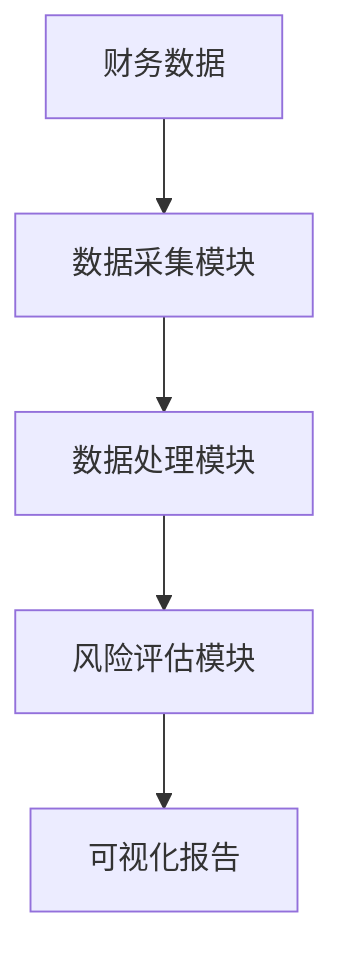
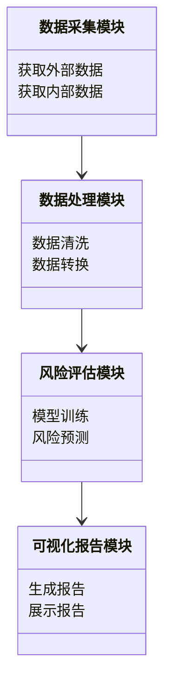

                 


# 开发AI辅助的企业财务风险量化评估工具

> 关键词：AI辅助，财务风险，量化评估，大模型，NLP，深度学习

> 摘要：随着企业面临的财务风险日益复杂，传统的财务风险评估方法已难以满足需求。本文探讨如何利用AI大模型开发企业财务风险量化评估工具，通过自然语言处理和深度学习技术，实现对企业财务数据的智能分析与风险预测。文章详细分析了工具的开发背景、技术原理、系统架构、算法实现及项目实战，为企业提供了一套完整的解决方案。

---

# 第1章: 企业财务风险量化评估工具的背景与意义

## 1.1 企业财务风险的定义与重要性

### 1.1.1 企业财务风险的定义
企业财务风险是指企业在经营过程中由于内外部因素的变化，导致财务状况恶化，进而影响企业偿债能力和经营稳定性的可能性。常见的财务风险包括流动性风险、信用风险、市场风险等。

### 1.1.2 财务风险对企业的影响
- **流动性风险**：企业无法及时获得足够的资金来偿还债务或维持日常运营。
- **信用风险**：交易对手无法履行合同义务，导致企业损失。
- **市场风险**：市场价格波动对企业财务状况的影响。

### 1.1.3 财务风险量化评估的必要性
传统的财务风险评估方法依赖于人工分析和经验判断，存在主观性强、效率低、覆盖面窄等问题。通过量化评估，可以提高评估的客观性、准确性和效率，为企业决策提供数据支持。

---

## 1.2 AI在财务风险评估中的应用

### 1.2.1 AI技术在金融领域的应用现状
AI技术已经在金融领域得到了广泛应用，包括股票预测、信用评分、欺诈检测等。然而，企业在财务风险评估方面的智能化水平仍有提升空间。

### 1.2.2 AI辅助财务风险评估的优势
- **高效性**：AI能够快速处理大量财务数据，提高评估效率。
- **准确性**：通过深度学习模型，AI能够发现数据中的隐含规律，提高评估准确性。
- **实时性**：AI系统可以实时监控财务数据，及时发现潜在风险。

### 1.2.3 企业财务风险量化评估工具的发展趋势
随着AI技术的不断发展，财务风险量化评估工具将更加智能化、个性化和实时化。未来，工具将结合企业内外部数据，提供更全面的评估服务。

---

## 1.3 本章小结
本章介绍了企业财务风险的定义及其重要性，分析了AI在财务风险评估中的应用优势，并展望了未来的发展趋势。通过AI技术，企业可以更高效、准确地量化财务风险，为决策提供有力支持。

---

# 第2章: AI大模型的基本原理与技术特点

## 2.1 AI大模型的定义与分类

### 2.1.1 AI大模型的定义
AI大模型是指基于深度学习的大型神经网络模型，通常包含 billions 的参数，能够处理复杂的任务，如自然语言理解、生成和推理。

### 2.1.2 常见的大模型分类
- **NLP大模型**：如GPT系列、BERT系列。
- **视觉大模型**：如Vision Transformer（ViT）。
- **多模态大模型**：如CLIP、LLAMA。

### 2.1.3 大模型与传统机器学习模型的区别
- **参数量**：大模型通常具有 billions 级参数，而传统模型参数量较小。
- **任务能力**：大模型可以同时处理多种任务，而传统模型通常针对单一任务优化。
- **训练数据**：大模型需要大量的标注数据进行训练，而传统模型可以使用较少的数据。

---

## 2.2 大模型的核心技术

### 2.2.1 深度学习的基本原理
深度学习是一种通过多层神经网络模拟人脑对数据进行处理和学习的技术。其核心在于通过多层非线性变换，从输入数据中提取高层次特征。

### 2.2.2 注意力机制与Transformer模型
- **注意力机制**：通过计算输入数据中每个位置的重要性，赋予其不同的权重，从而提高模型对关键信息的关注。
- **Transformer模型**：由编码器和解码器组成，广泛应用于NLP任务。

### 2.2.3 大模型的训练与优化方法
- **预训练**：在大规模通用数据上进行无监督训练，学习语言的表示。
- **微调**：在特定任务数据上进行有监督训练，优化模型性能。
- **模型压缩**：通过剪枝、量化等技术，降低模型大小，提高推理速度。

---

## 2.3 大模型在自然语言处理中的应用

### 2.3.1 NLP任务的基本类型
- **文本分类**：将文本分为不同的类别，如情感分析。
- **文本生成**：生成符合上下文的文本，如对话生成。
- **文本理解**：理解文本的语义，如问答系统。

### 2.3.2 大模型在文本理解中的优势
- **上下文理解能力强**：能够捕捉文本中的隐含信息。
- **多任务处理能力**：可以同时处理多种NLP任务。

### 2.3.3 大模型在文本生成中的应用
- **生成报告**：根据财务数据生成财务报告。
- **生成预测**：根据市场信息生成风险预测报告。

---

## 2.4 本章小结
本章介绍了AI大模型的定义与分类，详细讲解了大模型的核心技术，包括深度学习、注意力机制和Transformer模型。同时，分析了大模型在自然语言处理中的应用及其优势，为后续章节奠定了理论基础。

---

# 第3章: 企业财务风险量化评估工具的需求分析与系统设计

## 3.1 企业财务风险量化评估工具的核心需求

### 3.1.1 财务数据的获取与处理
企业需要获取内部财务数据（如资产负债表、利润表）和外部数据（如行业趋势、市场数据）。

### 3.1.2 风险评估指标的定义
常见的风险评估指标包括：
- **流动性指标**：如速动比率、流动比率。
- **偿债能力指标**：如资产负债率、利息覆盖倍数。
- **盈利能力指标**：如净利率、ROE。

### 3.1.3 风险评估的实时性要求
企业需要实时监控财务数据，及时发现潜在风险。

---

## 3.2 用户需求分析

### 3.2.1 企业财务部门的需求
- **自动化分析**：减少人工计算，提高效率。
- **实时监控**：及时发现财务风险。
- **定制化报告**：生成符合企业需求的报告。

### 3.2.2 企业决策层的需求
- **风险预警**：提前发现潜在风险。
- **数据可视化**：通过图表直观展示财务状况。
- **决策支持**：基于数据支持战略决策。

---

## 3.3 系统功能设计

### 3.3.1 功能模块划分
- **数据采集模块**：获取企业内外部财务数据。
- **数据处理模块**：清洗、转换和存储数据。
- **风险评估模块**：基于AI模型进行风险预测。
- **结果展示模块**：生成可视化报告。

### 3.3.2 数据流设计


---

## 3.4 系统架构设计

### 3.4.1 模块化设计
- **前端**：用户界面，展示数据和报告。
- **后端**：业务逻辑处理，调用AI模型。
- **数据层**：存储财务数据和模型。

### 3.4.2 系统架构图


---

## 3.5 本章小结
本章分析了企业财务风险量化评估工具的核心需求，从用户角度出发，设计了系统的功能模块和架构。通过模块化设计和数据流分析，确保系统高效、稳定地运行。

---

# 第4章: 企业财务风险量化评估工具的算法实现

## 4.1 NLP算法在财务风险评估中的应用

### 4.1.1 基于文本的情感分析
- **输入**：企业新闻、公告。
- **输出**：情感倾向（积极、消极、中性）。

### 4.1.2 基于文本的实体识别
- **任务**：识别财务报告中的关键实体（如公司名称、金额、时间）。

### 4.1.3 基于文本的意图识别
- **任务**：识别财务报告的意图（如财务预警、利润预测）。

---

## 4.2 深度学习算法在风险预测中的应用

### 4.2.1 基于LSTM的时序预测
- **原理**：LSTM（长短期记忆网络）能够捕捉时间序列数据中的长期依赖关系。
- **公式**：
  $$ LSTM(input, hidden) = \text{tanh}(W_{xh} \cdot input + W_{hh} \cdot hidden + b) $$
- **应用**：预测企业的未来财务状况。

### 4.2.2 基于Transformer的风险分类
- **原理**：Transformer通过自注意力机制捕捉数据中的全局依赖关系。
- **公式**：
  $$ \text{Attention}(Q, K, V) = \text{softmax}(\frac{QK^T}{\sqrt{d_k}})V $$
- **应用**：对企业财务数据进行分类（如低风险、高风险）。

---

## 4.3 算法实现步骤

### 4.3.1 数据预处理
- **清洗数据**：去除噪声数据。
- **特征提取**：提取关键特征（如金额、时间）。

### 4.3.2 模型训练
- **训练数据**：使用历史财务数据训练模型。
- **超参数调整**：优化学习率、批次大小等参数。

### 4.3.3 模型评估
- **评估指标**：准确率、召回率、F1值。
- **评估结果**：分析模型性能，进行优化。

---

## 4.4 本章小结
本章详细讲解了NLP和深度学习算法在企业财务风险评估中的应用，包括情感分析、实体识别、时序预测和风险分类。通过具体的算法实现步骤，为企业开发工具提供了技术参考。

---

# 第5章: 企业财务风险量化评估工具的系统实现与优化

## 5.1 系统实现步骤

### 5.1.1 数据集构建
- **数据来源**：企业内部财务数据和外部市场数据。
- **数据格式**：结构化数据（如CSV）和非结构化数据（如文本）。

### 5.1.2 模型训练
- **训练环境**：使用GPU加速训练。
- **训练流程**：预训练、微调。

### 5.1.3 模型部署
- **部署方式**：本地部署、云端部署。
- **接口设计**：提供API接口，供其他系统调用。

---

## 5.2 系统优化方法

### 5.2.1 数据优化
- **数据增强**：增加数据多样性。
- **数据压缩**：减少数据存储空间。

### 5.2.2 模型优化
- **模型剪枝**：删除冗余参数。
- **模型量化**：降低模型精度，减少存储空间。

### 5.2.3 性能优化
- **并行计算**：提高计算效率。
- **缓存优化**：减少数据访问时间。

---

## 5.3 本章小结
本章详细讲解了企业财务风险量化评估工具的系统实现步骤和优化方法。通过数据优化、模型优化和性能优化，可以提高工具的效率和准确性。

---

# 第6章: 企业财务风险量化评估工具的项目实战

## 6.1 项目背景

### 6.1.1 项目目标
开发一个基于AI大模型的企业财务风险量化评估工具，帮助企业实时监控财务风险，提供风险预警和决策支持。

### 6.1.2 项目团队
- **开发人员**：负责系统设计和实现。
- **数据工程师**：负责数据采集和处理。
- **业务分析师**：负责需求分析和用户反馈。

---

## 6.2 项目实现

### 6.2.1 环境搭建
- **开发环境**：Python 3.8及以上，PyTorch 1.9及以上。
- **工具安装**：安装必要的库，如Pandas、Scikit-learn、Plotly。

### 6.2.2 核心代码实现

#### 6.2.2.1 数据预处理
```python
import pandas as pd

# 读取数据
data = pd.read_csv('financial_data.csv')

# 数据清洗
data.dropna(inplace=True)

# 数据转换
data['date'] = pd.to_datetime(data['date'])
```

#### 6.2.2.2 模型训练
```python
import torch
import torch.nn as nn
import torch.optim as optim

# 定义模型
class FinancialRiskModel(nn.Module):
    def __init__(self, input_size, hidden_size, output_size):
        super(FinancialRiskModel, self).__init__()
        self.lstm = nn.LSTM(input_size, hidden_size, 1)
        self.fc = nn.Linear(hidden_size, output_size)

    def forward(self, x):
        out, _ = self.lstm(x)
        out = self.fc(out[:, -1, :])
        return out

# 初始化模型
input_size = 5
hidden_size = 10
output_size = 2
model = FinancialRiskModel(input_size, hidden_size, output_size)

# 定义损失函数和优化器
criterion = nn.CrossEntropyLoss()
optimizer = optim.Adam(model.parameters(), lr=0.001)

# 训练模型
for epoch in range(100):
    outputs = model(X_train)
    loss = criterion(outputs, y_train)
    optimizer.zero_grad()
    loss.backward()
    optimizer.step()
```

#### 6.2.2.3 模型评估
```python
# 预测结果
with torch.no_grad():
    outputs = model(X_test)
    predicted = torch.argmax(outputs.data, 1)

# 计算准确率
accuracy = (predicted == y_test).sum().item() / len(y_test)
print(f'准确率: {accuracy * 100}%')
```

---

## 6.3 项目小结
本章通过一个具体的项目案例，展示了企业财务风险量化评估工具的开发过程。从环境搭建到核心代码实现，再到模型评估，为读者提供了完整的实战指导。

---

# 第7章: 企业财务风险量化评估工具的总结与展望

## 7.1 本项目总结

### 7.1.1 核心成果
- 开发了一款基于AI大模型的企业财务风险量化评估工具。
- 提供了高效、准确的风险评估服务。

### 7.1.2 经验总结
- 数据质量对模型性能影响巨大，需重视数据清洗和特征提取。
- 模型调优是关键，需合理选择超参数和优化方法。

---

## 7.2 未来展望

### 7.2.1 技术进步
- **更强大的模型**：如基于视觉的大模型。
- **更高效的方法**：如轻量化模型和边缘计算。

### 7.2.2 应用拓展
- **多模态分析**：结合文本、图像等多种数据源。
- **个性化服务**：根据企业需求定制化服务。

---

## 7.3 本章小结
本章总结了项目的成果和经验，并展望了未来的发展方向。随着技术的进步和应用的拓展，企业财务风险量化评估工具将更加智能化、个性化和实时化。

---

# 作者：AI天才研究院/AI Genius Institute & 禅与计算机程序设计艺术/Zen And The Art of Computer Programming

---

**全文完**

