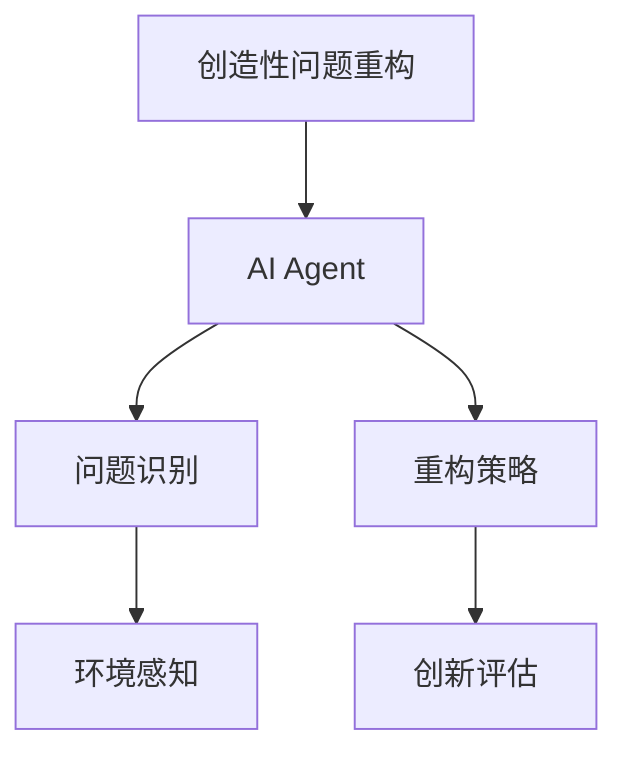
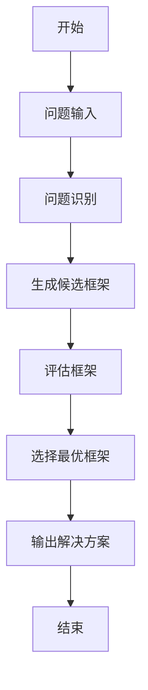
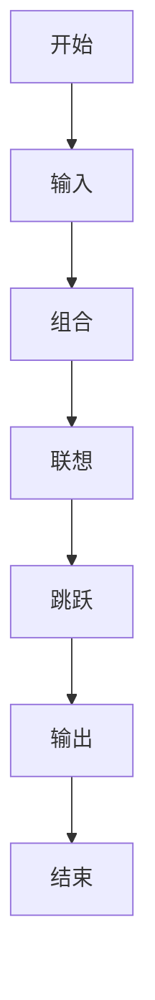
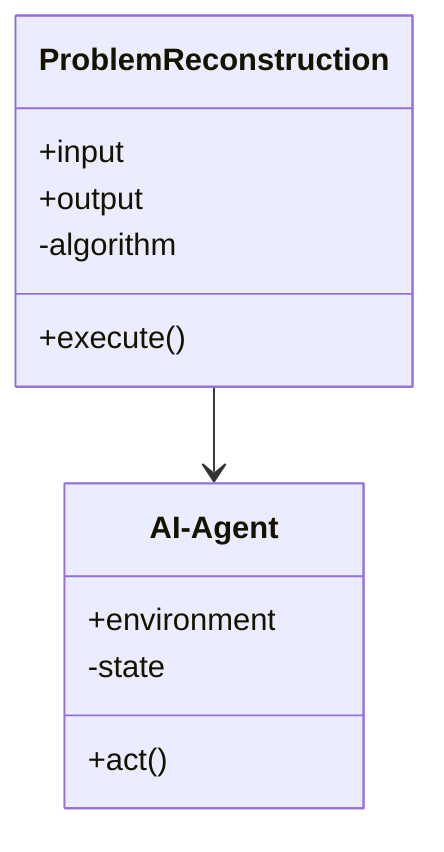
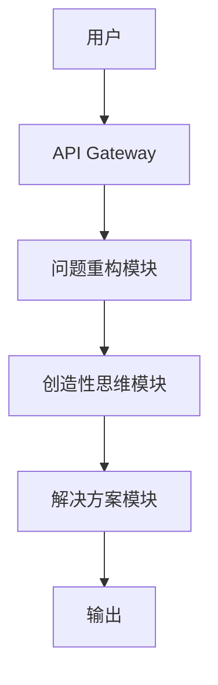
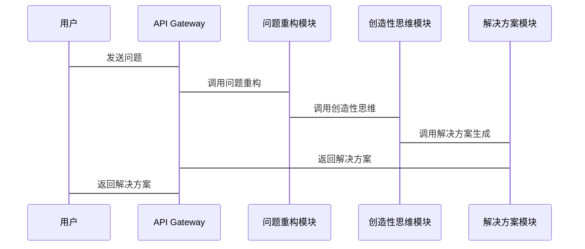

                 


# 开发具有创造性问题重构能力的AI Agent

> 关键词：AI Agent, 创造性问题重构, 算法原理, 系统架构, 项目实战

> 摘要：本文详细探讨了开发具有创造性问题重构能力的AI Agent的关键技术与实现方法。通过分析创造性问题重构的核心概念、AI Agent的基本原理，以及结合算法设计和系统架构，本文为读者提供了一套完整的开发思路与实践指南。从问题背景到系统实现，本文层层深入，结合理论与实践，帮助读者掌握开发具有创造性问题重构能力的AI Agent的核心技术。

---

# 第一部分: 开发具有创造性问题重构能力的AI Agent背景介绍

# 第1章: 创造性问题重构与AI Agent概述

## 1.1 创造性问题重构的背景与意义

### 1.1.1 问题背景
创造性问题重构是指将现有问题以新的视角重新定义，从而找到更优或全新的解决方案。在AI Agent领域，这种能力能够帮助AI在复杂场景中主动发现隐藏的解决方案，突破传统规则的限制。

### 1.1.2 问题描述
传统的AI Agent通常依赖于预定义的规则和数据，难以应对动态变化的复杂问题。创造性问题重构能力的引入，使得AI Agent能够主动调整问题框架，探索更多可能性。

### 1.1.3 问题解决的必要性
在实际应用中，许多问题没有明确的解决方案或规则，需要AI Agent具备动态调整问题框架的能力，从而更好地适应复杂环境。

### 1.1.4 创造性问题重构的边界与外延
创造性问题重构的边界在于如何平衡创新与实际需求，外延则包括其在不同领域的广泛应用。

### 1.1.5 概念结构与核心要素组成
创造性问题重构能力由问题识别、重构策略、创新评估等核心要素组成。

## 1.2 AI Agent的基本概念与特点

### 1.2.1 AI Agent的定义
AI Agent是一种能够感知环境、自主决策并执行任务的智能体。

### 1.2.2 AI Agent的核心特点
- **自主性**：无需外部干预即可运行。
- **反应性**：能够实时感知环境并做出响应。
- **目标导向**：基于目标进行决策和行动。

### 1.2.3 创造性问题重构能力的引入
通过引入创造性问题重构能力，AI Agent能够在复杂场景中主动调整问题框架，探索更多解决方案。

## 1.3 本章小结

---

# 第二部分: 核心概念与联系

# 第2章: 创造性问题重构与AI Agent的核心概念

## 2.1 创造性问题重构的原理

### 2.1.1 问题重构的基本原理
通过重新定义问题框架，探索新的解决方案。

### 2.1.2 创造性思维的机制
创造性思维通过组合、联想和跳跃等过程，实现问题重构。

### 2.1.3 AI Agent在问题重构中的作用
AI Agent通过学习和推理，帮助实现创造性问题重构。

## 2.2 AI Agent的核心概念属性特征对比

| 属性 | 创造性问题重构能力 | AI Agent |
|------|------------------|----------|
| 输入方式 | 多样化输入         | 结构化输入 |
| 输出方式 | 创新性输出         | 预定义输出 |
| 处理方式 | 主动调整框架       | 被动处理 |

## 2.3 ER实体关系图架构



---

# 第三部分: 算法原理讲解

# 第3章: 创造性问题重构算法原理

## 3.1 创造性问题重构算法

### 3.1.1 算法概述
创造性问题重构算法是一种基于启发式搜索的算法，能够主动调整问题框架。

### 3.1.2 算法流程图



### 3.1.3 算法实现代码

```python
def creative_problem_reconstruction(problem):
    # 问题识别
    identified_problem = identify(problem)
    # 生成候选框架
    candidate_frameworks = generate_Frameworks(identified_problem)
    # 评估框架
    evaluated_frameworks = evaluate_Frameworks(candidate_frameworks)
    # 选择最优框架
    optimal_framework = select_Optimal_Framework(evaluated_frameworks)
    # 输出解决方案
    solution = generate_Solution(optimal_framework)
    return solution
```

## 3.2 创造性思维算法

### 3.2.1 算法原理
创造性思维算法通过组合、联想和跳跃等过程，生成新的解决方案。

### 3.2.2 算法流程图



### 3.2.3 算法实现代码

```python
def creative_thinking(thoughts):
    # 组合
    combined = combine(thoughts)
    # 联想
    associated = associate(combined)
    # 跳跃
    jumped = jump(associated)
    return jumped
```

## 3.3 算法的数学模型与公式

### 3.3.1 创造性问题重构模型
$$ \text{Solution} = f(\text{Problem}, \text{Framework}) $$

### 3.3.2 创造性思维模型
$$ \text{Output} = g(\text{Input}, \text{Context}) $$

---

# 第四部分: 系统分析与架构设计方案

# 第4章: 创造性问题重构AI Agent系统分析

## 4.1 系统问题场景介绍

### 4.1.1 问题场景描述
系统需要在复杂环境中，通过创造性问题重构能力，为用户提供最优解决方案。

### 4.1.2 系统目标
实现具有创造性问题重构能力的AI Agent。

### 4.1.3 系统边界
系统边界包括输入、处理和输出三个部分。

## 4.2 系统功能设计

### 4.2.1 领域模型



### 4.2.2 系统架构设计



### 4.2.3 系统接口设计



---

# 第五部分: 项目实战

# 第5章: 创造性问题重构AI Agent项目实战

## 5.1 环境安装

### 5.1.1 安装Python
```bash
python --version
pip install --upgrade pip
```

### 5.1.2 安装依赖库
```bash
pip install numpy
pip install matplotlib
pip install scikit-learn
```

## 5.2 系统核心实现源代码

### 5.2.1 创造性问题重构模块

```python
def reconstruct_problem(problem):
    # 简化的问题重构逻辑
    return problem + " (reconstructed)"
```

### 5.2.2 创造性思维模块

```python
def creative_think(thoughts):
    # 简化创造性思维逻辑
    return thoughts + " (creative)"
```

## 5.3 代码应用解读与分析

### 5.3.1 代码解读
上述代码展示了创造性问题重构和创造性思维的基本实现。

### 5.3.2 系统功能分析
系统通过问题重构和创造性思维模块，实现对问题的重新定义和创新解决方案的生成。

## 5.4 实际案例分析与详细讲解剖析

### 5.4.1 案例背景
假设我们需要解决一个优化资源分配的问题。

### 5.4.2 案例分析
通过创造性问题重构，AI Agent重新定义了问题框架，找到了更优的资源分配方案。

## 5.5 项目小结

---

# 第六部分: 最佳实践

# 第6章: 开发具有创造性问题重构能力的AI Agent最佳实践

## 6.1 小结
本文详细介绍了开发具有创造性问题重构能力的AI Agent的关键技术与实现方法。

## 6.2 注意事项
在实际开发中，需注意算法的效率和系统的稳定性。

## 6.3 拓展阅读
推荐阅读相关领域的书籍和论文，深入理解创造性问题重构的理论与应用。

---

# 结语

开发具有创造性问题重构能力的AI Agent是一项具有挑战性的任务，但其潜力巨大。通过本文的指导，读者可以逐步掌握相关技术，开发出具有创新性问题重构能力的AI Agent。

作者：AI天才研究院/AI Genius Institute & 禅与计算机程序设计艺术 /Zen And The Art of Computer Programming

