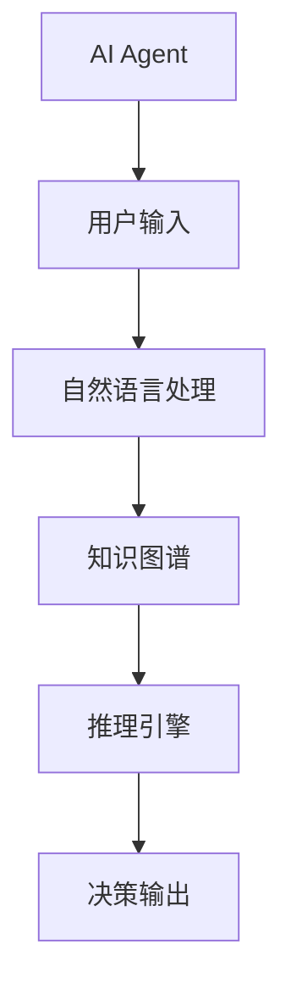
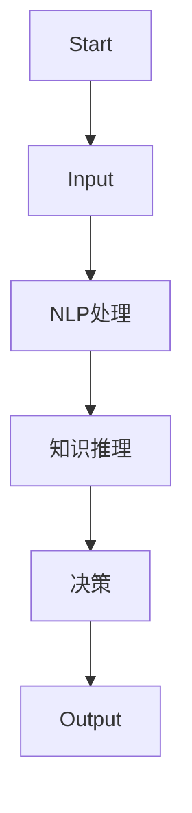
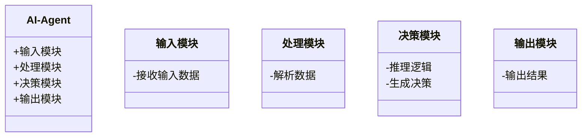
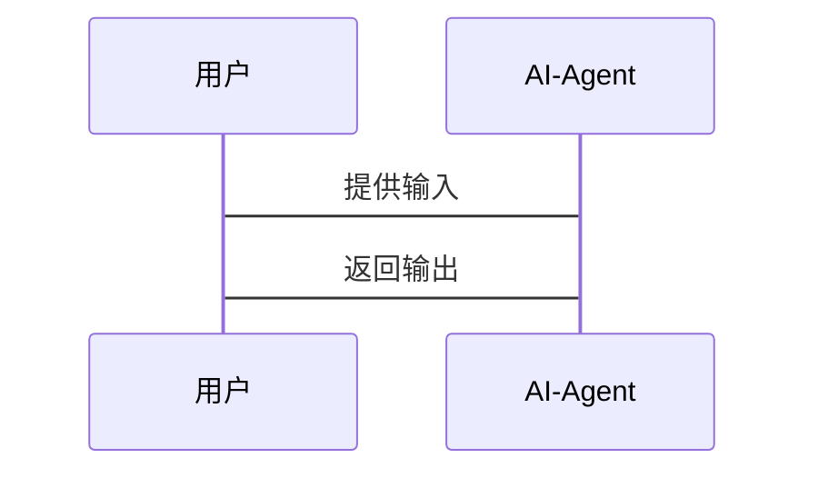

                 


# 开发具有复杂场景理解能力的AI Agent

> 关键词：AI Agent、复杂场景理解、自然语言处理、机器学习、系统架构

> 摘要：本文详细探讨了开发具有复杂场景理解能力的AI Agent的全过程，从背景介绍到系统架构设计，再到项目实战，全面解析了AI Agent的核心概念、算法原理和实际应用。

---

## 第一部分：AI Agent的背景与核心概念

### 第1章：AI Agent的引言

#### 1.1 问题背景
AI Agent（人工智能代理）是近年来人工智能领域的重要研究方向。随着技术的进步，AI Agent不仅需要处理简单的任务，还需要理解和应对复杂的现实场景。这种能力对于实现真正智能化的AI系统至关重要。

#### 1.2 问题描述
传统AI系统在处理复杂场景时往往显得力不从心，因为它们缺乏对上下文的理解和多任务处理的能力。AI Agent需要能够理解复杂场景中的各种元素，并做出合理的决策。

#### 1.3 问题解决
通过结合自然语言处理、机器学习和知识图谱等技术，AI Agent能够逐步理解和应对复杂场景。本文将详细探讨如何实现这一目标。

#### 1.4 概念结构与核心要素
AI Agent的核心要素包括感知、推理、决策和执行。复杂场景理解则需要结合这些要素，通过多模态数据处理和知识推理来实现。

---

## 第二部分：AI Agent的核心概念与联系

### 第2章：AI Agent的核心原理

#### 2.1 AI Agent的原理概述
AI Agent通过感知环境、分析数据、推理逻辑并做出决策来完成任务。复杂场景理解需要结合上下文信息和领域知识。

#### 2.2 核心概念的属性特征对比
| 技术 | 描述 |
|------|------|
| 自然语言处理 | 处理文本数据，理解语义 |
| 机器学习 | 从数据中学习模式 |
| 知识图谱 | 表达领域知识 |

#### 2.3 ER实体关系图架构


---

## 第三部分：AI Agent的算法原理与数学模型

### 第3章：AI Agent的算法原理

#### 3.1 算法流程


#### 3.2 数学模型
损失函数：$$L = \sum_{i=1}^{n} (y_i - \hat{y_i})^2$$

优化器：Adam优化器，使用学习率$$\alpha$$和动量参数$$\beta_1, \beta_2$$。

---

## 第四部分：系统分析与架构设计

### 第4章：系统功能设计

#### 4.1 项目背景
开发一个能够理解复杂场景的AI Agent，应用于智能客服和自动驾驶等领域。

#### 4.2 系统架构设计


#### 4.3 接口设计


---

## 第五部分：项目实战

### 第5章：环境安装与代码实现

#### 5.1 环境安装
安装Python、TensorFlow、Keras和自然语言处理库。

#### 5.2 核心代码实现
```python
class AIAgent:
    def __init__(self):
        self.model = self.build_model()

    def build_model(self):
        # 构建模型
        return model

    def process_input(self, input_data):
        # 处理输入
        pass

    def generate_output(self, processed_data):
        # 生成输出
        pass
```

#### 5.3 案例分析
通过具体案例展示AI Agent在复杂场景中的应用，分析代码实现和优化。

---

## 第六部分：总结与展望

### 第6章：总结

#### 6.1 最佳实践
- 数据质量的重要性
- 模型优化的关键点
- 系统架构的设计原则

#### 6.2 小结
本文详细探讨了AI Agent的开发过程，从理论到实践，为读者提供了全面的指导。

#### 6.3 注意事项
确保数据安全，避免模型过拟合。

#### 6.4 拓展阅读
推荐相关书籍和论文，供读者深入学习。

---

作者：AI天才研究院 & 禅与计算机程序设计艺术

