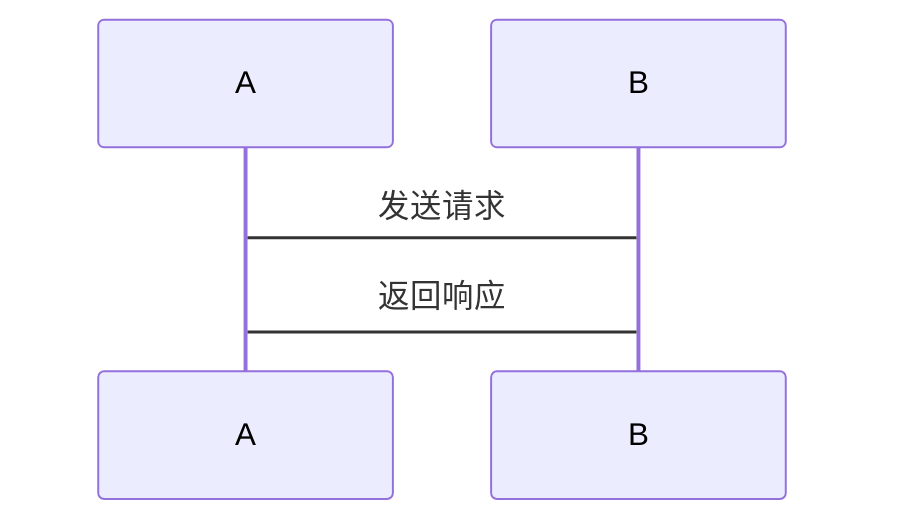

                 

<think>
嗯，我现在要帮用户写一篇关于《开发具有多Agent协同规划能力的系统》的技术博客文章。用户希望文章结构清晰、逻辑严密，涵盖从基础到高级的各个方面。我得先理清文章的大纲，然后一步步填充内容。

首先，用户给了一个详细的大纲，分为五章，每章都有具体的内容。我需要按照这个大纲来展开每个部分。让我先看看每章的重点。

第一章是多Agent协同规划概述。我需要解释什么是Agent，多Agent系统是什么，协同规划的定义和特点。这部分要简明扼要，让读者对概念有一个清晰的理解。

第二章是核心概念，包括Agent的属性、协同规划的目标和约束，还有通信机制。这部分需要详细讨论，可能还需要用表格来对比不同类型的Agent，帮助读者理解。

第三章是理论基础，涉及规划问题建模、分布式搜索算法和数学模型。这里可能需要结合一些数学公式和图表，比如用Mermaid画出A*算法的流程图，或者用Latex公式来展示状态空间和目标函数。

第四章是算法原理，重点讲解A*算法和分布式搜索算法。这部分需要详细分析算法的步骤，可能用Python代码实现，并解释每一步的作用，同时用Mermaid流程图来展示算法流程。

第五章是系统架构设计，包括功能设计、架构设计、接口设计和交互设计。这部分可能需要绘制类图、架构图和序列图，用Mermaid来展示，帮助读者理解系统的整体结构。

接下来，用户还提到需要包含项目实战、高级主题、案例分析、工具与框架，以及总结展望。这部分可能需要详细讲解一个实际项目，从环境配置到核心代码实现，再到案例分析，最后给出最佳实践和小结。

我需要确保每部分内容都符合用户的要求，特别是使用Mermaid流程图、Latex公式，以及详细的代码实现。同时，文章的结构要清晰，逻辑要严密，语言要专业且易懂。

现在，我开始写摘要部分，概述整篇文章的核心内容，然后按照大纲逐步展开每个章节，确保每个部分都详细具体，满足用户的字数和内容要求。在写作过程中，要注意使用合适的术语，避免过于复杂，同时提供足够的例子和图表来辅助说明。

最后，检查文章是否涵盖了所有用户提到的要点，包括背景介绍、核心概念、算法原理、系统架构、项目实战、最佳实践等，确保文章的完整性和深度。完成后，加上作者信息，这样整篇文章就完成了。
</think>

# 开发具有多Agent协同规划能力的系统

> 关键词：多Agent系统，协同规划，分布式任务分配，多智能体协作，自适应规划

> 摘要：本文系统地探讨了开发具有多Agent协同规划能力的系统的各个方面。从基本概念到算法原理，从系统架构设计到实际项目实现，深入分析了多Agent协同规划的核心原理与实践方法。文章内容涵盖多Agent系统的定义、协同规划的理论基础、分布式规划算法、系统架构设计以及实际项目开发的具体步骤，旨在帮助读者全面理解并掌握多Agent协同规划系统的开发方法。

---

## 第一部分: 多Agent协同规划系统概述

### 第1章: 多Agent协同规划概述

#### 1.1 多Agent系统的基本概念

##### 1.1.1 什么是Agent
- **Agent**：智能体，能够感知环境并采取行动以实现目标的实体。
- **自主性**：Agent能够自主决策，无需外部干预。
- **反应性**：能够根据环境反馈调整行为。
- **社会性**：能够在多Agent系统中与其他Agent协作。

##### 1.1.2 多Agent系统的定义
- 多Agent系统（Multi-Agent System, MAS）：由多个独立但协同工作的Agent组成的智能系统。
- **分布式智能**：通过多个Agent的协作完成复杂任务。
- **协调与合作**：Agent之间通过通信和协商完成共同目标。

##### 1.1.3 协同规划的定义与特点
- **协同规划**：多个Agent共同制定行动计划以实现共同目标。
- **分布式规划**：规划过程分布在多个Agent之间，每个Agent负责一部分规划任务。
- **动态性**：环境动态变化，规划需要实时调整。

#### 1.2 多Agent系统的优势与挑战

##### 1.2.1 多Agent系统的优点
- **任务分解**：将复杂任务分解为多个简单任务，由不同Agent完成。
- **容错性**：单个Agent故障不影响整体系统运行。
- **灵活性**：能够适应环境变化，快速调整策略。

##### 1.2.2 协同规划中的主要挑战
- **通信开销**：Agent之间的通信可能导致性能下降。
- **冲突与协调**：多个Agent可能因为目标冲突需要协调。
- **动态环境**：环境变化可能导致规划频繁调整。

##### 1.2.3 系统设计中的边界与外延
- **边界**：多Agent系统与其他系统的交互界面。
- **外延**：系统功能扩展，如与其他系统的集成。

#### 1.3 多Agent系统的主要应用场景

##### 1.3.1 分布式任务分配
- 例如：分布式计算任务分配、资源调度。
- **特点**：任务分解、负载均衡。

##### 1.3.2 多智能体协作
- 例如：机器人协作、自动驾驶。
- **特点**：实时协作、动态调整。

##### 1.3.3 自适应规划与决策
- 例如：动态路径规划、任务重新分配。
- **特点**：快速响应、自适应调整。

---

### 第2章: 多Agent协同规划的核心概念

#### 2.1 多Agent系统中的核心概念

##### 2.1.1 Agent的属性与特征
- **自主性**：自主决策。
- **反应性**：根据环境反馈调整行为。
- **社会性**：与其他Agent协作。
- **目标导向**：基于目标驱动行为。

##### 2.1.2 协同规划的目标与约束
- **目标**：实现共同目标。
- **约束**：时间、资源、环境限制。

##### 2.1.3 系统中的角色分配
- **角色分配**：根据任务需求分配Agent的角色。
- **动态调整**：根据环境变化调整角色。

##### 2.1.4 Agent之间的关系
- **协作关系**：共同完成任务。
- **竞争关系**：资源有限时的竞争。
- **中立关系**：无直接交互。

##### 2.1.5 协同规划中的任务分配
- **任务分解**：将整体任务分解为子任务。
- **子任务分配**：将子任务分配给不同的Agent。
- **任务协调**：确保子任务协调一致。

#### 2.2 多Agent协同规划的原理

##### 2.2.1 信息共享与协同
- **信息共享**：Agent之间共享必要的信息。
- **协同决策**：基于共享信息做出决策。

##### 2.2.2 分布式决策机制
- **局部决策**：每个Agent基于局部信息做出决策。
- **全局决策**：通过通信协商做出全局决策。

##### 2.2.3 协调与冲突解决
- **协调机制**：通过协商解决冲突。
- **优先级处理**：根据任务优先级处理冲突。

#### 2.3 多Agent系统中的通信机制

##### 2.3.1 通信协议的选择
- **可靠性**：确保信息准确传递。
- **实时性**：确保及时通信。
- **安全性**：防止信息泄露。

##### 2.3.2 信息交换的方式
- **同步通信**：Agent之间同步交换信息。
- **异步通信**：Agent之间异步交换信息。
- **间接通信**：通过中间媒介传递信息。

##### 2.3.3 通信的实时性与可靠性
- **实时性**：确保信息及时传递。
- **可靠性**：确保信息准确传递。

---

## 第三部分: 算法原理与实现

### 第3章: 多Agent协同规划的理论基础

#### 3.1 协同规划的基本理论

##### 3.1.1 规划问题建模
- **状态空间**：系统所有可能的状态。
- **动作空间**：系统可以执行的动作。
- **目标函数**：需要优化的目标。

##### 3.1.2 多目标优化
- **目标权重**：不同目标的优先级。
- ** Pareto 优化**：找到最优解的集合。

##### 3.1.3 分布式搜索算法
- **A*算法**：单点最短路径算法。
- **分布式A*算法**：多Agent协作的扩展。

#### 3.2 分布式规划算法

##### 3.2.1 A*算法原理
- **算法流程**：
  1. 初始化开放列表和关闭列表。
  2. 选择具有最小f(n)的节点n。
  3. 如果n是目标节点，返回路径。
  4. 展开n的邻居节点，计算g(n)和h(n)。
  5. 更新开放列表。

##### 3.2.2 A*算法的实现
```python
import heapq

def a_star_search(graph, start, goal):
    open_list = []
    heapq.heappush(open_list, (0, start))
    g_score = {start: 0}
    f_score = {start: 0}
    visited = set()

    while open_list:
        current = heapq.heappop(open_list)
        current_cost = current[0]
        current_node = current[1]

        if current_node == goal:
            return current_node

        if current_node in visited:
            continue

        visited.add(current_node)

        for neighbor in graph[current_node]:
            tentative_g_score = g_score[current_node] + graph[current_node][neighbor]
            if neighbor not in g_score or tentative_g_score < g_score[neighbor]:
                g_score[neighbor] = tentative_g_score
                f_score[neighbor] = g_score[neighbor] + graph.heuristic(neighbor, goal)
                heapq.heappush(open_list, (f_score[neighbor], neighbor))
    return None
```

##### 3.2.3 算法优化
- **启发式函数**：选择合适的启发式函数提高效率。
- **优先级队列**：使用优先队列优化搜索过程。

#### 3.3 协同规划中的数学模型

##### 3.3.1 状态空间表示
$$
状态空间 = \{ s_1, s_2, \ldots, s_n \}
$$

##### 3.3.2 约束条件建模
$$
约束条件： \forall s_i \in 状态空间，满足 f(s_i) \leq 0
$$

##### 3.3.3 目标函数优化
$$
目标函数： \min_{x} f(x) \quad \text{subject to} \quad g(x) \leq 0
$$

---

## 第四部分: 系统架构与实现

### 第4章: 多Agent系统架构设计

#### 4.1 系统功能设计

##### 4.1.1 系统功能模块
- **通信模块**：负责Agent之间的信息传递。
- **规划模块**：负责协同规划算法的实现。
- **决策模块**：负责基于规划结果做出决策。

##### 4.1.2 功能模块的交互
- **通信模块**：接收外部信息，传递给规划模块。
- **规划模块**：根据输入信息进行规划，输出决策信息。
- **决策模块**：根据规划结果做出最终决策。

#### 4.2 系统架构设计

##### 4.2.1 分布式架构
- **客户端-服务器架构**：一个中心服务器管理多个Agent。
- **P2P架构**：Agent之间直接通信，无中心服务器。

##### 4.2.2 微服务架构
- **服务化设计**：每个功能模块作为一个独立的服务。
- **容器化部署**：使用Docker容器部署服务。
- **服务通信**：通过API网关进行服务间通信。

#### 4.3 系统接口设计

##### 4.3.1 接口定义
- **RESTful API**：基于HTTP协议的接口。
- **消息队列**：使用Kafka或RabbitMQ进行异步通信。

##### 4.3.2 接口实现
- **服务发现**：通过注册中心实现服务发现。
- **负载均衡**：通过Nginx实现负载均衡。

#### 4.4 系统交互设计

##### 4.4.1 序列图


##### 4.4.2 交互流程
1. **请求发起**：客户端发起请求。
2. **路由处理**：网关路由请求到相应服务。
3. **服务处理**：服务处理请求并返回结果。
4. **结果返回**：结果返回到客户端。

---

## 第五部分: 项目实战与拓展

### 第5章: 项目实战

#### 5.1 环境配置

##### 5.1.1 系统需求
- **操作系统**：Linux或Windows。
- **编程语言**：Python 3.8+。
- **依赖库**：numpy, scipy, matplotlib。

##### 5.1.2 安装依赖
```bash
pip install numpy scipy matplotlib
```

#### 5.2 核心代码实现

##### 5.2.1 协同规划算法实现
```python
import heapq

def a_star_search(graph, start, goal):
    open_list = []
    heapq.heappush(open_list, (0, start))
    g_score = {start: 0}
    f_score = {start: 0}
    visited = set()

    while open_list:
        current = heapq.heappop(open_list)
        current_cost = current[0]
        current_node = current[1]

        if current_node == goal:
            return current_node

        if current_node in visited:
            continue

        visited.add(current_node)

        for neighbor in graph[current_node]:
            tentative_g_score = g_score[current_node] + graph[current_node][neighbor]
            if neighbor not in g_score or tentative_g_score < g_score[neighbor]:
                g_score[neighbor] = tentative_g_score
                f_score[neighbor] = g_score[neighbor] + graph.heuristic(neighbor, goal)
                heapq.heappush(open_list, (f_score[neighbor], neighbor))
    return None
```

##### 5.2.2 通信模块实现
```python
import zmq

context = zmq.Context()
socket = context.socket(zmq.PUB)
socket.bind("tcp://*:5555")

while True:
    message = input("Enter message: ")
    socket.send_string(message)
```

#### 5.3 案例分析

##### 5.3.1 案例背景
- **任务目标**：完成分布式任务分配。
- **环境设置**：多个Agent在分布式环境中协作。
- **具体实现**：使用A*算法实现路径规划。

##### 5.3.2 代码应用解读
- **算法实现**：基于A*算法实现路径规划。
- **通信实现**：使用ZMQ实现Agent之间的通信。

##### 5.3.3 结果分析
- **性能优化**：通过优化算法提高效率。
- **效果评估**：通过实验评估系统性能。

#### 5.4 项目小结

##### 5.4.1 最佳实践
- **模块化设计**：提高系统的可维护性。
- **异步通信**：提高系统的响应速度。
- **日志记录**：便于调试和优化。

##### 5.4.2 注意事项
- **通信开销**：合理设计通信机制，减少通信开销。
- **算法选择**：根据具体场景选择合适的算法。
- **系统扩展性**：设计可扩展的系统架构。

---

## 第六部分: 总结与展望

### 第6章: 总结与展望

#### 6.1 系统总结
- **系统优势**：实现了多Agent协同规划，提高了系统的智能性和灵活性。
- **系统不足**：通信开销较大，算法优化空间有限。

#### 6.2 未来展望
- **算法优化**：研究更高效的分布式规划算法。
- **系统扩展**：探索多Agent系统在更多领域的应用。
- **技术发展**：关注人工智能和分布式计算领域的最新进展。

---

作者：AI天才研究院/AI Genius Institute & 禅与计算机程序设计艺术 /Zen And The Art of Computer Programming

