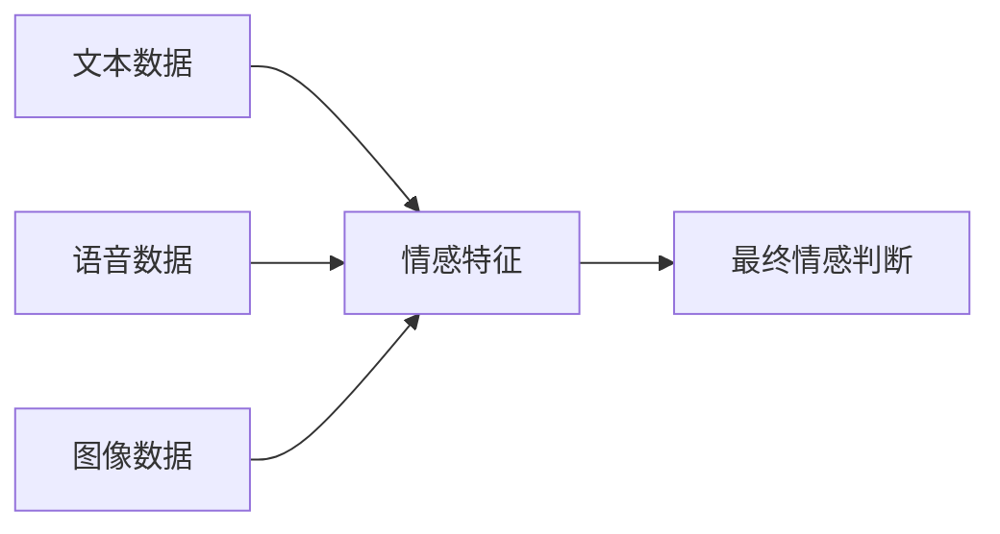
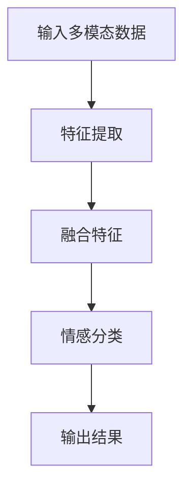
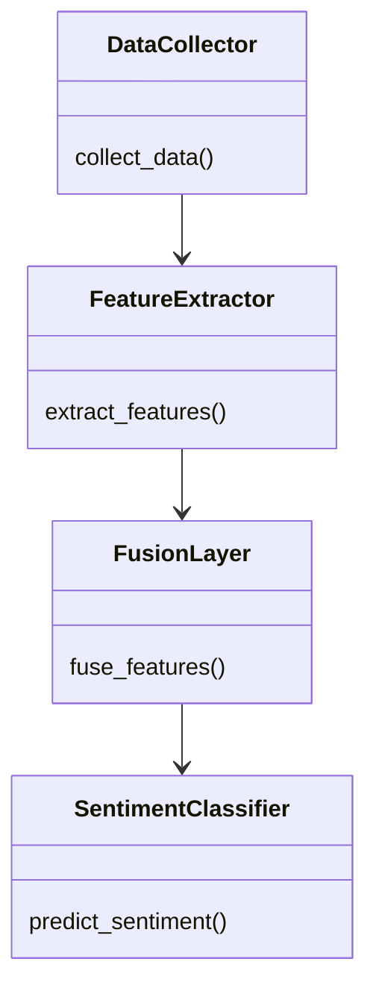
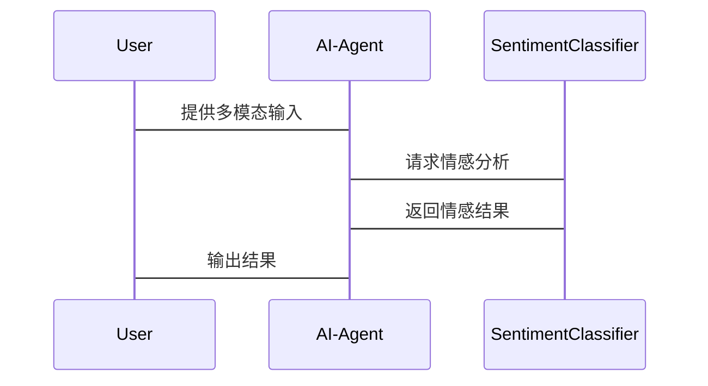

                 

<think>
嗯，用户希望我写一篇关于“开发具有多模态情感分析能力的AI Agent”的技术博客。看起来用户需要的是一个结构清晰、内容详尽的目录，覆盖从背景到实现的各个方面。

首先，我得理解多模态情感分析是什么。它不仅仅是处理文本，还要结合语音和图像等数据。这涉及到NLP、语音处理和计算机视觉等多个领域，所以目录需要涵盖这些部分。

用户给的示例目录已经很详细了，包括背景、核心概念、算法、系统架构、项目实战和最佳实践。我需要确保每个部分都细化到三级目录，内容全面。

考虑到用户是技术专家，文章需要专业但易懂。所以，在每个章节里，我需要加入原理分析、图表说明和代码示例，帮助读者更好地理解。

比如，在算法原理部分，用Mermaid画出流程图，再配上Python代码，这样读者可以跟着实现。数学模型部分，用LaTeX公式展示，确保准确性。

系统架构部分，需要设计类图和序列图，展示各个模块的交互。项目实战部分，提供具体的代码和案例分析，让读者能够实际操作。

最后，加上最佳实践和小结，帮助读者巩固知识，同时引导他们进一步学习。这样整个目录就完整了，既理论又实践，满足用户的需求。
</think>

# 开发具有多模态情感分析能力的AI Agent

> 关键词：多模态情感分析，AI Agent，机器学习，深度学习，自然语言处理，语音处理，计算机视觉

> 摘要：本文详细探讨了开发具有多模态情感分析能力的AI Agent的全过程，从核心概念、算法原理到系统架构设计，再到项目实战和最佳实践，为读者提供了一套完整的解决方案。文章结合理论与实践，深入分析了多模态数据融合的挑战与解决方案，并通过具体案例展示了如何实现一个高效的多模态情感分析系统。

---

# 第一部分: 多模态情感分析的背景与核心概念

## 第1章: 多模态情感分析的背景介绍

### 1.1 多模态情感分析的背景

#### 1.1.1 从单模态到多模态的情感分析演进
- 情感分析的起源与发展
- 单模态情感分析的局限性
- 多模态情感分析的必要性

#### 1.1.2 多模态数据在情感分析中的优势
- 文本、语音、图像的互补性
- 多模态数据的鲁棒性
- 实际场景中的应用需求

#### 1.1.3 AI Agent在多模态情感分析中的角色
- AI Agent的核心功能
- 多模态情感分析对AI Agent的重要性
- 情感分析在人机交互中的应用

### 1.2 多模态情感分析的核心问题

#### 1.2.1 情感分析的基本概念
- 情感分析的定义
- 情感类别划分
- 情感强度分析

#### 1.2.2 多模态数据的融合挑战
- 数据异构性问题
- 数据冗余与噪声
- 融合策略的选择

#### 1.2.3 多模态情感分析的边界与外延
- 多模态数据的适用场景
- 情感分析的局限性
- 多模态分析的未来发展方向

### 1.3 多模态情感分析的核心要素

#### 1.3.1 数据采集与预处理
- 文本数据的清洗与标注
- 语音数据的特征提取
- 图像数据的处理与标注

#### 1.3.2 数据融合方法
- 基于特征的融合
- 基于决策的融合
- 晚融合与早融合的对比

#### 1.3.3 情感分类模型的选择
- 传统机器学习模型
- 深度学习模型
- 模型的适用场景分析

---

## 第2章: 多模态情感分析的核心概念与联系

### 2.1 多模态数据融合的原理

#### 2.1.1 多模态数据的预处理方法
- 文本数据的分词与向量化
- 语音数据的特征提取（如MFCC）
- 图像数据的特征提取（如CNN）

#### 2.1.2 多模态数据的特征提取
- 文本：词嵌入（Word2Vec、BERT）
- 语音：Mel频谱、MFCC特征
- 图像：CNN特征提取

#### 2.1.3 多模态数据的融合方法对比
- 表格对比：特征融合、决策融合、混合融合的优缺点

| 融合方法 | 优点 | 缺点 |
|----------|------|------|
| 特征融合 | 高效性，低计算成本 | 可能丢失部分语义信息 |
| 决策融合 | 鲁棒性，可解释性 | 计算成本较高 |
| 混合融合 | 综合性高 | 实现复杂度高 |

#### 2.1.4 多模态数据的实体关系图


---

# 第三部分: 多模态情感分析的算法原理

## 第3章: 多模态情感分析的算法原理

### 3.1 多模态数据融合的算法流程

#### 3.1.1 数据预处理与特征提取
- 文本：分词、向量化（Word2Vec、BERT）
- 语音：MFCC特征提取
- 图像：CNN特征提取

#### 3.1.2 多模态特征融合方法
- 晚融合（Late Fusion）：将多模态特征分别处理后，再进行融合
- 早融合（Early Fusion）：将多模态特征在早期阶段进行融合

#### 3.1.3 情感分类器的设计与训练
- 选择深度学习模型（如LSTM、Transformer）
- 模型训练与优化

### 3.2 多模态情感分析的算法实现

#### 3.2.1 多模态数据融合的算法流程图


#### 3.2.2 多模态情感分析的Python实现示例
```python
import torch
import torch.nn as nn

class MultiModalFusion(nn.Module):
    def __init__(self, text_dim, audio_dim, visual_dim):
        super().__init__()
        self.text_layer = nn.Linear(text_dim, 128)
        self.audio_layer = nn.Linear(audio_dim, 128)
        self.visual_layer = nn.Linear(visual_dim, 128)
        self.dropout = nn.Dropout(0.5)
        self.fc = nn.Linear(128*3, 1)

    def forward(self, text_features, audio_features, visual_features):
        text_out = self.text_layer(text_features)
        audio_out = self.audio_layer(audio_features)
        visual_out = self.visual_layer(visual_features)
        features = torch.cat([text_out, audio_out, visual_out], dim=-1)
        features = features.view(features.size(0), -1)
        features = self.dropout(features)
        output = self.fc(features)
        return output
```

#### 3.2.3 数学模型与公式
- 晚融合模型：
  $$ y = f_{text}(x_{text}) + f_{audio}(x_{audio}) + f_{visual}(x_{visual}) $$
- 早融合模型：
  $$ y = f(x_{text}, x_{audio}, x_{visual}) $$

---

## 第4章: 多模态情感分析的系统分析与架构设计

### 4.1 问题场景介绍

#### 4.1.1 问题背景
- 情感分析的实际应用场景
- 多模态数据的采集与处理

#### 4.1.2 问题目标
- 构建一个高效的多模态情感分析系统
- 实现AI Agent的情感理解能力

### 4.2 系统功能设计

#### 4.2.1 功能模块划分
- 数据采集模块
- 特征提取模块
- 数据融合模块
- 情感分类模块
- 结果输出模块

#### 4.2.2 系统功能设计的类图


### 4.3 系统架构设计

#### 4.3.1 系统架构设计图


#### 4.3.2 系统接口设计
- 数据输入接口：文本、语音、图像
- 特征提取接口：Word2Vec、MFCC、CNN
- 情感分类接口：深度学习模型

#### 4.3.3 系统交互设计


---

## 第5章: 项目实战

### 5.1 环境安装与配置

#### 5.1.1 安装依赖
- Python
- PyTorch
- Transformers
- Scikit-learn
- Librosa
- OpenCV

#### 5.1.2 配置开发环境
- 虚拟环境配置
- 代码编辑器配置

### 5.2 系统核心实现

#### 5.2.1 数据采集模块
- 文本数据：从社交媒体爬取
- 语音数据：通过API获取
- 图像数据：从数据库中读取

#### 5.2.2 特征提取模块
- 文本：使用BERT进行向量化
- 语音：提取MFCC特征
- 图像：使用ResNet提取特征

#### 5.2.3 数据融合模块
- 晚融合：分别预测后再融合
- 早融合：联合特征后分类

#### 5.2.4 情感分类模块
- 使用预训练的深度学习模型（如BERT、Transformer）
- 模型微调与优化

### 5.3 代码实现与解读

#### 5.3.1 数据处理代码
```python
def process_text(text):
    # 使用BERT进行文本向量化
    pass

def process_audio(audio_file):
    # 提取MFCC特征
    pass

def process_image(image_file):
    # 使用ResNet提取图像特征
    pass
```

#### 5.3.2 模型训练代码
```python
def train_model(model, optimizer, criterion, train_loader, epochs=10):
    for epoch in range(epochs):
        for batch in train_loader:
            outputs = model(batch['text'], batch['audio'], batch['visual'])
            loss = criterion(outputs, batch['label'])
            loss.backward()
            optimizer.step()
```

#### 5.3.3 模型推理代码
```python
def evaluate_model(model, test_loader):
    model.eval()
    correct = 0
    total = 0
    with torch.no_grad():
        for batch in test_loader:
            outputs = model(batch['text'], batch['audio'], batch['visual'])
            predicted = torch.argmax(outputs.data, 1)
            total += batch['label'].size(0)
            correct += (predicted == batch['label']).sum().item()
    accuracy = correct / total
    return accuracy
```

### 5.4 案例分析与详细讲解

#### 5.4.1 案例背景
- 数据来源：社交媒体评论
- 数据类型：文本、语音、图像

#### 5.4.2 案例实现
- 数据预处理与特征提取
- 模型训练与优化
- 结果分析与评估

#### 5.4.3 实际应用中的问题与解决方案
- 数据不平衡问题
- 模型泛化能力不足
- 优化策略（数据增强、超参数调整）

### 5.5 项目小结

---

## 第6章: 最佳实践与小结

### 6.1 小结

#### 6.1.1 核心知识点回顾
- 多模态数据融合方法
- 深度学习模型的选择
- 系统架构设计

#### 6.1.2 项目经验总结
- 数据预处理的重要性
- 模型选择与优化的关键点
- 系统设计的注意事项

### 6.2 注意事项

#### 6.2.1 数据采集与处理
- 数据的多样性和代表性
- 数据标注的准确性

#### 6.2.2 模型训练与优化
- 超参数的选择
- 模型的泛化能力
- 训练数据的分布

#### 6.2.3 系统设计与实现
- 模块的独立性与可扩展性
- 接口设计的规范性
- 代码的可维护性

### 6.3 拓展阅读

#### 6.3.1 推荐书籍
- 《深度学习》
- 《自然语言处理实战》
- 《计算机视觉导论》

#### 6.3.2 推荐论文
- 多模态数据融合的经典论文
- 深度学习在情感分析中的应用
- 多任务学习的相关研究

---

# 作者：AI天才研究院/AI Genius Institute & 禅与计算机程序设计艺术 /Zen And The Art of Computer Programming

