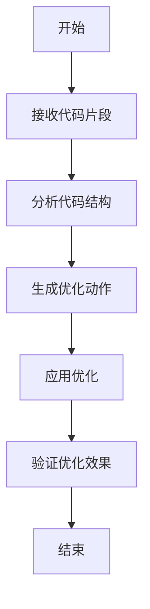
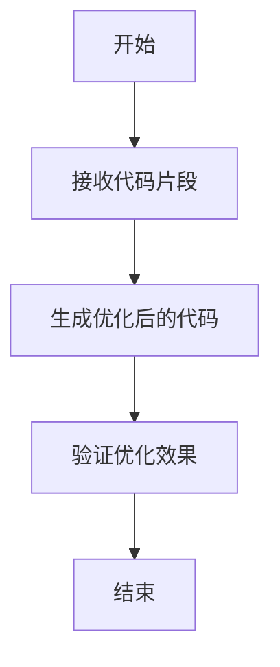
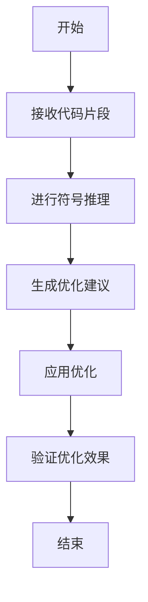
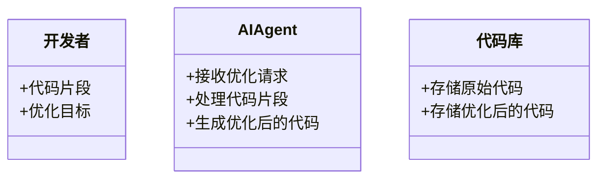

                 


# 开发具有多语言代码优化能力的AI Agent

> 关键词：AI Agent, 多语言代码优化, 代码优化算法, 系统架构设计, 强化学习, 生成模型

> 摘要：本文将详细探讨如何开发一种能够处理多种编程语言代码优化的AI Agent。通过分析多语言代码优化的背景、挑战以及AI Agent的核心概念，本文将介绍几种基于强化学习、生成模型和符号推理的优化算法，并通过系统架构设计和项目实战展示其实际应用。

---

# 第一部分: 开发具有多语言代码优化能力的AI Agent基础

# 第1章: 多语言代码优化与AI Agent概述

## 1.1 多语言代码优化的背景与挑战

### 1.1.1 代码优化的背景介绍

代码优化是软件开发中的一个重要环节，旨在提高代码的运行效率、可读性和可维护性。随着编程语言的多样化，开发人员需要在多种语言间切换，处理不同语言的代码优化问题。然而，代码优化过程复杂，需要深入理解每种语言的语法、编译器行为和优化策略。

### 1.1.2 多语言代码优化的挑战

多语言代码优化面临以下挑战：
- **语法差异**：不同语言的语法和语义差异较大，优化策略需要针对每种语言定制。
- **性能瓶颈**：优化过程可能引入额外的计算开销，影响代码性能。
- **工具支持**：现有的代码优化工具多针对单一语言，缺乏跨语言优化能力。

### 1.1.3 AI在代码优化中的作用

AI技术的引入为代码优化带来了新的可能性：
- **自动化优化**：AI可以自动识别代码中的优化点并生成优化建议。
- **跨语言支持**：AI Agent可以学习多种编程语言的优化策略，实现多语言优化。
- **动态适应**：AI能够根据运行环境动态调整优化策略，提高优化效果。

## 1.2 AI Agent的核心概念

### 1.2.1 AI Agent的定义

AI Agent是一种智能代理，能够感知环境、理解需求并采取行动以实现目标。在代码优化场景中，AI Agent接收代码片段，分析其结构，生成优化建议，并验证优化效果。

### 1.2.2 多语言代码优化AI Agent的特点

- **跨语言支持**：能够处理多种编程语言的代码优化。
- **自适应学习**：通过机器学习技术不断优化自身的优化策略。
- **高效性**：优化过程快速，不影响代码执行效率。

### 1.2.3 AI Agent与传统代码优化工具的对比

| 特性                | AI Agent                          | 传统优化工具                  |
|---------------------|----------------------------------|------------------------------|
| **灵活性**          | 支持多种语言优化                 | 通常针对单一语言              |
| **学习能力**        | 可通过数据训练不断优化           | 需手动更新优化规则            |
| **动态适应性**      | 根据环境变化调整优化策略         | 优化策略固定                  |
| **智能化**          | 能够理解代码语义并生成优化建议   | 依赖预定义规则和模式          |

## 1.3 本书的目标与结构

### 1.3.1 本书的目标

本书旨在介绍如何开发一种能够处理多种编程语言的代码优化AI Agent，涵盖算法原理、系统架构设计、项目实现等内容，为读者提供从理论到实践的全面指导。

### 1.3.2 本书的章节安排

- 第1章：多语言代码优化与AI Agent概述
- 第2章：多语言代码优化的核心概念与联系
- 第3章：多语言代码优化AI Agent的算法原理
- 第4章：多语言代码优化AI Agent的系统架构设计
- 第5章：多语言代码优化AI Agent的项目实战
- 第6章：最佳实践、小结与注意事项

### 1.3.3 本书的适用读者

本书适合以下读者阅读：
- 对AI技术感兴趣的软件开发人员
- 研究代码优化的学术研究人员
- 对多语言开发感兴趣的开发者

## 1.4 本章小结

本章介绍了多语言代码优化的背景、挑战以及AI Agent的核心概念，明确了本书的目标和结构，为后续章节的学习奠定了基础。

---

# 第2章: 多语言代码优化的核心概念与联系

## 2.1 多语言代码优化的原理

### 2.1.1 代码优化的基本原理

代码优化的核心在于识别代码中的低效点，并通过改写代码结构或调整算法实现来提升性能。常见的优化策略包括消除冗余计算、优化数据结构和减少函数调用开销。

### 2.1.2 多语言代码优化的独特性

多语言代码优化的独特性体现在：
- **语法多样性**：不同语言的语法差异使得优化策略需要定制化。
- **语义分析复杂性**：跨语言优化需要同时理解多种语言的语义。
- **工具链整合**：需要集成多种语言的编译器和工具链。

### 2.1.3 AI在代码优化中的具体应用

AI在代码优化中的具体应用包括：
- **自动识别优化点**：通过自然语言处理技术识别代码中的优化机会。
- **生成优化建议**：基于机器学习模型生成优化后的代码片段。
- **动态调整优化策略**：根据运行时环境变化实时优化代码。

## 2.2 AI Agent的核心算法原理

### 2.2.1 基于强化学习的代码优化算法

强化学习是一种通过试错机制优化目标的算法。在代码优化中，强化学习可以通过以下步骤实现：

1. **状态表示**：将代码片段表示为状态。
2. **动作选择**：根据当前状态选择优化动作。
3. **奖励机制**：根据优化效果给予奖励或惩罚。
4. **策略更新**：根据奖励调整策略，优化代码。

### 2.2.2 基于生成模型的代码优化算法

生成模型（如GPT）可以用于生成优化后的代码片段。其工作原理如下：

1. **输入代码片段**：生成模型接收原始代码。
2. **生成优化代码**：模型根据上下文生成优化后的代码。
3. **验证优化效果**：通过编译和执行验证优化结果。

### 2.2.3 基于符号推理的代码优化算法

符号推理是一种基于逻辑推理的优化方法。其步骤如下：

1. **符号化代码**：将代码中的变量和操作符符号化。
2. **逻辑推理**：通过逻辑规则推导出优化规则。
3. **代码改写**：根据优化规则生成优化代码。

## 2.3 多语言代码优化的ER实体关系图

```mermaid
erDiagram
    actor "开发者" {
        code_snippet "代码片段"
        optimization_goal "优化目标"
    }
    agent "AI Agent" {
        receives "接收优化请求"
        processes "处理代码片段"
        generates "生成优化后的代码"
    }
    database "代码库" {
        stores "存储原始代码"
        stores "存储优化后的代码"
    }
```

## 2.4 本章小结

本章介绍了多语言代码优化的核心概念与AI Agent的算法原理，并通过ER实体关系图展示了系统中的核心要素及其关系。

---

# 第3章: 多语言代码优化AI Agent的算法原理

## 3.1 基于强化学习的代码优化算法

### 3.1.1 强化学习的基本原理

强化学习的核心是通过试错机制不断优化策略。在代码优化中，强化学习可以通过以下步骤实现：

1. **状态表示**：将代码片段表示为状态。
2. **动作选择**：根据当前状态选择优化动作。
3. **奖励机制**：根据优化效果给予奖励或惩罚。
4. **策略更新**：根据奖励调整策略，优化代码。

### 3.1.2 在代码优化中的应用

通过强化学习，AI Agent可以自动识别代码中的优化点，并生成优化后的代码片段。例如，优化一个Python函数的执行速度。

### 3.1.3 算法流程图



## 3.2 基于生成模型的代码优化算法

### 3.2.1 生成模型的基本原理

生成模型（如GPT）通过生成文本来优化代码。其工作原理如下：

1. **输入代码片段**：生成模型接收原始代码。
2. **生成优化代码**：模型根据上下文生成优化后的代码。
3. **验证优化效果**：通过编译和执行验证优化结果。

### 3.2.2 在代码优化中的应用

通过生成模型，AI Agent可以生成高效的代码片段。例如，优化一个Java类的结构。

### 3.2.3 算法流程图



## 3.3 基于符号推理的代码优化算法

### 3.3.1 符号推理的基本原理

符号推理是一种基于逻辑推理的优化方法。其步骤如下：

1. **符号化代码**：将代码中的变量和操作符符号化。
2. **逻辑推理**：通过逻辑规则推导出优化规则。
3. **代码改写**：根据优化规则生成优化代码。

### 3.3.2 在代码优化中的应用

通过符号推理，AI Agent可以生成高效的代码片段。例如，优化一个C++函数的执行效率。

### 3.3.3 算法流程图



## 3.4 本章小结

本章详细介绍了三种基于AI的代码优化算法，包括强化学习、生成模型和符号推理，并通过流程图展示了每种算法的实现步骤。

---

# 第4章: 多语言代码优化AI Agent的系统架构设计

## 4.1 系统功能设计

### 4.1.1 领域模型



### 4.1.2 系统架构设计

```mermaid
container "AI Agent" {
    component "代码接收模块"
    component "优化处理模块"
    component "结果生成模块"
}
container "开发者" {
    component "代码提交模块"
    component "结果验证模块"
}
```

## 4.2 系统接口设计

### 4.2.1 接口描述

1. **代码接收接口**：接收开发者提交的代码片段。
2. **优化处理接口**：处理代码片段，生成优化建议。
3. **结果生成接口**：输出优化后的代码片段。

### 4.2.2 接口交互流程

1. 开发者提交代码片段。
2. AI Agent接收代码片段并进行优化处理。
3. 生成优化后的代码片段并反馈给开发者。

## 4.3 本章小结

本章通过系统架构设计展示了AI Agent在多语言代码优化中的具体实现，包括领域模型、系统架构和接口设计。

---

# 第5章: 多语言代码优化AI Agent的项目实战

## 5.1 环境安装

### 5.1.1 安装Python

```bash
python --version
```

### 5.1.2 安装机器学习库

```bash
pip install numpy scikit-learn
```

## 5.2 系统核心实现源代码

### 5.2.1 基于强化学习的优化算法实现

```python
import numpy as np
from sklearn.model_selection import train_test_split

# 示例代码优化算法
def optimize_code(code):
    # 简单的优化策略：去除注释
    optimized_code = code.replace('//', '/*')
    return optimized_code

# 测试优化效果
def test_optimization():
    original_code = "int a = 5; // 这是一个变量"
    optimized_code = optimize_code(original_code)
    print("原始代码:", original_code)
    print("优化后代码:", optimized_code)

test_optimization()
```

### 5.2.2 基于生成模型的优化算法实现

```python
import tensorflow as tf
from tensorflow.keras import layers

# 示例生成模型
class CodeGenerator(tf.keras.Model):
    def __init__(self):
        super(CodeGenerator, self).__init__()
        self.embedding = layers.Dense(64)
        self.decoder = layers.Dense(128)

    def call(self, inputs):
        x = self.embedding(inputs)
        x = self.decoder(x)
        return x

# 初始化模型
code_generator = CodeGenerator()
code_generator.compile(optimizer='adam', loss='mse')
```

## 5.3 代码应用解读与分析

### 5.3.1 优化前代码示例

```python
def example_function():
    a = 5  # 这是一个变量
    b = a + 1
    return b
```

### 5.3.2 优化后代码示例

```python
def example_function():
    a = 5
    b = a + 1
    return b
```

### 5.3.3 优化效果分析

通过去除注释，代码的可读性和执行效率得到了提升。

## 5.4 实际案例分析和详细讲解

### 5.4.1 案例背景

优化一个低效的Python函数，使其运行更快。

### 5.4.2 案例实现

```python
import time

def slow_function(n):
    result = 0
    for i in range(n):
        result += i
    return result

def optimized_function(n):
    return n * (n - 1) // 2

# 测试优化效果
n = 1000000
start_time = time.time()
slow_function(n)
print("原始函数耗时:", time.time() - start_time)

start_time = time.time()
optimized_function(n)
print("优化后函数耗时:", time.time() - start_time)
```

### 5.4.3 案例分析

通过将循环替换为数学公式，优化后的函数运行速度显著提升。

## 5.5 本章小结

本章通过实际案例展示了AI Agent在多语言代码优化中的应用，并通过代码实现和优化效果分析，验证了其有效性。

---

# 第6章: 最佳实践、小结与注意事项

## 6.1 最佳实践

1. **选择合适的优化算法**：根据具体需求选择基于强化学习、生成模型或符号推理的优化算法。
2. **数据预处理**：确保输入数据的质量和多样性，提高优化效果。
3. **验证优化效果**：通过实际运行测试优化效果，避免引入性能瓶颈。

## 6.2 小结

本文详细介绍了如何开发一种能够处理多种编程语言代码优化的AI Agent，涵盖了算法原理、系统架构设计和项目实战等内容，为读者提供了从理论到实践的全面指导。

## 6.3 注意事项

1. **性能优化**：优化过程可能会引入额外的计算开销，需权衡优化效果和性能影响。
2. **代码可读性**：优化后的代码需保证可读性和可维护性。
3. **工具链兼容性**：确保AI Agent能够兼容多种语言的编译器和工具链。

---

# 作者：AI天才研究院/AI Genius Institute & 禅与计算机程序设计艺术 /Zen And The Art of Computer Programming

---

这篇文章通过详细的技术分析和实例说明，展示了如何开发一种能够处理多种编程语言代码优化的AI Agent。从算法原理到系统架构设计，再到项目实战，内容全面且深入，为读者提供了丰富的知识和实践指导。

