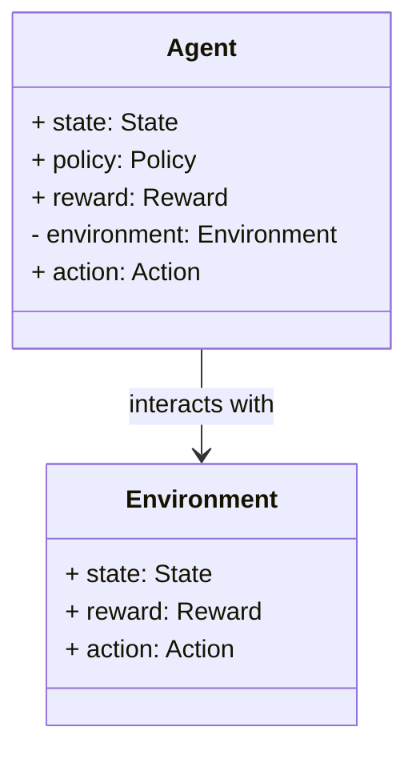
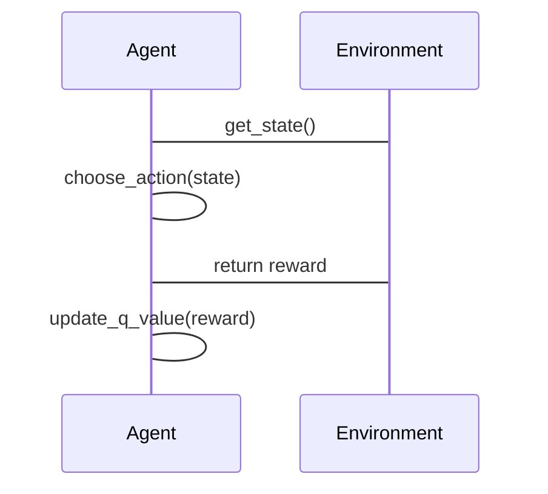

                 


# 开发具有强化学习能力的AI Agent

> 关键词：强化学习，AI Agent，Q-learning，Deep Q-Network，系统架构设计

> 摘要：本文详细探讨了如何开发具有强化学习能力的AI Agent，从强化学习的基本概念到核心算法，再到系统架构设计和项目实战，为读者提供了全面的指导。文章首先介绍了强化学习与AI Agent的关系，接着深入分析了强化学习的核心算法及其数学模型，随后详细讲解了AI Agent的系统架构设计，最后通过一个具体项目案例展示了强化学习AI Agent的开发过程。

---

# 第1章: 强化学习与AI Agent概述

## 1.1 强化学习的基本概念

### 1.1.1 什么是强化学习
强化学习（Reinforcement Learning，RL）是一种机器学习范式，通过智能体与环境的交互，学习如何做出决策以最大化累计奖励。与监督学习和无监督学习不同，强化学习通过试错机制，逐步优化策略以获得最佳性能。

### 1.1.2 强化学习的核心要素
- **状态（State）**：智能体所处的环境情况。
- **动作（Action）**：智能体在给定状态下做出的行为。
- **奖励（Reward）**：智能体采取某个动作后获得的反馈，用于指导智能体的学习。
- **策略（Policy）**：智能体选择动作的规则，目标是最大化累计奖励。
- **值函数（Value Function）**：评估某个状态或状态-动作对的价值。

### 1.1.3 AI Agent的定义与特点
AI Agent是一种智能实体，能够感知环境并采取行动以实现目标。AI Agent可以是软件程序、机器人或其他智能系统，其核心是具备自主决策能力。

## 1.2 强化学习与AI Agent的关系

### 1.2.1 强化学习在AI Agent中的作用
强化学习为AI Agent提供了一种通过试错优化决策的能力，使其能够在动态环境中自主学习和适应。

### 1.2.2 AI Agent的分类与应用场景
- **反应式AI Agent**：基于当前感知做出反应，如自动驾驶中的实时决策。
- **基于模型的AI Agent**：使用环境模型进行决策，如复杂的策略游戏AI。
- **应用领域**：游戏AI、机器人控制、自动驾驶、金融交易等。

## 1.3 强化学习的核心算法

### 1.3.1 Q-learning算法
Q-learning是一种经典的强化学习算法，适用于离散状态和动作空间。其核心思想是通过更新Q表（Q-value）来记录状态-动作对的价值。

### 1.3.2 Deep Q-Network (DQN)算法
DQN将Q-learning与深度神经网络结合，能够处理高维状态空间，如图像识别。

### 1.3.3 Policy Gradient方法
Policy Gradient直接优化策略，通过调整参数使策略更优。

## 1.4 强化学习的应用场景

### 1.4.1 游戏AI
在游戏环境中，强化学习AI可以训练出超越人类水平的玩家，如在《星际争霸》中击败专业选手。

### 1.4.2 机器人控制
机器人通过强化学习学习行走、抓取等动作，提高灵活性和适应性。

### 1.4.3 自动驾驶
自动驾驶系统通过强化学习优化路径规划和决策，提高驾驶安全性和效率。

## 1.5 本章小结
本章介绍了强化学习的基本概念和核心算法，以及AI Agent的定义、分类和应用场景，为后续章节奠定了基础。

---

# 第2章: 强化学习的核心概念与数学模型

## 2.1 强化学习的基本原理

### 2.1.1 状态、动作、奖励的定义
- **状态**：智能体所处环境的描述，如当前位置或观察到的信息。
- **动作**：智能体在给定状态下做出的选择，如移动方向。
- **奖励**：智能体采取某个动作后获得的反馈，指导学习方向。

### 2.1.2 马尔可夫决策过程（MDP）
MDP是一种数学模型，描述强化学习环境，包括状态、动作、转移概率和奖励函数。

### 2.1.3 动作-价值函数与策略
- **动作-价值函数（Q(s,a)）**：评估在状态s下采取动作a的价值。
- **策略（π(a|s)）**：在状态s下选择动作a的概率分布。

## 2.2 Q-learning算法的数学模型

### 2.2.1 Q-learning的更新公式
$$ Q(s,a) = Q(s,a) + \alpha (r + \gamma \max Q(s',a') - Q(s,a)) $$
其中，α是学习率，γ是折扣因子，r是即时奖励，s'是下一状态。

## 2.3 Deep Q-Network (DQN)的原理

### 2.3.1 DQN的网络结构
DQN由两个神经网络组成：主网络和目标网络，用于稳定训练过程。

### 2.3.2 经验回放机制
经验回放通过存储和重放历史经验，减少样本偏差，加速学习。

### 2.3.3 目标网络的作用
目标网络用于稳定价值评估，减少Q值估计的波动。

## 2.4 强化学习中的探索与利用

### 2.4.1 探索策略（如ε-greedy）
通过随机选择新动作（探索）或当前最优动作（利用）来平衡探索与利用。

### 2.4.2 利用策略（如贪心策略）
优先选择当前已知的最佳动作，减少不必要的探索。

## 2.5 本章小结
本章详细讲解了强化学习的核心概念和数学模型，为后续算法实现奠定了理论基础。

---

# 第3章: 强化学习算法的实现与优化

## 3.1 算法实现的基础步骤

### 3.1.1 环境接口设计
定义智能体与环境交互的接口，如获取状态、选择动作、接收奖励等。

### 3.1.2 状态空间和动作空间的处理
将高维状态压缩或编码，简化计算。

### 3.1.3 奖励函数的设计
设计合理的奖励机制，引导智能体学习正确的行为。

## 3.2 基于神经网络的强化学习实现

### 3.2.1 神经网络的结构设计
- 输入层：处理输入状态。
- 隐藏层：提取特征。
- 输出层：输出动作价值或概率分布。

### 3.2.2 损失函数与优化器
- 损失函数：衡量预测Q值与实际Q值的差距。
- 优化器：如Adam，用于更新神经网络参数。

## 3.3 算法优化策略

### 3.3.1 经验回放的优化
- 使用优先级经验回放，根据经验的重要性调整采样概率。

### 3.3.2 模型更新频率
- 定期同步主网络和目标网络，保持模型稳定。

### 3.3.3 学习率调整
- 动态调整学习率，适应训练过程中的变化。

## 3.4 算法实现的代码框架

### 3.4.1 环境类的实现
```python
class Environment:
    def __init__(self):
        # 初始化环境状态
        pass
    
    def get_state(self):
        # 返回当前状态
        pass
    
    def take_action(self, action):
        # 执行动作，返回新的状态和奖励
        pass
```

### 3.4.2 神经网络模型的实现
```python
import torch
import torch.nn as nn

class DQN(nn.Module):
    def __init__(self, state_dim, action_dim):
        super(DQN, self).__init__()
        self.fc1 = nn.Linear(state_dim, 64)
        self.fc2 = nn.Linear(64, action_dim)
    
    def forward(self, x):
        x = torch.relu(self.fc1(x))
        x = self.fc2(x)
        return x
```

## 3.5 本章小结
本章通过代码框架和优化策略，详细讲解了强化学习算法的实现过程，为实际开发提供了指导。

---

# 第4章: AI Agent的系统分析与架构设计

## 4.1 系统分析

### 4.1.1 问题场景介绍
假设我们正在开发一个用于游戏AI的强化学习系统，目标是训练AI在复杂游戏中击败人类玩家。

### 4.1.2 项目介绍
项目名称：强化学习游戏AI Agent开发。

## 4.2 系统功能设计

### 4.2.1 领域模型设计


### 4.2.2 系统架构设计
```mermaid
rectangle 系统边界 {
    rectangle 状态管理模块 {
        include 状态更新
        include 状态存储
    }
    rectangle 动作选择模块 {
        include 策略网络
        include 动作输出
    }
    rectangle 奖励机制模块 {
        include 奖励计算
        include 奖励反馈
    }
}
```

## 4.3 系统接口设计

### 4.3.1 接口定义
- **获取当前状态**：`get_state()`
- **选择动作**：`choose_action(state)`
- **更新Q值**：`update_q_value(reward, next_state)`

### 4.3.2 接口交互


## 4.4 本章小结
本章通过系统分析和架构设计，为强化学习AI Agent的开发提供了清晰的指导框架。

---

# 第5章: 项目实战——开发一个强化学习AI Agent

## 5.1 环境安装与配置

### 5.1.1 安装Python环境
- 使用Anaconda或virtualenv管理Python版本和依赖库。

### 5.1.2 安装必要的库
- `torch`：深度学习框架
- `gym`：OpenAI的强化学习环境库
- `numpy`：数值计算库
- `matplotlib`：可视化库

## 5.2 系统核心实现

### 5.2.1 环境类的实现
```python
import gym

class GymEnvironment:
    def __init__(self, env_name):
        self.env = gym.make(env_name)
    
    def get_state(self):
        return self.env.observation_space.sample()
    
    def take_action(self, action):
        obs, reward, done, info = self.env.step(action)
        return obs, reward, done
```

### 5.2.2 神经网络模型的实现
```python
import torch
import torch.nn as nn
import torch.optim as optim

class DQN(nn.Module):
    def __init__(self, state_dim, action_dim):
        super(DQN, self).__init__()
        self.fc1 = nn.Linear(state_dim, 64)
        self.fc2 = nn.Linear(64, action_dim)
    
    def forward(self, x):
        x = torch.relu(self.fc1(x))
        x = self.fc2(x)
        return x

def update_q_value(model, optimizer, reward, current_state, next_state):
    current_q = model(current_state)
    next_q = model(next_state).max().item()
    target = reward + 0.99 * next_q
    loss = nn.MSELoss()(current_q, torch.tensor([target]))
    optimizer.zero_grad()
    loss.backward()
    optimizer.step()
```

## 5.3 代码实现与解读

### 5.3.1 训练循环
```python
def train(agent, env, num_episodes=1000):
    optimizer = optim.Adam(agent.parameters(), lr=0.001)
    for episode in range(num_episodes):
        state = env.get_state()
        with torch.no_grad():
            action_probs = agent(state)
        action = torch.multinomial(action_probs, 1).item()
        next_state, reward, done = env.take_action(action)
        update_q_value(agent, optimizer, reward, state, next_state)
        if done:
            break
```

### 5.3.2 测试与评估
```python
def evaluate(agent, env, num_episodes=100):
    total_rewards = 0
    for _ in range(num_episodes):
        state = env.get_state()
        with torch.no_grad():
            action_probs = agent(state)
        action = torch.multinomial(action_probs, 1).item()
        next_state, reward, done = env.take_action(action)
        total_rewards += reward
        if done:
            break
    return total_rewards / num_episodes
```

## 5.4 项目小结
本章通过一个具体项目案例，展示了强化学习AI Agent的开发过程，从环境配置到代码实现，再到测试与评估，为读者提供了实践指导。

---

# 第6章: 最佳实践与小结

## 6.1 最佳实践

### 6.1.1 环境设计
- 明确问题场景，设计合理的环境接口和状态空间。

### 6.1.2 算法选择
- 根据任务需求选择合适的强化学习算法，如DQN适合离散动作空间。

### 6.1.3 网络结构优化
- 通过调整网络层数、节点数和激活函数，优化模型性能。

## 6.2 小结

### 6.2.1 强化学习的核心价值
强化学习通过试错机制，使AI Agent具备自主决策能力，适用于复杂动态环境。

### 6.2.2 未来发展方向
- 多智能体协同
- 连续控制任务
- 强化学习的安全性和伦理问题

## 6.3 注意事项

### 6.3.1 训练稳定性
- 通过经验回放和目标网络，减少训练波动。

### 6.3.2 超参数调整
- 学习率、折扣因子等超参数对训练效果影响显著，需谨慎调整。

### 6.3.3 环境设计合理性
- 合理设计环境和奖励机制，引导智能体学习正确的策略。

## 6.4 拓展阅读

### 6.4.1 经典论文
- "Deep Q-Networks: Decoupling Experience Replay and Target Networks"（DQN论文）

### 6.4.2 实战书籍
- 《Hands-On Machine Learning with Scikit-Learn, Keras, and TensorFlow》

## 6.5 本章小结
本章总结了开发强化学习AI Agent的最佳实践，并展望了未来的发展方向。

---

# 作者：AI天才研究院/AI Genius Institute & 禅与计算机程序设计艺术 /Zen And The Art of Computer Programming

---

希望这篇文章能满足你的需求！如果需要进一步修改或补充，请随时告诉我。

