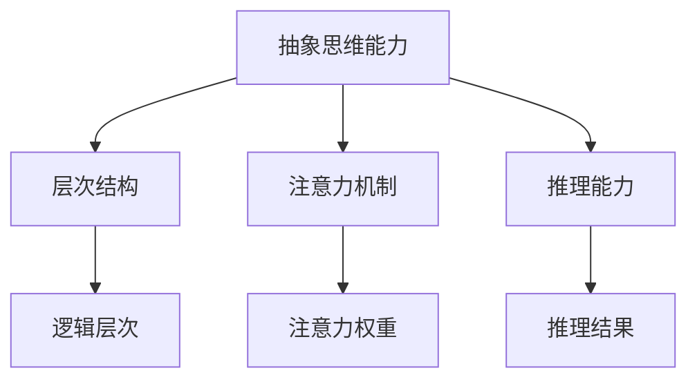
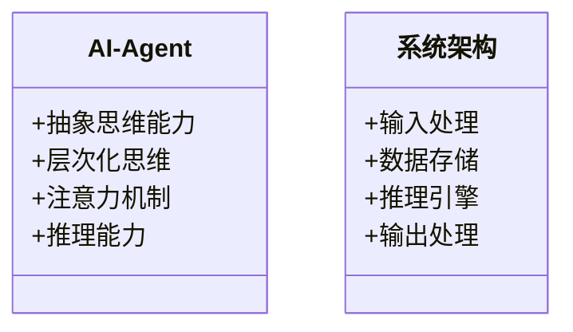
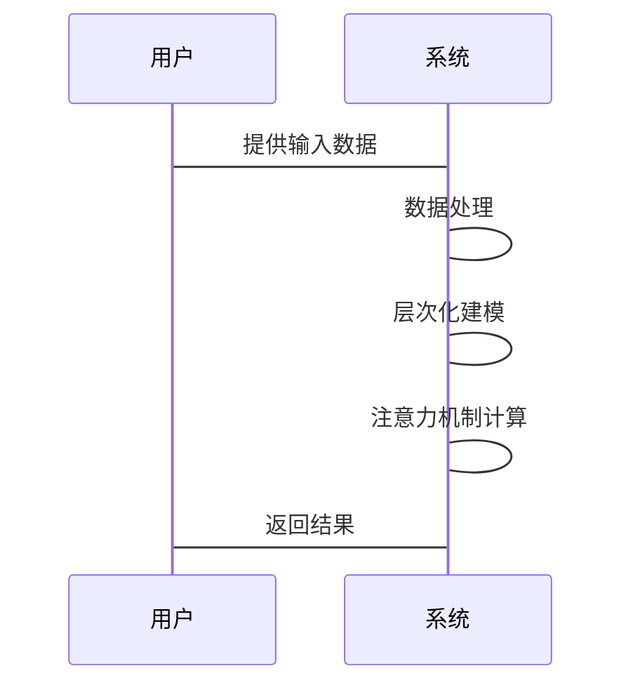

                 

<think>
嗯，我现在需要帮用户写一篇关于《开发具有抽象思维能力的AI Agent》的技术博客。首先，我得理解这个主题的核心是什么。抽象思维能力对AI Agent来说意味着什么？它需要具备理解、归纳和推理的能力，这可能涉及到层次结构和注意力机制。我应该从背景介绍开始，解释什么是AI Agent，以及抽象思维的重要性。

然后，我需要深入探讨抽象思维的核心概念，比如层次结构和注意力机制。这部分可能需要使用表格对比抽象思维与传统AI的区别，帮助读者更好地理解。接着，算法原理部分，我得详细讲解层次化思维算法和注意力机制模型，并用mermaid流程图展示工作流程。数学模型部分，我得写出相关的公式，确保准确无误。

系统分析与架构设计是关键，我需要介绍AI Agent的系统架构，用类图展示各个模块的关系。项目实战部分，我得提供一个具体的案例，比如开发一个多任务AI Agent，包括环境安装、代码实现和案例分析。最后，总结一下最佳实践，指出开发中的注意事项和未来的发展方向。

整体来看，文章需要逻辑清晰，层次分明，涵盖理论、算法、系统设计和实战，确保读者能全面掌握开发具有抽象思维能力的AI Agent所需的知识和技能。
</think>

# 开发具有抽象思维能力的AI Agent

## 关键词：AI Agent、抽象思维、层次化思维、注意力机制、算法原理、系统架构

## 摘要：  
本文将详细探讨如何开发具有抽象思维能力的AI Agent。通过分析抽象思维的核心概念、算法原理、系统架构以及实际案例，本文为读者提供一个全面的视角，帮助他们理解如何在AI Agent中实现抽象思维能力。从层次化思维到注意力机制，从数学模型到系统设计，本文都将进行深入的分析和讲解。

---

# 第1章: AI Agent与抽象思维概述

## 1.1 AI Agent的基本概念

### 1.1.1 AI Agent的定义  
AI Agent（人工智能代理）是指能够感知环境、自主决策并采取行动的智能体。它可以是一个软件程序、机器人或其他智能系统，目标是通过与环境交互来实现特定任务。

### 1.1.2 抽象思维的定义与特点  
抽象思维是人类认知的核心能力之一，指的是从具体事物中提取本质特征，忽略无关细节，构建高层次概念的能力。抽象思维的特点包括：层次性、概括性和灵活性。

### 1.1.3 AI Agent与抽象思维的关系  
AI Agent需要通过抽象思维能力来理解复杂环境、识别模式，并做出合理决策。抽象思维是AI Agent实现高级智能的基础。

## 1.2 抽象思维能力在AI Agent中的重要性

### 1.2.1 抽象思维能力的核心作用  
抽象思维能力使AI Agent能够从大量数据中提取关键信息，构建知识模型，并进行推理和预测。

### 1.2.2 抽象思维能力对AI Agent的影响  
具备抽象思维能力的AI Agent能够更好地处理复杂任务，提升决策的准确性和效率。

### 1.2.3 抽象思维能力的实现挑战  
抽象思维能力的实现需要解决层次化建模、注意力机制设计以及推理算法优化等技术难题。

## 1.3 本章小结  
本章介绍了AI Agent的基本概念，分析了抽象思维能力的重要性及其在AI Agent中的应用价值。

---

# 第2章: 抽象思维能力的核心概念与联系

## 2.1 抽象思维能力的核心概念

### 2.1.1 抽象思维的层次结构  
抽象思维可以分为多个层次，包括感知层、理解层、推理层和决策层。每个层次都有其独特的功能和作用。

### 2.1.2 抽象思维的注意力机制  
注意力机制是抽象思维的核心组成部分，用于聚焦关键信息，忽略无关细节。它通过权重分配的方式，帮助AI Agent高效处理信息。

### 2.1.3 抽象思维的推理能力  
推理能力是抽象思维的重要组成部分，包括归纳推理、演绎推理和类比推理等多种形式。

## 2.2 抽象思维能力与AI Agent的关系

### 2.2.1 抽象思维能力在AI Agent中的应用  
抽象思维能力使AI Agent能够理解复杂任务、构建知识图谱，并进行高层次的决策。

### 2.2.2 抽象思维能力的实现方式  
通过层次化建模、注意力机制和推理算法等技术手段，AI Agent可以实现抽象思维能力。

### 2.2.3 抽象思维能力的评估指标  
评估指标包括推理准确率、任务完成度和决策效率等。

## 2.3 抽象思维能力的ER实体关系图



## 2.4 本章小结  
本章深入探讨了抽象思维能力的核心概念，并通过ER实体关系图展示了其内部结构和相互关系。

---

# 第3章: 抽象思维能力的算法原理

## 3.1 层次化思维算法

### 3.1.1 层次化思维算法的定义  
层次化思维算法是一种基于层次结构的推理方法，通过分解问题到不同层次，逐步解决问题。

### 3.1.2 层次化思维算法的实现步骤  
1. 将问题分解为多个层次，构建层次化模型。
2. 从底层到高层逐步推理，获取高层次信息。
3. 结合注意力机制，优化推理过程。

### 3.1.3 层次化思维算法的优缺点  
优点：层次化结构清晰，适合复杂问题。缺点：层次划分需要人工设计，灵活性有限。

## 3.2 注意力机制模型

### 3.2.1 注意力机制模型的定义  
注意力机制是一种模拟人类注意力的方法，通过计算不同特征的权重，聚焦关键信息。

### 3.2.2 注意力机制模型的实现步骤  
1. 计算查询（Query）、键（Key）和值（Value）向量。
2. 计算注意力权重。
3. 加权求和，得到最终结果。

### 3.2.3 注意力机制模型的优缺点  
优点：能够有效提取关键信息。缺点：计算复杂度较高。

## 3.3 抽象思维能力的数学模型

### 3.3.1 层次化思维的数学模型  
$$ \text{层次化思维} = \sum_{i=1}^{n} w_i x_i $$

### 3.3.2 注意力机制的数学模型  
$$ \text{注意力权重} = \frac{e^{k_j \cdot q_i}}{\sum_{j=1}^{m} e^{k_j \cdot q_i}} $$

## 3.4 本章小结  
本章详细讲解了层次化思维算法和注意力机制模型的原理，并通过数学公式展示了其具体实现。

---

# 第4章: 抽象思维能力的系统分析与架构设计

## 4.1 系统分析

### 4.1.1 问题场景介绍  
我们以一个多任务AI Agent为例，分析其抽象思维能力的实现。

### 4.1.2 项目介绍  
该项目旨在开发一个具备抽象思维能力的AI Agent，能够处理复杂任务。

### 4.1.3 系统功能设计  
系统功能包括数据采集、层次化建模、注意力机制设计和推理引擎。

## 4.2 系统架构设计



## 4.3 系统接口设计

### 4.3.1 系统接口设计  
系统接口包括数据输入接口、推理接口和结果输出接口。

### 4.3.2 系统交互设计  


## 4.4 本章小结  
本章分析了系统架构，设计了系统接口和交互流程，为实现抽象思维能力的AI Agent提供了技术基础。

---

# 第5章: 项目实战

## 5.1 环境安装

### 5.1.1 开发工具安装  
安装Python、TensorFlow和Keras等开发工具。

### 5.1.2 依赖库安装  
安装numpy、pandas和scikit-learn等依赖库。

## 5.2 系统核心实现源代码

### 5.2.1 层次化思维算法实现  
```python
def hierarchical_reasoning(data):
    # 分解问题层次
    levels = decompose(data)
    # 逐层推理
    result = []
    for level in levels:
        result.append(reasoning(level))
    return result
```

### 5.2.2 注意力机制模型实现  
```python
def attention_model(data):
    # 计算查询、键和值向量
    Q, K, V = compute_vectors(data)
    # 计算注意力权重
    attention_weights = compute_attention(Q, K)
    # 加权求和
    result = weighted_sum(attention_weights, V)
    return result
```

## 5.3 代码应用解读与分析

### 5.3.1 代码解读  
层次化思维算法通过分解问题层次，逐步推理得到结果。注意力机制模型通过计算注意力权重，聚焦关键信息。

### 5.3.2 代码分析  
代码实现层次化思维和注意力机制的核心功能，展示了如何在实际项目中应用这些算法。

## 5.4 实际案例分析

### 5.4.1 案例介绍  
以一个多任务AI Agent为例，分析其抽象思维能力的实现。

### 5.4.2 案例分析  
通过具体案例，展示层次化思维和注意力机制在实际任务中的应用。

## 5.5 本章小结  
本章通过项目实战，展示了如何在实际项目中实现抽象思维能力的AI Agent。

---

# 第6章: 最佳实践、小结与展望

## 6.1 最佳实践 tips  
在开发AI Agent时，建议采用层次化思维算法和注意力机制模型，并结合具体任务需求进行优化。

## 6.2 小结  
本文详细讲解了开发具有抽象思维能力的AI Agent的核心概念、算法原理、系统架构和实际案例。

## 6.3 注意事项  
在实现过程中，需要注意层次划分的合理性、注意力机制的计算效率以及推理算法的准确性。

## 6.4 拓展阅读  
推荐阅读相关领域的书籍和论文，深入学习抽象思维能力的实现方法。

---

# 作者：AI天才研究院/AI Genius Institute & 禅与计算机程序设计艺术 /Zen And The Art of Computer Programming

