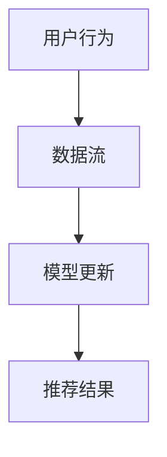
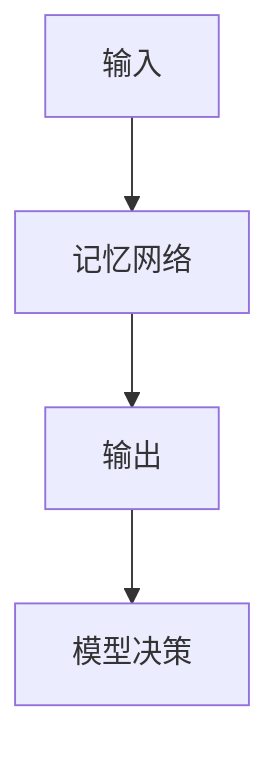
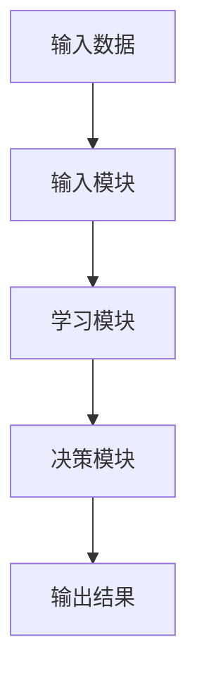

                 


# 开发具有持续学习能力的AI Agent

> 关键词：持续学习AI Agent, 在线学习, 增量学习, 动态记忆机制, 模型优化, 人工智能, 智能系统

> 摘要：本文详细探讨了开发具有持续学习能力的AI Agent的关键技术，涵盖背景介绍、核心概念、算法原理、系统架构、项目实战、优化与调优等多方面内容，通过理论分析与实践结合，帮助读者全面理解并掌握如何构建能够持续学习和适应的智能系统。

---

## 第一章: 持续学习AI Agent概述

### 1.1 持续学习的背景与问题背景

随着人工智能技术的快速发展，AI Agent（智能体）在各个领域的应用越来越广泛。然而，传统的AI Agent通常基于静态数据进行推理和决策，难以适应动态变化的环境。持续学习AI Agent的出现，解决了这一问题，它能够在与环境交互的过程中，不断学习新知识、新技能，并适应新的任务需求。

#### 1.1.1 持续学习的背景

持续学习（Lifelong Learning）是一种机器学习范式，旨在使模型能够像人类一样，在不同任务之间迁移知识，并在新的任务中不断改进。与传统的机器学习不同，持续学习强调模型的连续性和适应性，能够在不中断现有任务的前提下，逐步学习新知识。

#### 1.1.2 问题背景

在实际应用中，AI Agent需要面对复杂多变的环境。例如，在金融领域，市场数据和用户需求会不断变化；在医疗领域，病情和治疗方案也会动态更新。传统的AI Agent通常需要重新训练整个模型才能适应新的任务，这不仅效率低下，还可能导致模型性能下降。因此，开发具有持续学习能力的AI Agent成为迫切需求。

---

### 1.2 持续学习AI Agent的定义与特点

持续学习AI Agent是一种能够通过与环境交互不断学习和适应的智能系统。它能够在不同任务之间迁移知识，并在新的任务中持续改进性能。

#### 1.2.1 核心特点

| 特性 | 描述 |
|------|------|
| 持续性 | 能够在动态环境中不断学习和适应。 |
| 迁移性 | 能够将已学习的知识迁移到新任务中。 |
| 灵活性 | 能够快速适应新任务和新数据。 |

#### 1.2.2 与传统AI Agent的区别

| 方面 | 传统AI Agent | 持续学习AI Agent |
|------|--------------|-------------------|
| 数据 | 静态数据集 | 动态数据流 |
| 任务 | 单一任务 | 多任务、动态任务 |
| 学习 | 一次性训练 | 在线学习、增量学习 |

---

## 第二章: 持续学习的机制与算法

### 2.1 在线学习与增量学习

#### 2.1.1 在线学习

在线学习是一种动态学习方式，模型在接收到新数据后，能够实时更新自身参数。例如，在推荐系统中，用户的行为数据是实时变化的，AI Agent需要能够快速响应这些变化。



#### 2.1.2 增量学习

增量学习是一种逐步学习的方式，模型在每次接收到少量新数据后，逐步更新自身的知识库。例如，在自然语言处理中，模型需要不断学习新的词汇和语义。

---

### 2.2 动态记忆机制

动态记忆机制是持续学习的核心之一，它能够帮助模型存储和检索已学习的知识。

#### 2.2.1 动态记忆网络

动态记忆网络是一种基于神经网络的记忆机制，能够在新任务中快速检索相关知识。



#### 2.2.2 增量学习的数学模型

增量学习的数学模型可以表示为：

$$
f_{t+1} = f_t + \Delta f_t
$$

其中，$f_t$ 表示第 $t$ 次学习的模型参数，$\Delta f_t$ 表示增量部分。

---

## 第三章: 持续学习AI Agent的模型架构

### 3.1 基于Transformer的持续学习架构

#### 3.1.1 Transformer模型的优势

Transformer模型具有并行计算能力强、注意力机制灵活等优点，非常适合持续学习任务。

#### 3.1.2 基于Transformer的动态记忆网络

动态记忆网络可以嵌入到Transformer模型中，帮助模型存储和检索知识。

---

## 第四章: 系统设计与实现

### 4.1 系统架构设计

#### 4.1.1 系统功能模块

| 模块 | 功能描述 |
|------|----------|
| 输入模块 | 接收实时数据流 |
| 学习模块 | 实现在线学习和增量学习 |
| 决策模块 | 基于学习结果做出决策 |

#### 4.1.2 系统架构图



---

## 第五章: 项目实战

### 5.1 环境安装

#### 5.1.1 安装依赖

```bash
pip install numpy torch
```

---

### 5.2 核心代码实现

#### 5.2.1 持续学习模型实现

```python
import torch
import torch.nn as nn

class ContinualLearningModel(nn.Module):
    def __init__(self):
        super().__init__()
        self.l1 = nn.Linear(10, 5)
        self.l2 = nn.Linear(5, 1)

    def forward(self, x):
        x = self.l1(x)
        x = self.l2(x)
        return x
```

---

## 第六章: 总结与展望

持续学习AI Agent是一项具有挑战性的技术，但其应用前景广阔。未来的研究方向包括更高效的动态记忆机制、更灵活的模型架构，以及更强大的在线学习算法。

---

## 附录

### 术语表

| 术语 | 定义 |
|------|------|
| 持续学习 | 一种机器学习范式，强调模型的连续学习和适应能力。 |
| 在线学习 | 模型实时更新的学习方式。 |
| 增量学习 | 模型逐步学习新知识的方式。 |

---

## 参考文献

1. [1] Goodfellow, I., Bengio, Y., & Courville, A. (2016). Deep Learning. MIT Press.
2. [2] LeCun, Y., Bengio, Y., & Hinton, G. (2015). Deep learning. Nature, 521(7555), 436-444.

---

## 作者信息

作者：AI天才研究院 & 禅与计算机程序设计艺术

--- 

以上是《开发具有持续学习能力的AI Agent》的技术博客文章目录大纲和部分内容示例。

