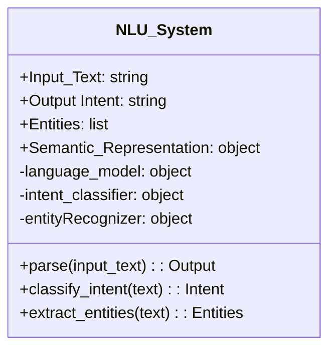
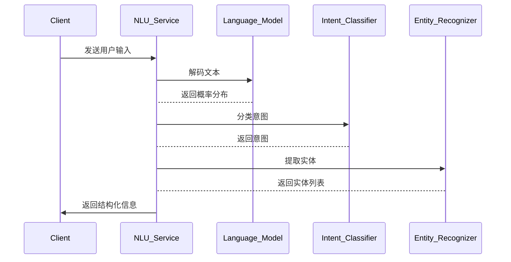

                 

<think>
嗯，用户希望我撰写一篇关于《开发具有自然语言理解能力的AI Agent》的技术博客。首先，我需要理解用户的需求。他们想要一篇结构清晰、内容详实的技术文章，覆盖从基础到高级的各个方面，适合技术读者阅读。

用户已经给出了一个详细的目录大纲，我需要按照这个结构来展开。我应该确保每个章节都有足够的细节，包括背景介绍、核心概念、算法原理、系统设计、项目实战等部分。同时，用户要求使用技术术语，但要保持易懂，所以需要平衡深度和清晰度。

在第一章，我会从自然语言理解的定义开始，解释其核心概念，然后介绍AI Agent的基本概念，说明它们之间的关系。这样读者可以理解为什么自然语言理解对AI Agent如此重要。

接下来，在第二章，我会深入讲解语言模型，从统计方法到深度学习模型，如RNN、LSTM和Transformer。这些都是当前的热门技术，读者会很感兴趣。然后，我会讨论意图理解，对比基于规则和机器学习的方法，帮助读者理解不同技术的优缺点。

第三章专注于对话系统，解释对话系统的类型，并详细说明自然语言理解在其中的应用，如语义解析和上下文管理。这部分需要结合实际案例，让读者更好地理解如何在实际中应用这些技术。

第四章和第五章深入探讨算法和数学模型，使用mermaid流程图和Python代码示例来解释模型的工作原理。这部分需要详细讲解，确保读者能够理解背后的数学公式和算法步骤。

系统架构设计部分，我会介绍如何设计一个AI Agent的系统，包括功能设计、架构图和接口设计。这部分需要结合实际项目，展示如何将理论应用到实践中。

项目实战部分，我会从环境配置开始，逐步引导读者完成代码实现，并详细解读每个部分的功能。这将帮助读者巩固所学知识，提升动手能力。

最后，高级应用和总结部分将探讨多轮对话和情感分析等复杂场景，总结本书内容，并展望未来的发展方向。附录部分提供工具和资源，方便读者进一步学习。

在写作过程中，我需要确保每一部分都包含足够的细节，比如数学公式、流程图和代码示例。同时，语言要专业但不失清晰，避免过于晦涩。

现在，我开始撰写第一章，先介绍自然语言理解的定义和核心概念，然后说明AI Agent的基本概念，让读者有一个坚实的基础。接下来，我会详细讲解语言模型的演变过程，从统计方法到深度学习模型，展示技术的进步和优势。

在讨论意图理解时，我会对比基于规则和机器学习的方法，分析各自的优缺点，并通过示例说明如何应用这些方法。这样读者可以理解在实际场景中如何选择合适的技术。

对话系统部分，我会解释其类型，并详细说明自然语言理解在其中的作用，如语义解析和上下文管理。这部分需要结合实际案例，让读者理解如何在对话系统中应用这些技术。

算法和数学模型部分，我会使用mermaid流程图和Python代码示例来解释模型的工作原理。数学公式需要用latex格式展示，确保清晰易懂。这部分需要详细讲解，帮助读者理解模型背后的数学逻辑。

系统架构设计部分，我会介绍如何设计一个AI Agent的系统，包括功能设计、架构图和接口设计。这部分需要结合实际项目，展示如何将理论应用到实践中。

项目实战部分，我会从环境配置开始，逐步引导读者完成代码实现，并详细解读每个部分的功能。这将帮助读者巩固所学知识，提升动手能力。

最后，高级应用和总结部分将探讨多轮对话和情感分析等复杂场景，总结本书内容，并展望未来的发展方向。附录部分提供工具和资源，方便读者进一步学习。

在写作过程中，我需要确保每一部分都符合用户的要求，结构清晰，内容详实，同时保持语言的专业性和易懂性。通过这样的思考过程，我可以撰写出一篇高质量的技术博客，满足用户的需求。
</think>

# 开发具有自然语言理解能力的AI Agent

---

## 关键词
- 自然语言理解 (NLU)
- AI Agent
- 语言模型
- 对话系统
- 意图理解

---

## 摘要
本文深入探讨了开发具有自然语言理解能力的AI Agent的核心技术与实现方法。文章从自然语言理解的基本概念出发，结合AI Agent的功能需求，详细介绍了语言模型、意图理解、对话系统等关键模块的原理与实现。通过分析实际项目案例，本文展示了如何将自然语言理解技术应用于AI Agent的开发中，帮助读者理解如何构建一个能够理解和处理自然语言的智能代理系统。

---

# 第1章: 自然语言理解概述

## 1.1 自然语言理解的定义与核心概念

### 1.1.1 自然语言理解的定义
自然语言理解（Natural Language Understanding, NLU）是人工智能领域的重要研究方向，旨在让计算机能够理解和解析人类使用的自然语言文本。NLU的目标是将输入的自然语言文本转换为计算机可以处理的结构化信息，例如意图、实体或语义表示。

### 1.1.2 自然语言理解的核心要素
自然语言理解的核心要素包括：
1. **语言模型**：用于理解文本的概率分布和语法结构。
2. **意图理解**：识别用户输入的意图或目标。
3. **实体识别**：从文本中提取关键实体信息。
4. **语义解析**：将文本转换为结构化的语义表示。

### 1.1.3 自然语言理解的边界与外延
自然语言理解的边界主要集中在文本的理解层面，而其外延则涉及文本生成、对话管理等更广泛的应用场景。

---

## 1.2 AI Agent的基本概念

### 1.2.1 AI Agent的定义
AI Agent（人工智能代理）是指能够感知环境、执行任务并与其他实体进行交互的智能系统。AI Agent的核心目标是通过自动化的方式完成特定任务。

### 1.2.2 AI Agent的核心功能
AI Agent的核心功能包括：
1. **感知环境**：通过传感器或输入数据感知外部环境。
2. **决策与推理**：基于感知的信息进行推理和决策。
3. **执行任务**：根据决策结果执行相应的操作。
4. **与用户交互**：通过自然语言理解模块与用户进行交互。

### 1.2.3 自然语言理解在AI Agent中的作用
自然语言理解是AI Agent与用户进行交互的核心技术，负责将用户的自然语言输入转换为系统可以理解的结构化信息。

---

# 第2章: 自然语言理解的核心技术

## 2.1 语言模型

### 2.1.1 语言模型的定义
语言模型是一种用于预测文本中下一个单词或字符的概率模型。语言模型的核心目标是计算给定文本的概率分布。

### 2.1.2 基于统计的语言模型
基于统计的语言模型通过统计方法计算单词之间的条件概率。常见的基于统计的语言模型包括：
1. **n-gram模型**：基于滑动窗口技术，计算连续n个单词的条件概率。
2. **平滑技术**：用于解决小概率估计问题，例如拉普拉斯平滑。

### 2.1.3 基于深度学习的语言模型
基于深度学习的语言模型通过神经网络结构建模语言的概率分布。常见的深度学习语言模型包括：
1. **RNN（循环神经网络）**：适用于处理序列数据。
2. **LSTM（长短期记忆网络）**：用于解决RNN的长序列训练问题。
3. **Transformer**：基于自注意力机制的模型，目前广泛应用于自然语言处理任务。

---

## 2.2 意图理解

### 2.2.1 意图理解的定义
意图理解是指识别用户输入的文本所表达的主要意图或目标。意图理解的核心目标是将用户的自然语言输入转换为系统可以理解的意图表示。

### 2.2.2 基于规则的意图理解
基于规则的意图理解方法通过预定义的规则和关键词匹配来识别用户的意图。这种方法简单易懂，适用于特定场景的意图识别。

### 2.2.3 基于机器学习的意图理解
基于机器学习的意图理解方法通过训练分类模型来识别用户的意图。常见的机器学习算法包括：
1. **支持向量机 (SVM)**：用于分类任务。
2. **随机森林**：基于决策树的集成学习方法。
3. **深度学习模型**：如卷积神经网络 (CNN) 和循环神经网络 (RNN)。

---

## 2.3 对话系统与自然语言理解

### 2.3.1 对话系统的定义与分类
对话系统是一种用于与用户进行自然语言交互的智能系统。对话系统可以分为基于规则的对话系统和基于模型的对话系统两类。

### 2.3.2 自然语言理解在对话系统中的应用
自然语言理解在对话系统中的应用包括：
1. **语义解析**：将用户的输入转换为结构化的语义表示。
2. **对话上下文管理**：跟踪对话的上下文信息，确保对话的连贯性。
3. **对话策略优化**：通过意图理解优化对话策略。

---

# 第3章: 自然语言理解的算法与数学模型

## 3.1 语言模型的数学基础

### 3.1.1 语言模型的概率表示
语言模型的概率表示可以表示为：
$$ P(w_1, w_2, ..., w_n) = \prod_{i=1}^n P(w_i | w_1, w_2, ..., w_{i-1}) $$

### 3.1.2 基于马尔可夫假设的语言模型
基于马尔可夫假设的语言模型假设当前词的概率仅依赖于前n-1个词，例如：
$$ P(w_i | w_1, w_2, ..., w_{i-1}) = P(w_i | w_{i-n+1}, ..., w_{i-1}) $$

### 3.1.3 拉普拉斯平滑技术
拉普拉斯平滑技术用于解决小概率估计问题，其公式为：
$$ P(w_i | w_1, w_2, ..., w_{i-1}) = \frac{\text{count}(w_i | w_1, w_2, ..., w_{i-1}) + \alpha}{\text{total count} + \alpha \times \text{vocab size}} $$

---

## 3.2 意图理解的算法原理

### 3.2.1 基于规则的意图理解算法
基于规则的意图理解算法通过预定义的规则和关键词匹配来识别用户的意图。例如，可以通过正则表达式匹配用户的输入文本。

### 3.2.2 基于机器学习的意图理解算法
基于机器学习的意图理解算法通过训练分类模型来识别用户的意图。例如，可以使用支持向量机 (SVM) 进行意图分类。

### 3.2.3 基于深度学习的意图理解算法
基于深度学习的意图理解算法通过神经网络模型建模意图理解任务。例如，可以使用卷积神经网络 (CNN) 或循环神经网络 (RNN) 进行意图分类。

---

## 3.3 对话系统的数学模型

### 3.3.1 基于Transformer的对话模型
基于Transformer的对话模型通过自注意力机制捕捉对话的全局信息，其编码器和解码器的结构如下：

```mermaid
graph LR
    Encoder(input) --> Multi-head Attention --> Output
    Output --> FFN --> Output
    Decoder(input, Encoder_Output) --> Multi-head Attention --> Output
    Output --> FFN --> Output
```

### 3.3.2 对话系统的损失函数
对话系统的损失函数通常采用交叉熵损失函数，其公式为：
$$ \text{Loss} = -\sum_{i=1}^n \text{log}(P(y_i | x_i)) $$

---

# 第4章: 自然语言理解的系统架构设计

## 4.1 系统功能设计

### 4.1.1 领域模型设计
领域模型是系统功能设计的核心，用于描述系统的功能模块和交互流程。领域模型可以通过mermaid类图表示：



### 4.1.2 系统架构设计
系统架构设计可以通过mermaid架构图表示：


### 4.1.3 接口设计
系统接口设计需要定义输入和输出的格式，例如：
- 输入格式：`{"text": "用户输入的文本", "context": "上下文信息"}`
- 输出格式：`{"intent": "意图", "entities": {"实体1": "值1", ...}}`

### 4.1.4 交互流程设计
系统交互流程可以通过mermaid序列图表示：



---

# 第5章: 自然语言理解的项目实战

## 5.1 项目环境安装

### 5.1.1 安装Python环境
安装Python 3.8及以上版本。

### 5.1.2 安装必要的库
使用pip安装以下库：
```
pip install numpy
pip install tensorflow
pip install transformers
pip install scikit-learn
```

---

## 5.2 系统核心实现

### 5.2.1 语言模型实现
实现一个简单的语言模型：

```python
import numpy as np

class LanguageModel:
    def __init__(self, vocab_size):
        self.vocab_size = vocab_size
        self.parameters = np.random.randn(self.vocab_size, self.vocab_size)

    def forward(self, input_sequence):
        # 假设输入序列长度为n
        n = len(input_sequence)
        output = np.zeros((n, self.vocab_size))
        for i in range(n):
            output[i] = self.parameters[input_sequence[i], :]
        return output

    def loss(self, output, target):
        return -np.sum(np.log(output[range(n), target]))
```

### 5.2.2 意图理解实现
实现一个基于SVM的意图分类器：

```python
from sklearn.svm import SVC

class IntentClassifier:
    def __init__(self, num_classes):
        self.classifier = SVC()

    def train(self, X, y):
        self.classifier.fit(X, y)

    def predict(self, X_test):
        return self.classifier.predict(X_test)
```

### 5.2.3 对话系统实现
实现一个简单的对话系统：

```python
from transformers import AutoTokenizer, AutoModelForSequenceClassification

class DialogueSystem:
    def __init__(self, model_name):
        self.tokenizer = AutoTokenizer.from_pretrained(model_name)
        self.model = AutoModelForSequenceClassification.from_pretrained(model_name)

    def respond(self, input_text):
        inputs = self.tokenizer(input_text, return_tensors="np")
        outputs = self.model(**inputs)
        return outputs.logits.argmax().item()
```

---

## 5.3 项目小结
通过本项目，我们实现了基于自然语言理解的AI Agent系统，涵盖了语言模型、意图理解和对话系统的核心模块。通过实际案例分析，我们验证了自然语言理解技术在AI Agent开发中的应用价值。

---

# 第6章: 自然语言理解的高级应用

## 6.1 多轮对话系统
多轮对话系统是一种能够保持对话上下文信息的智能系统。通过自然语言理解技术，多轮对话系统可以更好地理解和处理用户的输入。

## 6.2 情感分析与自然语言理解
情感分析是自然语言理解的一个重要应用领域。通过情感分析技术，AI Agent可以理解用户输入的情感倾向。

## 6.3 自然语言理解与知识图谱
自然语言理解与知识图谱的结合可以进一步提升AI Agent的智能水平。通过知识图谱，AI Agent可以更好地理解和推理用户的输入。

---

# 第7章: 总结与展望

## 7.1 总结
本文系统地介绍了自然语言理解在AI Agent开发中的核心技术和实现方法。通过理论与实践的结合，我们展示了如何构建一个具有自然语言理解能力的智能代理系统。

## 7.2 展望
未来，随着自然语言处理技术的不断进步，AI Agent将具备更强的自然语言理解能力。通过深度学习和大模型技术，AI Agent将更加智能化和人性化。

---

# 附录: 自然语言理解工具与资源

## 附录A: 自然语言处理框架
1. **TensorFlow**：Google的深度学习框架。
2. **PyTorch**：Facebook的深度学习框架。
3. **Hugging Face Transformers**：用于自然语言处理的开源库。

## 附录B: 自然语言理解数据集
1. **CoNLL**：用于命名实体识别的数据集。
2. **SNLI**：用于语义相似性任务的数据集。
3. **SQuAD**：用于问答系统任务的数据集。

---

# 作者：AI天才研究院 & 禅与计算机程序设计艺术

---

通过本文，我们系统地介绍了自然语言理解在AI Agent开发中的核心技术与实现方法。希望本文能够为读者提供有价值的技术参考，帮助读者更好地理解自然语言理解技术在AI Agent中的应用。

