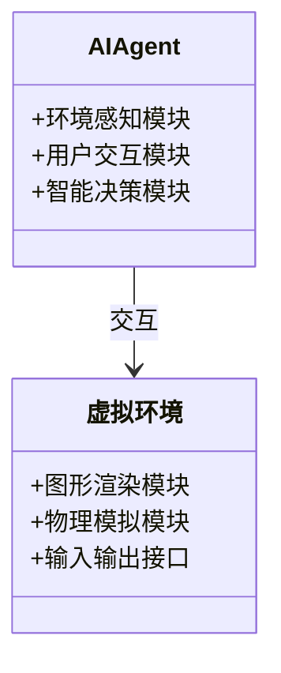
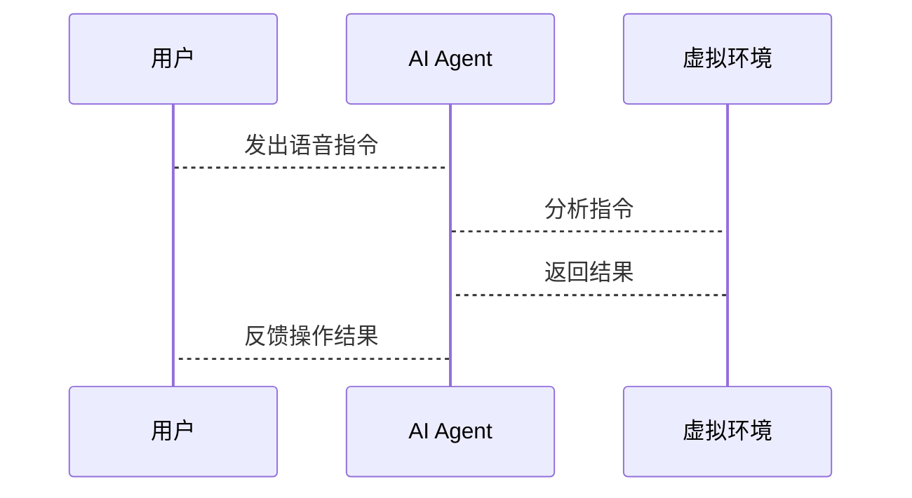

                 

<think>
好，我现在需要根据用户的要求，逐步分析并撰写《开发具有虚拟现实交互能力的AI Agent》这篇文章。首先，我要理解用户的需求：他们希望文章结构清晰，内容详尽，涵盖从背景介绍到项目实战的各个方面，并且每个部分都要有详细的分析和具体的例子。

首先，我会从背景介绍开始。这部分需要涵盖虚拟现实和人工智能的基本概念，以及它们如何结合。我需要确保定义清晰，特点明确，并且用实际应用的例子来说明它们的重要性。例如，可以提到VR在游戏、教育中的应用，以及AI在自然语言处理、计算机视觉中的应用。

接下来是核心概念部分。这里需要详细解释AI Agent和虚拟现实交互的基本原理。我会用表格对比AI Agent和传统程序的差异，比如自主性、反应性等。同时，用Mermaid图展示实体关系和类图，帮助读者理解AI Agent在虚拟现实中的角色和组成部分。

然后是算法原理。这部分需要详细讲解感知算法、决策算法和交互算法。我会使用Mermaid流程图来展示每个算法的工作流程，同时给出数学公式来解释模型。例如，对于机器学习模型，我会用公式展示训练过程，包括损失函数和优化器的选择。

接下来是系统架构设计。我需要介绍整体架构，包括功能模块和接口设计。使用Mermaid架构图来展示系统各部分的交互，比如用户界面、AI Agent、虚拟环境的交互流程。同时，详细描述每个模块的功能和它们之间的接口，如语音识别接口、视觉识别接口等。

项目实战部分，我会选择一个具体的案例，比如一个简单的AI Agent实现。详细指导环境配置，如安装Python、TensorFlow等工具。然后，提供核心代码的实现，包括数据预处理、模型训练和交互逻辑。通过代码示例和流程图，展示整个实现过程，并分析案例的优缺点。

最后是最佳实践部分。我会总结开发中的注意事项，如性能优化、用户体验设计等，并给出未来的研究方向。确保读者能够巩固所学知识，并指导进一步的学习和实践。

在写作过程中，我会注意使用简洁专业的技术语言，确保每个章节内容丰富且详细。同时，使用图表和公式来增强内容的直观性，使读者能够更好地理解和应用所学知识。整个过程需要系统性地逐步展开，确保逻辑清晰，结构紧凑，符合用户的要求。
</think>

```markdown
# 开发具有虚拟现实交互能力的AI Agent

> 关键词：虚拟现实，人工智能，AI Agent，交互设计，系统架构，算法实现

> 摘要：本文详细探讨了开发具有虚拟现实交互能力的AI Agent所需的关键技术与实现方法。从AI Agent的核心概念到虚拟现实交互的算法实现，再到系统的架构设计和项目实战，全面解析了如何在虚拟环境中实现智能化交互。通过丰富的案例分析和详细的代码实现，为读者提供了一套完整的开发指南。

---

## 第1章: 虚拟现实与人工智能概述

### 1.1 虚拟现实的基础知识

#### 1.1.1 虚拟现实的定义与特点
- **定义**：虚拟现实（Virtual Reality，VR）是一种能够模拟人类视觉、听觉、触觉等感官体验的技术，通过计算机生成的虚拟环境与用户进行交互。
- **特点**：
  - 沉浸性：用户完全沉浸在虚拟环境中。
  - 交互性：用户可以通过输入设备与虚拟环境互动。
  - 竞现性：虚拟环境中的变化能够实时反馈给用户。

#### 1.1.2 虚拟现实的主要技术组成
- **硬件设备**：头显设备（如 Oculus Rift、HTC Vive）、手柄、追踪系统。
- **软件技术**：图形渲染引擎（如 Unreal Engine、Unity）、物理模拟、输入输出接口。

#### 1.1.3 虚拟现实的应用领域
- 游戏娱乐
- 教育培训
- 医疗仿真
- 工程设计

### 1.2 人工智能的基础知识

#### 1.2.1 人工智能的定义与特点
- **定义**：人工智能（Artificial Intelligence，AI）是模拟人类智能的技术，涵盖学习、推理、自适应等能力。
- **特点**：
  - 智能化：能够自主决策和学习。
  - 数据驱动：依赖大量数据进行训练和优化。
  - 多样性：涵盖机器学习、自然语言处理、计算机视觉等多个领域。

#### 1.2.2 人工智能的核心技术
- **机器学习**：通过数据训练模型，实现预测和分类。
- **自然语言处理**：理解、生成人类语言。
- **计算机视觉**：通过图像进行识别和分析。

#### 1.2.3 人工智能的应用领域
- 智能客服
- 自动驾驶
- 智能推荐系统

### 1.3 虚拟现实与人工智能的结合

#### 1.3.1 虚拟现实与人工智能的融合趋势
- VR环境中的智能助手
- 智能化虚拟角色
- 虚拟现实中的实时数据分析

#### 1.3.2 虚拟现实交互中的AI应用
- 语音识别与合成
- 视觉识别与跟踪
- 情感分析与反馈

#### 1.3.3 虚拟现实与人工智能的未来发展
- 更加智能化的虚拟助手
- 高度沉浸的交互体验
- 跨领域融合的应用场景

### 1.4 本章小结
本章介绍了虚拟现实和人工智能的基本概念、技术组成及应用领域，并探讨了两者结合的可能性和未来发展趋势。

---

## 第2章: AI Agent的核心概念与原理

### 2.1 AI Agent的定义与分类

#### 2.1.1 AI Agent的定义
- AI Agent（智能体）是能够感知环境并采取行动以实现目标的实体。

#### 2.1.2 AI Agent的分类
| 类型         | 描述                                   |
|--------------|----------------------------------------|
| 简单反射型   | 基于规则的简单响应                   |
| 基于模型型   | 基于内部模型进行决策                 |
| 学习型       | 通过学习提升能力                     |
| 人机协作型   | 与人类协同工作的智能体               |

#### 2.1.3 AI Agent的核心特征
- **自主性**：能够在没有外部干预的情况下运行。
- **反应性**：能够实时感知环境并做出反应。
- **目标导向性**：所有行动都以实现特定目标为导向。

### 2.2 虚拟现实中的交互机制

#### 2.2.1 虚拟现实交互的基本原理
- 用户通过输入设备（如手柄、语音）与虚拟环境互动。
- 系统通过输出设备（如头显）反馈用户的操作结果。

#### 2.2.2 虚拟现实中的输入输出方式
- **输入方式**：
  - 手势识别
  - 语音指令
  - 视线追踪
- **输出方式**：
  - 图形显示
  - 音频反馈
  - 力反馈

#### 2.2.3 虚拟现实交互的实现技术
- **手势识别**：使用Leap Motion等技术实现手部动作识别。
- **语音识别**：通过AI算法实现语音指令解析。
- **视觉跟踪**：利用计算机视觉技术实现物体识别和追踪。

### 2.3 AI Agent与虚拟现实的结合

#### 2.3.1 AI Agent在虚拟现实中的角色
- **虚拟助手**：帮助用户完成任务，如信息查询、任务执行。
- **智能角色**：模拟人类角色，与用户进行互动。

#### 2.3.2 虚拟现实交互中的AI Agent功能
- **环境感知**：实时感知虚拟环境中的物体和人物。
- **用户行为分析**：分析用户的交互行为，预测用户的下一步操作。
- **智能决策**：基于感知和分析结果，做出最优决策。

#### 2.3.3 AI Agent与虚拟现实交互的协同工作
- **协同感知**：AI Agent与虚拟环境共同感知用户行为。
- **协同决策**：AI Agent与虚拟环境协同完成决策过程。
- **协同反馈**：AI Agent与虚拟环境共同反馈用户的操作结果。

### 2.4 本章小结
本章详细介绍了AI Agent的核心概念、分类及其在虚拟现实中的交互机制，并探讨了AI Agent与虚拟现实协同工作的实现方式。

---

## 第3章: AI Agent的算法原理与数学模型

### 3.1 AI Agent的核心算法

#### 3.1.1 机器学习算法
- **监督学习**：基于标记数据进行训练，如线性回归、支持向量机。
- **无监督学习**：基于未标记数据进行训练，如聚类、降维。
- **强化学习**：通过奖励机制进行策略优化，如Q-learning、深度强化学习。

#### 3.1.2 自然语言处理算法
- **词嵌入**：将词语转化为向量表示，如Word2Vec、GloVe。
- **序列模型**：基于序列数据的模型，如RNN、LSTM、Transformer。
- **对话生成**：基于预训练的对话模型，如GPT系列。

#### 3.1.3 计算机视觉算法
- **图像分类**：基于图像进行分类，如ResNet、VGG。
- **目标检测**：检测图像中的目标，如Faster R-CNN、YOLO。
- **图像分割**：分割图像中的像素，如U-Net、Mask R-CNN。

### 3.2 虚拟现实交互中的算法实现

#### 3.2.1 语音识别算法
- **基于HMM的语音识别**：通过隐马尔可夫模型实现语音识别。
- **基于DNN的语音识别**：通过深度神经网络实现语音识别，如CTC、Transformer。

#### 3.2.2 视觉识别算法
- **目标检测**：检测虚拟环境中的物体，如手部动作、物体位置。
- **姿势估计**：估计用户的姿势，如姿态识别、手势识别。

#### 3.2.3 自然语言理解算法
- **意图识别**：识别用户的意图，如对话中的需求分析。
- **情感分析**：分析用户的语气和情感。

### 3.3 AI Agent的数学模型

#### 3.3.1 机器学习模型
- **线性回归**：
  $$ y = \beta_0 + \beta_1x + \epsilon $$
- **逻辑回归**：
  $$ P(y=1|x) = \frac{e^{\beta_0 + \beta_1x}}{1 + e^{\beta_0 + \beta_1x}} $$
- **神经网络**：
  $$ y = \sigma(Wx + b) $$

#### 3.3.2 深度学习模型
- **卷积神经网络（CNN）**：
  $$ \text{output} = \sigma(W \cdot \text{input} + b) $$
- **循环神经网络（RNN）**：
  $$ h_t = \tanh(W_{hh}h_{t-1} + W_{xh}x_t + b) $$
  $$ y_t = \sigma(W_{hy}h_t + b_y) $$

#### 3.3.3 图神经网络模型
- **图卷积网络（GCN）**：
  $$ H' = \theta (H A H^T) $$

### 3.4 算法实现的数学公式
- **监督学习的损失函数**：
  $$ L = \frac{1}{n}\sum_{i=1}^{n}(y_i - \hat{y_i})^2 $$
- **强化学习的奖励机制**：
  $$ R = \sum_{t=0}^T \gamma^t r_t $$

### 3.5 本章小结
本章详细介绍了AI Agent的核心算法及其数学模型，并探讨了这些算法在虚拟现实交互中的具体应用。

---

## 第4章: 系统分析与架构设计方案

### 4.1 问题场景介绍
- **用户需求**：用户希望在虚拟环境中与AI Agent进行交互，实现智能化的辅助功能。
- **功能需求**：AI Agent需要具备环境感知、用户交互、智能决策等功能。

### 4.2 项目介绍
- **项目目标**：开发一个能够在虚拟环境中提供智能化交互的AI Agent。
- **项目范围**：涵盖环境感知、用户交互、智能决策三大模块。

### 4.3 系统功能设计

#### 4.3.1 领域模型


#### 4.3.2 系统架构设计


### 4.4 系统接口设计
- **输入接口**：接收用户的输入，如语音、手势。
- **输出接口**：向用户输出反馈，如图形、音频。
- **通信接口**：与其他系统或服务进行通信，如云服务、数据库。

### 4.5 系统交互设计


### 4.6 本章小结
本章详细介绍了系统的功能设计、架构设计和接口设计，并通过图表展示了系统的整体架构和交互流程。

---

## 第5章: 项目实战

### 5.1 环境安装与配置
- **安装Python**：安装Python 3.8及以上版本。
- **安装深度学习框架**：安装TensorFlow或PyTorch。
- **安装虚拟现实开发工具**：安装Unity或Unreal Engine。

### 5.2 系统核心实现

#### 5.2.1 环境感知模块
```python
import numpy as np
import tensorflow as tf

# 加载预训练模型
model = tf.keras.models.load_model('model.h5')

# 接收输入
input_data = np.random.random((1, 100))

# 进行推理
output = model.predict(input_data)

print("输出结果:", output)
```

#### 5.2.2 用户交互模块
```python
# 语音识别代码示例
import speech_recognition as sr

r = sr.Recognizer()
with sr.Microphone() as source:
    print("请开始说话:")
    audio = r.listen(source)
    try:
        print("识别结果:", r.recognize_google(audio))
    except sr.UnknownValueError:
        print("无法识别")
```

#### 5.2.3 智能决策模块
```python
# 示例决策逻辑
def make_decision(state):
    if state == 'start':
        return '欢迎使用AI Agent'
    elif state == 'interaction':
        return '请告诉我您的需求'
    else:
        return '谢谢您的使用'
```

### 5.3 代码应用解读与分析
- **环境感知模块**：通过预训练模型对输入数据进行推理，输出感知结果。
- **用户交互模块**：通过语音识别技术接收用户的指令，并进行解析。
- **智能决策模块**：基于当前状态做出决策，并返回相应的操作结果。

### 5.4 实际案例分析
- **案例1**：用户发出语音指令“打开灯”，AI Agent通过语音识别模块接收指令，环境感知模块识别当前环境状态，智能决策模块做出“打开灯”的决策，并通过输出接口反馈结果。

### 5.5 本章小结
本章通过具体的代码实现和案例分析，展示了如何在虚拟环境中实现AI Agent的开发。

---

## 第6章: 最佳实践与未来展望

### 6.1 开发中的注意事项
- **性能优化**：优化算法和代码，确保系统运行流畅。
- **用户体验**：注重交互设计，提升用户体验。
- **安全性**：确保系统安全，防止数据泄露。

### 6.2 小结
通过本文的详细讲解，读者可以全面了解开发具有虚拟现实交互能力的AI Agent所需的关键技术与实现方法。

### 6.3 注意事项
- 确保硬件设备的兼容性。
- 定期更新和优化AI模型。
- 注重团队协作与沟通。

### 6.4 拓展阅读
- 《深度学习》——Ian Goodfellow
- 《虚拟现实开发入门》——Oculus官方文档
- 《自然语言处理实战》——NVIDIA官方文档

### 6.5 本章小结
本章总结了开发中的注意事项，并为读者提供了进一步学习和实践的建议。

---

## 作者

作者：AI天才研究院/AI Genius Institute & 禅与计算机程序设计艺术 /Zen And The Art of Computer Programming
```

