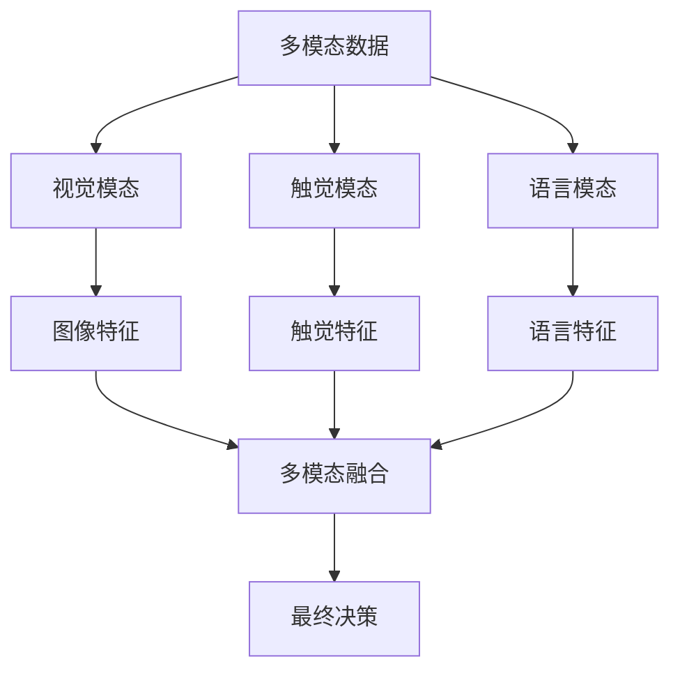
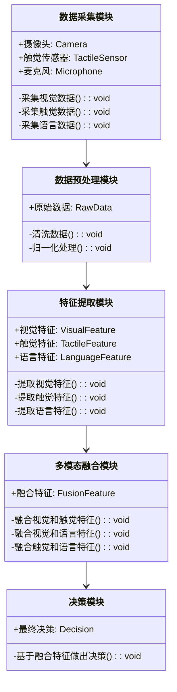
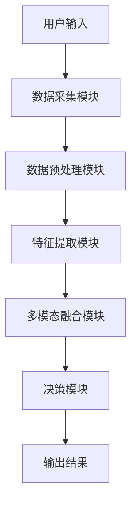
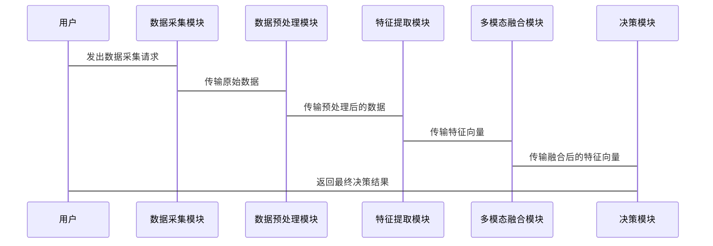

                 


# 开发具有视觉-触觉-语言多模态融合能力的AI Agent

> 关键词：多模态AI Agent、视觉触觉语言融合、深度学习、多模态数据处理、跨模态交互

> 摘要：本文将详细探讨如何开发具有视觉、触觉和语言多模态融合能力的AI Agent。通过分析多模态数据的融合方法、系统架构设计以及实际应用场景，我们旨在为开发者提供一个全面的技术指南，帮助他们构建能够处理复杂多模态信息的智能系统。本文还将结合实际案例，深入探讨多模态融合的核心算法与实现细节。

---

# 第一部分: 多模态AI Agent的背景与概念

## 第1章: 多模态AI Agent的背景与概念

### 1.1 多模态AI Agent的定义与背景

#### 1.1.1 多模态AI Agent的定义
多模态AI Agent是一种能够同时处理多种感官数据（如视觉、触觉、语言等）的智能体，通过多模态数据的融合，实现更强大的感知和决策能力。与传统的单模态AI系统相比，多模态AI Agent能够更好地理解和应对复杂的真实世界场景。

#### 1.1.2 多模态AI Agent的背景与重要性
随着人工智能技术的快速发展，单模态AI系统在许多应用场景中表现出局限性。例如，仅依赖视觉信息的AI系统在处理复杂场景时可能会遗漏重要的触觉或语言信息。多模态AI Agent通过整合多种感官数据，能够更全面地感知环境，从而在智能服务、机器人控制、增强现实等领域展现出更大的潜力。

#### 1.1.3 多模态AI Agent的应用场景
- 智能客服机器人：结合视觉（如识别用户表情）、触觉（如感知用户触摸屏幕的力度）和语言（如理解用户的语音指令）信息，提供更个性化的服务。
- 智能机器人控制：通过多模态数据融合，实现更精准的物体识别、动作控制和人机交互。
- 增强现实（AR）：结合视觉、触觉和语言信息，提供更沉浸式的用户体验。

### 1.2 视觉-触觉-语言多模态融合的核心概念

#### 1.2.1 多模态数据的定义与特点
- **视觉数据**：图像、视频等二维数据，通常用于物体识别、场景理解。
- **触觉数据**：力反馈、振动等物理感知数据，通常用于物体交互和环境探索。
- **语言数据**：文本、语音等语言信息，通常用于自然语言处理和人机交互。

#### 1.2.2 视觉、触觉、语言模态的特征对比

| 特性         | 视觉模态          | 触觉模态          | 语言模态          |
|--------------|-------------------|-------------------|-------------------|
| 数据形式     | 图像、视频        | 力度、振动         | 文本、语音        |
| 信息维度     | 高维、空间信息    | 低维、物理信息     | 高维、语义信息    |
| 采集设备     | 摄像头、深度相机   | 力反馈传感器、触觉手套 | 麦克风、摄像头     |
| 处理难度     | 较高              | 较低              | 较高              |
| 应用场景     | 人脸识别、物体检测 | 物体抓取、机器人控制 | 语音识别、NLP     |

#### 1.2.3 多模态融合的边界与外延
多模态融合的目标是通过整合不同模态的信息，提升AI系统的感知和决策能力。其边界在于如何有效地将不同模态的数据进行融合，同时避免信息冗余或冲突。外延则包括如何将融合后的信息应用于具体的场景中，例如通过视觉和触觉数据的融合实现更精准的物体识别。

### 1.3 多模态AI Agent的核心要素组成

#### 1.3.1 多模态数据采集与处理
- **数据采集**：通过摄像头、传感器等设备获取多模态数据。
- **数据预处理**：对采集到的数据进行清洗、归一化等处理，以便后续的特征提取和融合。

#### 1.3.2 多模态模型的构建与训练
- **模型设计**：设计能够同时处理多种模态数据的深度学习模型，例如多模态卷积神经网络（MCNN）。
- **模型训练**：使用多模态数据对模型进行端到端训练，使其能够自动学习模态间的关联性。

#### 1.3.3 多模态融合的实现方式
- **早期融合**：在特征提取阶段对不同模态的数据进行融合。
- **晚期融合**：在特征提取完成后，对不同模态的特征进行融合。
- **混合融合**：结合早期和晚期融合的优势，设计更灵活的融合策略。

---

# 第二部分: 多模态AI Agent的算法原理

## 第2章: 多模态融合的原理与方法

### 2.1 多模态数据的融合策略

#### 2.1.1 早期融合与晚期融合的对比

| 特性         | 早期融合          | 晚期融合          |
|--------------|-------------------|-------------------|
| 融合阶段     | 特征提取阶段       | 分类或决策阶段    |
| 优点         | 融合早，计算效率高  | 融合晚，灵活性高   |
| 缺点         | 可能丢失模态间信息  | 计算效率较低       |

#### 2.1.2 基于特征的融合方法
- **加法融合**：将不同模态的特征向量进行简单的相加。
- **加权融合**：根据模态的重要性对特征向量进行加权求和。
- **注意力机制融合**：通过注意力机制确定每个模态的重要性，从而进行加权融合。

#### 2.1.3 基于决策的融合方法
- **投票融合**：在多分类任务中，通过投票的方式确定最终的决策结果。
- **融合网络**：设计专门的网络结构用于模态间的信息交互和融合。

### 2.2 视觉、触觉、语言模态的特征分析

#### 2.2.1 视觉模态的特征提取
- **图像特征提取**：使用CNN（卷积神经网络）提取图像的深层特征。
- **视频特征提取**：通过3D CNN或Transformer提取视频的时空特征。

#### 2.2.2 触觉模态的特征提取
- **力反馈特征提取**：通过传感器获取物体的力、振动等信息，并将其转换为特征向量。
- **触觉事件特征提取**：分析触觉事件的时间、幅度等特征。

#### 2.2.3 语言模态的特征提取
- **文本特征提取**：通过词嵌入（如Word2Vec、BERT）提取文本的语义特征。
- **语音特征提取**：通过Mel频谱、MFCC等方法提取语音的声学特征。

### 2.3 多模态融合的数学模型与公式

#### 2.3.1 多模态融合的线性模型
$$ y = w_1 x_1 + w_2 x_2 + ... + w_n x_n $$
其中，$x_i$ 表示第$i$个模态的特征向量，$w_i$ 表示对应的权重。

#### 2.3.2 多模态融合的非线性模型
$$ y = \sigma(w_1 x_1 + w_2 x_2 + ... + w_n x_n) $$
其中，$\sigma$ 表示激活函数，例如ReLU、Sigmoid等。

#### 2.3.3 基于注意力机制的多模态融合公式
$$ a_i = \frac{\exp(\alpha_i)}{\sum_{j=1}^n \exp(\alpha_j)} $$
$$ y = \sum_{i=1}^n a_i x_i $$
其中，$\alpha_i$ 表示第$i$个模态的注意力权重，$x_i$ 表示对应的特征向量。

### 2.4 多模态融合的ER实体关系图


---

# 第三部分: 多模态AI Agent的系统架构设计

## 第3章: 多模态AI Agent的系统架构设计

### 3.1 系统功能设计

#### 3.1.1 功能模块划分
- 数据采集模块：负责采集视觉、触觉、语言数据。
- 数据预处理模块：对采集到的数据进行清洗、归一化等处理。
- 特征提取模块：分别对不同模态的数据进行特征提取。
- 多模态融合模块：将不同模态的特征进行融合。
- 决策模块：基于融合后的特征进行最终的决策。

#### 3.1.2 功能模块的类图


### 3.2 系统架构设计

#### 3.2.1 系统架构的总体设计


#### 3.2.2 系统接口设计
- 数据采集接口：提供采集视觉、触觉、语言数据的API。
- 特征提取接口：提供提取不同模态特征的API。
- 多模态融合接口：提供融合不同模态特征的API。
- 决策接口：提供基于融合特征做出决策的API。

#### 3.2.3 系统交互的序列图


---

# 第四部分: 多模态AI Agent的项目实战

## 第4章: 多模态AI Agent的项目实战

### 4.1 项目介绍
我们以一个智能客服机器人为例，展示如何开发一个具有视觉-触觉-语言多模态融合能力的AI Agent。

### 4.2 环境配置

#### 4.2.1 开发工具
- Python 3.8+
- PyTorch 1.9+
- OpenCV 4.5+
- ROS（机器人操作系统）

#### 4.2.2 数据集
- 视觉数据：使用公开的图像数据集（如ImageNet、COCO）。
- 触觉数据：使用模拟的触觉数据（如力反馈信号）。
- 语言数据：使用公开的文本和语音数据集（如MNLI、Common Voice）。

### 4.3 系统核心实现源代码

#### 4.3.1 数据采集模块
```python
import cv2
import numpy as np

class DataCollector:
    def __init__(self):
        self.camera = cv2.VideoCapture(0)
        self.tactile_sensor = TactileSensor()
        self microphone = Microphone()

    def collect_visual_data(self):
        ret, frame = self.camera.read()
        return frame

    def collect_tactile_data(self):
        return self.tactile_sensor.get_data()

    def collect_language_data(self):
        return self.microphone.record_audio()
```

#### 4.3.2 特征提取模块
```python
import torch
import torch.nn as nn

class FeatureExtractor:
    def __init__(self):
        self.visual_extractor = VisualCNN()
        self.tactile_extractor = TactileCNN()
        self.language_extractor = LanguageTransformer()

    def extract_visual_features(self, image):
        return self.visual_extractor(image)

    def extract_tactile_features(self, tactile_data):
        return self.tactile_extractor(tactile_data)

    def extract_language_features(self, text):
        return self.language_extractor(text)
```

#### 4.3.3 多模态融合模块
```python
class MultiModalFuser:
    def __init__(self):
        self.attention_weights = self._initialize_attention_weights()

    def _initialize_attention_weights(self):
        return torch.randn(3, 1)

    def fuse_features(self, visual_features, tactile_features, language_features):
        # 计算注意力权重
        attention = torch.softmax(self.attention_weights, dim=0)
        # 加权融合
        fused_features = attention[0] * visual_features + attention[1] * tactile_features + attention[2] * language_features
        return fused_features
```

#### 4.3.4 决策模块
```python
class DecisionModule:
    def __init__(self):
        self.fusion_module = MultiModalFuser()
        self.classifier = nn.Linear(1024, 10)

    def make_decision(self, visual_features, tactile_features, language_features):
        fused_features = self.fusion_module.fuse_features(visual_features, tactile_features, language_features)
        decision = self.classifier(fused_features)
        return decision
```

### 4.4 项目小结
通过本项目，我们展示了如何开发一个具有视觉-触觉-语言多模态融合能力的AI Agent。从数据采集到特征提取，再到多模态融合和最终决策，整个系统的实现过程清晰明了。实际应用中，可以根据具体需求对系统进行进一步优化和扩展。

---

# 第五部分: 多模态AI Agent的高级主题与应用展望

## 第5章: 多模态AI Agent的高级主题

### 5.1 自适应多模态融合
- 根据不同的应用场景动态调整模态间的融合权重。
- 使用自适应注意力机制实现模态间的动态交互。

### 5.2 多模态实时处理
- 提高系统的计算效率，使其能够实时处理多模态数据。
- 优化算法复杂度，降低硬件资源消耗。

### 5.3 多模态数据的稀疏性与鲁棒性
- 处理稀疏的多模态数据，例如部分模态数据缺失的情况。
- 提高系统的鲁棒性，使其在噪声干扰下仍能稳定工作。

## 第6章: 多模态AI Agent的应用展望

### 6.1 智能机器人与自动驾驶
- 多模态AI Agent在智能机器人中的应用，例如物体识别、路径规划等。
- 多模态AI Agent在自动驾驶中的应用，例如环境感知、人车交互等。

### 6.2 增强现实与虚拟现实
- 多模态AI Agent在增强现实（AR）中的应用，例如手势识别、语音交互等。
- 多模态AI Agent在虚拟现实（VR）中的应用，例如虚拟助手、虚拟角色交互等。

### 6.3 医疗健康与人机协作
- 多模态AI Agent在医疗健康中的应用，例如辅助诊断、手术机器人等。
- 多模态AI Agent在人机协作中的应用，例如智能助手、协作机器人等。

---

# 第六部分: 附录

## 6.1 多模态AI Agent的开发工具与库

### 6.1.1 视觉处理库
- OpenCV
- PyTorch Vision（TorchVision）

### 6.1.2 触觉处理库
- ROS（Robot Operating System）
- Open dynamics engine（ODE）

### 6.1.3 语言处理库
- NLTK
- SpaCy
- Hugging Face Transformers

## 6.2 多模态AI Agent的数据集

### 6.2.1 视觉数据集
- ImageNet
- COCO
- MNIST

### 6.2.2 触觉数据集
- TactileNet
- Robotic Dataset

### 6.2.3 语言数据集
- MNLI
- Common Voice
- LibriSpeech

## 6.3 多模态AI Agent的参考文献

### 6.3.1 经典论文
- "Multimodal Deep Learning for Grounded Textual Inference" (Zarei et al., 2019)
- "Cross-modal Attention Networks for Multimodal Recognition" (Wang et al., 2017)

### 6.3.2 书籍与教程
- "Deep Learning" by Ian Goodfellow, Yoshua Bengio, and Aaron Courville
- "Convolutional Neural Networks" by LeCun et al.

---

# 作者：AI天才研究院/AI Genius Institute & 禅与计算机程序设计艺术/Zen And The Art of Computer Programming

---

本文通过系统地分析多模态AI Agent的背景、核心概念、算法原理和系统架构设计，结合实际项目案例，为开发者提供了一个全面的技术指南。希望本文能够帮助读者更好地理解多模态融合的核心思想，并能够在实际应用中开发出更强大的AI Agent系统。

