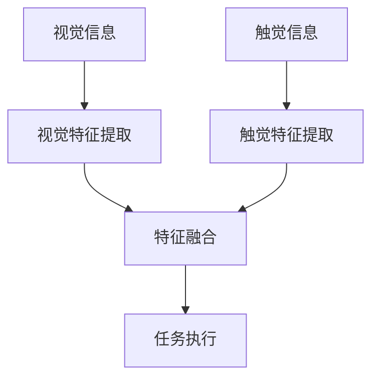
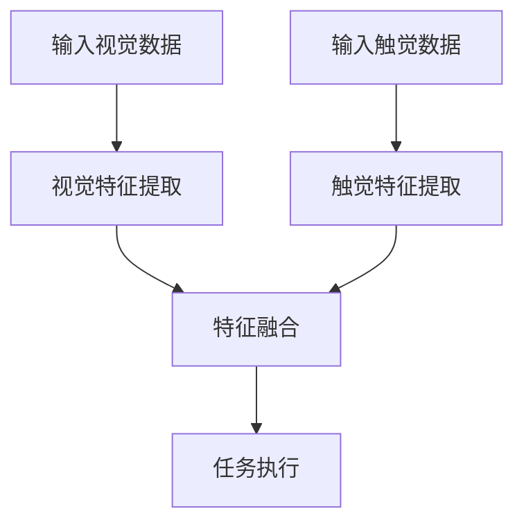
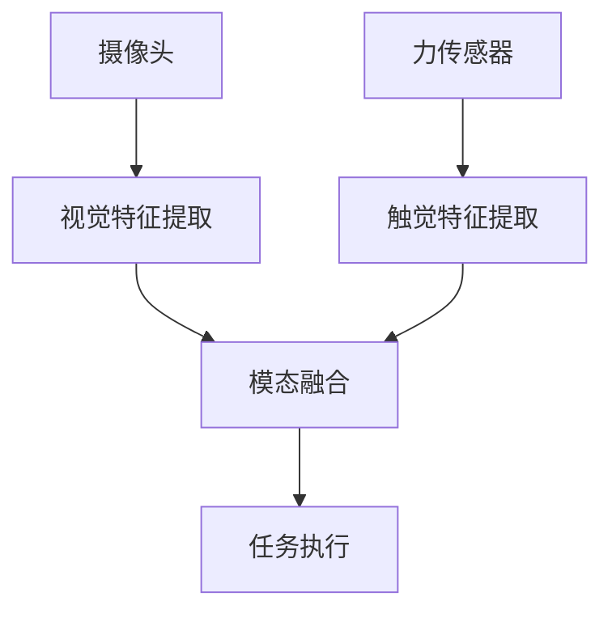

                 


# 开发具有视觉-触觉融合能力的AI Agent

> 关键词：AI Agent, 视觉-触觉融合, 多模态数据处理, 深度学习, 系统架构设计

> 摘要：本文详细探讨了开发具有视觉-触觉融合能力的AI Agent的核心技术与实现方法。文章首先介绍了视觉-触觉融合的背景与必要性，随后分析了多模态数据融合的基本原理与实现方法，详细讲解了基于深度学习的视觉与触觉感知算法，接着从系统架构设计的角度分析了AI Agent的整体实现方案，最后通过项目实战展示了如何将理论应用于实际开发中。

---

# 第一部分: 背景介绍与核心概念

## 第1章: 视觉-触觉融合AI Agent的背景与问题描述

### 1.1 问题背景
AI Agent（人工智能代理）是一种能够感知环境、执行任务的智能系统。然而，当前大多数AI Agent仅依赖单一模态的感知能力（如仅视觉或仅触觉），这限制了其在复杂环境中的表现。例如，在工业机器人、医疗机器人或虚拟现实交互等领域，AI Agent需要同时处理视觉信息（如物体的形状、颜色）和触觉信息（如物体的质地、温度），才能更准确地完成任务。

#### 1.1.1 当前AI Agent的发展现状
- 大多数AI Agent仅依赖单一模态的感知能力。
- 在复杂环境中，单一模态的感知能力往往不足以完成任务。
- 视觉与触觉信息的互补性尚未得到充分利用。

#### 1.1.2 视觉与触觉感知的局限性
- 视觉感知在处理动态环境或遮挡场景时存在困难。
- 触觉感知在处理复杂表面或精细操作时存在挑战。
- 单一模态感知无法提供完整的环境信息。

#### 1.1.3 视觉-触觉融合的必要性
- 视觉与触觉信息的互补性可以提高感知的准确性和鲁棒性。
- 视觉-触觉融合是实现更复杂任务（如物体识别、抓取与操作）的关键。
- 在现实场景中，视觉与触觉信息是不可分割的整体。

### 1.2 问题描述
视觉-触觉融合的核心问题是如何将来自不同模态的感知信息有效地结合起来，以提高AI Agent的感知能力和任务执行能力。

#### 1.2.1 视觉-触觉融合的核心问题
- 如何将视觉信息与触觉信息进行有效的对齐与融合。
- 如何处理不同模态数据的时空异步性问题。
- 如何在多模态数据中提取有用的特征。

#### 1.2.2 多模态数据处理的挑战
- 不同模态数据的特征维度和时间特性不同。
- 数据融合的实时性与计算复杂度之间的平衡问题。
- 数据融合的鲁棒性与泛化能力。

#### 1.2.3 AI Agent在复杂环境中的应用需求
- 在工业机器人中，AI Agent需要同时感知物体的视觉信息和触觉信息。
- 在医疗机器人中，AI Agent需要通过视觉-触觉融合来辅助手术操作。
- 在虚拟现实交互中，AI Agent需要通过视觉-触觉融合来提供更真实的交互体验。

### 1.3 问题解决思路
视觉-触觉融合的实现需要结合多模态数据处理技术、深度学习技术和系统架构设计。

#### 1.3.1 多模态数据融合的基本思路
- 基于特征对齐的融合方法：将不同模态的特征进行对齐，然后进行融合。
- 基于注意力机制的融合方法：通过注意力机制对不同模态的信息进行加权融合。
- 基于生成模型的融合方法：利用生成模型生成互补的模态信息。

#### 1.3.2 视觉与触觉信息的互补性利用
- 视觉信息可以提供物体的形状、颜色等信息。
- 触觉信息可以提供物体的质地、温度等信息。
- 通过视觉与触觉信息的互补，可以提高物体识别的准确性和抓取的稳定性。

#### 1.3.3 基于深度学习的融合方法
- 使用深度神经网络对多模态数据进行端到端的融合。
- 通过预训练模型提取不同模态的特征，然后进行融合。

### 1.4 边界与外延
视觉-触觉融合的实现需要考虑边界条件和外延范围。

#### 1.4.1 视觉-触觉融合的边界条件
- 数据采集的精度和实时性。
- 环境的动态性与复杂性。
- 任务的特定需求。

#### 1.4.2 相关技术的外延范围
- 其他感知方式（如听觉、嗅觉）的融合。
- 多模态数据的实时处理与传输。

#### 1.4.3 与其他感知方式的协同关系
- 听觉信息可以提供额外的环境信息。
- 嗅觉信息可以提供物体的化学性质。

### 1.5 核心要素与概念结构
视觉-触觉融合的核心要素包括：

#### 1.5.1 核心概念的组成要素
- 多模态数据采集：视觉与触觉信息的采集与预处理。
- 模态特征提取：利用深度学习模型提取不同模态的特征。
- 模态融合：将不同模态的特征进行融合，得到最终的感知结果。
- 任务执行：根据融合后的感知结果执行具体任务。

#### 1.5.2 概念之间的关系图


---

## 第2章: 视觉-触觉融合的核心概念与联系

### 2.1 多模态数据融合的基本原理
多模态数据融合的基本原理是通过结合不同模态的数据，提高感知的准确性和鲁棒性。

#### 2.1.1 多模态数据的定义与分类
- 多模态数据：来自不同感知模态的数据，如视觉、触觉、听觉等。
- 数据模态：不同的感知方式。

#### 2.1.2 数据融合的层次与方法
- 数据级融合：在原始数据级别进行融合。
- 特征级融合：在特征级别进行融合。
- 决策级融合：在决策级别进行融合。

#### 2.1.3 视觉与触觉数据的特征对比
| 特征维度 | 视觉数据 | 触觉数据 |
|----------|----------|----------|
| 空间特性 | 高维空间 | 低维空间 |
| 时间特性 | 高频变化 | 低频变化 |
| 信息类型 | 形状、颜色 | 质地、温度 |

### 2.2 视觉感知与触觉感知的联系
视觉感知与触觉感知在AI Agent中是相互补充的。

#### 2.2.1 视觉感知的核心特征
- 物体的形状、颜色、纹理等。

#### 2.2.2 触觉感知的核心特征
- 物体的质地、温度、压力等。

#### 2.2.3 视觉与触觉信息的互补性
- 视觉信息可以提供物体的宏观信息。
- 触觉信息可以提供物体的微观信息。

### 2.3 基于深度学习的多模态融合方法
基于深度学习的多模态融合方法可以通过以下步骤实现：

#### 2.3.1 多模态特征提取
- 使用卷积神经网络（CNN）提取视觉特征。
- 使用循环神经网络（RNN）提取触觉特征。

#### 2.3.2 模态融合
- 使用注意力机制对不同模态的特征进行加权融合。
- 使用生成对抗网络（GAN）对模态特征进行联合优化。

#### 2.3.3 任务执行
- 根据融合后的特征进行物体识别、抓取与操作等任务。

### 2.4 多模态数据融合的实现流程


---

## 第3章: 基于深度学习的视觉与触觉感知算法

### 3.1 视觉感知算法
视觉感知算法是基于深度学习的物体识别与场景理解技术。

#### 3.1.1 基于CNN的物体识别
- 使用卷积神经网络（CNN）提取视觉特征。
- 通过预训练模型（如ResNet、VGG）进行特征提取。

#### 3.1.2 基于RCNN的目标检测
- 使用区域卷积神经网络（RCNN）进行目标检测。
- 通过滑动窗口方法提取候选区域。

#### 3.1.3 视觉特征的表示方法
- 使用全局平均池化（GAP）提取全局特征。
- 使用区域平均池化（RSP）提取局部特征。

#### 3.1.4 视觉特征的融合方法
- 使用注意力机制对视觉特征进行加权融合。
- 使用通道注意力机制（Channel Attention）对特征通道进行优化。

#### 3.1.5 视觉特征的代码实现
```python
import torch
import torch.nn as nn

class VisualFeatureExtractor(nn.Module):
    def __init__(self):
        super(VisualFeatureExtractor, self).__init__()
        self.cnn = nn.Sequential(
            nn.Conv2d(3, 64, kernel_size=3, padding=1),
            nn.ReLU(),
            nn.Conv2d(64, 128, kernel_size=3, padding=1),
            nn.ReLU(),
            nn.AdaptiveAvgPool2d((1,1))
        )
    
    def forward(self, x):
        features = self.cnn(x)
        return features
```

### 3.2 触觉感知算法
触觉感知算法是基于深度学习的物体表面特性识别技术。

#### 3.2.1 基于力反馈的触觉感知
- 使用力传感器采集物体表面的力反馈信号。
- 通过时间序列模型（如LSTM）对力反馈信号进行分析。

#### 3.2.2 基于深度学习的触觉建模
- 使用循环神经网络（RNN）建模触觉信号的时间特性。
- 通过自注意力机制（Self-Attention）对触觉信号进行全局建模。

#### 3.2.3 触觉特征的表示方法
- 使用滑动平均池化（SAP）提取触觉特征。
- 使用自注意力机制（Self-Attention）对触觉特征进行优化。

#### 3.2.4 触觉特征的代码实现
```python
import torch
import torch.nn as nn

class TactileFeatureExtractor(nn.Module):
    def __init__(self):
        super(TactileFeatureExtractor, self).__init__()
        self.rnn = nn.LSTM(input_size=128, hidden_size=256, num_layers=2, batch_first=True)
    
    def forward(self, x):
        output, (h_n, c_n) = self.rnn(x)
        return output
```

### 3.3 视觉与触觉融合算法
视觉与触觉融合算法是将视觉特征与触觉特征进行联合建模。

#### 3.3.1 模态对齐方法
- 使用多模态对齐网络（MMAN）对齐视觉与触觉特征。
- 通过自注意力机制（Self-Attention）实现模态对齐。

#### 3.3.2 模态融合方法
- 使用加权融合网络（WNN）对视觉与触觉特征进行加权融合。
- 通过门控机制（Gate）对不同模态的信息进行动态融合。

#### 3.3.3 融合特征的代码实现
```python
import torch
import torch.nn as nn

class ModalityFuser(nn.Module):
    def __init__(self):
        super(ModalityFuser, self).__init__()
        self.weight_vis = nn.Parameter(torch.ones(1))
        self.weight_tact = nn.Parameter(torch.ones(1))
    
    def forward(self, vis_features, tact_features):
        fused_features = vis_features * self.weight_vis + tact_features * self.weight_tact
        return fused_features
```

### 3.4 视觉-触觉融合的数学模型
视觉-触觉融合的数学模型可以通过以下公式表示：

$$
F_{\text{fuse}} = \alpha F_{\text{vis}} + \beta F_{\text{tact}}
$$

其中，$F_{\text{fuse}}$ 是融合后的特征，$F_{\text{vis}}$ 是视觉特征，$F_{\text{tact}}$ 是触觉特征，$\alpha$ 和 $\beta$ 是融合权重。

---

## 第4章: 视觉-触觉融合的系统架构设计

### 4.1 问题场景介绍
视觉-触觉融合的系统架构设计需要考虑以下问题：

#### 4.1.1 系统功能需求
- 多模态数据采集与预处理。
- 视觉与触觉特征提取。
- 模态融合与任务执行。

#### 4.1.2 系统性能需求
- 实时性：系统需要在较短的时间内完成数据处理与任务执行。
- 鲁棒性：系统需要在复杂环境中稳定运行。

### 4.2 系统功能设计
系统功能设计包括以下模块：

#### 4.2.1 数据采集模块
- 视觉数据采集：通过摄像头采集物体的视觉信息。
- 触觉数据采集：通过力传感器采集物体的触觉信息。

#### 4.2.2 特征提取模块
- 视觉特征提取：使用深度学习模型提取视觉特征。
- 触觉特征提取：使用深度学习模型提取触觉特征。

#### 4.2.3 模态融合模块
- 模态对齐：对齐视觉与触觉特征。
- 模态融合：对视觉与触觉特征进行融合。

#### 4.2.4 任务执行模块
- 物体识别：根据融合后的特征进行物体识别。
- 抓取与操作：根据融合后的特征进行抓取与操作。

### 4.3 系统架构设计
系统架构设计需要考虑模块之间的交互与数据流。

#### 4.3.1 系统架构图


#### 4.3.2 模块交互流程
1. 数据采集模块采集视觉与触觉数据。
2. 特征提取模块提取视觉与触觉特征。
3. 模态融合模块对视觉与触觉特征进行融合。
4. 任务执行模块根据融合后的特征执行具体任务。

### 4.4 接口设计
系统接口设计需要考虑模块之间的接口定义。

#### 4.4.1 数据接口
- 视觉数据接口：摄像头输出的图像数据。
- 触觉数据接口：力传感器输出的力反馈数据。

#### 4.4.2 模块接口
- 视觉特征提取模块的输入接口：原始图像数据。
- 触觉特征提取模块的输入接口：原始触觉数据。
- 模态融合模块的输入接口：视觉特征与触觉特征。
- 任务执行模块的输入接口：融合后的特征。

### 4.5 交互流程
系统交互流程可以通过以下步骤实现：

#### 4.5.1 数据采集
- 视觉数据采集模块采集物体的视觉信息。
- 触觉数据采集模块采集物体的触觉信息。

#### 4.5.2 特征提取
- 视觉特征提取模块提取视觉特征。
- 触觉特征提取模块提取触觉特征。

#### 4.5.3 模态融合
- 模态融合模块对视觉与触觉特征进行融合。

#### 4.5.4 任务执行
- 任务执行模块根据融合后的特征执行具体任务。

---

## 第5章: 视觉-触觉融合的项目实战

### 5.1 环境安装与配置
项目实战需要以下环境：

#### 5.1.1 系统环境
- 操作系统：Linux或Windows。
- 显卡驱动：NVIDIA GPU驱动。
- 深度学习框架：PyTorch或TensorFlow。

#### 5.1.2 开发工具
- IDE：PyCharm或VS Code。
- 版本控制工具：Git。

### 5.2 系统核心实现
系统核心实现包括视觉特征提取、触觉特征提取和模态融合。

#### 5.2.1 视觉特征提取的代码实现
```python
import torch
import torch.nn as nn

class VisualFeatureExtractor(nn.Module):
    def __init__(self):
        super(VisualFeatureExtractor, self).__init__()
        self.cnn = nn.Sequential(
            nn.Conv2d(3, 64, kernel_size=3, padding=1),
            nn.ReLU(),
            nn.Conv2d(64, 128, kernel_size=3, padding=1),
            nn.ReLU(),
            nn.AdaptiveAvgPool2d((1,1))
        )
    
    def forward(self, x):
        features = self.cnn(x)
        return features
```

#### 5.2.2 触觉特征提取的代码实现
```python
import torch
import torch.nn as nn

class TactileFeatureExtractor(nn.Module):
    def __init__(self):
        super(TactileFeatureExtractor, self).__init__()
        self.rnn = nn.LSTM(input_size=128, hidden_size=256, num_layers=2, batch_first=True)
    
    def forward(self, x):
        output, (h_n, c_n) = self.rnn(x)
        return output
```

#### 5.2.3 模态融合的代码实现
```python
import torch
import torch.nn as nn

class ModalityFuser(nn.Module):
    def __init__(self):
        super(ModalityFuser, self).__init__()
        self.weight_vis = nn.Parameter(torch.ones(1))
        self.weight_tact = nn.Parameter(torch.ones(1))
    
    def forward(self, vis_features, tact_features):
        fused_features = vis_features * self.weight_vis + tact_features * self.weight_tact
        return fused_features
```

### 5.3 项目实现与分析
项目实现包括以下步骤：

#### 5.3.1 环境配置
- 安装PyTorch框架。
- 安装必要的库（如numpy、matplotlib）。

#### 5.3.2 数据采集
- 通过摄像头采集物体的视觉信息。
- 通过力传感器采集物体的触觉信息。

#### 5.3.3 数据预处理
- 对视觉数据进行归一化处理。
- 对触觉数据进行特征提取。

#### 5.3.4 模态融合
- 对视觉与触觉特征进行融合。

#### 5.3.5 任务执行
- 根据融合后的特征进行物体识别或抓取与操作。

### 5.4 项目总结
项目总结包括以下内容：

#### 5.4.1 实验结果
- 物体识别的准确率。
- 抓取与操作的成功率。

#### 5.4.2 系统性能
- 系统的实时性。
- 系统的鲁棒性。

#### 5.4.3 优化方向
- 提高模态融合的准确性。
- 优化系统的实时性。

---

## 第6章: 视觉-触觉融合的优化与展望

### 6.1 最佳实践
视觉-触觉融合的实现需要考虑以下最佳实践：

#### 6.1.1 数据预处理的注意事项
- 对视觉数据进行归一化处理。
- 对触觉数据进行特征提取。

#### 6.1.2 模态融合的优化方法
- 使用注意力机制对模态特征进行加权融合。
- 通过预训练模型提取更高质量的模态特征。

#### 6.1.3 系统优化的注意事项
- 优化系统的实时性。
- 提高系统的鲁棒性。

### 6.2 未来展望
视觉-触觉融合技术的未来发展包括以下方向：

#### 6.2.1 多模态数据处理的优化
- 研究更高效的多模态融合方法。
- 探索更先进的模态对齐技术。

#### 6.2.2 深度学习技术的创新
- 研究更强大的深度学习模型。
- 探索更高效的特征提取方法。

#### 6.2.3 应用场景的扩展
- 在更多领域（如医疗、教育）中应用视觉-触觉融合技术。
- 探索更复杂的多模态交互方式。

---

## 结语

视觉-触觉融合技术是AI Agent发展的关键方向。通过结合视觉与触觉信息，可以显著提高AI Agent的感知能力和任务执行能力。本文从理论到实践，详细探讨了视觉-触觉融合的核心技术与实现方法，为相关领域的研究与应用提供了参考。

---

## 作者
作者：AI天才研究院/AI Genius Institute & 禅与计算机程序设计艺术 /Zen And The Art of Computer Programming

