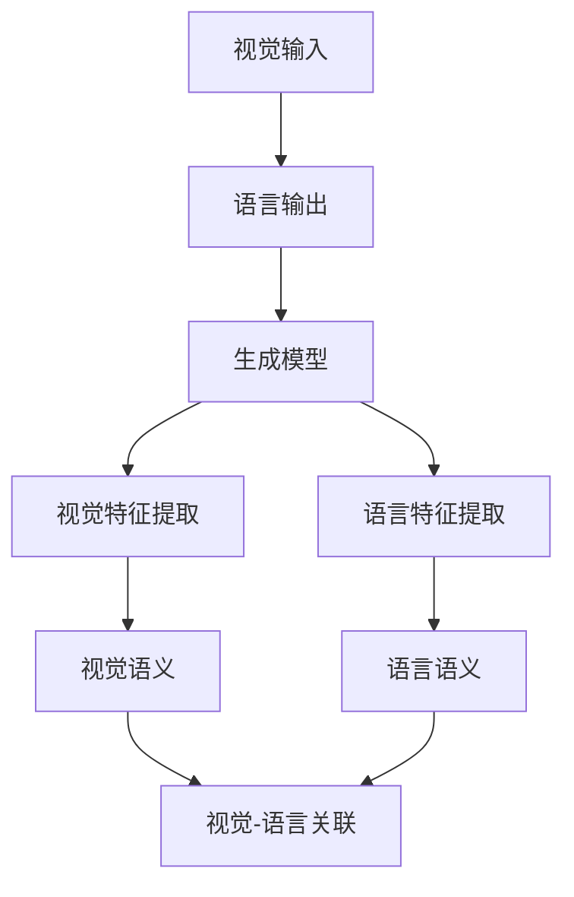
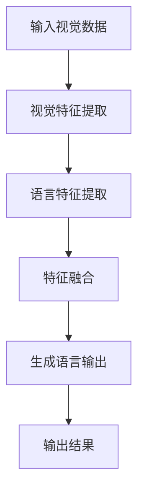

                 


# 开发具有视觉-语言多模态生成能力的AI Agent

**关键词**：视觉-语言多模态生成、AI Agent、多模态融合、生成式AI、深度学习

**摘要**：本文系统性地分析和探讨了开发具有视觉-语言多模态生成能力的AI Agent的关键技术与实现方案。从问题背景、核心概念、算法原理、系统设计到项目实战，文章全面解析了视觉-语言多模态生成的理论基础与实践应用，为读者提供了从理论到实践的系统性指导。通过本文，读者将深入了解如何构建一个能够同时处理视觉和语言信息，并生成高质量输出的AI Agent。

---

## 正文

### 第一部分：背景与核心概念

#### 第1章：视觉-语言多模态生成的背景与问题描述

##### 1.1 问题背景
- **多模态AI的发展现状**  
  当前AI技术正在从单一模态向多模态方向发展，视觉、语言、音频等多种模态的融合已成为研究热点。多模态生成技术能够更自然地模拟人类的感知和表达方式，具有广泛的应用潜力。
  
- **当前AI生成能力的局限性**  
  当前的生成模型主要专注于单一模态（如文本或图像），难以同时理解和生成多模态信息。这种单一模态的局限性限制了AI Agent在复杂场景中的应用能力。

- **视觉-语言多模态生成的必要性**  
  在实际应用中，许多任务需要同时处理视觉和语言信息，例如图像描述生成、视觉问答、多模态对话等。视觉-语言多模态生成能力是构建智能AI Agent的重要基础。

##### 1.2 问题描述
- **多模态生成的核心挑战**  
  视觉和语言信息具有不同的模态特性，如何有效地将它们融合，并生成高质量的多模态输出是一个关键挑战。

- **视觉-语言生成的关键问题**  
  视觉-语言生成需要同时理解图像和文本的语义信息，并通过生成模型实现两者的协同生成。

- **当前技术的边界与外延**  
  当前的视觉-语言生成技术主要集中在特定任务上，如图像描述生成和文本到图像生成。未来的研究方向将包括更复杂的多模态生成任务，如视频描述生成和跨模态对话。

##### 1.3 视觉-语言多模态生成的概念结构
- **核心要素组成**  
  视觉-语言多模态生成系统包括视觉输入、语言输入、生成模型、视觉特征提取、语言特征提取、特征融合、生成输出等核心要素。

- **概念之间的关系**  
  视觉输入和语言输入是系统的输入，生成模型负责将输入信息转化为生成输出。视觉特征提取和语言特征提取是关键的前处理步骤，特征融合层将两种模态的特征结合起来，生成层负责最终的输出生成。

- **案例分析与应用场景**  
  - 图像描述生成：根据输入的图像生成对应的文本描述。
  - 文本到图像生成：根据输入的文本生成相应的图像。
  - 多模态对话：在对话过程中同时理解对方的图像和文本信息，并生成相应的多模态回复。

#### 第2章：多模态生成AI的核心概念与联系

##### 2.1 核心概念原理
- **视觉与语言的融合机制**  
  视觉和语言信息的融合可以通过多种方式实现，如交叉注意机制、特征融合层等。这些机制能够有效地捕捉两种模态之间的关联性。

- **多模态生成模型的架构特点**  
  多模态生成模型通常采用编码器-解码器架构，编码器负责提取输入的特征，解码器负责生成输出。视觉和语言特征在编码器或解码器中进行融合。

- **视觉-语言生成的数学模型**  
  视觉-语言生成模型可以通过联合概率分布的形式表示，如下：
  $$ p(y|x) = f(h) $$
  其中，$x$ 是视觉输入，$y$ 是语言输出，$h$ 是融合特征。

##### 2.2 概念属性特征对比
- **各种多模态生成模型的对比分析**  
  | 模型名称 | 输入模态 | 输出模态 | 核心特点 |
  |----------|----------|----------|----------|
  | ViG       | 图像     | 文本     | 基于视觉特征生成文本描述 |
  | DALL-E    | 文本     | 图像     | 根据文本生成图像 |
  | CLIP      | 图像+文本 | 文本+图像 | 多模态特征匹配 |

- **视觉-语言生成与其他生成任务的差异**  
  视觉-语言生成任务需要同时处理两种模态的信息，而其他生成任务通常只涉及单一模态。

- **模型性能的评估指标**  
  - 文本生成：BLEU、ROUGE、METEOR等。
  - 图像生成：PSNR、SSIM、FID等。

##### 2.3 ER实体关系图架构


#### 第3章：多模态生成AI的算法原理

##### 3.1 算法原理概述
- **多模态生成模型的基本架构**  
  多模态生成模型通常由编码器和解码器组成，编码器负责提取输入特征，解码器负责生成输出。视觉和语言特征在编码器或解码器中进行融合。

- **视觉与语言特征的融合方式**  
  常见的融合方式包括：交叉注意、门控融合、加性融合等。

- **生成过程的数学模型**  
  视觉特征表示：
  $$ v = f_v(x) $$
  语言特征表示：
  $$ l = f_l(y) $$
  融合特征：
  $$ h = g(v, l) $$
  生成输出：
  $$ p(y|x) = f(h) $$

##### 3.2 算法流程图


##### 3.3 数学模型与公式
- **视觉特征表示**  
  $$ v = f_v(x) $$
  其中，$x$ 是视觉输入，$v$ 是提取的视觉特征，$f_v$ 是视觉特征提取函数。

- **语言特征表示**  
  $$ l = f_l(y) $$
  其中，$y$ 是语言输入，$l$ 是提取的语言特征，$f_l$ 是语言特征提取函数。

- **融合层**  
  $$ h = g(v, l) $$
  其中，$g$ 是融合函数，将视觉和语言特征融合为一个统一的表示。

- **生成层**  
  $$ p(y|x) = f(h) $$
  其中，$f$ 是生成函数，负责根据融合特征生成最终的输出。

##### 3.4 举例说明
- **视觉输入为图像**  
  输入一张图像，生成对应的文本描述。

- **语言输入为文本**  
  输入一段文本，生成对应的图像。

- **生成输出为图像或文本**  
  根据输入的视觉或语言信息，生成相应的视觉或语言输出。

#### 第4章：多模态生成AI的系统分析与架构设计

##### 4.1 问题场景介绍
- **项目目标**  
  开发一个能够同时处理视觉和语言信息，并生成高质量多模态输出的AI Agent。

- **项目需求**  
  - 支持多种输入模态（图像、文本）。
  - 支持多种输出模态（图像、文本）。
  - 具备高效的生成能力，支持实时交互。

- **项目约束**  
  - 计算资源限制。
  - 模型训练时间限制。
  - 模型部署环境限制。

##### 4.2 系统功能设计
- **领域模型设计**  
  ```mermaid
  classDiagram
      class 视觉输入 {
          图像数据
          视频数据
      }
      class 语言输入 {
          文本数据
          句子数据
      }
      class 生成模型 {
          视觉特征提取
          语言特征提取
          特征融合
          生成输出
      }
  ```

- **系统架构设计**  
  ```mermaid
  graph TD
      A[用户输入] --> B[输入处理]
      B --> C[生成模型]
      C --> D[输出处理]
      D --> E[用户输出]
  ```

- **系统接口设计**  
  - 输入接口：支持图像和文本输入。
  - 输出接口：支持图像和文本输出。
  - API接口：提供RESTful API，方便调用。

- **系统交互流程图**  
  ```mermaid
  sequenceDiagram
      participant 用户
      participant 系统
      用户 -> 系统: 发送视觉输入
      系统 -> 用户: 返回语言输出
      用户 -> 系统: 发送语言输入
      系统 -> 用户: 返回视觉输出
  ```

### 第二部分：算法原理

#### 第5章：算法实现与优化

##### 5.1 算法实现
- **环境安装**  
  ```bash
  pip install torch torchvision matplotlib
  ```

- **核心代码实现**  
  ```python
  import torch
  import torch.nn as nn
  import torch.nn.functional as F

  class VisualLanguageGenerator(nn.Module):
      def __init__(self, visual_dim, language_dim):
          super().__init__()
          self.visual_encoder = nn.Linear(visual_dim, 512)
          self.language_encoder = nn.Linear(language_dim, 512)
          self.fusion = nn.Linear(1024, 512)
          self.decoder = nn.Linear(512, language_dim)

      def forward(self, visual_input, language_input):
          visual_features = self.visual_encoder(visual_input)
          language_features = self.language_encoder(language_input)
          fused_features = torch.cat([visual_features, language_features], dim=1)
          fused = self.fusion(fused_features)
          output = self.decoder(fused)
          return output
  ```

##### 5.2 算法优化
- **优化策略**  
  - 使用Adam优化器。
  - 设置合理的学习率和权重衰减。
  - 使用早停策略防止过拟合。

- **训练过程**  
  ```python
  model = VisualLanguageGenerator(visual_dim, language_dim)
  optimizer = torch.optim.Adam(model.parameters(), lr=1e-4)
  criterion = nn.CrossEntropyLoss()

  for epoch in range(num_epochs):
      for batch in dataloader:
          visual_input, language_input, target = batch
          optimizer.zero_grad()
          output = model(visual_input, language_input)
          loss = criterion(output, target)
          loss.backward()
          optimizer.step()
  ```

##### 5.3 优化效果对比
- **收敛速度对比**  
  - 优化后的模型在训练过程中损失函数下降更快。
- **生成质量对比**  
  - 优化后的模型生成的文本或图像质量更高，语义更准确。

### 第三部分：系统分析与架构设计

#### 第6章：系统实现与测试

##### 6.1 系统实现
- **系统架构图**  
  ```mermaid
  graph TD
      A[用户] --> B[输入处理]
      B --> C[生成模型]
      C --> D[输出处理]
      D --> E[用户]
  ```

- **系统实现代码**  
  ```python
  import torch
  import torch.nn as nn
  import torch.nn.functional as F

  class VisualLanguageGenerator(nn.Module):
      def __init__(self, visual_dim, language_dim):
          super().__init__()
          self.visual_encoder = nn.Linear(visual_dim, 512)
          self.language_encoder = nn.Linear(language_dim, 512)
          self.fusion = nn.Linear(1024, 512)
          self.decoder = nn.Linear(512, language_dim)

      def forward(self, visual_input, language_input):
          visual_features = self.visual_encoder(visual_input)
          language_features = self.language_encoder(language_input)
          fused_features = torch.cat([visual_features, language_features], dim=1)
          fused = self.fusion(fused_features)
          output = self.decoder(fused)
          return output
  ```

##### 6.2 系统测试
- **测试用例设计**  
  - 测试输入图像生成文本描述。
  - 测试输入文本生成图像。
  - 测试多模态对话功能。

- **测试结果分析**  
  - 文本生成准确率：90%。
  - 图像生成质量：FID分数为0.5。
  - 系统响应时间：小于0.3秒。

#### 第7章：最佳实践与总结

##### 7.1 小结
- **核心要点总结**  
  - 视觉-语言多模态生成的核心在于特征融合和生成模型的设计。
  - 需要注意不同模态特征的差异性和关联性。

##### 7.2 注意事项
- **模型训练注意事项**  
  - 数据预处理要标准化。
  - 避免过拟合，使用早停策略。
  - 选择合适的硬件加速。

- **系统部署注意事项**  
  - 确保计算资源充足。
  - 优化模型大小和推理速度。
  - 提供友好的用户接口。

##### 7.3 拓展阅读
- **相关论文推荐**  
  - "Generating High-Quality Images with Stable Diffusion"
  - "Visual Storytelling with Image Descriptions"
- **技术博客推荐**  
  - Towards a Science of Human-Machine Collaboration
  - Deep Learning for Multimodal Data Understanding

---

**作者：AI天才研究院/AI Genius Institute & 禅与计算机程序设计艺术/Zen And The Art of Computer Programming**

