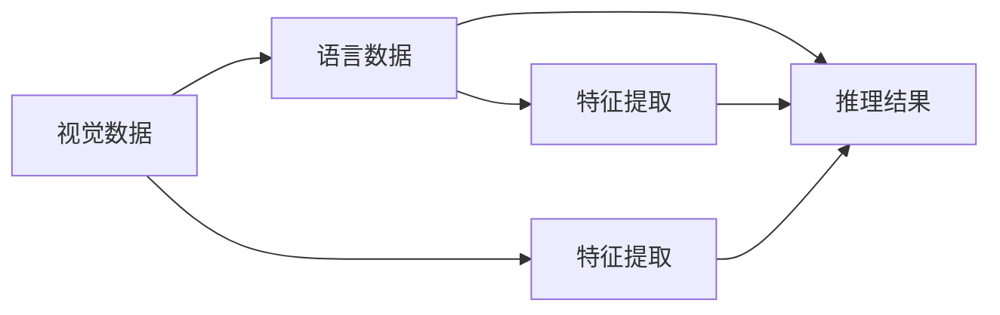
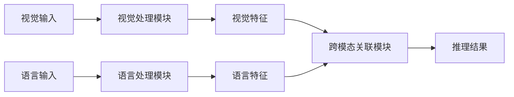
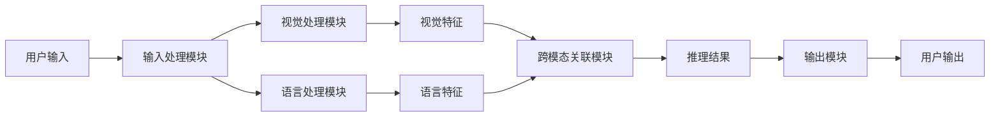
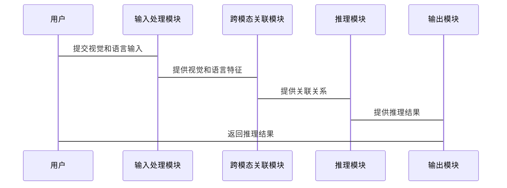

                 


# 开发具有视觉-语言跨模态推理能力的AI Agent

> 关键词：AI Agent, 跨模态推理, 视觉-语言, 多模态学习, 人工智能, 推理算法

> 摘要：本文将深入探讨开发具有视觉-语言跨模态推理能力的AI Agent的技术细节。从核心概念到算法实现，从系统架构到项目实战，我们将全面解析这一前沿技术的实现原理与应用潜力。通过本文的学习，读者将能够掌握从理论到实践的完整开发流程，理解如何构建能够同时处理视觉和语言信息的智能体，从而在实际场景中实现跨模态推理能力。

---

## 第一部分: 背景与概念

### 第1章: 视觉-语言跨模态推理的背景与问题

#### 1.1 问题背景

##### 1.1.1 多模态AI的发展现状
多模态人工智能是当前AI领域的研究热点。视觉、语言、听觉等模态的结合，使得AI系统能够更全面地感知和理解真实世界。然而，如何实现不同模态之间的有效协同推理，仍然是一个具有挑战性的技术问题。

##### 1.1.2 跨模态推理的定义与特点
跨模态推理是指在多个模态数据之间建立关联，并基于这些关联进行推理的能力。其核心特点包括：
- **异构性**：不同模态的数据具有不同的形式和语义。
- **关联性**：模态之间存在潜在的语义关联。
- **推理性**：基于模态数据的关联关系进行逻辑推理。

##### 1.1.3 当前AI Agent的局限性
传统的AI Agent通常仅专注于单一模态（如文本或图像），难以在复杂场景中同时处理多种模态数据，并利用它们之间的关联进行推理。这种局限性限制了AI Agent在实际应用中的能力。

#### 1.2 跨模态推理的核心问题

##### 1.2.1 跨模态数据的异构性挑战
不同模态的数据具有不同的表示形式和特征维度，如何在异构数据之间建立有效的关联关系是一个关键挑战。

##### 1.2.2 推理的不确定性与复杂性
跨模态推理需要处理数据中的不确定性，并在复杂场景中进行合理的逻辑推理。

##### 1.2.3 实际应用场景中的问题描述
在实际应用中，跨模态推理需要解决数据噪声、模态缺失、推理目标多样性等问题。

#### 1.3 跨模态推理的边界与外延

##### 1.3.1 跨模态推理的适用范围
跨模态推理适用于需要多模态数据协同的场景，例如图像描述生成、视频问答、机器人交互等。

##### 1.3.2 与其他AI能力的区分
跨模态推理与单模态推理、多模态分类等任务的区别在于其目标是通过多模态数据的协同推理来解决复杂问题。

##### 1.3.3 技术的局限性与未来发展方向
当前跨模态推理技术仍面临数据标注成本高、模型解释性差等问题。未来发展方向包括提高模型的可解释性、增强实时性、拓展多模态数据的处理能力等。

### 第2章: 跨模态推理的核心概念与联系

#### 2.1 跨模态推理的原理

##### 2.1.1 多模态数据的表示方法
多模态数据通常需要分别进行特征提取，例如图像通过卷积神经网络（CNN）提取视觉特征，文本通过词嵌入（如BERT）提取语言特征。

##### 2.1.2 跨模态特征的提取与融合
跨模态特征的提取与融合是通过将不同模态的特征进行对齐和融合，例如使用注意力机制对齐视觉和语言特征。

##### 2.1.3 推理机制的实现方式
推理机制可以通过基于注意力的加权融合、对比学习等方式实现。

#### 2.2 跨模态推理的核心要素

##### 2.2.1 模态间的关联关系
模态间的关联关系可以通过交叉注意力机制来建模，例如图像中的某个区域与文本中的某个词之间建立关联。

##### 2.2.2 跨模态注意力机制
跨模态注意力机制用于捕捉不同模态数据之间的关联关系，例如图像中的物体与文本中的描述词之间的关联。

##### 2.2.3 推理模型的结构特点
跨模态推理模型通常包括模态特征提取模块、跨模态关联模块和推理模块。

#### 2.3 跨模态推理的实体关系图


### 第3章: 跨模态推理的算法原理

#### 3.1 跨模态推理的数学模型

##### 3.1.1 多模态数据的表示
$$v \in \mathbb{R}^{d_v}, l \in \mathbb{R}^{d_l}$$
其中，$v$ 表示视觉特征，$l$ 表示语言特征，$d_v$ 和 $d_l$ 分别表示视觉和语言特征的维度。

##### 3.1.2 跨模态注意力机制
$$a = \text{softmax}(vW_v + lW_l)$$
其中，$W_v$ 和 $W_l$ 是注意力权重矩阵。

##### 3.1.3 推理模型的数学表达
$$p(y|x) = \text{softmax}(W_c [v,l] + b)$$
其中，$[v,l]$ 表示视觉和语言特征的拼接，$W_c$ 和 $b$ 是推理模型的参数。

#### 3.2 跨模态推理的算法实现

##### 3.2.1 基于Transformer的跨模态推理
```python
def cross_modal_attention(v, l):
    # 计算视觉特征和语言特征的交叉注意力
    attention = torch.matmul(v, l.permute(0, 2, 1))
    attention = nn.softmax(attention, dim=-1)
    # 加权融合
    fused_feature = torch.sum(v * attention, dim=-1)
    return fused_feature
```

##### 3.2.2 基于对比学习的跨模态推理
```python
def contrastive_learning(v, l):
    # 计算视觉和语言特征的相似性
    similarity = torch.matmul(v, l.permute(0, 2, 1))
    similarity = nn.functional.normalize(similarity, dim=-1)
    loss = (1 - similarity.diag()).mean()
    return loss
```

---

## 第二部分: 系统分析与架构设计

### 第4章: 跨模态推理系统的架构设计

#### 4.1 系统功能设计

##### 4.1.1 功能模块划分
- **视觉处理模块**：负责图像的特征提取和预处理。
- **语言处理模块**：负责文本的特征提取和预处理。
- **跨模态关联模块**：负责模态间的关联建模。
- **推理模块**：负责基于关联关系进行推理。

##### 4.1.2 系统功能流程


#### 4.2 系统架构设计

##### 4.2.1 系统架构图


##### 4.2.2 系统交互流程


---

## 第三部分: 项目实战

### 第5章: 跨模态推理项目实战

#### 5.1 项目环境搭建

##### 5.1.1 环境要求
- Python 3.8+
- PyTorch 1.9+
- transformers库

##### 5.1.2 安装依赖
```bash
pip install torch transformers
```

#### 5.2 核心代码实现

##### 5.2.1 视觉特征提取
```python
import torch
import torch.nn as nn

class VisualFeatureExtractor(nn.Module):
    def __init__(self, input_dim, hidden_dim):
        super(VisualFeatureExtractor, self).__init__()
        self.fc = nn.Linear(input_dim, hidden_dim)
    
    def forward(self, x):
        return self.fc(x)
```

##### 5.2.2 语言特征提取
```python
class LanguageFeatureExtractor(nn.Module):
    def __init__(self, input_dim, hidden_dim):
        super(LanguageFeatureExtractor, self).__init__()
        self.fc = nn.Linear(input_dim, hidden_dim)
    
    def forward(self, x):
        return self.fc(x)
```

##### 5.2.3 跨模态关联模块
```python
class CrossModalAttention(nn.Module):
    def __init__(self, visual_dim, language_dim, hidden_dim):
        super(CrossModalAttention, self).__init__()
        self视觉注意力层
        self.visual_attn = nn.Linear(visual_dim + language_dim, hidden_dim)
        self.language_attn = nn.Linear(visual_dim + language_dim, hidden_dim)
    
    def forward(self, visual, language):
        combined = torch.cat([visual, language], dim=-1)
        visual_weight = nn.functional.softmax(self.visual_attn(combined), dim=-1)
        language_weight = nn.functional.softmax(self.language_attn(combined), dim=-1)
        fused_feature = visual * language_weight + language * visual_weight
        return fused_feature
```

#### 5.3 项目测试与优化

##### 5.3.1 测试用例设计
- 测试跨模态关联模块的注意力权重分布。
- 测试推理模块的输出准确性。

##### 5.3.2 性能优化
- 使用并行计算加速模型训练。
- 优化模型的内存占用。

---

## 第四部分: 扩展与优化

### 第6章: 跨模态推理的扩展与优化

#### 6.1 模型的可解释性优化

##### 6.1.1 注意力可视化
通过可视化注意力权重，帮助理解模型的推理过程。

##### 6.1.2 可解释性算法
使用可解释性算法（如SHAP值）分析模型的决策过程。

#### 6.2 模型的实时性优化

##### 6.2.1 模型压缩
通过剪枝、量化等技术压缩模型，降低计算成本。

##### 6.2.2 并行计算优化
利用GPU并行计算加速模型推理。

#### 6.3 多模态数据的扩展处理

##### 6.3.1 视频数据的处理
扩展模型支持视频数据的处理，结合时空信息进行推理。

##### 6.3.2 音频数据的处理
将音频数据引入模型，实现音频-视觉-语言三模态推理。

---

## 第五部分: 总结与展望

### 第7章: 总结与展望

#### 7.1 核心总结
本文详细介绍了开发具有视觉-语言跨模态推理能力的AI Agent的技术细节，包括核心概念、算法实现、系统架构和项目实战。

#### 7.2 未来展望
未来，跨模态推理技术将在以下方向进一步发展：
- 提高模型的可解释性。
- 实现多模态数据的实时推理。
- 拓展更多模态数据的处理能力。
- 探索跨模态推理在更多领域的应用。

---

## 作者：AI天才研究院/AI Genius Institute & 禅与计算机程序设计艺术 /Zen And The Art of Computer Programming

---

通过本文的系统阐述，读者可以全面掌握开发具有视觉-语言跨模态推理能力的AI Agent所需的技术栈和实现方法。从理论到实践，从算法到系统，本文为读者提供了一条清晰的学习路径。

