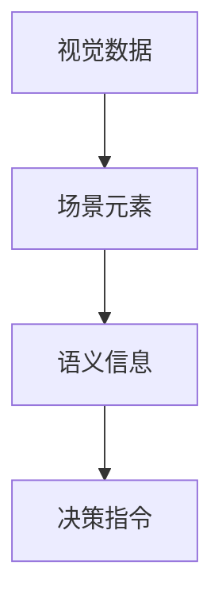
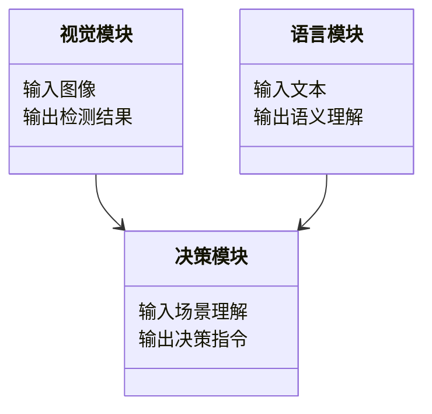
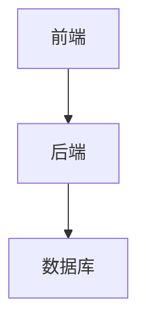
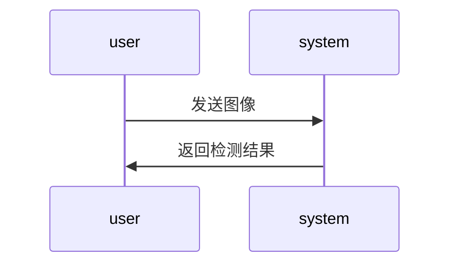

                 


# 开发具有视觉场景理解能力的AI Agent

## 关键词：AI Agent, 视觉场景理解, 多模态数据, 语义分割, 目标检测, 语义理解

## 摘要：本文详细探讨了开发具有视觉场景理解能力的AI Agent的各个方面。从背景介绍到核心概念，从算法原理到系统架构设计，再到项目实战，全面分析了如何构建一个能够理解复杂视觉场景的智能体。文章结合理论与实践，为读者提供了丰富的技术细节和实现方法，帮助读者掌握开发此类AI Agent的技能。

---

## 第1章: 背景介绍

### 1.1 问题背景

#### 1.1.1 视觉场景理解的定义与重要性
视觉场景理解是指AI系统能够识别和理解图像或视频中的场景、物体、关系和语义信息。其重要性体现在自动驾驶、智能安防、机器人控制等领域，能够提升系统的自主决策能力。

#### 1.1.2 AI Agent的核心目标与应用场景
AI Agent通过视觉场景理解，能够感知环境并做出相应决策。应用场景包括自动驾驶、智能助手、智能安防等。

#### 1.1.3 当前技术的局限性与挑战
当前技术在复杂场景下的准确性和实时性不足，多模态数据的融合仍需进一步优化。

### 1.2 问题描述

#### 1.2.1 视觉场景理解的关键问题
包括目标检测、语义分割、多模态数据融合等。

#### 1.2.2 AI Agent在复杂环境中的交互需求
AI Agent需要实时感知和理解环境，并与用户或系统进行交互。

#### 1.2.3 问题解决的必要性与可行性分析
必要性：提升AI系统的智能性和实用性。可行性：通过深度学习和多模态数据融合，实现对复杂场景的理解。

### 1.3 问题解决

#### 1.3.1 多模态数据的融合与处理
通过融合视觉、语言等多种数据，提升场景理解的准确性和全面性。

#### 1.3.2 视觉与语言理解的协同工作
结合计算机视觉和自然语言处理技术，实现更精准的场景理解。

#### 1.3.3 场景理解的层次化架构设计
从低级特征到高级语义，分层次进行理解和处理。

### 1.4 边界与外延

#### 1.4.1 视觉场景理解的边界条件
限定于特定场景和数据类型，避免过于泛化的处理。

#### 1.4.2 AI Agent能力的扩展与限制
能力扩展包括多模态融合，限制包括计算资源和数据量的限制。

#### 1.4.3 相关领域的区别与联系
与计算机视觉、自然语言处理等领域的区别和联系。

### 1.5 概念结构与核心要素组成

#### 1.5.1 视觉场景理解的核心要素
包括视觉数据、语义信息、场景关系。

#### 1.5.2 AI Agent的功能模块划分
包括感知模块、决策模块、执行模块。

#### 1.5.3 系统整体架构的逻辑关系
感知层、理解层、决策层的逻辑关系。

---

## 第2章: 核心概念与联系

### 2.1 核心概念原理

#### 2.1.1 视觉场景理解的数学模型
基于深度学习的模型，如卷积神经网络。

#### 2.1.2 AI Agent的决策机制
基于场景理解的决策树或概率模型。

#### 2.1.3 多模态数据的融合方法
注意力机制和融合网络。

### 2.2 概念属性特征对比表格

| 概念 | 属性 | 特征 |
|------|------|------|
| 视觉数据 | 类型 | 图像、视频 |
| 语言理解 | 方法 | NLP、BERT |
| 场景理解 | 精度 | 高精度、实时性 |

### 2.3 ER实体关系图架构



---

## 第3章: 算法原理讲解

### 3.1 视觉场景理解算法

#### 3.1.1 目标检测算法
使用YOLO或Faster R-CNN实现目标检测。

#### 3.1.2 语义分割算法
使用U-Net进行语义分割。

#### 3.1.3 多模态融合算法
使用注意力机制融合视觉和语言信息。

### 3.2 Python源代码实现

#### 3.2.1 目标检测代码示例
```python
import tensorflow as tf
from tensorflow.keras.models import Model
from tensorflow.keras.layers import Input, Conv2D, MaxPooling2D

input_tensor = Input(shape=(224, 224, 3))
x = Conv2D(32, (3, 3), activation='relu')(input_tensor)
x = MaxPooling2D((2, 2))(x)
model = Model(inputs=input_tensor, outputs=x)
```

### 3.3 数学模型和公式

#### 3.3.1 目标检测损失函数
$$ \text{损失函数} = \text{分类损失} + \text{定位损失} $$

---

## 第4章: 系统分析与架构设计方案

### 4.1 项目介绍

#### 4.1.1 项目背景
开发一个具备视觉场景理解能力的AI Agent，应用于智能安防。

### 4.2 系统功能设计

#### 4.2.1 领域模型类图


### 4.3 系统架构设计

#### 4.3.1 分层架构图


### 4.4 系统接口设计

#### 4.4.1 RESTful API接口
```json
POST /api/v1/detect
{
    "image": "base64图像数据"
}
```

### 4.5 系统交互设计

#### 4.5.1 用户与系统的交互序列图


---

## 第5章: 项目实战

### 5.1 环境安装

#### 5.1.1 安装Python库
```bash
pip install tensorflow keras opencv-python
```

### 5.2 核心实现

#### 5.2.1 视觉模块实现
```python
import cv2

def detect_objects(image):
    # 目标检测代码
    pass
```

### 5.3 案例分析

#### 5.3.1 智能安防案例
AI Agent识别并处理入侵者。

---

## 第6章: 最佳实践、小结、注意事项、拓展阅读

### 6.1 最佳实践

#### 6.1.1 数据质量的重要性
确保数据的多样性和代表性。

#### 6.1.2 模型的可解释性
提升模型的透明度和可解释性。

### 6.2 小结

视觉场景理解是开发AI Agent的核心能力，通过多模态数据融合和深度学习技术，能够实现复杂场景的理解和决策。

### 6.3 注意事项

- 计算资源需求
- 数据隐私保护
- 模型的实时性

### 6.4 拓展阅读

- 《Deep Learning》
- 《Computer Vision: Algorithms and Applications》

---

## 作者：AI天才研究院 & 禅与计算机程序设计艺术

