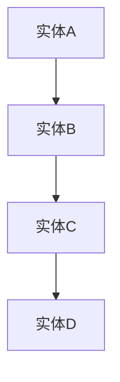

                 

<think>
嗯，我现在需要帮用户写一篇关于《开发具有视觉常识推理能力的AI Agent》的技术博客文章。首先，我得理解用户的需求，他想要一个结构清晰、内容详实的技术博客，涵盖从背景到实际应用的各个方面。文章需要包含摘要、关键词、目录结构，以及详细的内容，每个章节都要有三级子标题，内容要专业且易懂。

首先，我会先确定文章的标题和关键词。标题已经给出，是《开发具有视觉常识推理能力的AI Agent》。关键词应该包括AI Agent、视觉常识推理、多模态数据、知识图谱、深度学习，这些词汇能够准确反映文章的主题。

接下来是摘要部分。摘要需要简洁明了地概括文章的核心内容。我需要指出AI Agent在视觉常识推理中的重要性，以及开发中的关键技术和挑战，强调结合多模态数据、知识图谱和深度学习的方法，以及实现的应用场景和意义。

然后是目录结构。用户已经提供了详细的目录，我需要确保每个部分都涵盖必要的内容，并且逻辑连贯。第一部分是背景介绍，包括问题背景、问题描述、解决方案等。第二部分是核心概念与联系，涉及原理、对比分析和ER图。第三部分是算法原理，详细讲解特征提取、常识推理模型和多模态融合。第四部分是系统架构，介绍问题场景、功能设计、架构图、接口设计和交互流程。第五部分是项目实战，指导安装环境、实现代码、案例分析。最后是最佳实践，总结经验、注意事项和未来趋势。

在撰写每个章节时，我需要确保内容详细且专业。例如，在背景介绍部分，要解释AI Agent的发展历程，视觉常识推理的定义和特点，以及当前技术的挑战。核心概念部分需要用表格和Mermaid图来展示概念之间的关系，帮助读者理解。

算法原理部分，我需要详细讲解每种算法，如视觉特征提取使用CNN和Transformer，常识推理模型基于知识图谱和逻辑推理，多模态融合方法如对比学习和注意力机制。并提供Python代码示例，解释数学公式，使用Mermaid流程图展示算法步骤。

系统架构部分，要介绍问题场景，设计项目，功能设计用领域模型图，系统架构图展示模块之间的关系，接口设计和交互流程用序列图说明。项目实战部分，要指导读者如何安装环境，实现核心功能，解读代码，并分析实际案例。

最后，最佳实践部分要总结开发经验，列出注意事项，讨论未来趋势，并推荐扩展阅读材料。整个过程需要逻辑清晰，内容详尽，确保读者能够逐步理解和掌握开发具有视觉常识推理能力的AI Agent的方法。

现在，我需要按照这个结构来撰写文章，确保每个部分都符合用户的要求，内容丰富，结构合理。可能会遇到一些挑战，比如如何将复杂的算法用简单的语言解释清楚，或者如何设计直观的图表来辅助说明。但通过逐步分析和详细阐述，我相信能够完成一篇高质量的技术博客。
</think>

# 开发具有视觉常识推理能力的AI Agent

> **关键词**：AI Agent，视觉常识推理，多模态数据，知识图谱，深度学习

> **摘要**：  
> 本文深入探讨了开发具有视觉常识推理能力的AI Agent的核心技术与实现方法。通过结合计算机视觉、自然语言处理和知识图谱等多模态数据，我们提出了一种基于深度学习的视觉常识推理框架。文章详细分析了视觉常识推理的算法原理、系统架构设计及实际应用场景，为AI Agent的开发提供了理论基础和实践指导。

---

## 第一部分: 开发具有视觉常识推理能力的AI Agent概述

### 第1章: 背景介绍

#### 1.1 问题背景
##### 1.1.1 AI Agent的发展历程
AI Agent（智能体）是指能够感知环境、执行任务并做出决策的智能系统。从早期的规则驱动型AI到现代的深度学习驱动型AI，AI Agent经历了从简单到复杂的演变。

##### 1.1.2 视觉常识推理的定义与特点
视觉常识推理是指AI Agent在视觉感知的基础上，结合常识知识进行推理和理解的能力。其特点包括多模态数据的融合、知识的表达与推理、以及动态环境的适应性。

##### 1.1.3 当前AI Agent在视觉推理中的挑战
目前，AI Agent在视觉常识推理中面临的主要挑战包括：
- **知识表示的复杂性**：如何有效地表示和利用常识知识。
- **多模态数据的融合**：如何将视觉数据与语言数据有机结合。
- **动态环境的适应性**：如何在动态环境中实时推理和决策。

#### 1.2 问题描述
##### 1.2.1 视觉常识推理的核心问题
视觉常识推理的核心问题是将视觉感知与常识知识相结合，实现对复杂场景的理解和推理。

##### 1.2.2 AI Agent在视觉推理中的目标与任务
AI Agent的目标是通过视觉感知和常识推理，实现对场景的语义理解、目标识别和行为决策。

##### 1.2.3 当前技术的局限性与改进方向
当前技术的局限性主要体现在：
- 知识表示的不完善性。
- 多模态数据融合的不充分性。
- 动态环境适应性的不足。

改进方向包括优化知识表示方法、提升多模态数据融合能力以及增强动态环境适应性。

#### 1.3 问题解决
##### 1.3.1 视觉常识推理的关键技术
- **知识表示**：利用知识图谱表示常识知识。
- **多模态数据融合**：结合视觉数据和语言数据进行推理。
- **深度学习**：利用深度学习模型进行特征提取和推理。

##### 1.3.2 多模态数据的整合与处理
通过整合视觉数据（如图像、视频）和语言数据（如文本、语音），实现多模态数据的协同处理。

##### 1.3.3 AI Agent的自主学习与推理能力
通过自主学习和推理，AI Agent能够不断优化自身的知识表示和推理能力。

#### 1.4 边界与外延
##### 1.4.1 视觉常识推理的边界条件
视觉常识推理的边界条件包括场景的复杂性、数据的完整性以及任务的明确性。

##### 1.4.2 相关领域的区别与联系
- **区别**：视觉常识推理与传统视觉识别的区别在于对常识知识的依赖。
- **联系**：视觉常识推理与自然语言处理、知识图谱密切相关。

##### 1.4.3 技术的可扩展性与应用场景
视觉常识推理技术具有较强的可扩展性，可应用于智能助手、自动驾驶、机器人等领域。

#### 1.5 概念结构与核心要素
##### 1.5.1 概念层次分析
视觉常识推理可以分为感知层、知识层和推理层三个层次。

##### 1.5.2 核心要素组成
- **视觉感知**：通过视觉传感器获取环境信息。
- **常识知识**：基于常识知识的表示与存储。
- **推理机制**：通过推理算法实现对场景的理解与决策。

##### 1.5.3 概念之间的关系与依赖
视觉感知依赖于常识知识的指导，常识知识通过推理机制实现对视觉信息的解释与应用。

---

## 第二部分: 视觉常识推理的核心概念与联系

### 第2章: 核心概念与原理

#### 2.1 视觉常识推理的原理
##### 2.1.1 视觉感知与常识推理的结合
视觉感知为常识推理提供基础数据，常识推理为视觉感知提供上下文信息。

##### 2.1.2 知识表示与推理机制
通过知识图谱表示常识知识，利用推理算法实现知识的推理与应用。

##### 2.1.3 多模态数据的融合与分析
通过多模态数据的融合，提升视觉常识推理的准确性和鲁棒性。

#### 2.2 核心概念的对比分析
##### 2.2.1 感知与推理的对比
- **感知**：基于传感器获取环境信息。
- **推理**：基于知识对感知信息进行解释与应用。

##### 2.2.2 单模态与多模态推理的对比
- **单模态推理**：仅基于单一类型的数据进行推理。
- **多模态推理**：基于多种类型的数据进行推理，提升推理的准确性和全面性。

##### 2.2.3 视觉推理与语言推理的对比
- **视觉推理**：基于视觉数据进行推理。
- **语言推理**：基于语言数据进行推理。
- **对比**：视觉推理更依赖于视觉数据的理解，语言推理更依赖于语言数据的理解。

#### 2.3 ER实体关系图架构

---

## 第三部分: 视觉常识推理的算法原理

### 第3章: 算法原理与实现

#### 3.1 视觉特征提取算法
##### 3.1.1 基于CNN的特征提取
通过卷积神经网络（CNN）提取图像的视觉特征。

##### 3.1.2 Transformer在视觉特征提取中的应用
利用Transformer结构进行视觉特征的提取与建模。

##### 3.1.3 跨模态特征对齐方法
通过跨模态特征对齐方法，实现视觉特征与语言特征的对齐与融合。

#### 3.2 常识推理模型
##### 3.2.1 基于知识图谱的推理算法
通过知识图谱构建常识知识图谱，并利用图推理算法进行推理。

##### 3.2.2 基于逻辑推理的模型
利用逻辑推理模型，基于常识知识进行推理与决策。

##### 3.2.3 基于概率推理的方法
通过概率推理方法，基于概率模型进行推理与决策。

#### 3.3 多模态融合算法
##### 3.3.1 对比学习
通过对比学习方法，实现多模态数据的特征对齐与融合。

##### 3.3.2 注意力机制
通过注意力机制，实现多模态数据的注意力分配与聚焦。

##### 3.3.3 图神经网络
通过图神经网络，实现多模态数据的图结构建模与推理。

---

## 第四部分: 视觉常识推理的系统架构设计

### 第4章: 系统分析与架构设计方案

#### 4.1 问题场景介绍
##### 4.1.1 问题场景的描述
通过一个具体的场景描述，说明视觉常识推理的应用场景。

##### 4.1.2 项目介绍
简要介绍开发项目的背景、目标和主要功能。

#### 4.2 系统功能设计
##### 4.2.1 领域模型设计
通过领域模型图，展示系统的主要功能模块及其关系。

##### 4.2.2 系统架构设计
通过系统架构图，展示系统的整体架构及模块之间的关系。

##### 4.2.3 系统接口设计
通过接口设计，展示系统与其他系统的交互接口及数据流。

##### 4.2.4 系统交互流程
通过交互流程图，展示系统的交互流程及主要步骤。

---

## 第五部分: 视觉常识推理的项目实战

### 第5章: 项目实战

#### 5.1 环境安装
##### 5.1.1 开发环境的安装
介绍开发环境的安装步骤，包括操作系统、编程语言、依赖库的安装。

##### 5.1.2 数据集的准备
介绍数据集的准备步骤，包括数据的获取、预处理和存储。

#### 5.2 系统核心实现
##### 5.2.1 视觉特征提取的实现
通过代码实现视觉特征提取的功能。

##### 5.2.2 常识推理模型的实现
通过代码实现常识推理模型的构建与推理。

##### 5.2.3 多模态融合算法的实现
通过代码实现多模态数据的融合与推理。

#### 5.3 代码应用解读与分析
##### 5.3.1 代码的功能分析
通过代码分析，展示代码的主要功能及其实现方法。

##### 5.3.2 代码的优化建议
提出代码优化的建议，包括算法优化、代码结构优化等。

#### 5.4 实际案例分析
##### 5.4.1 案例描述
通过具体的案例描述，展示视觉常识推理的应用场景。

##### 5.4.2 案例分析
通过案例分析，展示视觉常识推理的实现过程及结果。

##### 5.4.3 结果解读
通过结果解读，展示视觉常识推理的效果及优化方向。

#### 5.5 项目小结
总结项目的开发过程、主要成果及经验教训。

---

## 第六部分: 视觉常识推理的最佳实践

### 第6章: 最佳实践

#### 6.1 小结
总结全文的核心内容及主要观点。

#### 6.2 注意事项
提出开发过程中需要注意的事项及常见问题的解决方案。

#### 6.3 未来趋势
展望视觉常识推理技术的未来发展趋势及可能的研究方向。

#### 6.4 拓展阅读
推荐相关领域的拓展阅读材料，包括书籍、论文、技术博客等。

---

## 作者信息

作者：AI天才研究院/AI Genius Institute & 禅与计算机程序设计艺术 /Zen And The Art of Computer Programming

---

以上是《开发具有视觉常识推理能力的AI Agent》的技术博客文章的详细内容。

