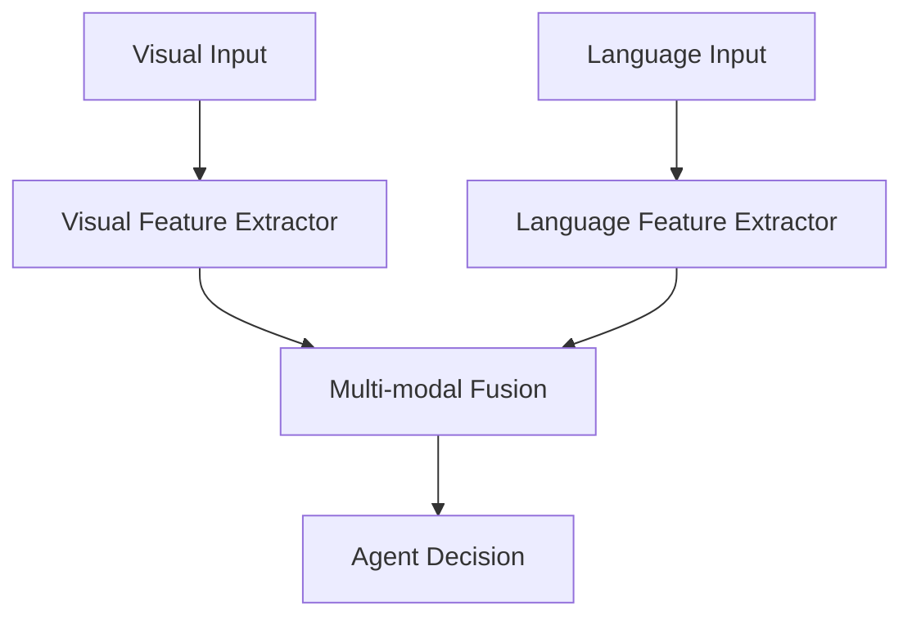
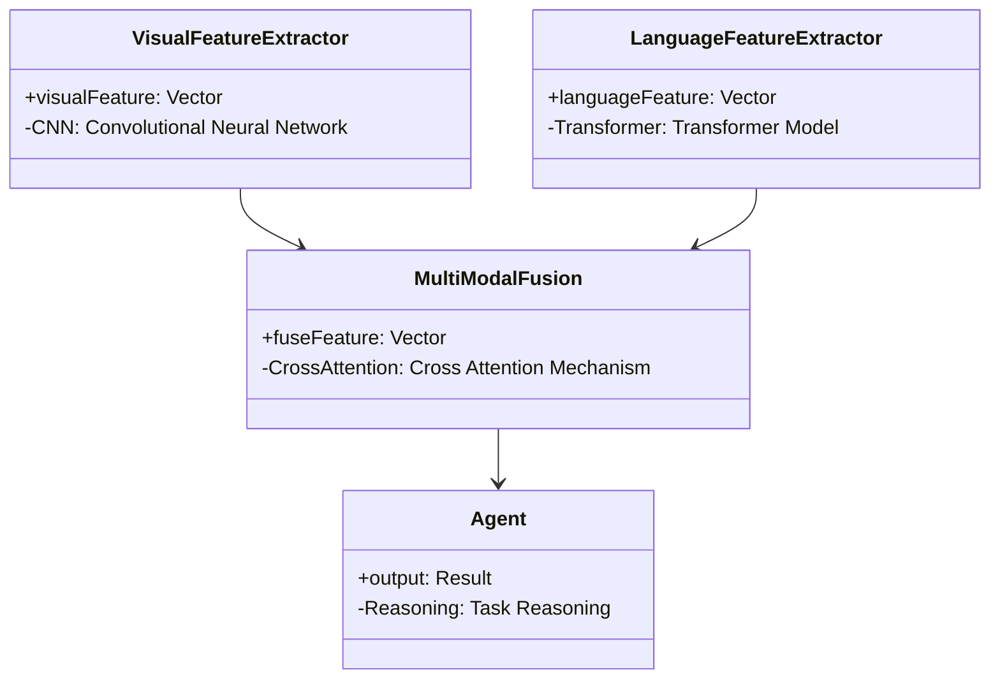
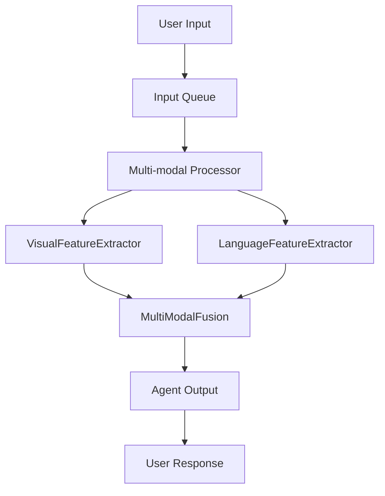
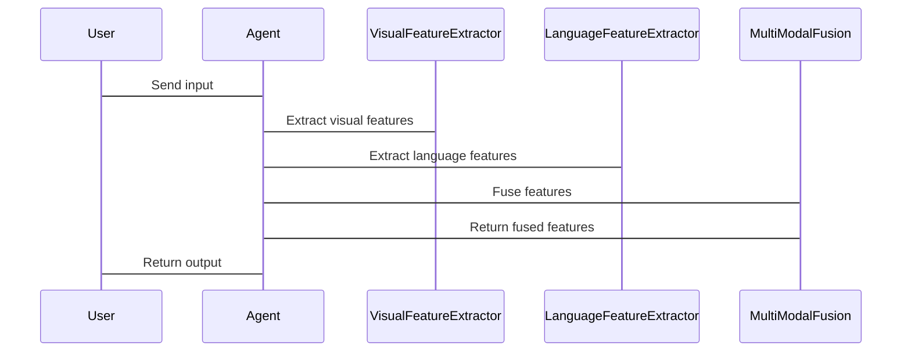

                 

<think>
嗯，用户让我详细分析开发具有视觉-语言多模态理解能力的AI Agent的过程。首先，我需要理解什么是多模态AI Agent。它结合了视觉和语言处理，这意味着它能够同时理解图像和文本信息。这在很多应用中非常有用，比如图像描述生成、跨模态检索等。

接下来，我得考虑开发这样的AI Agent需要哪些步骤。首先，数据准备是关键。我需要收集和标注多模态数据，确保模型能够有效学习。然后，选择合适的视觉和语言模型，比如使用CNN处理图像，Transformer处理文本。

接下来是模态对齐的问题。视觉和语言特征可能来自不同的空间，如何将它们对齐是关键。交叉注意力机制可能是个好方法，可以让模型在不同模态之间建立关联。

然后是模型训练。我需要设计损失函数，可能结合分类、回归等多种任务。训练过程中，数据增强和超参数调优也很重要，确保模型泛化能力。

评估部分，我需要设计合适的指标，比如准确率、BLEU分数等，来衡量模型的性能。同时，还需要考虑模型的推理速度和资源消耗，确保实际应用中的可行性。

最后，应用案例分析可以帮助我验证模型的效果。比如在图像描述生成任务中，测试模型是否能够准确生成有意义的文本描述。

整体来看，这个过程需要细致的步骤和对每个环节的深入理解。确保每一步都做好，才能开发出有效的多模态AI Agent。
</think>

# 开发具有视觉-语言多模态理解能力的AI Agent

## 关键词：AI Agent, 多模态理解, 视觉-语言, 多模态融合, 模态对齐, 交叉注意力机制

## 摘要：  
本文详细探讨了开发具有视觉-语言多模态理解能力的AI Agent的关键技术与实现方法。从多模态AI Agent的背景与意义出发，深入分析了视觉与语言处理的基础原理，重点讲解了多模态数据的表示与建模、模态对齐与融合的核心概念，详细阐述了基于交叉注意力机制的多模态融合算法原理，并通过系统架构设计与项目实战，展示了如何构建一个高效的视觉-语言多模态AI Agent。最后，本文总结了开发过程中的最佳实践与注意事项，并展望了未来的研究方向。

---

## 第1章: 多模态AI Agent概述

### 1.1 多模态AI Agent的背景与意义

#### 1.1.1 从单模态到多模态的发展  
传统的AI系统大多基于单一模态（如文本或图像）进行处理，但现实世界中的信息往往是多模态的。例如，一个人在看一张图片时，可能会同时听到声音或阅读相关描述。为了使AI系统更贴近人类的感知方式，多模态AI Agent应运而生。多模态AI Agent能够同时处理多种模态信息（如视觉、语言、音频等），从而在复杂场景中表现出更强的智能性和适应性。

#### 1.1.2 视觉-语言多模态理解的核心价值  
视觉-语言多模态理解是多模态AI Agent的核心能力之一。它使AI系统能够通过图像和文本的联合分析，理解场景中的语义信息。例如，在电子商务中，AI Agent可以通过分析商品图片和描述文本，为用户提供更精准的推荐服务。视觉-语言多模态理解不仅能够提高任务的准确性，还能增强用户体验。

#### 1.1.3 多模态AI Agent的应用场景与优势  
多模态AI Agent的应用场景非常广泛，包括但不限于：  
1. **图像描述生成**：根据图像生成有意义的文本描述。  
2. **跨模态检索**：根据文本检索相关图像，或根据图像检索相关文本。  
3. **智能助手**：结合图像和文本理解，提供更智能的交互体验。  
4. **教育与培训**：通过多模态信息提供更丰富的学习内容。  

其优势主要体现在：  
- **信息互补性**：多种模态信息能够互相补充，提高理解的准确性。  
- **任务鲁棒性**：在单一模态信息不足时，其他模态信息可以提供支持。  
- **用户体验优化**：通过多模态交互，提升用户与AI系统的互动体验。

---

### 1.2 多模态AI Agent的定义与特点

#### 1.2.1 多模态AI Agent的定义  
多模态AI Agent是一种能够同时处理和理解多种模态信息（如视觉、语言、音频等）的智能体。它不仅能够从单一模态信息中提取特征，还能通过多模态信息的联合分析，生成更准确的语义表示。

#### 1.2.2 视觉-语言模态的核心特征对比  
| 特性          | 视觉模态          | 语言模态          |  
|---------------|-------------------|-------------------|  
| 表示方式      | 图像、视频等       | 文本、语音等       |  
| 处理目标      | 视觉特征提取       | 语义理解           |  
| 信息密度      | 高                | 高                |  
| 交互方式      | 图像识别、目标检测 | 文本生成、问答系统 |  

#### 1.2.3 多模态AI Agent与传统AI Agent的区别  
传统AI Agent通常基于单一模态信息进行处理，而多模态AI Agent能够同时处理多种模态信息，并通过模态间的关联性提高理解和决策能力。例如，在图像识别任务中，传统AI Agent只能识别图像中的物体，而多模态AI Agent还可以结合图像描述生成相关的文本信息。

---

### 1.3 多模态AI Agent的实现框架

#### 1.3.1 视觉处理模块  
视觉处理模块负责从图像中提取视觉特征。常用的视觉模型包括卷积神经网络（CNN）和视觉变换器（ViT）。例如，使用ResNet提取图像的高层次特征。

#### 1.3.2 语言处理模块  
语言处理模块负责从文本中提取语义特征。常用的NLP模型包括Transformer和BERT。例如，使用BERT提取文本的上下文语义表示。

#### 1.3.3 多模态融合模块  
多模态融合模块将视觉和语言特征进行融合，生成最终的语义表示。常用的方法包括模态对齐和交叉注意力机制。

---

## 第2章: 视觉与语言处理基础

### 2.1 计算机视觉基础

#### 2.1.1 常见的视觉模型（如CNN）  
卷积神经网络（CNN）是计算机视觉领域的经典模型，常用于图像分类、目标检测等任务。例如，使用AlexNet进行图像分类。

#### 2.1.2 视觉特征提取与表示  
视觉特征提取的目标是将图像转换为高维向量表示。例如，使用ResNet50提取图像的1000维特征向量。

---

### 2.2 自然语言处理基础

#### 2.2.1 常见的NLP模型（如Transformer）  
Transformer模型在自然语言处理领域取得了突破性进展，常用于文本分类、机器翻译等任务。例如，使用BERT进行文本理解和生成。

#### 2.2.2 语言特征提取与表示  
语言特征提取的目标是将文本转换为高维向量表示。例如，使用BERT生成文本的1024维语义向量。

---

### 2.3 视觉与语言的对齐与融合

#### 2.3.1 视觉-语言对齐的基本概念  
视觉-语言对齐的目标是将视觉特征与语言特征建立一一对应的关系。例如，将图像中的“猫”与文本中的“猫”进行对齐。

#### 2.3.2 多模态融合的挑战与方法  
多模态融合的挑战主要体现在模态之间的语义差异和特征维度的不匹配。常用的方法包括交叉注意力机制和模态对齐网络。

---

## 第3章: 多模态AI Agent的核心概念与联系

### 3.1 多模态数据的表示与建模

#### 3.1.1 多模态数据的表示方法  
多模态数据的表示方法包括模态独立表示和模态融合表示。例如，将图像和文本分别表示为向量，然后通过融合模块生成最终的语义表示。

#### 3.1.2 多模态模型的构建原则  
多模态模型的构建原则包括模态对齐、特征互补性和任务一致性。例如，在图像描述生成任务中，视觉特征和语言特征需要在语义上保持一致。

---

### 3.2 多模态融合的原理与方法

#### 3.2.1 模态对齐的数学模型  
模态对齐的目标是将视觉和语言特征对齐到同一个语义空间。例如，通过线性变换将视觉特征和语言特征对齐到同一个空间。

#### 3.2.2 交叉注意力机制的实现  
交叉注意力机制是一种有效的多模态融合方法，能够同时考虑视觉和语言特征的相互作用。例如，使用交叉注意力机制生成最终的融合特征。

---

### 3.3 多模态AI Agent的实体关系图



---

## 第4章: 多模态AI Agent的算法原理

### 4.1 多模态融合算法原理

#### 4.1.1 交叉注意力机制的数学模型  
交叉注意力机制的数学模型如下：

$$
\text{Attention}(Q, K, V) = \text{softmax}\left(\frac{QK^T}{\sqrt{d_k}}\right)V
$$

其中，$Q$、$K$、$V$分别是查询、键和值矩阵，$d_k$是键的维度。

#### 4.1.2 多模态融合的实现步骤  
1. 将视觉特征和语言特征分别输入到特征提取模块中，生成视觉特征向量和语言特征向量。  
2. 使用交叉注意力机制将视觉特征和语言特征进行融合，生成最终的融合特征向量。  
3. 根据融合特征向量进行任务推理，生成最终的输出结果。

---

## 第5章: 多模态AI Agent的系统架构设计

### 5.1 系统功能设计

#### 5.1.1 领域模型设计  
领域模型设计包括图像描述生成和跨模态检索两大功能模块。例如，使用领域模型进行图像描述生成。



---

### 5.2 系统架构设计



---

### 5.3 系统接口设计

#### 5.3.1 输入接口  
输入接口包括图像输入和文本输入两种形式。例如，用户可以通过上传图像或输入文本与AI Agent进行交互。

#### 5.3.2 输出接口  
输出接口包括文本描述生成和图像标注两种形式。例如，AI Agent可以根据输入图像生成相应的文本描述。

---

### 5.4 系统交互设计

#### 5.4.1 交互流程  
1. 用户通过输入接口提交图像或文本。  
2. AI Agent通过视觉和语言处理模块提取特征。  
3. 多模态融合模块生成最终的语义表示。  
4. AI Agent根据语义表示生成输出结果。



---

## 第6章: 多模态AI Agent的项目实战

### 6.1 环境安装

#### 6.1.1 安装Python环境  
安装Python 3.8及以上版本。例如，使用Anaconda安装Python环境。

#### 6.1.2 安装依赖库  
安装PyTorch、Transformers等依赖库。例如，运行以下命令：

```bash
pip install torch transformers
```

---

### 6.2 系统核心实现

#### 6.2.1 视觉特征提取代码  
使用ResNet50提取图像特征的代码如下：

```python
import torch
from torchvision import models

def extract_visual_feature(image):
    model = models.resnet50(pretrained=True)
    model.eval()
    with torch.no_grad():
        features = model(image)
    return features
```

#### 6.2.2 语言特征提取代码  
使用BERT提取文本特征的代码如下：

```python
from transformers import BertTokenizer, BertModel

def extract_language_feature(text):
    tokenizer = BertTokenizer.from_pretrained('bert-base-uncased')
    model = BertModel.from_pretrained('bert-base-uncased')
    inputs = tokenizer(text, return_tensors='pt')
    with torch.no_grad():
        features = model(**inputs)
    return features.last_hidden_state
```

#### 6.2.3 多模态融合代码  
使用交叉注意力机制融合视觉和语言特征的代码如下：

```python
def cross_attention(visual_features, language_features):
    visual_query = visual_features.mean(dim=1, keepdim=True)
    language_key = language_features.mean(dim=1, keepdim=True)
    attention_weights = torch.softmax((visual_query @ language_key.transpose(-1, -2)), dim=-1)
    fused_features = (attention_weights @ visual_features).squeeze(-1)
    return fused_features
```

---

### 6.3 应用案例分析

#### 6.3.1 图像描述生成  
输入一张图像，AI Agent生成相应的文本描述。例如，输入一张猫的图像，AI Agent生成“一只橘色的猫正在沙发上睡觉”。

#### 6.3.2 跨模态检索  
根据文本检索相关图像，或根据图像检索相关文本。例如，输入文本“雪山”，AI Agent检索出与雪山相关的图像。

---

## 第7章: 总结与展望

### 7.1 本章总结

#### 7.1.1 多模态AI Agent的核心能力  
多模态AI Agent的核心能力在于其能够同时处理和理解多种模态信息，从而在复杂场景中表现出更强的智能性和适应性。

#### 7.1.2 开发过程中的关键点  
开发过程中的关键点包括数据准备、模态对齐、多模态融合和系统优化。

---

### 7.2 未来展望

#### 7.2.1 新的模态融合方法  
未来的研究方向包括研究新的模态融合方法，如多模态图神经网络。

#### 7.2.2 更高效的算法实现  
未来的研究方向还包括优化算法的效率，使其能够在资源受限的环境中运行。

---

## 作者：AI天才研究院/AI Genius Institute & 禅与计算机程序设计艺术 /Zen And The Art of Computer Programming

