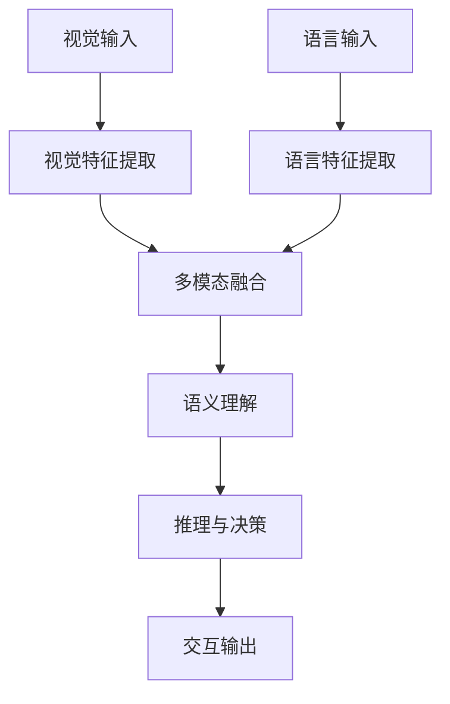
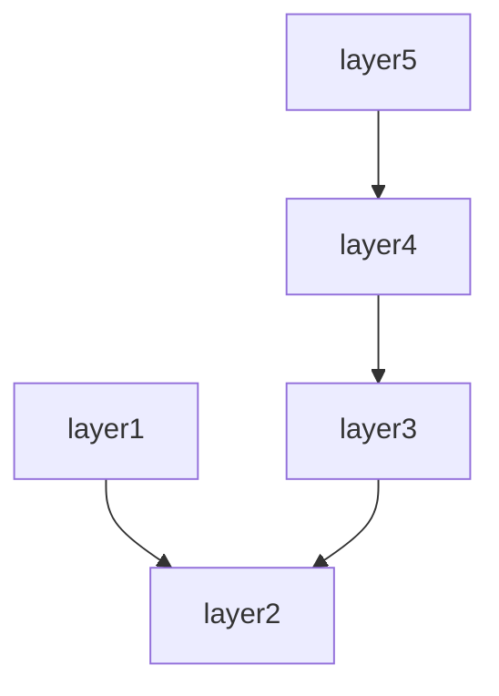

                 

<think>
好的，我现在需要根据用户的要求，逐步分析如何撰写一篇关于《开发具有视觉-语言理解能力的AI Agent》的技术博客文章。用户希望文章结构清晰，内容详细，并且包含多个部分，如背景介绍、核心概念、算法原理等。

首先，我需要确定文章的结构和内容。根据用户提供的大纲，文章分为几个主要部分：背景介绍、核心概念与联系、算法原理、系统分析与架构设计、项目实战、最佳实践与小结。每个部分都有详细的子主题。

接下来，我需要考虑每个部分的具体内容。例如，在背景介绍部分，我需要解释为什么视觉-语言理解对AI Agent重要，以及当前的发展趋势。核心概念部分需要详细说明多模态模型的原理和特点。

然后，我需要确保每个部分都包含必要的元素，如数学公式、代码示例和图表。例如，在算法原理部分，我需要使用Mermaid流程图来展示算法流程，并附上Python代码示例。

我还需要注意格式要求，使用Markdown，并确保每个部分都有足够的细节，以满足用户的字数要求。同时，结尾需要加上作者信息。

最后，我需要检查整个结构是否逻辑连贯，内容是否全面，确保没有遗漏任何关键部分。这样，我才能完成一篇符合用户要求的高质量技术博客文章。
</think>

# 开发具有视觉-语言理解能力的AI Agent

> 关键词：AI Agent, 视觉-语言理解, 多模态模型, 对比学习, 自注意力机制

> 摘要：本文详细探讨了开发具有视觉-语言理解能力的AI Agent的核心技术，从背景介绍到系统架构设计，再到项目实战，全面解析了多模态模型的构建与应用。文章结合理论与实践，通过丰富的案例和详细的代码示例，为读者提供了一套完整的开发指南。

---

## 第1章: 背景介绍

### 1.1 问题背景

#### 1.1.1 视觉与语言理解的结合  
在人工智能领域，视觉和语言理解是两个重要但相对独立的分支。视觉理解依赖于图像或视频的像素信息，而语言理解则基于文本数据。然而，现实世界中的信息往往需要同时结合视觉和语言才能被充分理解。例如，在一个智能家居场景中，用户可能通过语音指令（语言）结合房间布局（视觉）来控制设备。

#### 1.1.2 AI Agent的发展趋势  
AI Agent（智能体）是一种能够感知环境并采取行动以实现目标的实体。随着技术的进步，AI Agent正逐步从单一功能向多模态、多任务方向发展。视觉-语言理解能力的加入，使得AI Agent能够更好地理解和处理复杂场景中的信息。

#### 1.1.3 多模态技术的重要性  
多模态技术通过整合不同数据源（如图像、文本、语音等）的信息，能够提供更全面的感知能力。在AI Agent中，视觉-语言理解技术能够提升其交互能力和环境适应性，使其在实际应用中更具灵活性和智能性。

### 1.2 问题描述

#### 1.2.1 视觉-语言理解的核心问题  
视觉-语言理解的核心问题在于如何有效地将视觉信息和语言信息进行融合。这涉及到跨模态数据的对齐、特征的提取与融合，以及模型的训练与优化。

#### 1.2.2 AI Agent的功能需求  
AI Agent需要具备以下功能：  
1. **感知能力**：能够通过视觉和语言等多种方式感知环境。  
2. **理解能力**：能够理解输入的视觉和语言信息，并进行语义分析。  
3. **推理能力**：基于理解的信息进行推理和决策。  
4. **交互能力**：能够与用户进行自然的对话交互。

#### 1.2.3 多模态数据处理的挑战  
多模态数据处理的主要挑战包括：  
1. **数据对齐**：不同模态的数据在时间和空间上可能不对齐。  
2. **特征融合**：如何有效地将不同模态的特征进行融合。  
3. **模型训练**：多模态模型的训练需要同时处理多种数据类型。

### 1.3 问题解决

#### 1.3.1 多模态模型的构建  
多模态模型的构建需要结合视觉和语言模型的特点，设计合适的特征提取和融合方法。例如，可以使用卷积神经网络（CNN）提取视觉特征，使用 transformers 提取语言特征，然后通过注意力机制进行融合。

#### 1.3.2 视觉-语言联合优化  
视觉-语言联合优化的目标是通过同时处理视觉和语言信息，提升模型的联合理解能力。这可以通过联合训练的方式实现，例如通过对比学习来增强视觉和语言特征之间的关联性。

#### 1.3.3 AI Agent的交互设计  
AI Agent的交互设计需要考虑用户的需求和意图，设计自然的对话流程。例如，可以通过多轮对话的方式，逐步获取用户的意图，并结合视觉信息进行推理和决策。

### 1.4 边界与外延

#### 1.4.1 视觉-语言理解的边界  
视觉-语言理解的边界主要体现在以下方面：  
1. **数据范围**：模型只能处理特定范围内的视觉和语言信息。  
2. **理解深度**：模型的理解能力受限于其训练数据和模型结构。  
3. **应用场景**：模型在特定场景下表现良好，但在其他场景中可能存在不足。

#### 1.4.2 AI Agent的应用场景  
AI Agent的应用场景包括但不限于：  
1. **智能助手**：如 Siri、Alexa 等，能够通过语音交互帮助用户完成任务。  
2. **智能客服**：通过视觉和语言理解，提供更智能的客户服务。  
3. **机器人控制**：通过视觉和语言理解，实现机器人与人类的自然交互。

#### 1.4.3 多模态技术的未来发展方向  
多模态技术的未来发展方向包括：  
1. **更高效的特征融合方法**：如图灵完备的多模态模型。  
2. **跨模态学习**：通过对比学习等方法，提升不同模态之间的关联性。  
3. **实时性优化**：提升模型的实时处理能力，适用于更多的应用场景。

### 1.5 核心概念

#### 1.5.1 多模态模型的定义  
多模态模型是指能够同时处理多种数据模态（如图像、文本、语音等）的模型。其核心在于如何有效地融合不同模态的信息，以提升模型的感知和理解能力。

#### 1.5.2 视觉-语言理解的实现方式  
视觉-语言理解的实现方式主要包括以下几种：  
1. **单模态主导**：以视觉或语言模态为主导，辅助另一个模态进行理解。  
2. **联合优化**：同时优化视觉和语言模态的特征，以提升联合理解能力。  
3. **多模态注意力机制**：通过注意力机制，动态调整不同模态的特征权重。

#### 1.5.3 AI Agent的核心要素  
AI Agent的核心要素包括：  
1. **感知模块**：负责感知环境中的视觉和语言信息。  
2. **理解模块**：负责对感知到的信息进行语义分析。  
3. **推理模块**：基于理解的信息进行推理和决策。  
4. **交互模块**：负责与用户进行自然的对话交互。

---

## 第2章: 核心概念与联系

### 2.1 多模态模型的原理

#### 2.1.1 对比学习  
对比学习是一种通过对比不同样本之间的相似性来学习特征的方法。在视觉-语言理解中，可以通过对比学习来增强视觉和语言特征之间的关联性。例如，可以通过以下公式进行对比学习：

$$ L = \text{CE}(f_{\text{image}}(x), f_{\text{text}}(x)) $$

其中，$f_{\text{image}}(x)$ 和 $f_{\text{text}}(x)$ 分别表示图像和文本的特征向量。

#### 2.1.2 自注意力机制  
自注意力机制（Self-attention）是一种用于捕捉序列中元素之间关系的机制。在视觉-语言理解中，可以通过自注意力机制来捕捉图像和文本之间的全局关系。例如，可以通过以下公式进行自注意力计算：

$$ \text{Attention}(Q, K, V) = \text{softmax}\left(\frac{QK^T}{\sqrt{d_k}}\right)V $$

其中，$Q$、$K$ 和 $V$ 分别表示查询、键和值矩阵，$d_k$ 是键的维度。

#### 2.1.3 多模态特征融合  
多模态特征融合是指将不同模态的特征进行融合，以生成更丰富的特征表示。例如，可以通过以下方式将图像特征和文本特征进行融合：

$$ f_{\text{combined}} = \text{Concat}(f_{\text{image}}, f_{\text{text}}) $$

其中，$f_{\text{combined}}$ 是融合后的特征向量。

### 2.2 视觉与语言的对比分析

#### 2.2.1 视觉特征的表征方式  
视觉特征的表征方式主要包括以下几种：  
1. **CNN特征**：通过卷积神经网络提取图像的低层和高层特征。  
2. **区域建议网络（RPN）**：用于生成图像中的目标区域建议。  
3. **注意力特征**：通过注意力机制捕捉图像中重要区域的特征。

#### 2.2.2 语言特征的表征方式  
语言特征的表征方式主要包括以下几种：  
1. **词嵌入（Word Embedding）**：通过单词的向量表示捕捉单词的意义。  
2. **句嵌入（Sentence Embedding）**：通过句子的向量表示捕捉句子的语义。  
3. **上下文嵌入（Context Embedding）**：通过上下文信息捕捉单词或句子的语义。

#### 2.2.3 两者的异同点  
视觉和语言特征的异同点如下：  
- **相同点**：都需要通过某种方式提取特征，并进行语义分析。  
- **不同点**：视觉特征依赖于图像的空间信息，而语言特征依赖于文本的序列信息。

### 2.3 实体关系图



---

## 第3章: 算法原理

### 3.1 视觉模型算法

#### 3.1.1 ResNet网络  
ResNet（残差网络）是一种深度残差网络，通过引入跳跃连接（skip connection）来缓解深层网络的训练难题。其网络结构如下：



#### 3.1.2 视觉模型的数学公式  
ResNet的前向传播公式如下：

$$ y = f(x) + x $$

其中，$f(x)$ 表示残差函数，$x$ 是输入。

### 3.2 语言模型算法

#### 3.2.1 BERT模型  
BERT（Bidirectional Encoder Representations from Transformers）是一种基于Transformer的预训练语言模型，通过双向上下文信息捕捉文本的语义表示。

#### 3.2.2 BERT模型的数学公式  
BERT的自注意力机制公式如下：

$$ \text{Attention}(Q, K, V) = \text{softmax}\left(\frac{QK^T}{\sqrt{d_k}}\right)V $$

### 3.3 多模态模型融合算法

#### 3.3.1 多模态融合方法  
多模态融合方法主要包括以下几种：  
1. **简单拼接**：直接将视觉和语言特征拼接在一起。  
2. **注意力融合**：通过注意力机制动态调整视觉和语言特征的权重。  
3. **非线性融合**：通过非线性变换将视觉和语言特征进行融合。

#### 3.3.2 对比学习的数学公式  
对比学习的损失函数公式如下：

$$ L = \text{CE}(f_{\text{image}}(x), f_{\text{text}}(x)) $$

其中，$\text{CE}$ 表示交叉熵损失函数。

---

## 第4章: 系统分析与架构设计

### 4.1 问题场景介绍

#### 4.1.1 问题场景  
本文以开发一个多模态AI Agent为例，探讨视觉-语言理解技术在实际应用中的实现。该AI Agent需要具备以下功能：  
1. 接收视觉和语言输入。  
2. 理解输入信息并进行推理。  
3. 与用户进行自然的交互。

#### 4.1.2 项目介绍  
本项目旨在开发一个能够同时处理视觉和语言信息的AI Agent，通过多模态模型实现视觉-语言理解，并通过交互模块与用户进行对话。

### 4.2 系统功能设计

#### 4.2.1 领域模型  
领域模型描述了AI Agent的功能模块及其交互关系。如下图所示：

```mermaid
classDiagram
class 视觉模块 {
  - 图像特征提取
  - 视觉注意力机制
}
class 语言模块 {
  - 文本特征提取
  - 语言注意力机制
}
class 融合模块 {
  - 多模态特征融合
}
class 推理模块 {
  - 语义理解
  - 决策推理
}
class 交互模块 {
  - 用户输入处理
  - 系统输出生成
}
视觉模块 --> 融合模块
语言模块 --> 融合模块
融合模块 --> 推理模块
推

