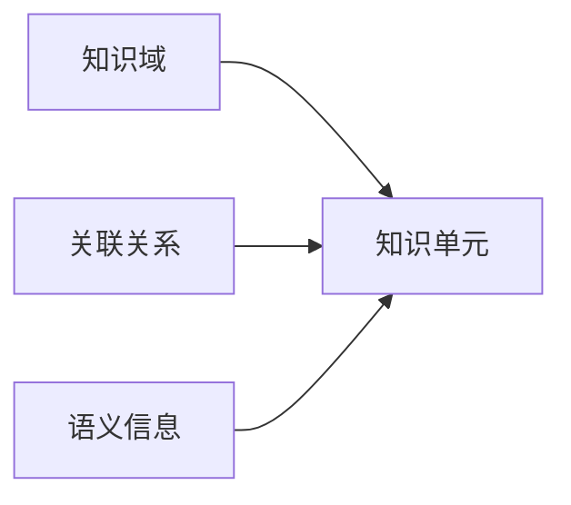
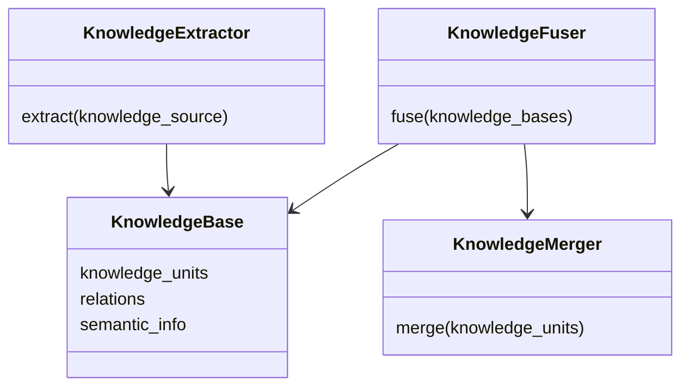

                 

<think>
嗯，用户希望我以《开发具有跨域知识融合能力的AI Agent》为标题，写一篇技术博客。看起来用户是一位技术专家，可能需要一篇结构清晰、内容详实的文章，涵盖从理论到实践的各个方面。首先，我得理清文章的结构，确保每个部分都详细且逻辑连贯。

我先从背景介绍开始，这部分需要说明AI Agent是什么，为什么需要跨域知识融合。然后，核心概念部分要深入讲解相关术语和原理，可能还需要用到图表，比如Mermaid图来展示实体关系。接下来是算法部分，这里需要详细分析融合算法，包括流程图和数学模型，确保读者能够理解实现过程。

系统架构设计也是关键，我得展示AI Agent的整体结构，使用类图和架构图来说明各个模块之间的关系。项目实战部分，需要提供具体的代码和案例，让读者能够实际操作，理解理论的应用。最后，总结和展望部分，强调跨域融合的重要性，并指出未来的发展方向。

在写作过程中，我要确保每个部分都符合用户的要求，特别是使用Mermaid图和数学公式，这些元素能帮助读者更好地理解内容。同时，语言要专业但不失清晰，逻辑严谨，结构紧凑。这样写出来的文章才能真正帮助读者掌握开发跨域知识融合AI Agent的技术和方法。
</think>

# 开发具有跨域知识融合能力的AI Agent

> 关键词：AI Agent, 跨域知识融合, 知识图谱, 多模态融合, 语义理解, 系统架构

> 摘要：本文将详细探讨如何开发具有跨域知识融合能力的AI Agent。从核心概念到算法原理，从系统架构到项目实战，我们将逐步解析这一复杂而前沿的技术。通过本文，读者将深入了解跨域知识融合的必要性、实现方法以及实际应用场景，并掌握开发此类AI Agent的关键技能。

---

# 第一部分: 背景介绍与核心概念

## 第1章: AI Agent的基本概念与背景

### 1.1 AI Agent的定义与特点

AI Agent（人工智能代理）是指在计算机系统中，能够感知环境并采取行动以实现目标的实体。与传统的被动程序不同，AI Agent具有主动性、反应性和社会性等特性。它能够通过传感器获取信息，通过执行器与环境交互，并通过推理和学习不断提升自身的智能水平。

AI Agent的核心特点包括：
1. **自主性**：能够在没有外部干预的情况下独立运作。
2. **反应性**：能够根据环境的变化调整自身的行为。
3. **目标导向性**：所有行动都是为了实现特定的目标。
4. **学习能力**：能够通过经验优化自身的决策过程。

### 1.2 跨域知识融合的必要性

在现代AI应用中，单一领域的知识往往不足以满足复杂任务的需求。例如，在医疗领域，AI Agent可能需要同时处理医学知识、患者数据、药物信息以及法律法规等多方面的信息。因此，跨域知识融合成为提升AI Agent智能水平的关键。

**跨域知识融合**是指将来自不同领域或异构数据源的知识进行整合、关联和统一，以形成更完整、更精确的知识表示。这种能力能够显著提升AI Agent的决策能力和问题解决能力。

---

## 第2章: 跨域知识融合的核心概念

### 2.1 跨域知识融合的定义与属性

**跨域知识融合**是指将来自不同领域或异构数据源的知识进行整合、关联和统一，以形成更完整、更精确的知识表示。这种能力能够显著提升AI Agent的决策能力和问题解决能力。

跨域知识融合的核心属性包括：
1. **多样性**：知识来源的多样性和异构性。
2. **关联性**：不同领域的知识之间存在潜在的关联。
3. **一致性**：融合后知识的统一性和完整性。

### 2.2 跨域知识融合的实体关系图

为了更好地理解跨域知识融合的实体关系，我们可以使用Mermaid图来展示：



从上图可以看出，知识域（A）中的知识单元（B）通过关联关系（C）和语义信息（D）进行连接，形成完整的知识网络。

---

# 第二部分: 跨域知识融合的算法原理

## 第3章: 跨域知识融合的主要算法

### 3.1 基于规则的知识融合算法

**基于规则的融合算法**通过预定义的规则对不同领域的知识进行匹配和关联。这种方法适用于规则明确且知识结构相对简单的场景。

#### 算法流程

1. **知识抽取**：从不同数据源中提取知识单元。
2. **规则匹配**：基于预定义规则，匹配不同知识单元之间的关联关系。
3. **知识融合**：将匹配的知识单元进行关联和统一。
4. **结果验证**：通过人工或自动化方式验证融合结果的准确性。

#### 示例代码

```python
def rule_based_fusion(knowledge_base1, knowledge_base2):
    # 1. 提取知识单元
    units1 = extract_units(knowledge_base1)
    units2 = extract_units(knowledge_base2)
    
    # 2. 基于规则匹配关联关系
    matched_units = []
    for u1 in units1:
        for u2 in units2:
            if match_rule(u1, u2):
                matched_units.append((u1, u2))
    
    # 3. 知识融合
    fused_knowledge = []
    for u1, u2 in matched_units:
        fused_unit = merge(u1, u2)
        fused_knowledge.append(fused_unit)
    
    return fused_knowledge
```

### 3.2 基于统计的知识融合算法

**基于统计的融合算法**通过概率统计方法对知识单元的关联性进行评估和融合。这种方法适用于规则复杂且知识结构多样的场景。

#### 算法流程

1. **知识抽取**：从不同数据源中提取知识单元。
2. **特征提取**：提取知识单元的特征向量。
3. **相似度计算**：基于特征向量计算知识单元之间的相似度。
4. **知识融合**：根据相似度进行知识单元的融合。

#### 示例代码

```python
import numpy as np

def statistical_fusion(knowledge_base1, knowledge_base2):
    # 1. 提取知识单元
    units1 = extract_units(knowledge_base1)
    units2 = extract_units(knowledge_base2)
    
    # 2. 特征提取
    features1 = extract_features(units1)
    features2 = extract_features(units2)
    
    # 3. 计算相似度
    similarity_matrix = np.zeros((len(units1), len(units2)))
    for i in range(len(units1)):
        for j in range(len(units2)):
            similarity_matrix[i, j] = cosine_similarity(features1[i], features2[j])
    
    # 4. 知识融合
    fused_knowledge = []
    for i in range(len(units1)):
        for j in range(len(units2)):
            if similarity_matrix[i, j] > 0.8:
                fused_unit = merge(units1[i], units2[j])
                fused_knowledge.append(fused_unit)
    
    return fused_knowledge
```

---

## 第4章: 跨域知识融合的系统架构

### 4.1 系统功能设计

为了实现跨域知识融合，AI Agent的系统架构需要包括以下几个核心模块：

1. **知识抽取模块**：从不同数据源中提取知识单元。
2. **知识表示模块**：将知识单元表示为统一的格式。
3. **关联推理模块**：基于知识图谱进行关联推理。
4. **知识融合模块**：将不同领域的知识进行融合。
5. **决策推理模块**：基于融合后的知识进行决策。

#### 领域模型设计

以下是AI Agent的领域模型设计图：



### 4.2 系统架构设计

AI Agent的整体架构设计如下：


从上图可以看出，AI Agent的核心模块包括知识抽取模块、知识融合模块、知识表示模块以及决策推理模块。

---

## 第5章: 项目实战与案例分析

### 5.1 项目背景与需求分析

假设我们正在开发一个医疗领域的AI Agent，该Agent需要能够融合医学知识、患者数据以及药物信息，以辅助医生进行诊断和治疗方案制定。

### 5.2 环境安装与配置

为了实现跨域知识融合，我们需要以下工具和库：

- **Python 3.8+**
- **TensorFlow 2.0+**
- **Numpy 1.20+**
- **networkx**
- **scikit-learn**

### 5.3 核心代码实现

以下是AI Agent的核心代码实现：

```python
import networkx as nx
from sklearn.metrics.pairwise import cosine_similarity

def extract_units(knowledge_source):
    # 从知识源中提取知识单元
    units = []
    for source in knowledge_source:
        units.extend(source.extract())
    return units

def merge_units(u1, u2):
    # 知识单元融合函数
    merged_unit = {}
    merged_unit['id'] = u1['id'] + '_' + u2['id']
    merged_unit['attributes'] = {**u1['attributes'], **u2['attributes']}
    return merged_unit

def跨域知识融合(knowledge_base1, knowledge_base2):
    units1 = extract_units(knowledge_base1)
    units2 = extract_units(knowledge_base2)
    
    features1 = [get_features(u) for u in units1]
    features2 = [get_features(u) for u in units2]
    
    similarity_matrix = cosine_similarity(features1, features2)
    
    merged_units = []
    for i in range(len(units1)):
        for j in range(len(units2)):
            if similarity_matrix[i, j] > 0.8:
                merged_units.append(merge_units(units1[i], units2[j]))
    return merged_units
```

### 5.4 案例分析与结果解读

通过上述代码实现，我们可以在医疗领域中实现医学知识与患者数据的融合。例如，将患者的症状、病史与医学知识库中的疾病信息进行关联，从而辅助医生进行诊断。

---

## 第6章: 总结与展望

### 6.1 核心观点总结

跨域知识融合是提升AI Agent智能水平的关键技术。通过本文的介绍，我们详细探讨了跨域知识融合的核心概念、算法原理以及系统架构，并通过实际案例展示了其应用价值。

### 6.2 未来展望

随着AI技术的不断发展，跨域知识融合将朝着以下方向发展：
1. **多模态融合**：结合文本、图像、语音等多种数据源。
2. **自适应融合**：基于动态环境进行自适应的融合策略。
3. **可解释性增强**：提升融合过程的可解释性。

### 6.3 最佳实践 tips

- 在实际应用中，建议结合具体场景选择合适的融合算法。
- 知识表示的标准化是跨域融合的关键，需要高度重视。
- 定期更新知识库，以保持知识的准确性和时效性。

---

作者：AI天才研究院（AI Genius Institute） & 禅与计算机程序设计艺术（Zen And The Art of Computer Programming）

