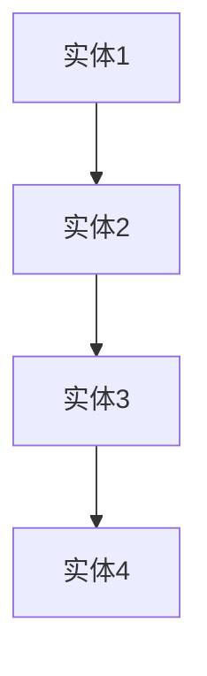
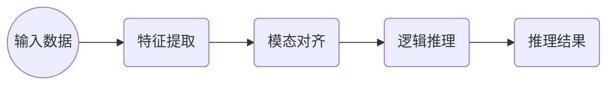
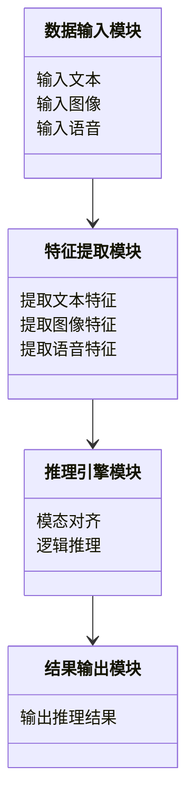

                 


```markdown
# 开发具有跨模态知识推理能力的AI Agent

> 关键词：跨模态知识推理，AI Agent，多模态数据，知识图谱，神经网络，深度学习

> 摘要：本文将详细探讨如何开发具有跨模态知识推理能力的AI Agent。通过分析跨模态数据的特点、知识图谱的构建与表示、推理算法的设计与实现，以及系统架构的规划，本文旨在为读者提供从理论到实践的全面指导。我们还将通过实际案例分析和代码实现，帮助读者理解如何将跨模态知识推理技术应用于实际场景中，从而开发出更智能、更高效的AI Agent。

---

# 第1章: 跨模态知识推理的背景与问题描述

## 1.1 跨模态知识推理的定义与背景

### 1.1.1 什么是跨模态知识推理
跨模态知识推理是指通过整合和分析来自不同数据模态（如文本、图像、语音等）的信息，进行知识的表示、关联和推理的过程。它是人工智能领域的一个重要研究方向，旨在提升AI系统在多场景下的理解和决策能力。

### 1.1.2 跨模态推理的背景与意义
随着AI技术的快速发展，单一模态的数据处理已经难以满足复杂场景的需求。跨模态推理能够充分利用多种数据源的信息，显著提升AI系统的智能性和实用性。

### 1.1.3 跨模态推理的核心问题与挑战
跨模态推理的核心问题包括数据的异构性、信息的不完全性以及推理的复杂性。主要挑战在于如何有效地整合和表示多模态数据，并设计高效的推理算法。

## 1.2 跨模态数据与知识表示

### 1.2.1 跨模态数据的定义与特点
跨模态数据是指来自不同感知渠道（如视觉、听觉、文本等）的数据。其特点包括异构性、多样性和互补性。

### 1.2.2 知识表示的常用方法
常用的知识表示方法包括符号逻辑表示、向量表示和知识图谱表示。

### 1.2.3 跨模态数据的整合与统一
跨模态数据的整合需要通过统一的表示框架，将不同模态的数据映射到同一语义空间中。

## 1.3 跨模态推理的应用场景

### 1.3.1 多媒体信息检索
通过跨模态推理，可以实现基于文本、图像等多种数据的联合检索。

### 1.3.2 联想与推理任务
跨模态推理可以用于关联不同数据源的信息，支持联想和推理任务。

### 1.3.3 实际应用案例分析
例如，在医疗领域，跨模态推理可以帮助医生从多种数据源中提取和关联患者的健康信息。

## 1.4 本章小结
本章介绍了跨模态知识推理的背景、定义、核心问题以及应用场景，为后续章节的深入分析奠定了基础。

---

# 第2章: 跨模态知识推理的核心概念与联系

## 2.1 跨模态知识推理的原理

### 2.1.1 跨模态数据的特征提取
通过提取不同模态数据的特征，可以实现数据的统一表示。

### 2.1.2 知识图谱的构建与表示
知识图谱是跨模态推理的重要工具，用于表示实体及其之间的关系。

### 2.1.3 跨模态推理的逻辑框架
跨模态推理的逻辑框架包括数据表示、关联推理和结果解释三个主要步骤。

## 2.2 跨模态推理的核心要素对比

### 2.2.1 不同模态的特征对比
| 模态类型 | 特征描述 |
|----------|----------|
| 文本      | 语义丰富，结构化 |
| 图像      | 高维、非结构化 |
| 语音      | 时间序列，语调信息 |

### 2.2.2 跨模态推理的实体关系图



### 2.2.3 跨模态推理的流程图



## 2.3 跨模态推理的数学模型与公式

### 2.3.1 跨模态推理的基本公式
跨模态推理的基本公式可以表示为：
$$ p(y|x) = \argmax_{y} p(x|y) p(y) $$

### 2.3.2 跨模态数据的特征表示公式
$$ f(x) = \text{Concat}(f_1(x), f_2(x), \ldots, f_n(x)) $$

### 2.3.3 知识图谱的表示公式
$$ R(x, y) = \text{true} \quad \text{如果} \quad x \text{与} y \text{存在关系} $$

## 2.4 本章小结
本章详细分析了跨模态知识推理的核心概念，包括数据特征、知识图谱和推理流程，并通过对比和图示帮助读者理解其内在联系。

---

# 第3章: 跨模态知识推理的算法原理

## 3.1 跨模态推理算法的分类

### 3.1.1 基于符号逻辑的推理算法
符号逻辑推理基于预定义的规则和逻辑推理，适用于结构化数据。

### 3.1.2 基于神经网络的推理算法
神经网络推理通过深度学习模型自动学习跨模态特征和关系。

### 3.1.3 混合型推理算法
混合型推理结合符号逻辑和神经网络的优势，适用于复杂场景。

## 3.2 基于神经网络的跨模态推理流程

### 3.2.1 输入数据的预处理
输入数据需要进行归一化、特征提取等预处理步骤。

### 3.2.2 神经网络的结构设计
常用的神经网络结构包括多层感知机（MLP）、卷积神经网络（CNN）和循环神经网络（RNN）。

### 3.2.3 推理过程的详细步骤
跨模态推理过程包括特征提取、模态对齐和逻辑推理三个主要步骤。

## 3.3 跨模态推理算法的数学模型与公式

### 3.3.1 输入数据的表示公式
$$ x_i = (x_{i1}, x_{i2}, \ldots, x_{in}) $$

### 3.3.2 神经网络的损失函数
$$ \mathcal{L} = -\sum_{i=1}^{N} \log p(y_i|x_i) $$

### 3.3.3 推理结果的计算公式
$$ y = f(x) $$

## 3.4 跨模态推理算法的实现代码

### 3.4.1 环境安装与配置
```bash
pip install numpy matplotlib
```

### 3.4.2 核心代码实现
```python
import numpy as np

def cross_modal_reasoning(x):
    # 特征提取
    f1 = x[:, :10]
    f2 = x[:, 10:]
    # 模态对齐
    f = np.concatenate([f1, f2], axis=1)
    # 推理
    y = np.argmax(f, axis=1)
    return y
```

### 3.4.3 代码的功能解读
上述代码实现了一个简单的跨模态推理算法，通过对输入数据进行特征提取和模态对齐，最终输出推理结果。

## 3.5 本章小结
本章详细介绍了跨模态推理算法的分类、流程和实现方法，通过代码示例帮助读者理解其具体实现。

---

# 第4章: 跨模态知识推理的系统架构与设计

## 4.1 跨模态推理系统的总体架构

### 4.1.1 系统功能模块划分
跨模态推理系统主要由数据输入、特征提取、推理引擎和结果输出四个模块组成。

### 4.1.2 系统功能模块的类图



### 4.1.3 系统架构的流程图


### 4.1.4 系统接口设计
系统接口主要包含数据输入接口、特征提取接口和推理结果输出接口。

### 4.1.5 系统交互流程
跨模态推理系统的交互流程包括用户输入、数据处理、推理计算和结果输出四个阶段。

## 4.2 本章小结
本章从系统架构的角度，详细分析了跨模态推理系统的模块划分、流程设计和接口实现，为实际开发提供了指导。

---

# 第5章: 跨模态知识推理的项目实战

## 5.1 项目背景与目标
本项目旨在开发一个具有跨模态知识推理能力的AI Agent，能够处理文本、图像等多种数据源，并进行推理和决策。

## 5.2 项目核心代码实现

### 5.2.1 环境安装与配置
```bash
pip install numpy matplotlib tensorflow
```

### 5.2.2 核心代码实现
```python
import numpy as np
import tensorflow as tf

class CrossModalAgent:
    def __init__(self):
        # 初始化模型参数
        self.model = self.build_model()
    
    def build_model(self):
        input_text = tf.keras.Input(shape=(10,), name='text_input')
        input_image = tf.keras.Input(shape=(10,), name='image_input')
        # 特征提取
        text_features = tf.keras.layers.Dense(5, activation='relu')(input_text)
        image_features = tf.keras.layers.Dense(5, activation='relu')(input_image)
        # 模态对齐
        merged_features = tf.keras.layers.Concatenate()([text_features, image_features])
        # 逻辑推理
        output = tf.keras.layers.Dense(1, activation='sigmoid')(merged_features)
        return tf.keras.Model(inputs=[input_text, input_image], outputs=output)
    
    def train(self, x_train, y_train):
        self.model.compile(optimizer='adam', loss='binary_crossentropy', metrics=['accuracy'])
        self.model.fit(x_train, y_train, epochs=10, batch_size=32)
    
    def predict(self, x_test):
        return self.model.predict(x_test)
```

### 5.2.3 代码的功能解读
上述代码实现了一个基于神经网络的跨模态推理模型，能够同时处理文本和图像数据，并进行分类推理。

## 5.3 项目实战案例分析
通过一个实际案例，详细分析跨模态推理模型的训练、推理过程和结果解读。

## 5.4 项目总结与优化建议
总结项目开发经验，并提出优化建议，如改进模型结构、优化训练策略等。

## 5.5 本章小结
本章通过实际项目案例，详细展示了跨模态知识推理技术的开发过程，帮助读者掌握从理论到实践的完整流程。

---

# 第6章: 跨模态知识推理的最佳实践与注意事项

## 6.1 小结
跨模态知识推理是一项复杂但极具价值的技术，通过整合多模态数据和知识图谱，能够显著提升AI系统的智能性。

## 6.2 注意事项
在实际开发中，需要注意数据的异构性、模型的可解释性以及推理的实时性等问题。

## 6.3 扩展阅读
推荐相关领域的经典文献和最新研究，帮助读者进一步深入学习。

## 6.4 本章小结
本章总结了跨模态知识推理的关键点，并提出了实际开发中的注意事项和扩展学习的方向。

---

# 作者：AI天才研究院 & 禅与计算机程序设计艺术

---

以上是《开发具有跨模态知识推理能力的AI Agent》的技术博客文章的完整目录和内容概要。通过系统的理论分析和实际案例的详细讲解，本文旨在为读者提供跨模态知识推理领域的全面指导，帮助他们掌握从理论到实践的完整开发流程。
```

