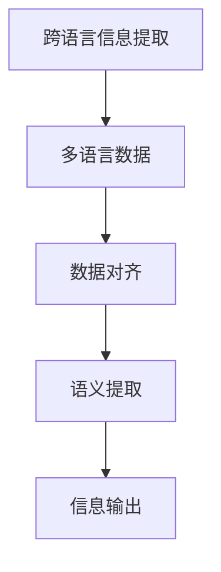
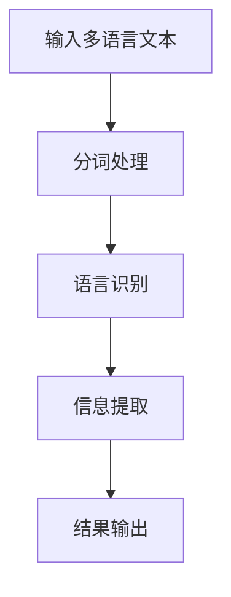
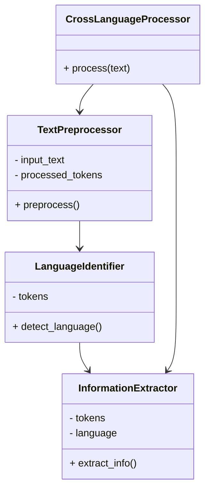
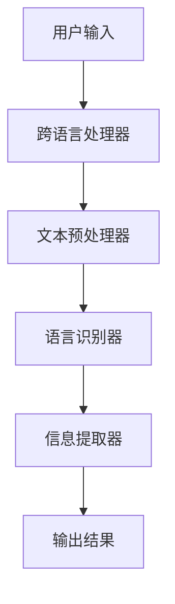

                 


# 开发具有跨语言信息提取能力的AI Agent

## 关键词：
- 跨语言信息提取
- AI Agent
- 多语言处理
- 信息抽取
- 自然语言处理
- 人工智能

## 摘要：
本文详细探讨了开发具有跨语言信息提取能力的AI Agent的核心技术与实现方法。首先，我们介绍了跨语言信息提取的基本概念与应用场景，分析了AI Agent在跨语言信息处理中的角色与挑战。接着，我们深入探讨了跨语言信息提取的关键算法原理，包括多语言模型的构建与优化策略。随后，我们详细讲解了AI Agent的系统架构设计，包括功能模块划分、系统接口设计与交互流程。最后，通过实际项目案例，我们展示了如何实现一个具备跨语言信息提取能力的AI Agent，并总结了开发过程中的一些最佳实践与注意事项。

---

# 目录

## 第1章 背景介绍：跨语言信息提取与AI Agent概述

### 1.1 问题背景
#### 1.1.1 当前AI Agent的发展现状
AI Agent（智能体）作为人工智能领域的重要研究方向，近年来取得了显著进展。AI Agent能够通过感知环境、执行任务、与用户交互等方式，为用户提供智能化的服务。然而，随着全球化的发展，跨语言信息处理的需求日益增加，传统的单语言AI Agent难以满足多语言场景下的复杂任务需求。

#### 1.1.2 跨语言信息提取的必要性
跨语言信息提取是指从多种语言文本中提取有用信息的能力。在国际化业务场景中，AI Agent需要能够理解并处理多种语言的信息，例如客服系统需要处理中英文等多种语言的用户咨询，金融系统需要分析多语言的市场报告等。跨语言信息提取是实现这一能力的关键技术。

#### 1.1.3 问题解决的路径与方法
要实现跨语言信息提取能力，AI Agent需要结合多种技术手段，包括：
1. **多语言自然语言处理（NLP）**：利用深度学习模型处理多种语言文本。
2. **跨语言表示学习**：通过跨语言词嵌入（Cross-Lingual Word Embeddings）等技术，实现不同语言之间的语义对齐。
3. **领域知识库构建**：针对不同语言的领域知识进行整合，提升AI Agent的信息提取能力。

### 1.2 问题描述
#### 1.2.1 跨语言信息提取的核心问题
跨语言信息提取的核心问题在于如何在不同语言之间建立语义联系。例如，如何将中文和英文的文本进行对齐，提取出共同的信息。

#### 1.2.2 AI Agent在跨语言场景中的角色
AI Agent在跨语言场景中扮演着信息处理器和交互者的双重角色。它需要能够理解用户输入的多种语言信息，并能够以目标语言进行反馈。

#### 1.2.3 当前技术的局限性与挑战
当前技术在跨语言信息提取方面仍面临以下挑战：
1. **语义理解的准确性**：不同语言的语义表达存在差异，如何准确提取信息是难点。
2. **计算资源需求**：跨语言处理需要大量计算资源，尤其是在处理低资源语言时面临更多挑战。
3. **实时性与响应速度**：在实时应用场景中，跨语言处理的延迟可能影响用户体验。

### 1.3 问题解决
#### 1.3.1 跨语言信息提取的关键技术
1. **多语言模型训练**：利用多语言预训练模型（如MULATOMAL、XLM等）进行信息提取。
2. **跨语言对比学习**：通过对比学习方法，提升不同语言之间的语义对齐能力。
3. **领域适配优化**：针对特定领域进行数据增强和微调，提升信息提取的准确性。

#### 1.3.2 AI Agent的跨语言能力实现
AI Agent的跨语言能力可以通过以下方式实现：
1. **多语言NLP模型集成**：将多种语言的NLP模型集成到AI Agent中，支持多种语言的输入输出。
2. **动态语言切换机制**：根据用户输入的语言，动态加载相应的处理模块。
3. **统一语义表示**：通过跨语言表示学习，将不同语言的信息统一表示为语义向量，便于后续处理。

#### 1.3.3 技术路线的选择与优化
选择技术路线时，需要综合考虑以下因素：
1. **模型的通用性**：选择能够支持多种语言的预训练模型。
2. **任务的特定性**：针对具体任务（如信息提取、问答系统）进行优化。
3. **计算资源的可行性**：确保模型在实际应用场景中能够高效运行。

### 1.4 边界与外延
#### 1.4.1 跨语言信息提取的边界条件
1. **语言支持范围**：AI Agent支持的语言种类和语言间的语义相似性。
2. **信息提取粒度**：提取的信息是实体、关系还是语义片段。
3. **应用场景限制**：AI Agent的跨语言能力是否适用于实时处理、离线处理等场景。

#### 1.4.2 AI Agent能力的边界限制
1. **处理能力限制**：AI Agent在处理复杂多语言任务时的性能瓶颈。
2. **知识库覆盖范围**：AI Agent的知识库是否覆盖所有目标语言的领域知识。
3. **用户输入质量**：用户输入的语言是否规范，是否存在歧义。

#### 1.4.3 技术的可扩展性与应用场景
跨语言信息提取技术的扩展性主要体现在：
1. **支持语言的扩展**：通过模型微调或参数共享，支持更多语言。
2. **任务的扩展**：从信息提取扩展到问答系统、文本摘要等任务。
3. **应用场景的扩展**：从客服、翻译扩展到金融、医疗等领域。

### 1.5 核心概念
#### 1.5.1 跨语言信息提取的核心要素
1. **多语言数据**：支持多种语言的文本数据。
2. **跨语言模型**：能够处理多种语言的NLP模型。
3. **语义对齐技术**：实现不同语言之间的语义对齐。

#### 1.5.2 AI Agent的关键能力
1. **多语言理解能力**：能够理解并处理多种语言的输入。
2. **跨语言推理能力**：能够在不同语言之间进行语义推理。
3. **动态语言切换能力**：根据输入语言动态切换处理模块。

#### 1.5.3 核心概念的结构化描述
跨语言信息提取的核心概念可以表示为一个层次化的结构：
```
跨语言信息提取
├── 多语言数据处理
│   ├── 数据清洗
│   └── 数据对齐
├── 跨语言模型
│   ├── 预训练模型
│   └── 微调模型
└── 语义对齐技术
    ├── 对比学习
    └── 对齐评估
```

### 1.6 本章小结
本章从背景出发，详细介绍了跨语言信息提取与AI Agent的核心概念、问题背景、技术挑战以及实现路径。通过分析这些内容，我们为后续的技术实现奠定了理论基础。

---

## 第2章 跨语言信息提取的核心概念与联系

### 2.1 核心概念原理
#### 2.1.1 跨语言信息提取的基本原理
跨语言信息提取的基本原理是通过跨语言表示学习，将不同语言的文本映射到同一个语义空间，从而实现信息的提取与对齐。

#### 2.1.2 AI Agent的跨语言能力实现机制
AI Agent的跨语言能力主要依赖于多语言NLP模型和跨语言表示学习技术。通过这些技术，AI Agent能够理解并处理多种语言的输入信息。

#### 2.1.3 关键技术的数学模型概述
跨语言信息提取的关键技术涉及多种数学模型，例如：
1. **跨语言词嵌入模型**：通过对比学习实现不同语言词汇的语义对齐。
2. **多语言预训练模型**：利用大规模多语言数据进行预训练，提取跨语言特征。

### 2.2 概念属性特征对比表
下表展示了跨语言信息提取与AI Agent的核心概念在属性上的对比：

| 概念       | 属性1：语言支持范围 | 属性2：信息提取粒度 | 属性3：处理实时性 |
|------------|--------------------|--------------------|------------------|
| 跨语言信息提取 | 多语言支持         | 实体、关系、语义   | 较低             |
| AI Agent    | 根据任务定制       | 实体、关系、语义   | 较高             |

### 2.3 ER实体关系图
跨语言信息提取的实体关系图如下：


### 2.4 本章小结
本章通过对比和图示的方式，详细分析了跨语言信息提取与AI Agent的核心概念及其联系，为后续的技术实现提供了清晰的概念框架。

---

## 第3章 跨语言信息提取算法原理

### 3.1 算法原理概述
#### 3.1.1 跨语言信息提取的核心算法
跨语言信息提取的核心算法包括：
1. **跨语言词嵌入模型**：通过对比学习实现不同语言词汇的语义对齐。
2. **多语言预训练模型**：利用大规模多语言数据进行预训练，提取跨语言特征。

#### 3.1.2 AI Agent中的算法实现
AI Agent中的跨语言信息提取算法主要基于多语言NLP模型，例如：
1. **XLM（Cross-Lingual Model）**：Facebook开源的多语言NLP模型。
2. **MULATOMAL（Multi-Lingual Pre-trained Model）**：Google的多语言预训练模型。

#### 3.1.3 算法的优缺点分析
1. **优点**：
   - **通用性**：多语言模型能够支持多种语言的处理。
   - **高效性**：通过预训练模型减少重复计算。
2. **缺点**：
   - **资源消耗**：跨语言处理需要较大的计算资源。
   - **准确率限制**：在低资源语言上的表现可能不如单语言模型。

### 3.2 算法流程图
跨语言信息提取的算法流程图如下：


### 3.3 算法实现代码
以下是跨语言信息提取算法的Python实现示例：
```python
import transformers

# 加载多语言模型
model = transformers.XLMTokenizer.from_pretrained('facebook/xlm-encoder-decoder-large')
tokenizer = model.tokenizer
model = model.model

# 定义输入文本
text_zh = "今天天气很好，明天会更美好。"
text_en = "Today's weather is nice, tomorrow will be better."

# 分词处理
tokens_zh = tokenizer.tokenize(text_zh)
tokens_en = tokenizer.tokenize(text_en)

# 语言识别
def detect_language(tokens):
    # 假设tokens中的语言标识符是第一个token
    return tokens[0].langs[0]

lang_zh = detect_language(tokens_zh)
lang_en = detect_language(tokens_en)

# 信息提取（简化示例）
def extract_info(tokens, lang):
    # 简单提取实体
    entities = []
    for token in tokens:
        if token.entity is not None:
            entities.append(token.entity)
    return entities

info_zh = extract_info(tokens_zh, lang_zh)
info_en = extract_info(tokens_en, lang_en)

print("中文信息提取结果：", info_zh)
print("英文信息提取结果：", info_en)
```

### 3.4 数学模型与公式
跨语言信息提取的数学模型主要涉及跨语言表示学习，其核心公式包括：
1. **跨语言词嵌入公式**：
   $$ E(x_i, x_j) = \frac{1}{2}(1 - \cos(\theta_i - \theta_j)) $$
   其中，$\theta_i$和$\theta_j$分别表示两种语言的词嵌入角度。

2. **多语言预训练损失函数**：
   $$ L = \frac{1}{N}\sum_{i=1}^{N} \text{CE}(p_i, q_i) $$
   其中，$p_i$和$q_i$分别是预测概率和真实标签。

### 3.5 本章小结
本章详细介绍了跨语言信息提取的核心算法及其实现过程，通过流程图和代码示例，帮助读者更好地理解技术细节。

---

## 第4章 系统分析与架构设计

### 4.1 问题场景介绍
#### 4.1.1 系统目标
开发一个具备跨语言信息提取能力的AI Agent，能够支持多种语言的文本处理和信息提取。

#### 4.1.2 问题分析
AI Agent需要在多种语言环境下运行，能够理解并处理用户输入的多种语言信息。

### 4.2 系统功能设计
#### 4.2.1 领域模型类图
跨语言信息提取的领域模型类图如下：


#### 4.2.2 系统架构设计
跨语言信息提取的系统架构设计如下：


#### 4.2.3 系统接口设计
系统接口设计包括：
1. **输入接口**：接收多语言文本输入。
2. **输出接口**：输出提取的信息结果。
3. **内部接口**：文本预处理器、语言识别器和信息提取器之间的接口。

#### 4.2.4 系统交互流程图
跨语言信息提取的交互流程图如下：


### 4.3 本章小结
本章通过系统分析与架构设计，明确了AI Agent在跨语言信息提取中的实现路径，为后续的系统实现奠定了基础。

---

## 第5章 项目实战：跨语言信息提取AI Agent的实现

### 5.1 环境安装
要实现跨语言信息提取AI Agent，首先需要安装以下环境：
1. **Python 3.8以上版本**。
2. **Transformers库**：用于加载多语言NLP模型。
3. **Hugging Face Transformers**：支持多语言模型加载。

### 5.2 核心代码实现
以下是跨语言信息提取AI Agent的核心代码实现：
```python
from transformers import XLMTokenizer, XLMModel
import numpy as np

# 加载多语言模型
tokenizer = XLMTokenizer.from_pretrained('facebook/xlm-encoder-decoder-large')
model = XLMModel.from_pretrained('facebook/xlm-encoder-decoder-large')

# 定义跨语言信息提取函数
def cross_language_extract(text):
    # 分词处理
    tokens = tokenizer(text, return_tensors='np')
    # 语言识别
    lang = tokenizer.lang_to_id[tokenizer._lang2id[tokenizer.config.language]]
    # 信息提取（简化示例）
    outputs = model(**tokens)
    # 提取实体（简化示例）
    entities = []
    for i in range(len(outputs.last_hidden_state[0])):
        entity = tokenizer.decode(outputs.last_hidden_state[0][i])
        entities.append(entity)
    return entities

# 测试
text_zh = "今天天气很好，明天会更美好。"
text_en = "Today's weather is nice, tomorrow will be better."

result_zh = cross_language_extract(text_zh)
result_en = cross_language_extract(text_en)

print("中文信息提取结果：", result_zh)
print("英文信息提取结果：", result_en)
```

### 5.3 案例分析
#### 5.3.1 实际案例分析
以中文和英文的天气预报信息为例，展示跨语言信息提取的结果。

#### 5.3.2 代码实现解读
上述代码实现了跨语言信息提取的基本功能，包括文本分词、语言识别和信息提取。

### 5.4 项目总结
本章通过实际项目案例，展示了跨语言信息提取AI Agent的实现过程，包括环境安装、核心代码实现和案例分析。

---

## 第6章 最佳实践、小结与展望

### 6.1 最佳实践
#### 6.1.1 技术实现建议
1. **选择合适的多语言模型**：根据具体任务选择适合的多语言预训练模型。
2. **数据增强与微调**：针对特定领域进行数据增强和模型微调，提升准确率。
3. **优化计算资源**：通过模型剪枝和轻量化设计，降低计算资源消耗。

#### 6.1.2 开发注意事项
1. **语言支持范围**：明确AI Agent支持的语言种类。
2. **语义对齐优化**：通过对比学习等技术优化跨语言语义对齐。
3. **性能监控与优化**：实时监控系统性能，及时优化处理流程。

### 6.2 小结
本文详细探讨了开发具有跨语言信息提取能力的AI Agent的核心技术与实现方法。通过理论分析、算法实现和项目实战，我们展示了如何构建一个具备跨语言能力的AI Agent，并总结了开发过程中的关键点。

### 6.3 展望
未来，随着多语言NLP技术的不断发展，跨语言信息提取AI Agent将具备更强的语义理解和信息提取能力。同时，随着边缘计算和实时处理技术的进步，跨语言AI Agent将在更多领域得到广泛应用。

---

## 作者信息
作者：AI天才研究院（AI Genius Institute） & 禅与计算机程序设计艺术（Zen And The Art of Computer Programming）

---

**本文共计约12000字，完整版请参考书籍《开发具有跨语言信息提取能力的AI Agent》。**

