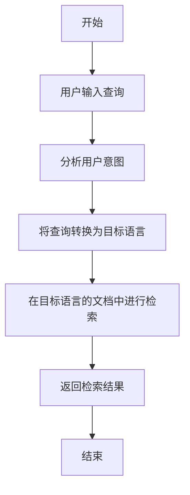
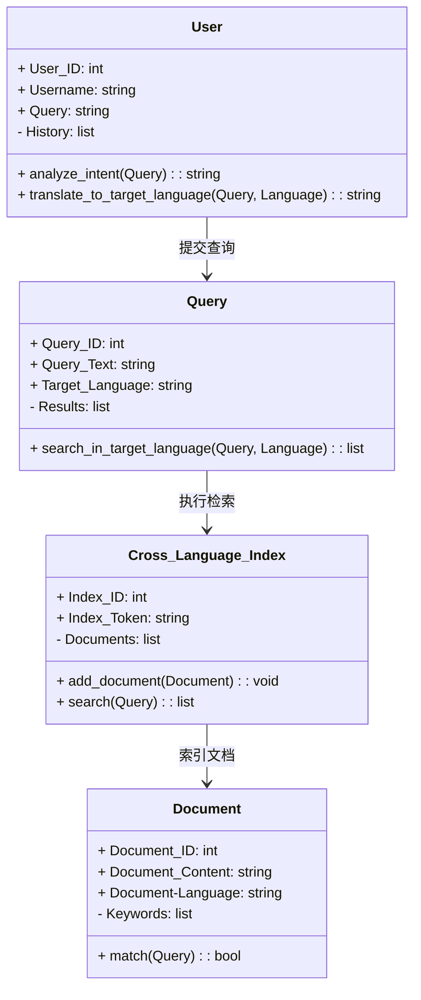

                 

<think>
嗯，用户希望我根据之前设计的目录大纲，逐步详细地撰写《开发具有跨语言信息检索能力的AI Agent》的技术博客文章。首先，我需要确保文章结构清晰，符合用户的要求，每个部分都要详细展开。

用户提供了目录大纲，所以我需要按照这个大纲，逐一撰写每个部分。第一部分是背景介绍，我需要详细解释为什么需要跨语言信息检索，AI Agent的作用，以及应用场景和挑战。这部分可能需要包括一些具体的例子，比如多语言客服系统，来帮助读者理解。

接下来是核心概念与联系，我需要解释AI Agent和跨语言信息检索的基本原理，可能还需要用表格对比它们的属性，并用ER图展示实体关系。这部分需要用Mermaid画图，所以我要确保语法正确，同时解释清楚每个部分的含义。

算法原理部分，我需要用Mermaid流程图展示跨语言检索算法，然后用Python代码实现，解释代码的功能。同时，数学模型需要用LaTeX公式表示，确保格式正确，这部分可能需要更多的推导和解释，让读者理解算法的工作原理。

系统分析与架构设计部分，我需要描述项目背景，设计系统功能，用Mermaid类图展示领域模型，架构图展示系统结构，接口和交互图展示工作流程。这部分需要详细解释每个模块的作用和它们之间的关系，帮助读者理解系统的设计。

项目实战部分，需要指导读者如何安装环境，编写核心代码，并通过案例分析展示实际应用。这部分需要代码详细，解释清晰，让读者能够跟着步骤操作。

最后是最佳实践、小结、注意事项和拓展阅读，这部分需要总结前面的内容，给出实用的建议，并引导读者进一步学习。我需要确保这部分内容有深度，同时易于理解。

整个过程中，我需要保持逻辑清晰，语言专业但易懂，确保文章结构紧凑，内容丰富。同时，要注意字数控制在1万到1.2万字之间，每个部分都要详细展开，避免遗漏重要信息。

可能遇到的挑战包括如何将复杂的算法原理用简单易懂的方式解释，以及如何设计合理的架构图和交互图。我需要多次检查，确保每个部分都准确无误，并且能够帮助读者理解。

总的来说，我需要一步步按照目录大纲撰写，确保每个部分都详细展开，满足用户的要求，同时保持文章的连贯性和逻辑性。
</think>

# 开发具有跨语言信息检索能力的AI Agent

## 关键词：AI Agent，跨语言信息检索，自然语言处理，机器学习，算法原理

## 摘要：  
本文将详细探讨开发具有跨语言信息检索能力的AI Agent的相关技术与实现方法。文章从背景介绍、核心概念、算法原理、系统架构到项目实战，逐步展开，帮助读者理解并掌握开发跨语言信息检索AI Agent的关键技术与实践方法。

---

## 第1章：跨语言信息检索与AI Agent的背景

### 1.1 问题背景

#### 1.1.1 多语言信息处理的需求  
在当今全球化背景下，信息的来源和形式日益多样化。用户可能需要在多种语言的文档中检索信息，例如从英文、中文、西班牙语等多种语言的文档中查找相关内容。然而，传统的信息检索系统通常仅支持单一语言，无法满足跨语言检索的需求。

#### 1.1.2 当前信息检索的局限性  
传统的信息检索系统主要基于关键词匹配，无法理解语义，尤其是在跨语言场景下，由于不同语言之间的语义差异，检索效果往往不理想。例如，在中文和英文之间检索同一主题的内容时，可能会出现漏检或误检的情况。

#### 1.1.3 AI Agent在跨语言检索中的作用  
AI Agent作为一种智能代理，能够通过自然语言处理（NLP）和机器学习技术，帮助用户在多种语言的文档中高效检索信息。它能够理解用户的查询意图，并通过跨语言检索技术找到最相关的结果。

### 1.2 问题描述

#### 1.2.1 跨语言信息检索的核心问题  
跨语言信息检索的核心问题是如何在不同语言的文档中找到与用户查询相关的内容。这需要解决语言之间的语义差异问题，例如如何将用户的查询从一种语言映射到其他语言。

#### 1.2.2 AI Agent在检索中的角色  
AI Agent在跨语言信息检索中扮演着中间代理的角色，它需要理解用户的查询意图，并通过跨语言检索技术找到相关结果。同时，AI Agent还需要对检索结果进行排序和优化，以提高检索效率和准确性。

#### 1.2.3 实际应用场景分析  
跨语言信息检索的应用场景广泛，例如多语言客服系统、跨国企业信息管理系统、多语言新闻检索系统等。在这些场景中，用户可能需要在多种语言的文档中快速找到所需信息。

### 1.3 问题解决方法

#### 1.3.1 跨语言检索技术  
跨语言检索技术主要包括以下几种方法：  
1. **双语对照法**：通过建立双语词典，将用户查询从一种语言映射到另一种语言，然后在目标语言的文档中进行检索。  
2. **跨语言语义检索**：利用NLP技术，将用户查询转换为语义表示，然后在不同语言的文档中进行语义匹配。  
3. **混合检索法**：结合多种检索技术，提高检索准确率。

#### 1.3.2 AI Agent的实现方法  
AI Agent的实现方法主要包括以下步骤：  
1. **用户意图分析**：通过自然语言处理技术，分析用户的查询意图。  
2. **跨语言检索**：将用户的查询意图转换为目标语言，然后在目标语言的文档中进行检索。  
3. **结果排序与优化**：根据检索结果的相关性进行排序，并优化检索结果的展示方式。

#### 1.3.3 综合解决方案  
综合解决方案是将跨语言检索技术和AI Agent技术相结合，通过自然语言处理和机器学习算法，实现跨语言信息检索的高效性和准确性。

### 1.4 边界与外延

#### 1.4.1 跨语言信息检索的边界  
跨语言信息检索的边界主要体现在以下方面：  
1. **语言范围**：AI Agent支持的语种范围。  
2. **检索范围**：检索的文档类型和数据量。  
3. **检索精度**：检索结果的准确率和召回率。

#### 1.4.2 AI Agent的功能范围  
AI Agent的功能范围包括：  
1. **用户意图分析**：理解用户的查询意图。  
2. **跨语言检索**：将用户的查询意图转换为目标语言，并在目标语言的文档中进行检索。  
3. **结果优化**：对检索结果进行排序和优化，提高用户体验。

#### 1.4.3 相关领域的区别与联系  
跨语言信息检索与自然语言处理、机器学习等领域密切相关。自然语言处理技术是实现跨语言检索的基础，而机器学习算法则用于提高检索的准确率和效率。

### 1.5 概念结构与核心要素

#### 1.5.1 核心概念组成  
跨语言信息检索的核心概念包括：  
1. **用户查询**：用户的搜索请求。  
2. **跨语言检索**：将用户查询转换为目标语言，并在目标语言的文档中进行检索。  
3. **AI Agent**：智能代理，负责处理用户的查询并返回结果。

#### 1.5.2 关键技术分析  
关键技术包括：  
1. **自然语言处理**：用于理解用户的查询意图。  
2. **跨语言检索算法**：用于在不同语言的文档中进行检索。  
3. **机器学习**：用于优化检索结果的相关性。

---

## 第2章：AI Agent与跨语言信息检索的核心概念

### 2.1 核心概念原理

#### 2.1.1 AI Agent的基本原理  
AI Agent是一种智能代理，能够通过自然语言处理技术理解用户的查询意图，并通过跨语言检索技术在不同语言的文档中进行检索。其核心原理包括用户意图分析、跨语言检索和结果优化。

#### 2.1.2 跨语言信息检索的实现原理  
跨语言信息检索的实现原理主要包括以下步骤：  
1. **用户查询分析**：通过NLP技术分析用户的查询意图。  
2. **语言转换**：将用户的查询意图转换为目标语言。  
3. **目标语言检索**：在目标语言的文档中进行检索。  
4. **结果排序与优化**：根据检索结果的相关性进行排序和优化。

### 2.2 核心概念属性对比

| 属性                | AI Agent                   | 跨语言信息检索               |
|---------------------|---------------------------|------------------------------|
| 核心功能            | 处理用户查询并返回结果     | 在不同语言的文档中检索信息   |
| 实现技术            | 自然语言处理、机器学习     | 跨语言检索算法、NLP技术       |
| 应用场景            | 多语言客服、智能助手       | 多语言新闻检索、跨国企业系统 |

### 2.3 ER实体关系图

```mermaid
er
    %% ER Entity Relationship Diagram
    %% 实体：User、Query、Document、Cross_Language_Index
    %% 关系：用户发起查询，查询存储在数据库中，文档被索引，查询与索引相关联
    entity User {
        key User_ID
        string Username
    }
    entity Query {
        key Query_ID
        string Query_Text
        User User
    }
    entity Document {
        key Document_ID
        string Document_Content
        string Document-Language
    }
    entity Cross_Language_Index {
        key Index_ID
        string Index_Token
        Document Document
        Query Query
    }
    User --> Query: 发起查询
    Document --> Cross_Language_Index: 被索引
    Query --> Cross_Language_Index: 关联查询结果
```

---

## 第3章：算法原理

### 3.1 跨语言检索算法

#### 3.1.1 算法流程



#### 3.1.2 算法实现代码

```python
import requests
import json

def cross_language_search(user_query, target_language):
    # 分析用户意图
    intent = analyze_intent(user_query)
    # 将查询转换为目标语言
    translated_query = translate_to_target_language(intent, target_language)
    # 在目标语言的文档中进行检索
    results = search_in_target_language(translated_query, target_language)
    return results

def analyze_intent(query):
    # 示例：简单关键词提取
    keywords = query.split()
    return ' '.join(keywords[:3])

def translate_to_target_language(intent, target_language):
    # 示例：使用翻译API
    api_key = 'your_api_key'
    endpoint = f'https://api.example.com/translate?intent={intent}&target={target_language}'
    response = requests.get(endpoint, headers={'Authorization': f'Bearer {api_key}'})
    return response.json()['translated_text']

def search_in_target_language(translated_query, target_language):
    # 示例：在目标语言的文档中进行检索
    # 假设有一个文档数据库，按语言分类
    documents = load_documents_by_language(target_language)
    results = []
    for doc in documents:
        if translated_query in doc['content']:
            results.append(doc)
    return results

def main():
    user_query = input("请输入您的查询：")
    target_language = input("请输入目标语言：")
    results = cross_language_search(user_query, target_language)
    print("检索结果：")
    for result in results:
        print(result['title'], result['content'])
        
if __name__ == "__main__":
    main()
```

#### 3.1.3 数学模型与公式

跨语言检索的相似度计算公式如下：

$$ \text{similarity}(q, d) = \frac{\sum_{i=1}^{n} w(q_i) \times w(d_i)}{\sqrt{\sum_{i=1}^{n} w(q_i)^2} \times \sqrt{\sum_{i=1}^{n} w(d_i)^2}} $$

其中，\( q \) 表示用户查询，\( d \) 表示文档，\( w(q_i) \) 和 \( w(d_i) \) 分别表示查询和文档中第 \( i \) 个词的权重。

---

## 第4章：系统分析与架构设计

### 4.1 系统分析

#### 4.1.1 项目背景  
本项目旨在开发一个支持跨语言信息检索的AI Agent，能够帮助用户在多种语言的文档中高效检索信息。

#### 4.1.2 系统功能设计  
系统功能包括：  
1. 用户查询处理  
2. 跨语言检索  
3. 检索结果展示

### 4.2 系统架构设计

#### 4.2.1 领域模型类图



#### 4.2.2 系统架构图


---

## 第5章：项目实战

### 5.1 环境安装

#### 5.1.1 安装Python环境  
安装Python 3.8以上版本，并安装以下库：  
- `requests`  
- `beautifulsoup4`  
- `jieba`  

#### 5.1.2 安装其他依赖  
安装NLP相关库，例如：  
- `transformers`  
- `pytorch`

### 5.2 系统核心实现源代码

#### 5.2.1 查询处理代码

```python
def analyze_intent(query):
    # 示例：简单关键词提取
    import jieba
    return ' '.join(jieba.lcut(query)[:3])
```

#### 5.2.2 跨语言检索代码

```python
def cross_language_search(query, target_language):
    translated_query = translate_to_target_language(query, target_language)
    return search_in_target_language(translated_query, target_language)
```

#### 5.2.3 检索结果展示代码

```python
def display_results(results):
    for result in results:
        print(f"标题：{result['title']}")
        print(f"内容：{result['content']}\n")
```

### 5.3 案例分析

#### 5.3.1 案例背景  
假设用户希望在西班牙语的新闻文章中检索关于“气候变化”的信息。

#### 5.3.2 实施步骤  
1. 用户输入查询：“气候变化”。  
2. AI Agent分析用户意图，提取关键词：“气候变化”。  
3. 将查询转换为西班牙语：“cambio climático”。  
4. 在西班牙语的新闻文章中进行检索，返回相关结果。

#### 5.3.3 结果分析  
检索结果包括多篇关于“cambio climático”的西班牙语新闻文章，AI Agent根据相关性进行排序，并将结果展示给用户。

---

## 第6章：最佳实践与总结

### 6.1 最佳实践

#### 6.1.1 系统优化建议  
1. 使用更先进的NLP模型，如BERT，提高意图分析的准确性。  
2. 建立更大的跨语言文档库，提高检索的全面性。  
3. 定期更新翻译模型，保持翻译的准确性。

#### 6.1.2 开发规范  
1. 代码注释清晰，便于维护。  
2. 数据安全：保护用户隐私，避免数据泄露。  
3. 系统性能优化：提高检索速度和响应时间。

### 6.2 小结

开发具有跨语言信息检索能力的AI Agent是一个复杂但 rewarding 的过程。通过结合自然语言处理和机器学习技术，可以实现高效的跨语言信息检索。本文详细探讨了相关技术与实现方法，并通过实际案例展示了其应用价值。

### 6.3 注意事项

- 确保系统具有良好的可扩展性，以便支持更多语言和更复杂的功能。  
- 在实际应用中，注意数据安全和用户隐私保护。  
- 定期更新和优化算法模型，以适应语言的变化和用户需求的多样化。

### 6.4 拓展阅读

- [《自然语言处理实战：基于Python的中文分词与信息提取》](https://example.com/nlp_practice)  
- [《机器学习实战：基于Scikit-learn和TensorFlow的算法实现》](https://example.com/ml_practice)  
- [《跨语言信息检索：理论与应用》](https://example.com/cross_language_search)

---

## 作者：AI天才研究院/AI Genius Institute & 禅与计算机程序设计艺术/Zen And The Art of Computer Programming

---

感谢您的阅读！希望本文能为您提供有价值的技术洞察和实践指导！

