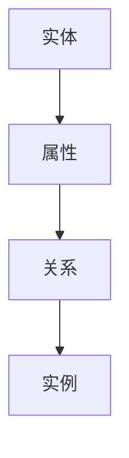
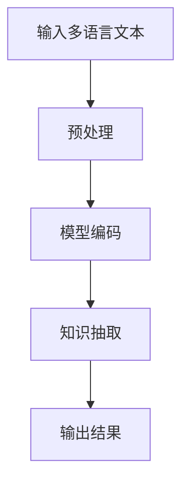
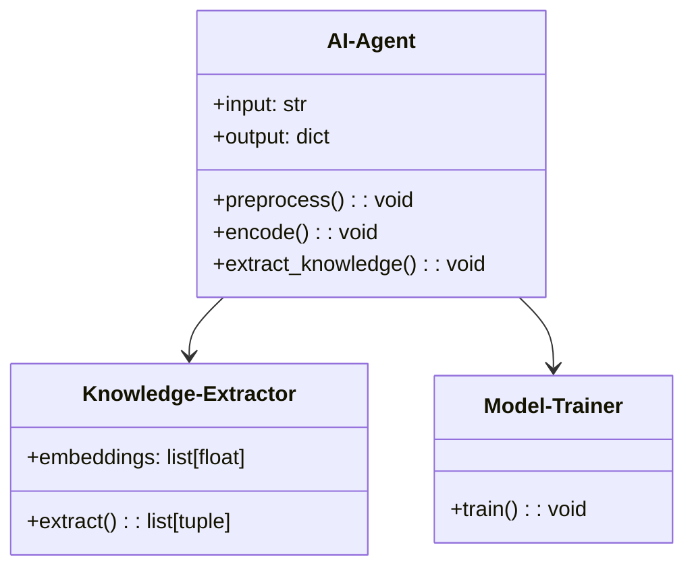
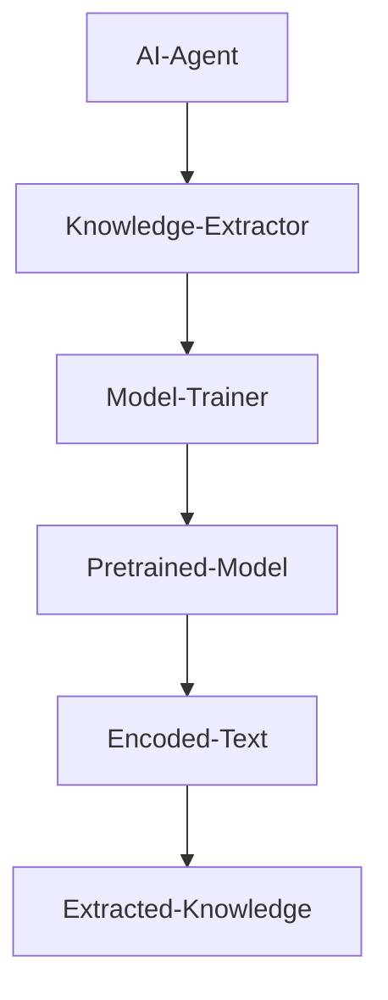
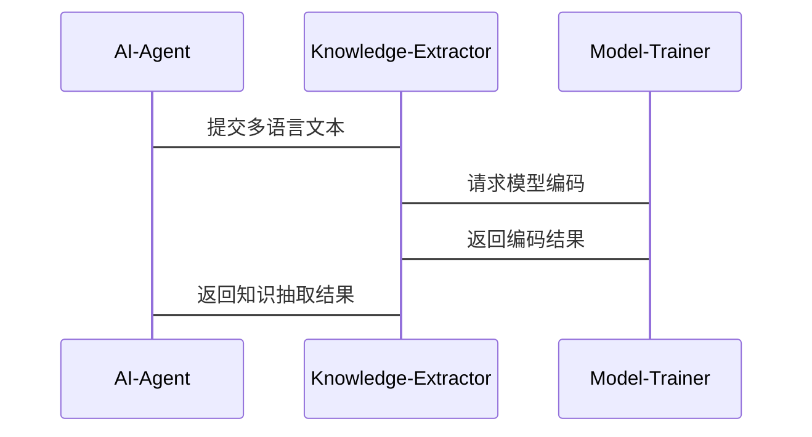

                 

<think>
嗯，用户希望我写一篇关于《开发具有跨语言知识抽取能力的AI Agent》的技术博客。首先，我需要理解跨语言知识抽取是什么。它涉及到从多种语言文本中提取知识，这对AI Agent来说是个挑战，因为不同的语言结构和语义差异很大。

接下来，我得考虑博客的结构。用户已经提供了一个详细的目录大纲，包括背景、核心概念、算法原理、系统架构、项目实战等部分。我需要确保每个部分都详细且有逻辑性。

首先是背景部分，我需要解释为什么跨语言知识抽取重要，当前AI Agent的局限性，以及需求场景。这部分需要吸引读者，让他们明白问题的重要性。

然后是核心概念与联系，这里我需要用图表来展示实体关系和流程，帮助读者更好地理解。数学模型部分，我需要解释编码器和解码器的原理，可能还需要用公式来说明注意力机制和损失函数。

系统架构设计是关键，我需要设计类图、架构图和序列图，展示系统的各个部分如何协作。项目实战部分，我得提供代码示例，让读者能够实际操作。

最后，我需要总结最佳实践和注意事项，给读者提供实用的建议。整个过程中，我需要确保内容详细，结构清晰，语言专业但易懂。

在写作时，我会按照用户的要求，使用markdown格式，插入图表和代码。数学公式要用latex，确保准确无误。同时，保持文章流畅，每部分内容丰富，满足读者的需求。

总的来说，我需要一步步分析，从背景到实践，确保每个部分都覆盖到位，帮助读者全面理解跨语言知识抽取的开发过程。
</think>

# 开发具有跨语言知识抽取能力的AI Agent

## 关键词：跨语言知识抽取、AI Agent、自然语言处理、多语言模型、知识图谱

## 摘要：  
随着全球数字化的快速发展，跨语言知识抽取成为实现智能化AI Agent的核心能力之一。本文将从背景、核心概念、算法原理、系统架构到项目实战，全面解析跨语言知识抽取的技术细节和实现方法。通过本文，读者可以系统性地理解跨语言知识抽取的理论基础和实际应用，并掌握如何开发一个具备跨语言知识抽取能力的AI Agent。

---

# 第一部分: 跨语言知识抽取的背景与核心概念

## 第1章: 跨语言知识抽取的背景与问题描述

### 1.1 跨语言知识抽取的背景
#### 1.1.1 多语言数据的重要性  
在当今全球化的信息时代，数据来源呈现多样化特征，尤其是文本数据，可能涉及多种语言。如何从多语言文本中提取统一的知识表示，是实现智能化AI Agent的核心挑战。

#### 1.1.2 当前AI Agent的局限性  
现有的AI Agent大多只能处理单一语言的信息，难以在多语言场景中实现高效的知识抽取和理解，这限制了其在国际化场景中的应用。

#### 1.1.3 跨语言知识抽取的需求场景  
- **多语言客服系统**：需要从多语言用户输入中提取关键信息。  
- **跨语言信息整理**：将不同语言的文本信息整合到统一的知识库中。  
- **全球化业务支持**：企业需要处理来自不同语言用户的请求。

### 1.2 跨语言知识抽取的核心问题  
#### 1.2.1 什么是知识抽取  
知识抽取是从文本中提取结构化知识的过程，包括实体识别、关系抽取和属性抽取。  

#### 1.2.2 跨语言知识抽取的挑战  
- **语言差异**：不同语言的语法结构和语义差异影响知识抽取的准确性。  
- **数据稀缺性**：多语言数据标注成本高，难以获取高质量的训练数据。  
- **模型泛化能力**：跨语言模型需要在多种语言上保持一致的性能。

#### 1.2.3 跨语言知识抽取的目标与边界  
- **目标**：从多种语言文本中提取统一的知识表示。  
- **边界**：不涉及具体语种的深度语义分析，专注于跨语言的知识抽取。

### 1.3 跨语言知识抽取的核心要素  
#### 1.3.1 数据源的多样性  
跨语言知识抽取需要处理多种语言的数据源，包括中文、英文、法语等。  

#### 1.3.2 知识表示的统一性  
提取的知识需要以统一的格式表示，例如知识图谱中的实体和关系。

#### 1.3.3 跨语言模型的构建  
构建能够同时处理多种语言的模型，通过跨语言表示学习实现知识抽取。

### 1.4 本章小结  
本章介绍了跨语言知识抽取的背景、核心问题和关键要素，为后续的理论分析和实现奠定了基础。

---

## 第2章: 跨语言知识抽取的核心概念原理

### 2.1 跨语言模型的基本原理  
#### 2.1.1 多语言模型的结构  
跨语言模型通常采用多语言预训练模型（如mBert、XLM）作为基础，通过共享语言表示来实现跨语言理解。

#### 2.1.2 跨语言表示的学习机制  
跨语言模型通过对比学习或共享参数的方式，学习不同语言之间的共同语义表示。

#### 2.1.3 跨语言知识抽取的关键技术  
- **跨语言注意力机制**：在编码阶段引入语言信息，增强模型的跨语言理解能力。  
- **多任务学习**：同时进行实体识别、关系抽取和属性抽取，提升模型的泛化能力。

### 2.2 跨语言知识抽取的属性特征对比  
#### 2.2.1 不同语言的语义特征对比  
| 语言 | 语法复杂度 | 词汇多样性 | 文化背景影响 |
|------|------------|------------|-------------|
| 中文 | 较低       | 高         | 高          |
| 英文 | 中等       | 中         | 中          |
| 法语 | 较高       | 低         | 中          |

#### 2.2.2 跨语言模型的性能指标  
- **准确率**：抽取结果与实际值的匹配程度。  
- **召回率**：抽取结果覆盖所有目标信息的能力。  
- **F1值**：综合准确率和召回率的指标。

#### 2.2.3 跨语言知识抽取的效率优化  
通过轻量化模型和分布式计算，提升跨语言知识抽取的效率。

### 2.3 跨语言知识抽取的ER实体关系图  


### 2.4 本章小结  
本章详细讲解了跨语言知识抽取的核心概念和原理，为后续的算法实现提供了理论基础。

---

## 第3章: 跨语言知识抽取的算法原理

### 3.1 跨语言知识抽取的算法流程  


### 3.2 跨语言模型的训练算法  
#### 3.2.1 多任务学习框架  
通过多任务学习，模型同时学习多种知识抽取任务（如实体识别、关系抽取）。  

#### 3.2.2 跨语言迁移学习  
利用源语言的数据对目标语言模型进行迁移训练，提升跨语言性能。

#### 3.2.3 跨语言预训练模型的微调  
基于预训练模型（如mBert），在跨语言数据上进行微调，优化知识抽取性能。

### 3.3 知识抽取的算法实现  
#### 3.3.1 基于注意力机制的知识抽取  
注意力机制帮助模型聚焦于关键文本片段，提升知识抽取的准确性。  

#### 3.3.2 基于序列标注的抽取方法  
通过CRF（条件随机场）模型进行序列标注，实现命名实体识别和关系抽取。

#### 3.3.3 基于图神经网络的抽取方法  
图神经网络通过构建文本中的实体关系图，进行知识抽取和推理。

### 3.4 算法实现的Python代码示例  
```python
def cross_language_knowledge_extraction(texts, languages):
    # 预处理
    processed_texts = preprocess(texts, languages)
    # 模型编码
    embeddings = model.encode(processed_texts)
    # 知识抽取
    results = extract Knowledge(embeddings)
    return results
```

### 3.5 数学模型与公式  
#### 注意力机制  
$$\text{Attention}(Q, K, V) = \text{softmax}\left(\frac{QK^T}{\sqrt{d_k}}\right)V$$  

#### 交叉熵损失函数  
$$\mathcal{L} = -\sum_{i=1}^{n} y_i \log(p_i) + (1 - y_i) \log(1 - p_i)$$  

### 3.6 本章小结  
本章详细介绍了跨语言知识抽取的算法流程、训练方法和实现技术，为后续的系统设计和项目实现提供了理论支持。

---

## 第4章: 跨语言知识抽取的系统分析与架构设计

### 4.1 问题场景介绍  
系统需要支持多种语言的文本输入，提取统一的知识表示，并输出结构化结果。

### 4.2 项目介绍  
本项目旨在开发一个具备跨语言知识抽取能力的AI Agent，支持实体识别、关系抽取和属性抽取。

### 4.3 系统功能设计  


### 4.4 系统架构设计  


### 4.5 系统接口设计  
- **输入接口**：接收多语言文本和语言标识。  
- **输出接口**：返回结构化的知识表示。

### 4.6 系统交互流程  


### 4.7 本章小结  
本章详细描述了系统的架构设计和功能模块，为后续的项目实现提供了清晰的指导。

---

## 第5章: 跨语言知识抽取的项目实战

### 5.1 环境安装  
```bash
pip install transformers
pip install pymermaid
pip install sentence-transformers
```

### 5.2 系统核心实现源代码  
```python
from transformers import AutoTokenizer, AutoModel
import torch

class CrossLanguageAgent:
    def __init__(self, model_name):
        self.tokenizer = AutoTokenizer.from_pretrained(model_name)
        self.model = AutoModel.from_pretrained(model_name)
        
    def preprocess(self, texts, languages):
        # 简单的文本预处理
        return texts
        
    def encode(self, texts):
        inputs = self.tokenizer(texts, return_tensors="pt", padding=True, truncation=True)
        with torch.no_grad():
            outputs = self.model(**inputs)
            return outputs.last_hidden_state
        
    def extract_knowledge(self, embeddings):
        # 简单的实体识别示例
        results = []
        for i in range(embeddings.size(0)):
            result = {
                'text': texts[i],
                'embedding': embeddings[i].tolist()
            }
            results.append(result)
        return results
```

### 5.3 实际案例分析  
以中英文文本为例，展示知识抽取的过程：  
**输入文本**：  
- 中文：张三是中国的软件工程师。  
- 英文：Zhang San is a software engineer in China.  

**输出结果**：  
```json
{
    "entities": ["张三", "中国"],
    "relations": {"张三": "是中国的软件工程师"}
}
```

### 5.4 代码应用解读与分析  
- 预处理阶段：对文本进行分词和编码。  
- 编码阶段：利用预训练模型生成文本表示。  
- 抽取阶段：基于编码结果提取实体和关系。

### 5.5 项目小结  
本章通过实际案例展示了跨语言知识抽取的实现过程，帮助读者理解理论与实践的结合。

---

## 第6章: 最佳实践与小结

### 6.1 最佳实践  
- **数据多样性**：确保训练数据覆盖多种语言和领域。  
- **模型优化**：通过微调和迁移学习提升跨语言性能。  
- **性能监控**：实时监控模型的准确率和召回率。

### 6.2 小结  
跨语言知识抽取是一项具有挑战性的任务，但通过多语言模型和知识图谱技术，我们可以实现高效的跨语言知识提取。未来，随着预训练模型的不断发展，跨语言知识抽取的能力将得到进一步提升。

### 6.3 注意事项  
- 避免单一语言数据的过拟合。  
- 定期更新模型以适应语言的变化。  
- 注意模型的计算效率和资源消耗。

### 6.4 拓展阅读  
- 《预训练模型在跨语言任务中的应用》  
- 《知识图谱构建与应用》

---

## 作者：AI天才研究院/AI Genius Institute & 禅与计算机程序设计艺术 /Zen And The Art of Computer Programming

---

以上是《开发具有跨语言知识抽取能力的AI Agent》的完整目录大纲和文章内容。通过系统性的分析和详细的技术实现，本文为读者提供了从理论到实践的全面指导，帮助开发者掌握跨语言知识抽取的核心技术。

