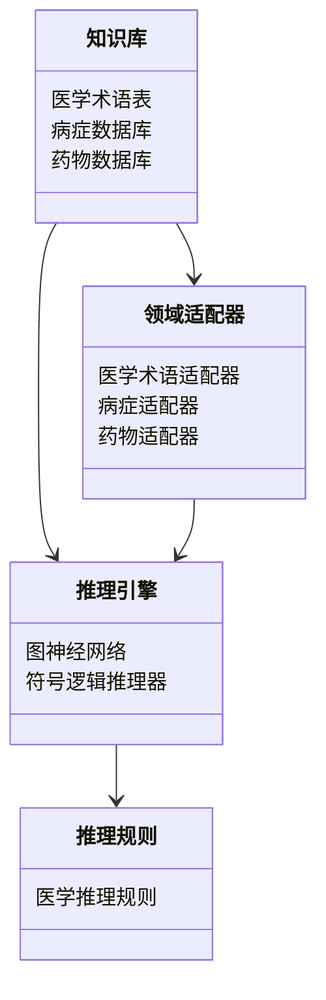
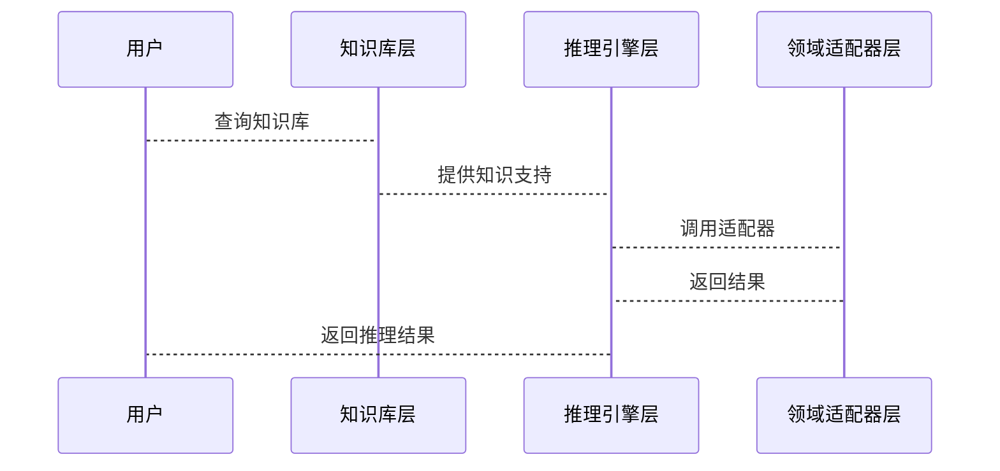

                 


# 开发具有跨领域推理能力的AI Agent

## 关键词：AI Agent，跨领域推理，知识图谱，机器学习，系统架构

## 摘要：  
AI Agent（人工智能代理）是一种能够感知环境、自主决策并执行任务的智能体。开发具有跨领域推理能力的AI Agent，意味着该AI Agent能够理解并整合多个领域的知识，从而在复杂问题上做出更准确的推理和决策。本文将从背景介绍、核心概念、算法原理、系统架构设计、项目实战等方面，详细阐述如何开发具有跨领域推理能力的AI Agent。通过本文，读者将能够掌握跨领域推理的核心原理，了解其实现方法，并通过实际案例学习如何将理论应用于实践。

---

# 第一部分: 背景介绍

## 第1章: 跨领域推理能力的AI Agent背景介绍

### 1.1 问题背景
#### 1.1.1 当前AI技术的局限性
目前，人工智能技术在许多领域取得了显著进展，但大多数AI系统仅擅长单一任务或特定领域的问题。例如，图像识别模型在识别猫和狗方面表现出色，但无法将这种能力扩展到其他领域，如自然语言处理或数据分析。这种“孤岛式”的AI能力限制了其在复杂现实场景中的应用。

#### 1.1.2 跨领域推理能力的重要性
跨领域推理能力是指AI Agent能够将不同领域中的知识、规则和经验整合起来，解决跨领域的问题。例如，在医疗领域，AI Agent需要结合医学知识、患者数据和药物信息，进行诊断和治疗方案推荐。这种能力使得AI Agent能够在复杂场景中提供更全面的解决方案。

#### 1.1.3 跨领域推理能力的应用场景
跨领域推理能力的应用场景包括：
- **医疗领域**：结合医学知识和患者数据，提供个性化的诊断建议。
- **金融领域**：整合市场数据、客户行为和经济指标，进行风险评估和投资建议。
- **教育领域**：根据学生的学习数据和课程内容，提供个性化的教学方案。
- **制造业**：结合生产数据、供应链信息和市场需求，优化生产计划。

### 1.2 问题描述
#### 1.2.1 跨领域推理能力的定义
跨领域推理能力是指AI Agent能够理解、整合和应用多个领域中的知识，从而在复杂问题中做出推理和决策的能力。

#### 1.2.2 跨领域推理能力的核心问题
- **知识整合**：如何将不同领域的知识有效地整合在一起。
- **推理机制**：如何在跨领域知识的基础上进行推理。
- **动态适应**：如何在动态变化的环境中保持推理能力。

#### 1.2.3 跨领域推理能力的实现挑战
- **知识表示**：不同领域的知识具有不同的表示方式，如何统一表示是一个挑战。
- **推理模型**：需要设计能够处理跨领域知识的推理模型。
- **数据融合**：如何将来自不同领域的数据有效地融合在一起。

### 1.3 问题解决
#### 1.3.1 跨领域推理能力的解决方案
- **知识图谱构建**：将不同领域的知识整合到一个统一的知识图谱中。
- **多模态学习**：结合多种数据类型（如文本、图像、数值）进行学习和推理。
- **领域适配器**：设计适配器模块，将不同领域的知识转换为通用格式。

#### 1.3.2 跨领域推理能力的实现方法
- **基于图神经网络的推理**：利用图神经网络处理知识图谱中的关系。
- **基于符号逻辑的推理**：使用符号逻辑进行跨领域知识的推理。
- **基于深度学习的跨领域迁移**：通过迁移学习将一个领域的知识迁移到另一个领域。

#### 1.3.3 跨领域推理能力的优化策略
- **领域知识蒸馏**：将领域知识提取出来，用于其他领域。
- **领域间关系建模**：建立不同领域之间的关系模型，辅助推理。
- **动态知识更新**：根据新数据动态更新知识库。

### 1.4 边界与外延
#### 1.4.1 跨领域推理能力的边界
- **知识范围**：AI Agent的跨领域推理能力仅限于其知识库覆盖的领域。
- **推理深度**：推理深度受到模型复杂性和计算能力的限制。
- **实时性**：跨领域推理可能需要更多的时间和计算资源。

#### 1.4.2 跨领域推理能力的外延
- **多模态推理**：结合文本、图像等多种数据进行推理。
- **实时推理**：在动态变化的环境中进行实时推理。
- **自适应学习**：根据新数据自动调整推理模型。

#### 1.4.3 跨领域推理能力与其他技术的关系
- **与知识图谱的关系**：跨领域推理依赖于知识图谱的构建和应用。
- **与深度学习的关系**：深度学习为跨领域推理提供了强大的模型支持。
- **与符号逻辑的关系**：符号逻辑为跨领域推理提供了推理规则和框架。

### 1.5 概念结构与核心要素组成
#### 1.5.1 跨领域推理能力的概念结构
跨领域推理能力由以下核心要素组成：
1. **知识库**：包含多个领域的知识和数据。
2. **推理引擎**：负责根据知识库进行推理。
3. **领域适配器**：将不同领域的知识转换为通用格式。
4. **推理规则**：定义推理的逻辑和规则。

#### 1.5.2 跨领域推理能力的核心要素
- **知识表示**：如何表示不同领域的知识。
- **推理模型**：如何在跨领域知识上进行推理。
- **领域适配器**：如何将不同领域的知识统一起来。
- **推理规则**：如何定义和应用推理规则。

#### 1.5.3 跨领域推理能力的组成关系
- **知识库与推理引擎**：知识库为推理引擎提供数据支持。
- **领域适配器与知识表示**：领域适配器将不同领域的知识转换为统一的表示形式。
- **推理规则与推理引擎**：推理规则指导推理引擎如何进行推理。

---

# 第二部分: 核心概念与联系

## 第2章: 跨领域推理能力的核心概念与联系

### 2.1 核心概念原理
#### 2.1.1 跨领域推理能力的原理
跨领域推理能力的实现依赖于以下几个关键原理：
1. **知识图谱构建**：将不同领域的知识整合到一个统一的知识图谱中。
2. **多模态学习**：结合多种数据类型进行学习和推理。
3. **领域适配器设计**：将不同领域的知识转换为通用格式，以便推理引擎处理。

#### 2.1.2 跨领域推理能力的实现机制
- **知识表示**：使用统一的符号或图结构表示知识。
- **推理规则**：定义推理的逻辑和规则，指导推理引擎进行推理。
- **领域适配器**：将不同领域的知识转换为通用格式，供推理引擎使用。

#### 2.1.3 跨领域推理能力的核心算法
- **基于图神经网络的推理**：利用图神经网络处理知识图谱中的关系。
- **基于符号逻辑的推理**：使用符号逻辑进行跨领域知识的推理。
- **基于深度学习的跨领域迁移**：通过迁移学习将一个领域的知识迁移到另一个领域。

### 2.2 概念属性特征对比表格
| 概念属性 | 跨领域推理能力 | 单领域推理能力 |
|----------|----------------|----------------|
| 知识范围 | 多个领域        | 单个领域        |
| 推理复杂度 | 高             | 低             |
| 应用场景 | 复杂场景         | 简单场景         |
| 实现难度 | 高             | 低             |

### 2.3 ER实体关系图架构
```mermaid
erd
    左侧：AI Agent
    右侧：知识库、推理引擎、领域适配器、推理规则
    关系：
    AI Agent拥有知识库、推理引擎、领域适配器和推理规则。
```

### 2.4 概念关系分析
- **知识库与推理引擎**：知识库为推理引擎提供数据支持。
- **领域适配器与知识表示**：领域适配器将不同领域的知识转换为统一的表示形式。
- **推理规则与推理引擎**：推理规则指导推理引擎如何进行推理。

---

# 第三部分: 算法原理讲解

## 第3章: 跨领域推理能力的算法原理讲解

### 3.1 基于图神经网络的推理算法
#### 3.1.1 图神经网络的原理
图神经网络是一种处理图结构数据的深度学习模型。它通过聚合节点及其邻居的信息，生成节点的表示向量。这些表示向量可以用于各种推理任务。

#### 3.1.2 图神经网络的数学模型
图神经网络的数学模型可以表示为：
$$
h_v = \sum_{u \in N(v)} w_{vu} \cdot h_u
$$
其中，$h_v$是节点$v$的表示向量，$N(v)$是节点$v$的邻居节点集合，$w_{vu}$是边权重。

#### 3.1.3 图神经网络的应用
图神经网络可以应用于知识图谱的构建和推理。例如，在医疗领域，可以使用图神经网络推理疾病与症状之间的关系。

### 3.2 基于符号逻辑的推理算法
#### 3.2.1 符号逻辑的原理
符号逻辑是一种基于符号和规则的推理方法。它通过定义推理规则，将前提和结论之间的关系表达出来。

#### 3.2.2 符号逻辑的数学模型
符号逻辑的数学模型可以表示为：
$$
\text{如果} \ A \text{且} B \text{，则} C
$$
其中，$A$和$B$是前提，$C$是结论。

#### 3.2.3 符号逻辑的应用
符号逻辑可以应用于法律推理和数学推理。例如，在法律领域，可以使用符号逻辑推理法律条文之间的关系。

### 3.3 基于深度学习的跨领域迁移算法
#### 3.3.1 深度学习的原理
深度学习是一种基于人工神经网络的机器学习方法。它通过多层非线性变换，从输入数据中提取特征。

#### 3.3.2 深度学习的数学模型
深度学习的数学模型可以表示为：
$$
y = f(x) + \epsilon
$$
其中，$x$是输入数据，$y$是输出数据，$f$是深度神经网络模型，$\epsilon$是噪声。

#### 3.3.3 深度学习的应用
深度学习可以应用于图像识别、自然语言处理等领域。例如，在图像识别领域，可以使用深度学习进行跨领域迁移。

---

# 第四部分: 系统分析与架构设计

## 第4章: 跨领域推理能力的系统架构设计

### 4.1 问题场景介绍
在医疗领域，AI Agent需要结合医学知识、患者数据和药物信息，进行诊断和治疗方案推荐。

### 4.2 系统功能设计
#### 4.2.1 领域模型


#### 4.2.2 系统架构


#### 4.2.3 接口设计
- **知识库接口**：提供知识库的访问接口。
- **推理引擎接口**：提供推理引擎的调用接口。
- **领域适配器接口**：提供领域适配器的调用接口。

#### 4.2.4 交互流程


---

# 第五部分: 项目实战

## 第5章: 跨领域推理能力的项目实战

### 5.1 环境安装
- **Python 3.8以上**
- **TensorFlow 2.0以上**
- **NetworkX库**
- **PyYAML库**

### 5.2 系统核心实现源代码
```python
import tensorflow as tf
from tensorflow.keras import layers
import networkx as nx
import yaml

# 定义图神经网络模型
class GNN(tf.keras.Model):
    def __init__(self):
        super(GNN, self).__init__()
        self.gcn_layer = layers.GCN()

    def call(self, inputs):
        return self.gcn_layer(inputs)

# 定义符号逻辑推理器
def symbolic_inference(rules, premises):
    conclusions = []
    for rule in rules:
        if all(p in premises for p in rule['premises']):
            conclusions.append(rule['conclusion'])
    return conclusions

# 定义领域适配器
class DomainAdapter:
    def __init__(self, domain):
        self.domain = domain
        self.adapter_map = {}

    def adapt(self, data):
        return self.adapter_map.get(data, data)

# 知识库加载
def load_knowledge_base():
    with open('knowledge_base.yaml', 'r') as f:
        return yaml.safe_load(f)

# 主函数
def main():
    # 加载知识库
    knowledge_base = load_knowledge_base()
    
    # 初始化图神经网络模型
    gnn_model = GNN()
    
    # 加载推理规则
    rules = knowledge_base['rules']
    
    # 加载领域适配器
    domain_adapter = DomainAdapter('medicine')
    
    # 推理过程
    premises = domain_adapter.adapt(knowledge_base['premises'])
    conclusions = symbolic_inference(rules, premises)
    
    # 输出结果
    print(f'推理结论：{conclusions}')

if __name__ == '__main__':
    main()
```

### 5.3 代码应用解读与分析
- **GNN类**：定义了一个图神经网络模型，用于处理知识图谱中的关系。
- **symbolic_inference函数**：定义了一个符号逻辑推理函数，根据规则和前提进行推理。
- **DomainAdapter类**：定义了一个领域适配器，用于将不同领域的知识转换为统一格式。
- **load_knowledge_base函数**：定义了一个知识库加载函数，从文件中加载知识库。
- **main函数**：定义了主函数，整合了知识库加载、模型初始化、推理过程和结果输出。

### 5.4 实际案例分析
以医疗领域为例，假设知识库包含以下内容：
- 病症数据库：流感、肺炎、新冠
- 药物数据库：感冒药、抗生素、抗病毒药
- 推理规则：如果病症是流感，推荐使用感冒药；如果病症是肺炎，推荐使用抗生素；如果病症是新冠，推荐使用抗病毒药。

通过上述代码，AI Agent可以根据输入的病症进行推理，推荐相应的药物。

### 5.5 项目小结
通过本项目，我们可以看到，跨领域推理能力的实现需要结合知识图谱、图神经网络和符号逻辑推理等多种技术。同时，领域适配器的设计使得不同领域的知识可以被统一处理。

---

# 第六部分: 最佳实践、小结、注意事项、拓展阅读

## 第6章: 最佳实践与总结

### 6.1 最佳实践
- **知识表示**：使用统一的符号或图结构表示知识，以便于推理引擎处理。
- **领域适配器**：设计灵活的领域适配器，支持不同领域的知识转换。
- **推理引擎**：结合图神经网络和符号逻辑推理，提高推理的准确性和效率。
- **知识更新**：定期更新知识库，确保推理引擎能够处理最新的知识。

### 6.2 小结
跨领域推理能力的实现是一个复杂但具有挑战性的任务。通过结合知识图谱、图神经网络和符号逻辑推理等多种技术，我们可以开发出具有跨领域推理能力的AI Agent，从而在复杂场景中提供更全面的解决方案。

### 6.3 注意事项
- **知识整合**：不同领域的知识具有不同的表示方式，需要仔细处理。
- **推理规则**：推理规则的设计需要符合实际应用场景的需求。
- **计算资源**：跨领域推理需要大量的计算资源，需要优化算法和硬件配置。

### 6.4 拓展阅读
- **《知识图谱构建与应用》**：深入理解知识图谱的构建和应用。
- **《深度学习与符号逻辑结合的推理方法》**：探讨深度学习与符号逻辑结合的推理方法。
- **《跨领域迁移学习》**：研究跨领域迁移学习的最新进展。

---

# 作者：AI天才研究院/AI Genius Institute & 禅与计算机程序设计艺术 /Zen And The Art of Computer Programming

