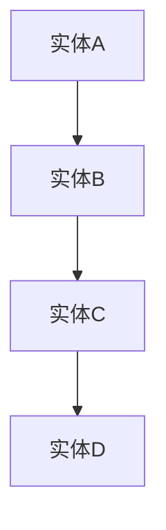
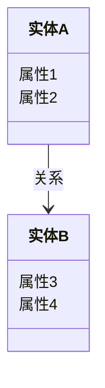

                 

<think>
嗯，我现在需要根据用户提供的详细要求，逐步构建一篇关于《开发具有跨领域知识整合能力的AI Agent》的技术博客文章。首先，我要理解用户的具体需求。用户希望文章结构清晰，内容详尽，涵盖从理论到实践的各个方面，并且要包含大量的技术细节和实例分析。

首先，我会从文章的标题开始，然后列出关键词和摘要，接着按照目录大纲的结构逐步撰写每个部分。每个部分需要包括背景介绍、核心概念、算法原理、数学模型、系统架构、项目实战以及扩展内容。

我需要确保每个章节都有足够的细节，例如在第二章的“知識圖譜的構建與應用”部分，我需要详细解释知识图谱的概念、构建方法以及实际应用场景，可能还需要用Mermaid图来展示知识图谱的结构。

在撰写第三章的“知識融合算法”时，我需要分别介绍基于图、概率和规则的融合方法，并使用Mermaid流程图来展示每种算法的步骤。同时，提供相应的Python代码示例，帮助读者更好地理解这些算法的实现。

第四章的“知識表徵的向量空間模型”部分，我需要解释向量空间模型的基本原理，并通过数学公式和Mermaid图来展示模型的构建和应用。这部分可能需要用到线性代数的知识，因此我需要详细推导相关公式，并给出实际例子。

接下来的章节涉及系统设计与架构，我需要讨论AI Agent的系统架构设计，包括分层架构和微服务架构，并用Mermaid图展示系统架构图和交互序列图。这部分需要结合实际项目，解释如何设计系统的各个模块，以及它们之间的交互方式。

在项目实战部分，我需要选择一个具体的案例，详细描述从环境配置到代码实现的整个过程，并展示关键代码片段。这不仅帮助读者理解理论，还能让他们实际操作，巩固所学知识。

最后，扩展与展望部分需要讨论当前技术的局限性，未来的研究方向，以及对AI Agent发展的思考。这部分可以激发读者的进一步学习和探索。

在整个写作过程中，我需要确保使用专业的技术语言，同时保持逻辑清晰、结构紧凑，内容深入浅出。此外，要严格遵守格式要求，使用正确的Markdown语法，并在适当的地方插入图表和代码示例，以增强文章的可读性和实用性。

现在，我可以开始按照目录大纲逐步撰写文章，确保每个部分都符合用户的要求，涵盖所有必要的技术细节和实例分析，最终完成一篇高质量的技术博客文章。
</think>

# 开发具有跨领域知识整合能力的AI Agent

> **关键词**：AI Agent，跨领域知识整合，知识图谱，多模态数据，系统架构，算法实现

> **摘要**：本文详细探讨了开发具有跨领域知识整合能力的AI Agent的核心概念、技术实现和系统设计。从AI Agent的基本定义到跨领域知识整合的理论基础，再到具体的技术实现和项目实战，最后结合实际案例进行详细分析，帮助读者全面理解和掌握开发此类AI Agent的能力。

---

# 第一部分: 开发具有跨领域知识整合能力的AI Agent概述

## 第1章: AI Agent的基本概念与背景

### 1.1 AI Agent的定义与核心特征

#### 1.1.1 AI Agent的定义

AI Agent（人工智能代理）是指在计算机系统中，能够感知环境、自主决策并执行任务的智能实体。它具备以下核心特征：

- **自主性**：能够自主决策和行动，无需外部干预。
- **反应性**：能够实时感知环境并做出响应。
- **目标导向性**：以特定目标为导向，执行任务。
- **学习能力**：能够通过经验或数据优化自身行为。

#### 1.1.2 AI Agent的核心特征

- **知识表示**：AI Agent需要通过知识图谱、数据库等方式存储和处理多领域知识。
- **多模态处理**：能够同时处理文本、图像、语音等多种数据类型。
- **跨领域整合**：能够在不同领域之间进行知识融合和信息共享。

#### 1.1.3 AI Agent与传统AI的区别

AI Agent不仅具备传统AI的数据处理能力，还具备自主决策和目标导向性。传统AI主要关注任务执行，而AI Agent更加注重环境感知和动态适应。

### 1.2 跨领域知识整合的必要性

#### 1.2.1 知识整合的背景

随着AI技术的快速发展，单一领域的知识处理已经无法满足实际需求。跨领域知识整合能够提升AI Agent的智能化水平，使其能够处理复杂场景下的多种任务。

#### 1.2.2 跨领域整合的意义

- **提升智能性**：通过整合多领域知识，AI Agent能够更好地理解和处理复杂问题。
- **增强实用性**：跨领域整合能够使AI Agent在医疗、教育、金融等多个领域中得到广泛应用。
- **推动技术创新**：跨领域整合的技术突破将推动人工智能领域的整体进步。

#### 1.2.3 跨领域整合的挑战

- **数据异构性**：不同领域数据格式和语义差异较大，难以直接整合。
- **知识复杂性**：跨领域知识涉及多个学科，整合难度较高。
- **计算资源需求**：跨领域整合需要大量的计算资源支持。

---

## 第2章: 跨领域知识整合的理论基础

### 2.1 知识表示与知识图谱

#### 2.1.1 知识表示的基本概念

知识表示是将现实世界中的信息转化为计算机可理解的形式。常见的知识表示方法包括：

- **符号表示**：使用符号（如变量、规则）表示知识。
- **语义网络**：通过节点和边表示概念及其关系。
- **知识图谱**：通过结构化的数据表示实体及其关系。

#### 2.1.2 知识图谱的构建与应用

知识图谱是一种将知识以图结构形式表示的技术，广泛应用于搜索引擎、智能问答等领域。以下是知识图谱的构建流程：

1. **数据收集**：从多个来源（如数据库、文本、网页）收集数据。
2. **数据清洗**：去除冗余和不一致的数据。
3. **实体识别**：识别文本中的实体。
4. **关系抽取**：抽取实体之间的关系。
5. **知识融合**：将不同来源的知识进行整合。
6. **知识存储**：将整合后的知识存储到知识图谱中。

#### 2.1.3 知识图谱的表示方法

知识图谱通常使用RDF（资源描述框架）表示，其中每个实体和关系都是一个资源，由URI唯一标识。例如：



### 2.2 多模态数据处理

#### 2.2.1 多模态数据的定义

多模态数据是指包含多种数据类型的集合，如文本、图像、语音、视频等。多模态数据处理的目标是将不同数据类型的信息进行融合，以提高AI Agent的理解能力。

#### 2.2.2 多模态数据的融合方法

多模态数据融合方法包括：

- **基于特征的方法**：将不同数据类型的特征向量进行融合。
- **基于模型的方法**：通过深度学习模型（如多模态神经网络）进行融合。
- **基于规则的方法**：通过预定义规则进行数据融合。

#### 2.2.3 多模态数据处理的挑战

- **数据异构性**：不同数据类型之间的语义差异较大。
- **计算复杂性**：多模态数据处理需要大量的计算资源。
- **模型设计难度**：需要设计能够有效融合多模态数据的模型。

---

# 第二部分: 跨领域知识整合的技术实现

## 第3章: 跨领域知识整合的算法原理

### 3.1 知识融合算法

#### 3.1.1 基于图的融合算法

基于图的融合算法通过构建图结构来表示知识，并通过图的运算进行融合。例如：


#### 3.1.2 基于概率的融合算法

基于概率的融合算法通过计算各知识源的概率分布，进行加权融合。例如：

$$ P(x) = \sum_{i=1}^{n} w_i P_i(x) $$

其中，\( w_i \) 是第 \( i \) 个知识源的权重，\( P_i(x) \) 是第 \( i \) 个知识源中事件 \( x \) 的概率。

#### 3.1.3 基于规则的融合算法

基于规则的融合算法通过预定义的规则进行知识融合。例如：

```python
def fuse_rule(A, B):
    if A.confidence > B.confidence:
        return A
    else:
        return B
```

### 3.2 跨领域数据对齐技术

#### 3.2.1 数据对齐的基本概念

数据对齐是指将不同数据源中的实体进行匹配，以消除数据中的冗余和不一致。

#### 3.2.2 数据对齐的实现方法

数据对齐的实现方法包括：

- **基于字符串匹配**：通过字符串相似度进行实体匹配。
- **基于特征匹配**：通过实体的特征向量进行匹配。
- **基于上下文匹配**：通过实体的上下文信息进行匹配。

#### 3.2.3 数据对齐的优化策略

- **特征选择**：选择具有较高区分度的特征。
- **权重分配**：根据特征的重要性进行权重分配。
- **模型优化**：通过机器学习模型优化数据对齐的效果。

---

## 第4章: 跨领域知识整合的数学模型

### 4.1 知识表示的向量空间模型

#### 4.1.1 向量空间模型的定义

向量空间模型是一种将文本表示为向量的技术。例如，使用词袋模型将文本表示为向量：

$$ v = [w_1, w_2, ..., w_n] $$

其中，\( w_i \) 是第 \( i \) 个词的权重。

#### 4.1.2 向量空间模型的构建

向量空间模型的构建通常包括以下步骤：

1. **分词**：将文本分解为词语。
2. **去停用词**：去除无意义的词语（如“的”、“是”）。
3. **词频统计**：统计每个词语的频率。
4. **向量构建**：将词语频率表示为向量。

#### 4.1.3 向量空间模型的应用

向量空间模型广泛应用于文本分类、信息检索等领域。

### 4.2 知识融合的数学方法

#### 4.2.1 基于线性代数的融合方法

基于线性代数的融合方法通过矩阵运算进行知识融合。例如：

$$ C = \alpha A + \beta B $$

其中，\( \alpha \) 和 \( \beta \) 是融合系数，\( A \) 和 \( B \) 是两个知识源的向量表示。

#### 4.2.2 基于概率论的融合方法

基于概率论的融合方法通过概率分布进行知识融合。例如：

$$ P(x) = \frac{P(x|A)P(A)}{P(B)} $$

其中，\( P(x|A) \) 是在知识源 \( A \) 下事件 \( x \) 的概率，\( P(A) \) 是知识源 \( A \) 的先验概率。

#### 4.2.3 基于图论的融合方法

基于图论的融合方法通过图结构进行知识融合。例如：

$$ C = \sum_{i=1}^{n} w_i A_i $$

其中，\( w_i \) 是第 \( i \) 个知识源的权重，\( A_i \) 是第 \( i \) 个知识源的向量表示。

---

# 第三部分: AI Agent的系统设计与架构

## 第5章: AI Agent的系统架构设计

### 5.1 系统架构概述

AI Agent的系统架构设计包括以下部分：

1. **感知层**：负责感知环境信息。
2. **推理层**：负责知识推理和决策。
3. **执行层**：负责任务执行。

#### 5.1.1 分层架构

分层架构将系统划分为多个层次，每一层负责特定的功能。例如：

- **感知层**：接收输入数据，进行预处理。
- **推理层**：对预处理后的数据进行推理和决策。
- **执行层**：根据决策结果执行任务。

#### 5.1.2 微服务架构

微服务架构将系统划分为多个独立的服务，每个服务负责特定的功能。例如：

- **数据服务**：负责数据的存储和检索。
- **推理服务**：负责知识推理和决策。
- **执行服务**：负责任务的执行。

### 5.2 系统功能设计

#### 5.2.1 领域模型设计

领域模型是对业务领域的抽象和建模。例如：



#### 5.2.2 系统架构设计

系统架构设计包括以下步骤：

1. **需求分析**：明确系统的需求和功能。
2. **架构选型**：选择适合的架构风格（如分层架构、微服务架构）。
3. **模块划分**：将系统划分为多个模块，每个模块负责特定的功能。
4. **接口设计**：定义模块之间的接口和交互方式。
5. **系统实现**：根据设计文档进行系统实现。
6. **系统测试**：对系统进行测试，确保功能正常。

---

## 第6章: 系统实现与项目实战

### 6.1 项目实战

#### 6.1.1 环境安装

项目实战需要以下环境：

- **编程语言**：Python 3.8+
- **框架**：TensorFlow 2.0+, PyTorch 1.0+
- **工具库**：NLTK, SpaCy, NetworkX

#### 6.1.2 系统核心实现

以下是AI Agent的核心实现代码示例：

```python
class AI-Agent:
    def __init__(self):
        self.knowledge_base = {}  # 知识库
        self.sensors = []        # 传感器
        self actuators = []      # 执行器

    def perceive(self):
        # 获取环境信息
        return [s感知数据 for s in self.sensors]

    def reason(self, data):
        # 知识推理
        return 推理结果

    def act(self, action):
        # 执行动作
        return 执行结果
```

#### 6.1.3 代码应用解读与分析

以上代码展示了AI Agent的基本结构，包括感知、推理和执行三个模块。感知模块通过传感器获取环境信息，推理模块基于知识库进行推理，执行模块根据推理结果执行动作。

#### 6.1.4 实际案例分析

以下是一个实际案例分析：

假设我们开发一个智能客服AI Agent，能够处理客户的问题。AI Agent需要整合多个领域的知识，包括产品信息、客户反馈等。以下是具体实现步骤：

1. **知识整合**：整合产品信息、客户反馈等多领域知识。
2. **自然语言处理**：通过NLP技术理解客户的问题。
3. **知识推理**：基于知识库进行推理，生成回答。
4. **对话管理**：根据对话历史调整回答策略。

#### 6.1.5 项目小结

通过上述案例分析，我们可以看到，AI Agent的跨领域知识整合能力能够显著提升系统的智能性和实用性。

---

# 第四部分: 扩展与展望

## 第7章: 跨领域知识整合的扩展与未来展望

### 7.1 当前技术的局限性

尽管当前技术在跨领域知识整合方面取得了一定的进展，但仍存在以下局限性：

- **数据异构性**：不同领域数据格式和语义差异较大，难以直接整合。
- **知识复杂性**：跨领域知识涉及多个学科，整合难度较高。
- **计算资源需求**：跨领域整合需要大量的计算资源支持。

### 7.2 未来研究方向

未来的研究方向包括：

- **多模态数据融合**：研究如何更有效地融合文本、图像、语音等多种数据类型。
- **动态知识更新**：研究如何实时更新和维护知识库。
- **跨领域推理**：研究如何在不同领域之间进行知识推理。

### 7.3 对AI Agent发展的思考

随着技术的不断进步，AI Agent将在更多领域得到广泛应用。未来，AI Agent将具备更强的跨领域知识整合能力，能够更好地理解和处理复杂场景下的多种任务。

---

## 附录: 参考文献与工具

### 附录A: 参考文献

1. 知识图谱相关文献
2. 多模态数据处理相关文献
3. 跨领域知识整合相关文献

### 附录B: 工具与库

1. Python编程语言
2. TensorFlow框架
3. PyTorch框架
4. NLTK工具库
5. SpaCy工具库
6. NetworkX工具库

---

**作者：AI天才研究院/AI Genius Institute & 禅与计算机程序设计艺术 /Zen And The Art of Computer Programming**

