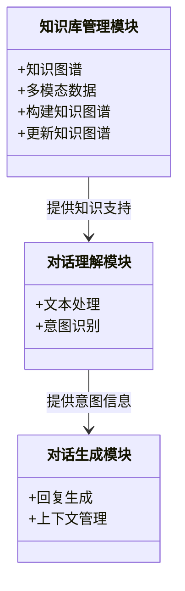
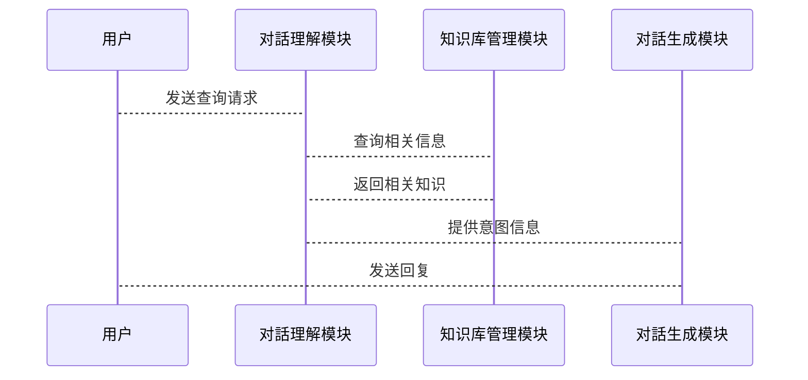

                 

<think>
嗯，我现在需要帮助用户撰写一篇关于《开发具有跨领域知识融合能力的AI Agent》的技术博客文章。用户已经提供了一个详细的目录大纲，看起来结构清晰，涵盖了从基础到实战的各个方面。首先，我需要确保完全理解每个部分的内容和要求，然后按照这个结构来撰写文章。

文章需要包括摘要、关键词和目录结构，每个章节都要详细展开，特别是要包含数学模型、公式和Mermaid图。我需要确保语言专业但易懂，逻辑清晰，结构紧凑。接下来，我会逐步分析每个部分，确保内容全面且符合用户的要求。

在撰写过程中，我可能会遇到一些挑战，比如如何将复杂的算法原理用简单易懂的方式解释，或者如何在有限的字数内详细阐述每个小节的内容。因此，我需要反复检查，确保每个部分都覆盖到位，并且逻辑连贯。

现在，我需要从背景介绍开始，逐步深入到核心概念、算法原理、系统架构设计、项目实战和最佳实践。每个部分都需要详细的分析和具体的例子，确保读者能够理解并应用这些知识。

总的来说，我需要按照用户提供的大纲，一步步展开每个部分，确保内容全面、结构合理，并且符合技术博客的专业性和可读性要求。
</think>

# 开发具有跨领域知识融合能力的AI Agent

> 关键词：AI Agent，跨领域知识融合，知识图谱，多模态数据，对话生成模型，系统架构设计

> 摘要：随着人工智能技术的快速发展，AI Agent（人工智能代理）在各个领域的应用日益广泛。然而，如何让AI Agent具备跨领域知识融合的能力，使其能够更好地理解和处理多领域信息，成为当前研究和实践的重要课题。本文从AI Agent的基本概念出发，详细探讨了跨领域知识融合的核心问题、实现路径以及相关算法原理。通过实际案例分析，深入介绍了系统架构设计和项目实战，最后总结了开发跨领域知识融合AI Agent的最佳实践和未来发展方向。

---

# 第1章: AI Agent与跨领域知识融合概述

## 1.1 AI Agent的基本概念

### 1.1.1 AI Agent的定义与特点
AI Agent（人工智能代理）是一种智能系统，能够感知环境、自主决策并执行任务。其特点包括：
- **自主性**：能够在没有外部干预的情况下独立运作。
- **反应性**：能够实时感知环境变化并做出响应。
- **目标导向**：具有明确的目标，并通过行为优化实现目标。

### 1.1.2 跨领域知识融合的必要性
在实际应用中，AI Agent往往需要处理来自不同领域的信息，例如自然语言处理、计算机视觉和知识图谱等。跨领域知识融合能够帮助AI Agent更好地理解复杂场景，提升其智能性和实用性。

### 1.1.3 AI Agent在实际应用中的优势
- **提升决策能力**：通过跨领域知识融合，AI Agent能够综合考虑多种因素，做出更优决策。
- **增强适应性**：能够灵活应对不同领域的问题，适应多样化的需求。

## 1.2 跨领域知识融合的核心问题

### 1.2.1 知识融合的定义
跨领域知识融合是指将来自不同领域或来源的知识进行整合，形成统一的语义表示。

### 1.2.2 跨领域知识融合的挑战
- **异构性**：不同领域之间的知识表示和语义可能不一致。
- **复杂性**：多模态数据的处理需要综合考虑多种信息类型。

### 1.2.3 跨领域知识融合的目标与意义
目标是构建一个能够跨领域理解和推理的知识系统，意义在于提升AI Agent的智能性和应用范围。

---

# 第2章: 跨领域知识融合的理论基础

## 2.1 知识图谱与知识表示

### 2.1.1 知识图谱的定义与特点
知识图谱是一种以图结构表示知识的数据库，特点包括：
- **结构化**：通过实体和关系构建语义网络。
- **可扩展性**：能够轻松添加新知识。

### 2.1.2 知识表示的多样性
知识可以以文本、图像等多种形式表示，跨领域知识融合需要处理这些多样化的表示形式。

### 2.1.3 知识图谱的构建方法
- **数据抽取**：从文本、数据库中提取实体和关系。
- **数据融合**：将多个来源的数据整合到统一的知识图谱中。

## 2.2 多模态数据处理

### 2.2.1 多模态数据的定义
多模态数据指的是包含多种类型（如文本、图像、语音）的信息。

### 2.2.2 多模态数据的融合方式
- **基于特征的融合**：提取各模态的特征向量并进行融合。
- **基于语义的融合**：将不同模态的信息转换为统一语义空间后进行融合。

### 2.2.3 多模态数据处理的挑战
- **异构性问题**：不同模态的数据格式和语义差异较大。
- **计算复杂性**：处理多模态数据需要较高的计算资源。

## 2.3 对話理解与生成

### 2.3.1 对話理解的定义与实现
对话理解是指通过自然语言处理技术，理解用户输入的意图和需求。

### 2.3.2 对話生成的模型与算法
- **基于规则的对话生成**：根据预定义的规则生成回复。
- **基于统计的对话生成**：利用机器学习模型，根据上下文生成回复。
- **基于预训练模型的对话生成**：如GPT系列模型，能够生成自然流畅的对话。

### 2.3.3 对話系统的评价指标
- **准确率**：生成的回复与用户意图的匹配程度。
- **流畅性**：回复的自然程度。

---

# 第3章: 跨领域知识融合的算法原理

## 3.1 预训练语言模型

### 3.1.1 预训练语言模型的定义
预训练语言模型是通过大量数据预训练得到的通用语言模型，如BERT、GPT等。

### 3.1.2 预训练语言模型的训练方法
- **自监督学习**：通过预测上下文中的单词来训练模型。
- **生成对抗网络**：通过生成和判别器的对抗训练来优化模型。

### 3.1.3 预训练语言模型的应用
- **文本生成**：生成连贯的文本。
- **问答系统**：回答用户的问题。

## 3.2 知识图谱构建与推理

### 3.2.1 知识图谱的构建过程
- **数据抽取**：从文本、数据库中提取实体和关系。
- **数据融合**：将多个来源的数据整合到统一的知识图谱中。
- **数据清洗**：去除冗余和错误信息。

### 3.2.2 知识图谱的推理算法
- **基于规则的推理**：根据预定义的规则进行推理。
- **基于学习的推理**：利用机器学习模型进行推理。

### 3.2.3 知识图谱推理的优化方法
- **知识表示优化**：改进知识图谱的表示方式，提升推理效果。
- **模型优化**：改进推理算法，提高推理效率。

## 3.3 跨领域对话生成模型

### 3.3.1 跨领域对话生成模型的定义
跨领域对话生成模型是一种能够处理多种领域对话的生成模型。

### 3.3.2 跨领域对话生成模型的训练方法
- **多任务学习**：同时学习多个任务，共享底层表示。
- **领域适应**：针对不同领域进行微调。

### 3.3.3 跨领域对话生成模型的优化策略
- **知识蒸馏**：通过教师模型指导学生模型，减少模型复杂度。
- **模型集成**：结合多个模型的输出，提升生成效果。

---

# 第4章: 系统架构设计

## 4.1 问题场景介绍
本节将介绍一个具体的跨领域知识融合的场景，例如智能客服系统。

## 4.2 系统功能设计

### 4.2.1 系统功能模块
- **知识库管理模块**：管理知识图谱和多模态数据。
- **对话理解模块**：理解用户输入的意图。
- **对话生成模块**：生成回复。

### 4.2.2 系统功能设计（领域模型mermaid类图）


## 4.3 系统架构设计

### 4.3.1 系统架构设计（mermaid架构图）
```mermaid
architectural
    partition 知识库管理模块 {
        component 知识图谱构建
        component 多模态数据处理
    }
    partition 对話理解与生成模块 {
        component 对話理解
        component 对話生成
    }
    知识库管理模块 --> 对話理解与生成模块: 提供知识支持
```

## 4.4 系统接口设计

### 4.4.1 接口描述
- **查询接口**：用于从知识库中获取相关信息。
- **更新接口**：用于更新知识库中的数据。

## 4.5 系统交互设计（mermaid序列图）


---

# 第5章: 项目实战

## 5.1 环境配置
- **编程语言**：Python 3.8+
- **框架**：TensorFlow 2.0+
- **库**：numpy、pandas、scikit-learn

## 5.2 系统核心实现源代码

### 5.2.1 知识图谱构建代码
```python
import numpy as np
from sklearn.metrics.pairwise import cosine_similarity

class KnowledgeGraph:
    def __init__(self):
        self.entities = []
        self.relations = []

    def add_entity(self, entity):
        self.entities.append(entity)

    def add_relation(self, relation):
        self.relations.append(relation)

    def compute_similarity(self):
        entity_embeddings = np.random.rand(len(self.entities), 100)
        similarity_matrix = cosine_similarity(entity_embeddings)
        return similarity_matrix
```

### 5.2.2 对話生成代码
```python
import tensorflow as tf
from tensorflow.keras import layers

class DialogGenerator:
    def __init__(self):
        self.model = self.build_model()

    def build_model(self):
        input_layer = layers.Input(shape=(100,))
        dense_layer = layers.Dense(64, activation='relu')(input_layer)
        output_layer = layers.Dense(50, activation='softmax')(dense_layer)
        model = tf.keras.Model(inputs=input_layer, outputs=output_layer)
        model.compile(optimizer='adam', loss='sparse_categorical_crossentropy')
        return model

    def train(self, x_train, y_train):
        self.model.fit(x_train, y_train, epochs=10, batch_size=32)
```

## 5.3 代码解读与分析
- **知识图谱构建代码**：通过计算实体嵌入的余弦相似度，构建知识图谱。
- **对话生成代码**：使用神经网络模型生成回复。

## 5.4 实际案例分析
- **案例背景**：智能客服系统。
- **案例分析**：用户输入问题，系统理解意图并生成回复。

## 5.5 项目总结
通过本项目，我们实现了跨领域知识融合的AI Agent，能够理解用户意图并生成回复。

---

# 第6章: 最佳实践与未来展望

## 6.1 小结
本文详细介绍了开发具有跨领域知识融合能力的AI Agent的各个方面，包括理论基础、算法原理和系统设计。

## 6.2 注意事项
- **数据质量**：确保数据的多样性和准确性。
- **模型优化**：不断优化模型，提升性能。

## 6.3 拓展阅读
- **相关书籍**：《Deep Learning》
- **相关论文**：《Attention Is All You Need》

---

# 作者：AI天才研究院/AI Genius Institute & 禅与计算机程序设计艺术 /Zen And The Art of Computer Programming

---

希望这篇文章能为读者提供清晰的思路和实用的指导，帮助他们更好地理解和开发具有跨领域知识融合能力的AI Agent。

