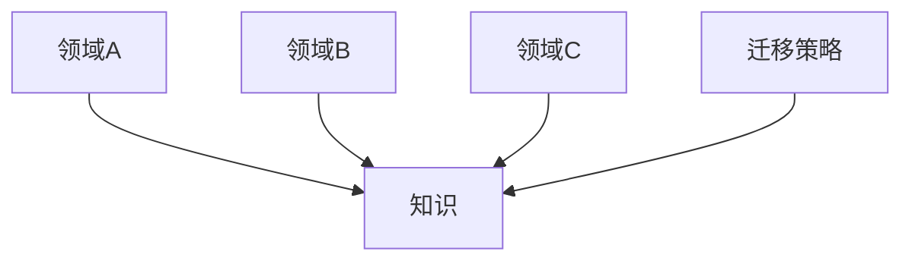
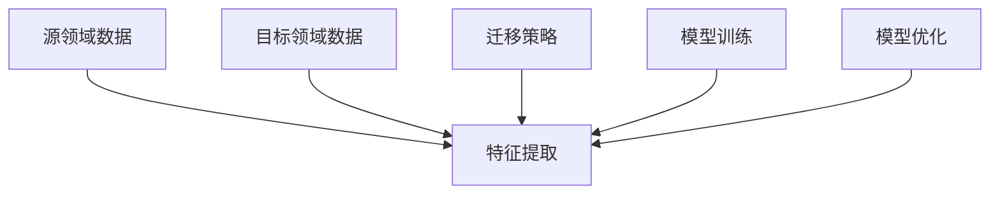
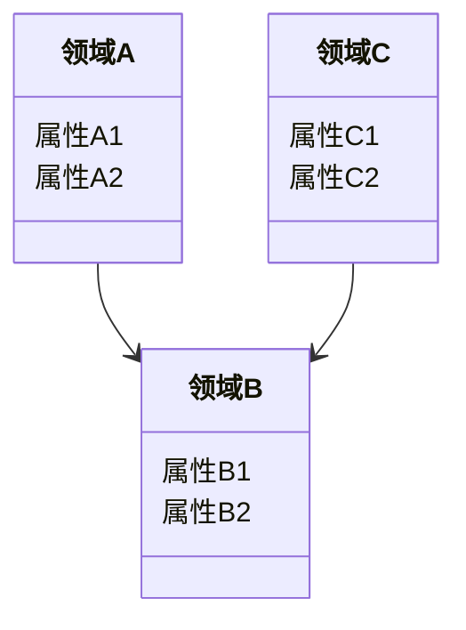
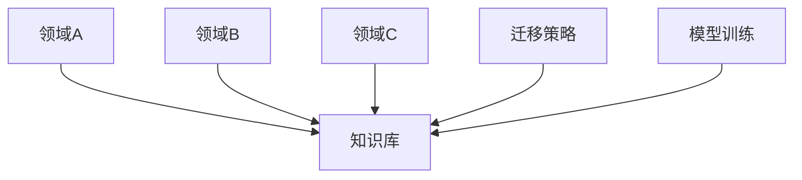
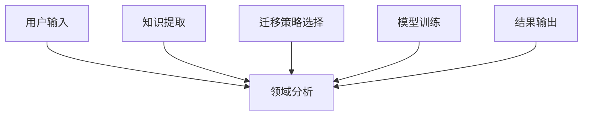

                 

<think>
好的，我需要帮助用户完成《开发具有跨领域知识迁移能力的AI Agent》这本书的目录大纲。首先，我得明确用户的需求。用户希望有一篇结构清晰、内容详尽的技术博客文章，涵盖跨领域知识迁移的核心概念、算法原理、系统设计以及项目实战等内容。

用户已经提供了一个大纲，但可能不够详细或完整。我需要检查每一章，确保每个部分都涵盖必要的内容，并且符合用户的要求。

首先，我会考虑每一章的逻辑顺序。通常，技术博客会从背景介绍开始，逐步深入到核心概念、算法原理、系统设计，最后通过项目实战来验证理论。这样读者可以一步步理解从理论到实践的过程。

接下来，我需要确保每个章节都有足够的细节。例如，在算法原理部分，用户提到了迁移学习的基本流程和数学模型。我应该进一步细化，解释每一步骤的具体实现，可能包括特征提取、模型训练等，并用Mermaid图来展示流程。

在系统架构设计方面，用户提到了类图和架构图。我需要确保这些图表清晰地展示各个模块之间的关系，帮助读者理解系统的整体结构。同时，接口设计和交互流程图也是必要的，以展示系统的实际运作方式。

项目实战部分，用户可能需要一个实际的例子，展示如何从环境安装、代码实现到案例分析。我应该选择一个具体的场景，比如医疗领域的应用，展示AI Agent如何在不同领域之间迁移知识，并通过代码示例来解释实现过程。

此外，用户还要求包括最佳实践、小结、注意事项和拓展阅读。这些内容可以为读者提供额外的价值，帮助他们在实际项目中更好地应用所学知识。

在写作过程中，我需要确保语言简洁明了，逻辑清晰，每个部分都紧密联系，形成一个完整的知识体系。同时，使用适当的markdown格式，如标题、列表、代码块和图表，以增强文章的可读性和专业性。

最后，检查整个大纲是否符合用户的字数要求，大约在10000到12000字之间。确保每个章节都有足够的内容，但不过于冗长，保持读者的兴趣和理解。

总结一下，我的思考过程包括理解用户需求、细化目录结构、确保内容详尽且有逻辑性、选择合适的案例和代码示例，以及检查整体格式和字数。这样，我就能为用户生成一个符合要求的详细目录大纲，帮助他们撰写一篇高质量的技术博客文章。
</think>

# 开发具有跨领域知识迁移能力的AI Agent

> 关键词：AI Agent, 跨领域知识迁移, 人工智能, 知识迁移模型, 系统架构设计, 项目实战, 技术博客

> 摘要：本文将详细介绍开发具有跨领域知识迁移能力的AI Agent的相关技术与方法。从AI Agent的基本概念到跨领域知识迁移的核心原理，从算法实现到系统架构设计，从项目实战到最佳实践，我们将全面解析如何构建能够有效进行跨领域知识迁移的AI Agent系统。文章内容涵盖理论与实践相结合，旨在为读者提供一份系统性、实用性的技术指南。

---

# 第一部分: 开发具有跨领域知识迁移能力的AI Agent背景介绍

# 第1章: AI Agent与跨领域知识迁移概述

## 1.1 AI Agent的基本概念
### 1.1.1 AI Agent的定义与特点
- **定义**: AI Agent是一种具有自主决策能力和问题解决能力的智能体，能够通过感知环境并采取行动来实现特定目标。
- **特点**: 
  - 自主性: 能够独立决策和行动。
  - 反应性: 能够感知环境并实时响应。
  - 学习能力: 能够通过经验改进自身的性能。
  - 交互性: 能够与人类或其他智能体进行有效交互。

### 1.1.2 跨领域知识迁移的必要性
- AI Agent在不同领域之间进行知识迁移的需求日益增长。
- 知识迁移能够帮助AI Agent在新的领域中快速适应并解决问题。
- 通过跨领域知识迁移，AI Agent可以实现更广泛的应用场景。

### 1.1.3 当前AI Agent的发展现状
- AI Agent技术在各个领域的应用逐渐增多。
- 知识迁移技术是当前AI Agent研究的热点方向之一。
- 各种跨领域知识迁移的方法和技术正在快速发展。

## 1.2 跨领域知识迁移的核心问题
### 1.2.1 知识迁移的基本概念
- 知识迁移是指将一个领域的知识应用到另一个领域的过程。
- 跨领域知识迁移需要解决领域间知识的异构性和差异性问题。

### 1.2.2 跨领域知识迁移的挑战
- 领域间知识的差异性。
- 数据分布的不均衡性。
- 迁移策略的选择与优化。

### 1.2.3 跨领域知识迁移的应用场景
- 医疗领域: 将医学知识应用到健康管理或其他相关领域。
- 教育领域: 将学科知识迁移到教学设计或教育管理。
- 企业领域: 将内部知识迁移到其他业务领域。

## 1.3 本书的核心目标与内容框架
### 1.3.1 本书的核心目标
- 系统性地介绍跨领域知识迁移的基本原理与方法。
- 提供AI Agent开发中跨领域知识迁移的具体实现方案。
- 探讨跨领域知识迁移技术的最新研究进展与未来发展方向。

### 1.3.2 本书的主要内容框架
- 第一部分: 背景介绍与核心概念。
- 第二部分: 跨领域知识迁移的算法原理。
- 第三部分: 跨领域知识迁移的系统架构设计。
- 第四部分: 项目实战与案例分析。
- 第五部分: 最佳实践与未来展望。

### 1.3.3 本书的适用读者
- AI领域的研究人员。
- 人工智能工程师。
- 对跨领域知识迁移技术感兴趣的读者。

---

# 第2章: 跨领域知识迁移的核心概念与联系

## 2.1 知识迁移的基本原理
### 2.1.1 知识迁移的定义
- 知识迁移到本质上是一种将知识从一个领域转移到另一个领域的能力。
- 这种能力依赖于领域间的相似性和知识的可迁移性。

### 2.1.2 知识迁移的核心要素
- **源领域**: 知识的来源领域。
- **目标领域**: 知识的应用领域。
- **迁移策略**: 知识迁移的具体方法和策略。
- **知识表示**: 知识在不同领域的表示方式。

### 2.1.3 知识迁移的分类与对比
- **同质化迁移**: 领域间具有较高的相似性，知识可以直接迁移。
- **异质化迁移**: 领域间差异较大，需要进行知识转换。
- **零样本迁移**: 目标领域完全没有数据的情况下的迁移。

## 2.2 跨领域知识迁移的模型与方法
### 2.2.1 跨领域知识迁移的模型
- **特征表示模型**: 通过特征提取将不同领域的知识转化为统一的表示。
- **知识图谱模型**: 通过构建跨领域的知识图谱实现知识迁移。
- **迁移学习模型**: 基于迁移学习的算法实现跨领域知识迁移。

### 2.2.2 跨领域知识迁移的方法
- **基于特征的迁移**: 通过提取特征进行知识迁移。
- **基于标签的迁移**: 通过标签信息进行知识迁移。
- **基于分布的迁移**: 通过数据分布的对齐进行知识迁移。

### 2.2.3 跨领域知识迁移的优缺点对比
- **优点**: 
  - 提高AI Agent的通用性。
  - 减少目标领域数据的需求。
- **缺点**: 
  - 领域间差异可能导致迁移效果不佳。
  - 迁移策略的选择需要专业知识。

## 2.3 跨领域知识迁移的ER实体关系图


---

# 第3章: 跨领域知识迁移的算法原理

## 3.1 知识迁移的基本算法
### 3.1.1 迁移学习的基本流程
- 数据预处理: 对源领域和目标领域的数据进行预处理。
- 特征提取: 提取数据的特征。
- 迁移策略选择: 根据领域间的差异选择合适的迁移策略。
- 模型训练与优化: 在目标领域上进行模型训练和优化。

### 3.1.2 迁移学习的数学模型
- 源领域和目标领域的联合分布:
$$ P(x,y) = P(x|y)P(y) $$
- 迁移目标: 最小化目标领域的期望风险:
$$ \min_{f} \mathbb{E}_{x,y \sim P_{target}}[L(f(x), y)] $$

### 3.1.3 迁移学习的优化方法
- 基于正则化的优化方法。
- 基于对抗训练的优化方法。

## 3.2 跨领域知识迁移的算法实现
### 3.2.1 基于特征的迁移学习
- 特征提取:
```python
def feature_extractor(x):
    # 实现特征提取逻辑
    return features
```
- 迁移策略:
```python
def transfer_strategy(features):
    # 实现迁移策略逻辑
    return transferred_features
```

### 3.2.2 基于标签的迁移学习
- 标签对齐:
```python
def label_alignment(y_source, y_target):
    # 实现标签对齐逻辑
    return aligned_labels
```
- 模型训练:
```python
model.fit(X_source, y_aligned)
```

### 3.2.3 基于分布的迁移学习
- 数据分布对齐:
```python
def distribution_alignment(X_source, X_target):
    # 实现分布对齐逻辑
    return aligned_X
```
- 模型优化:
```python
model.optimize(aligned_X, y_target)
```

## 3.3 跨领域知识迁移的算法流程图


---

# 第4章: 跨领域知识迁移的系统分析与架构设计

## 4.1 系统功能设计
### 4.1.1 领域模型设计


### 4.1.2 系统架构设计


## 4.2 系统接口设计
### 4.2.1 系统输入接口
- 源领域数据输入接口。
- 目标领域数据输入接口。
- 迁移策略配置接口。

### 4.2.2 系统输出接口
- 迁移后的特征表示输出接口。
- 最终模型输出接口。

### 4.2.3 系统交互流程图


---

# 第5章: 跨领域知识迁移的项目实战

## 5.1 环境安装与配置
- 安装必要的库:
```bash
pip install numpy pandas scikit-learn tensorflow
```

## 5.2 系统核心功能实现
### 5.2.1 知识提取模块
```python
def extract Knowledge(domain_data):
    # 实现知识提取逻辑
    return knowledge
```

### 5.2.2 迁移策略模块
```python
def apply_transfer(knowledge, strategy):
    # 实现迁移策略逻辑
    return transferred_knowledge
```

### 5.2.3 模型训练模块
```python
def train_model(transferred_knowledge, labels):
    # 实现模型训练逻辑
    return model
```

## 5.3 项目案例分析
- 案例背景: 医疗领域的疾病诊断。
- 案例实现: 将医学知识迁移到健康管理领域。
- 案例分析: 通过迁移学习提高健康管理的准确性。

## 5.4 项目小结
- 项目实现的关键点。
- 项目中的经验与教训。
- 项目未来改进方向。

---

# 第6章: 最佳实践与未来展望

## 6.1 最佳实践
### 6.1.1 知识迁移策略的选择
- 根据领域间的相似性选择合适的迁移策略。
- 定期评估迁移效果并进行调整。

### 6.1.2 系统架构设计的优化
- 确保系统的可扩展性。
- 提高系统的容错能力。

## 6.2 小结
- 跨领域知识迁移的核心价值。
- 本书的主要内容回顾。
- 未来的研究方向与技术趋势。

## 6.3 注意事项
- 确保数据的安全性与隐私性。
- 在实际应用中充分考虑领域间的差异性。

## 6.4 拓展阅读
- 推荐的相关书籍与论文。
- 其他相关的技术资源。

---

# 作者：AI天才研究院/AI Genius Institute & 禅与计算机程序设计艺术 /Zen And The Art of Computer Programming

---

以上是《开发具有跨领域知识迁移能力的AI Agent》的技术博客文章目录大纲，接下来可以根据这个大纲逐步撰写具体的章节内容。

