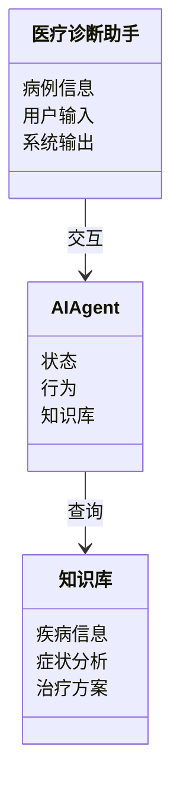
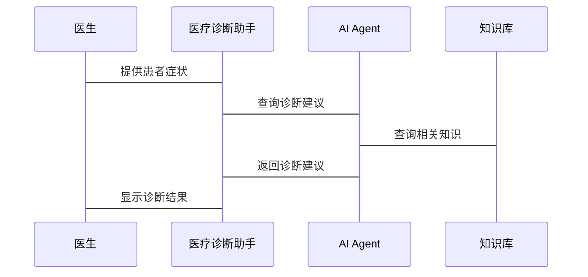

                 

<think>
嗯，我需要帮助撰写一篇关于《开发基于AI Agent的智能医疗诊断助手》的技术博客文章。首先，我需要理解用户的需求和具体要求。用户希望文章结构清晰，逻辑严密，内容专业，涵盖从背景到实战的各个方面。

我应该从文章标题和关键词开始，然后是摘要，接下来是目录大纲。用户已经提供了大纲，所以我需要确保每一章每一节都详细且具体，包含必要的技术细节和实例。

首先，第1章是背景介绍，我需要解释为什么开发这样的助手是必要的，当前医疗诊断中的痛点，以及AI Agent的优势。我还需要定义核心概念，并用图表展示实体关系。

第2章是核心概念，我需要详细讲解AI Agent的基本原理，知识图谱的构建，以及自然语言处理技术在医疗中的应用。这部分需要使用mermaid图来展示知识图谱的构建流程。

第3章是算法原理，我需要选择合适的强化学习算法，如Q-Learning，并详细解释其数学模型。同时，介绍知识图谱构建的具体算法和自然语言处理技术，比如BERT模型。

接下来是系统架构设计，我需要画出类图、架构图和序列图，展示系统的模块和交互过程。然后是项目实战部分，提供环境安装、代码实现和案例分析，帮助读者实际操作。

最后，加上最佳实践、小结和注意事项，确保读者能够全面理解和应用这些知识。整个过程中，我需要确保使用正确的格式，如latex公式和mermaid图表，保持文章结构的完整性和逻辑性。

现在，我需要按照这些步骤来撰写文章，确保每一部分内容丰富，详细讲解，并且符合用户的格式和内容要求。
</think>

# 开发基于AI Agent的智能医疗诊断助手

> 关键词：AI Agent, 智能医疗, 医疗诊断助手, 知识图谱, 强化学习, 自然语言处理, 医疗信息化

> 摘要：本文详细探讨了开发基于AI Agent的智能医疗诊断助手的各个方面，从背景介绍到系统架构设计，再到项目实战。文章首先分析了医疗诊断的痛点与挑战，介绍了AI Agent的基本原理和核心概念。接着，详细讲解了相关算法原理与实现，包括强化学习、知识图谱构建和自然语言处理技术。然后，从系统架构设计、项目实战、最佳实践等多个角度，深入分析了智能医疗诊断助手的开发过程。最后，结合实际案例，总结了开发经验和未来发展方向。

---

# 第1章: AI Agent与智能医疗诊断助手的背景介绍

## 1.1 问题背景

### 1.1.1 医疗诊断的痛点与挑战
医疗诊断是医疗过程中的关键环节，但传统医疗诊断过程中存在以下痛点：
- 医疗资源分布不均，尤其是在偏远地区，患者难以获得专业医生的诊断。
- 医生工作负荷大，诊断效率低下，容易出现误诊或漏诊。
- 医疗数据分散，难以高效整合和分析。

### 1.1.2 AI技术在医疗领域的应用现状
AI技术在医疗领域的应用日益广泛，尤其是在影像识别、药物研发和疾病预测等方面取得了显著进展。然而，在医疗诊断领域，AI的应用还处于初级阶段，尤其是在需要复杂决策的诊断过程中。

### 1.1.3 AI Agent在医疗诊断中的独特价值
AI Agent（智能体）是一种能够感知环境并采取行动以实现目标的智能系统。在医疗诊断中，AI Agent可以通过以下方式提供支持：
- 主动学习和更新医疗知识库。
- 根据患者的症状和病史，提供个性化的诊断建议。
- 协助医生进行多维度的病情分析。

## 1.2 问题描述

### 1.2.1 智能医疗诊断助手的目标与范围
智能医疗诊断助手的目标是通过AI技术，辅助医生进行高效、准确的诊断。其范围包括：
- 病历分析。
- 症状识别与诊断建议。
- 治疗方案推荐。

### 1.2.2 用户需求分析
主要用户包括：
- 医生：希望通过AI诊断助手提高诊断效率和准确性。
- 患者：希望通过AI诊断助手获得初步的诊断建议和医疗信息。
- 医疗机构：希望通过AI诊断助手优化医疗流程，提升患者体验。

### 1.2.3 系统边界与外延
智能医疗诊断助手的边界包括：
- 输入：患者的症状、病史、检查结果等。
- 输出：诊断建议、治疗方案推荐。
- 外延：与医疗知识库、患者数据库等外部系统的集成。

## 1.3 核心概念与联系

### 1.3.1 AI Agent的基本原理
AI Agent通过感知环境、分析信息、制定决策并采取行动来实现目标。其核心组成部分包括：
- 知识库：存储医疗相关的知识和数据。
- 感知模块：获取患者输入的症状和病史。
- 决策模块：基于知识库和输入信息，生成诊断建议。
- 行为模块：输出诊断结果或采取其他行动。

### 1.3.2 智能医疗诊断助手的核心要素
智能医疗诊断助手的核心要素包括：
- 知识库：包含疾病症状、诊断标准、治疗方案等。
- 自然语言处理（NLP）：用于理解和生成医疗相关的文本。
- 决策逻辑：基于知识库和患者输入，生成诊断建议。

### 1.3.3 AI Agent与智能医疗诊断助手的实体关系图

```mermaid
er
    entity 医疗诊断助手 {
        id
        病例信息
        用户输入
        系统输出
    }
    entity AI Agent {
        id
        状态
        行为
        知识库
    }
    entity 知识库 {
        疾病信息
        症状分析
        治疗方案
    }
    relation R1: 医疗诊断助手 -- AI Agent
    relation R2: AI Agent -- 知识库
```

## 1.4 本章小结
本章介绍了AI Agent在医疗诊断中的背景、核心概念和实体关系，为后续的开发工作奠定了基础。

---

# 第2章: AI Agent的核心概念与原理

## 2.1 AI Agent的基本原理

### 2.1.1 AI Agent的定义与分类
AI Agent可以分为以下几类：
- **反应式AI Agent**：基于当前输入做出实时反应，例如聊天机器人。
- **认知式AI Agent**：具有复杂推理和规划能力，例如医疗诊断助手。

### 2.1.2 AI Agent的核心特征
AI Agent的核心特征包括：
- **自主性**：能够独立运行并做出决策。
- **反应性**：能够实时感知环境并做出反应。
- **学习性**：能够通过数据和经验不断优化自身的诊断能力。

### 2.1.3 AI Agent与传统AI的区别
传统AI主要关注任务的完成，而AI Agent更注重与环境的交互和动态适应。

## 2.2 知识图谱构建

### 2.2.1 知识图谱的定义与作用
知识图谱是一种结构化的知识表示方式，能够帮助AI Agent更好地理解和推理医疗信息。

### 2.2.2 知识图谱的构建流程
知识图谱的构建流程包括：
1. 数据收集：从医疗文献、电子病历中提取数据。
2. 数据清洗：去除噪声数据，确保数据质量。
3. 知识抽取：从文本中提取实体和关系。
4. 知识融合：将不同数据源中的知识整合到统一的知识图谱中。

### 2.2.3 医疗知识图谱的特殊性
医疗知识图谱需要处理复杂的医学术语和多种类型的医疗关系。

## 2.3 自然语言处理技术

### 2.3.1 NLP在医疗诊断中的应用
NLP技术在医疗诊断中的应用包括：
- 症状识别：通过自然语言处理技术分析患者的症状描述。
- 文本摘要：对电子病历进行自动摘要，提取关键信息。

### 2.3.2 常见的NLP技术与工具
常用的NLP技术包括：
- 词袋模型（Bag-of-Words）。
- 词嵌入（Word Embedding）。
- 深度学习模型（如BERT）。

### 2.3.3 医疗文本的处理挑战
医疗文本的处理需要考虑专业术语的准确性以及数据隐私问题。

## 2.4 本章小结
本章详细介绍了AI Agent的核心概念和知识图谱构建的基本原理，为后续的算法实现奠定了基础。

---

# 第3章: AI Agent的算法原理与实现

## 3.1 强化学习算法

### 3.1.1 强化学习的基本概念
强化学习是一种通过试错方式来优化决策策略的算法。在医疗诊断中，强化学习可以用于优化诊断流程。

### 3.1.2 常见的强化学习算法
- **Q-Learning**：一种经典的强化学习算法，适用于离散动作空间。
- **Deep Q-Network (DQN)**：基于深度学习的强化学习算法，适用于连续动作空间。

### 3.1.3 强化学习在AI Agent中的应用
强化学习可以通过与医生的交互不断优化诊断策略。

## 3.2 知识图谱构建算法

### 3.2.1 知识抽取与实体识别
知识抽取包括从文本中提取实体（如疾病名称、症状）和关系（如疾病-症状关系）。

### 3.2.2 关系抽取与推理
关系抽取是通过自然语言处理技术识别文本中的关系信息。

### 3.2.3 知识图谱的存储与查询
知识图谱可以存储为RDF（Resource Description Framework）格式，并通过SPARQL进行查询。

## 3.3 自然语言处理算法

### 3.3.1 分词与词性标注
分词是将文本分割成词语，词性标注是对词语进行词性分类。

### 3.3.2 语义理解与意图识别
语义理解是通过深度学习模型（如BERT）来理解文本的语义。

### 3.3.3 基于深度学习的NLP模型
深度学习模型在医疗文本处理中的应用越来越广泛。

## 3.4 算法实现的数学模型

### 3.4.1 强化学习的数学模型
$$ Q(s,a) = r + \gamma \max_{a'} Q(s',a') $$

### 3.4.2 知识图谱构建的数学模型
$$ Entity = \{e_1, e_2, ..., e_n\} $$
$$ Relation = \{r_1, r_2, ..., r_m\} $$

### 3.4.3 自然语言处理的数学模型
$$ P(word|context) = \text{softmax}(W_{word} \cdot \text{hidden}_\text{context}) $$

## 3.5 本章小结
本章详细讲解了AI Agent开发中的关键算法原理，并通过数学公式和实例分析了这些算法的实现细节。

---

# 第4章: 系统架构设计

## 4.1 问题场景介绍
智能医疗诊断助手需要在医院环境中运行，与医生和患者进行交互。

## 4.2 系统功能设计

### 4.2.1 领域模型


### 4.2.2 系统架构


### 4.2.3 系统接口设计
系统接口包括：
- 用户界面：接收患者的症状描述。
- API接口：与其他医疗系统进行数据交互。

### 4.2.4 系统交互


## 4.3 本章小结
本章通过系统架构设计，明确了智能医疗诊断助手的各个模块及其交互方式。

---

# 第5章: 项目实战

## 5.1 环境安装

### 5.1.1 安装Python
```bash
python --version
pip install --upgrade pip
```

### 5.1.2 安装相关库
```bash
pip install numpy
pip install scikit-learn
pip install spacy
pip install transformers
```

## 5.2 系统核心实现源代码

### 5.2.1 知识图谱构建
```python
import spacy

nlp = spacy.load("en_core_medical")
text = "The patient has a persistent cough and fever."
doc = nlp(text)

entities = [ent.text for ent in doc.ents]
print(entities)
```

### 5.2.2 自然语言处理
```python
from transformers import BertTokenizer, BertModel

tokenizer = BertTokenizer.from_pretrained('bert-base-uncased')
model = BertModel.from_pretrained('bert-base-uncased')

text = "I have a headache and fatigue."
inputs = tokenizer(text, return_tensors='np')
outputs = model(**inputs)
print(outputs.last_hidden_state)
```

### 5.2.3 强化学习实现
```python
import numpy as np

class QLearning:
    def __init__(self, state_space, action_space):
        self.q_table = np.zeros((state_space, action_space))
    
    def choose_action(self, state):
        return np.argmax(self.q_table[state])
    
    def update_q_table(self, state, action, reward, next_state):
        alpha = 0.1
        gamma = 0.9
        self.q_table[state][action] = (1 - alpha) * self.q_table[state][action] + alpha * (reward + gamma * np.max(self.q_table[next_state]))
```

## 5.3 代码应用解读与分析
通过上述代码，我们可以实现基本的知识图谱构建、自然语言处理和强化学习功能。

## 5.4 实际案例分析
以咳嗽和发烧为例，系统可以提供可能的诊断建议，如普通感冒或COVID-19。

## 5.5 本章小结
本章通过实际代码实现了智能医疗诊断助手的核心功能，并通过案例分析展示了系统的实际应用。

---

# 第6章: 最佳实践与总结

## 6.1 最佳实践
- **数据隐私**：确保患者数据的安全性和隐私性。
- **模型更新**：定期更新知识库和模型，以保持诊断的准确性。
- **用户反馈**：收集医生和患者的反馈，不断优化系统。

## 6.2 项目小结
智能医疗诊断助手的开发需要结合AI Agent、知识图谱和自然语言处理技术，通过系统的架构设计和实际实现，可以显著提升医疗诊断的效率和准确性。

## 6.3 注意事项
- 确保系统的稳定性和可靠性。
- 处理好医疗数据的隐私和安全问题。
- 定期更新系统的知识库和模型。

## 6.4 拓展阅读
建议读者进一步阅读《Deep Learning for NLP》和《Reinforcement Learning: Theory and Algorithms》。

---

# 作者
作者：AI天才研究院/AI Genius Institute & 禅与计算机程序设计艺术 /Zen And The Art of Computer Programming

