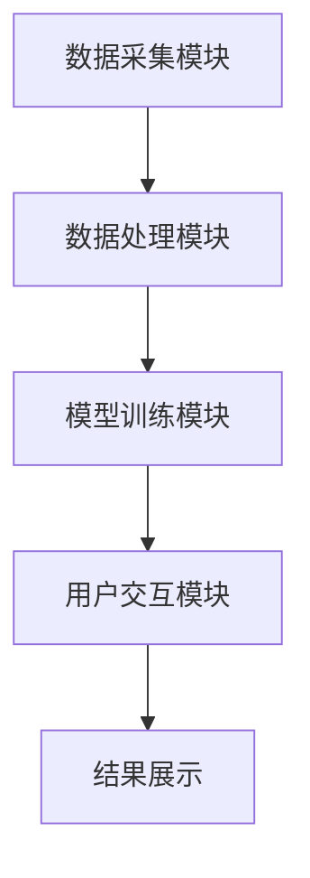
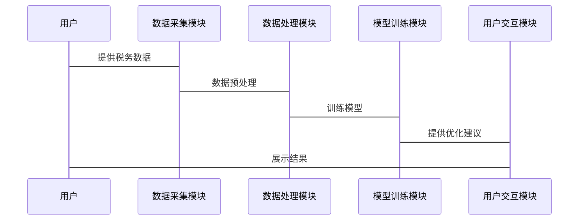

                 

<think>
嗯，用户现在需要我帮忙写一篇关于开发基于AI的智能税务规划助手的技术博客文章。用户提供了详细的结构大纲，包括摘要、关键词和目录。看起来用户希望内容详细，结构清晰，并且有实际的技术分析和案例。

首先，我需要确保文章的开头部分，包括标题、关键词和摘要。标题是“开发基于AI的智能税务规划助手”，关键词应该涵盖AI、税务规划、机器学习、自然语言处理、系统架构等。摘要要简明扼要，概述文章的核心内容和目标。

接下来是目录部分。用户已经给出了一个详细的大纲，包括五部分：背景与概述、核心概念与技术、算法原理、系统架构与设计、项目实战与优化。每部分下还有子章节，内容非常具体。

在写作过程中，我需要按照目录逐步展开，每个部分都要详细讲解。例如，在背景与概述部分，需要介绍税务规划的定义、重要性，以及AI如何改变这一领域。核心概念部分则要深入讲解数据处理、NLP和机器学习的应用。算法部分需要结合具体的模型和代码示例，可能使用Mermaid流程图和数学公式来解释原理。

系统架构设计部分，我需要绘制类图、架构图和交互图，使用Mermaid语法。项目实战部分则要提供实际的代码示例，解释每一步的作用，并通过案例分析来展示应用效果。

最后，用户要求在文章末尾加上作者信息，并且整体字数在10000到12000字左右。这意味着我需要确保每个章节内容丰富，覆盖所有必要的技术细节和实际应用。

总的来说，我需要按照用户提供的大纲，逐部分展开，确保内容详细、结构清晰，并且符合技术博客的专业性要求。同时，要注意使用正确的格式，如Markdown中的代码块、数学公式和Mermaid图表，以增强文章的可读性和专业性。
</think>

# 开发基于AI的智能税务规划助手

> 关键词：AI，税务规划，机器学习，自然语言处理，系统架构，税务优化

> 摘要：本文将详细介绍如何开发基于AI的智能税务规划助手。文章从税务规划的背景与目标出发，深入探讨AI在税务规划中的核心概念与技术，包括数据处理、自然语言处理和机器学习算法的原理。接着，文章详细讲解了系统架构设计与实现，包括功能模块划分、系统架构选型和接口设计。最后，通过项目实战与优化，展示了如何将理论应用于实践，并总结了开发过程中需要注意的事项和最佳实践。

---

# 第一部分：智能税务规划助手的背景与概述

## 第1章：智能税务规划助手的背景与目标

### 1.1 税务规划的定义与重要性

#### 1.1.1 税务规划的基本概念
税务规划是指通过合法的手段，优化个人或企业的税务负担，使其在遵守法律法规的前提下，实现税负最小化。税务规划的核心在于充分利用税法的灵活性，合理配置资源，降低税务支出。

#### 1.1.2 税务规划在个人和企业中的作用
- 对个人：通过合理配置资产、选择合适的纳税方式，降低个人所得税负担。
- 对企业：通过优化税务结构、合理分配收入和成本，降低企业所得税负担，提高企业净利润。

#### 1.1.3 数字化税务规划的趋势
随着数字化转型的推进，税务规划也在逐步向数字化、智能化方向发展。传统的税务规划依赖人工计算和经验判断，效率较低且容易出错。而基于AI的税务规划助手可以通过大数据分析和机器学习算法，快速提供个性化的税务优化方案。

### 1.2 人工智能在税务规划中的应用

#### 1.2.1 AI技术如何改变税务规划
- 数据驱动的分析：通过AI技术处理海量税务数据，提取关键特征，为税务规划提供科学依据。
- 自然语言处理（NLP）：用于分析税务文档、法规文本，提取关键信息，辅助税务规划。
- 机器学习模型：用于预测税务风险、优化税务方案，提供个性化建议。

#### 1.2.2 智能税务规划助手的核心价值
- 提高效率：快速分析大量税务数据，提供高效的税务规划方案。
- 增强准确性：通过AI算法减少人为错误，提高税务规划的准确性。
- 个性化服务：根据用户的具体情况，提供定制化的税务优化建议。

#### 1.2.3 当前市场中的AI税务工具现状
目前，市场上已经出现了一些基于AI的税务规划工具，但大多数仍处于初级阶段，主要依赖规则引擎和简单的数据分析。随着技术的进步，未来的智能税务规划助手将更加智能化、个性化，能够处理复杂的税务问题，并提供动态优化的建议。

### 1.3 本书的目标与结构

#### 1.3.1 本书的目标
本书旨在为开发者和研究人员提供一份全面的指南，详细介绍如何利用AI技术开发智能税务规划助手。书中将涵盖从理论到实践的各个方面，帮助读者从零开始构建一个基于AI的税务规划系统。

#### 1.3.2 本书的主要内容
- 第一部分：介绍智能税务规划助手的背景与目标。
- 第二部分：探讨AI在税务规划中的核心概念与技术。
- 第三部分：详细讲解智能税务规划助手的算法原理。
- 第四部分：分析系统的架构设计与实现。
- 第五部分：通过项目实战与优化，展示如何将理论应用于实践。

#### 1.3.3 本书的读者群体
本书适合以下读者：
- 对AI技术感兴趣的技术人员。
- 对税务规划领域有研究的学者和研究人员。
- 希望利用AI技术优化税务管理的企业或个人。

---

# 第二部分：智能税务规划助手的核心概念与技术

## 第2章：AI在税务规划中的核心概念

### 2.1 数据驱动的税务分析

#### 2.1.1 数据收集与处理
- 数据收集：从税务报表、财务数据、法规文本等多来源获取数据。
- 数据清洗：处理缺失值、异常值和重复数据。
- 数据转换：将数据转换为适合机器学习模型的形式，例如归一化、标准化等。

#### 2.1.2 数据特征提取
- 选择与税务相关的特征，例如收入、支出、资产、负债等。
- 利用特征工程提取更有意义的特征，例如通过PCA（主成分分析）降维。

#### 2.1.3 数据分析与建模
- 使用统计分析方法（如回归分析）和机器学习算法（如随机森林、神经网络）进行数据分析。
- 通过模型评估（如准确率、召回率、F1分数）选择最优模型。

### 2.2 自然语言处理在税务文档中的应用

#### 2.2.1 文本分类与信息提取
- 使用NLP技术对税务文档进行分类（如税务法规分类）。
- 通过信息抽取技术提取关键信息（如税率、优惠政策）。

#### 2.2.2 基于NLP的税务咨询
- 利用聊天机器人技术，为用户提供实时的税务咨询。
- 通过意图识别技术，理解用户需求并提供个性化的税务建议。

#### 2.2.3 语义理解在税务规则中的应用
- 使用语义理解技术（如BERT）分析税务法规，提取规则。
- 将提取的规则转化为可执行的代码逻辑，辅助税务规划。

### 2.3 机器学习在税务预测中的应用

#### 2.3.1 监督学习与税务预测
- 使用回归算法预测企业的税负。
- 使用分类算法预测税务风险（如逃税风险）。

#### 2.3.2 非监督学习在税务分析中的应用
- 使用聚类算法将客户分为不同的纳税类别。
- 使用异常检测算法识别潜在的税务风险。

#### 2.3.3 强化学习在税务优化中的潜力
- 使用强化学习算法优化税务方案。
- 利用动态规划方法解决复杂的税务优化问题。

---

## 第三章：基于机器学习的税务预测模型

### 3.1 税务预测模型的构建

#### 3.1.1 数据预处理与特征工程
- 数据清洗：处理缺失值、异常值。
- 特征提取：选择与税务相关的特征，如收入、支出、资产等。
- 特征转换：将数据转换为适合模型的形式，例如归一化、标准化。

#### 3.1.2 模型选择与训练
- 选择适合的机器学习模型（如随机森林、神经网络）。
- 使用训练数据训练模型，调整模型参数以优化性能。

#### 3.1.3 模型评估与优化
- 使用测试数据评估模型性能（如准确率、召回率）。
- 通过交叉验证优化模型参数。

### 3.2 基于NLP的税务信息提取

#### 3.2.1 文本预处理与分词
- 对税务文档进行分词处理，提取关键词。
- 使用分词工具（如jieba）对中文文本进行分词。

#### 3.2.2 基于BERT的税务信息抽取
- 使用预训练的BERT模型对税务文档进行编码。
- 通过注意力机制提取关键信息。

#### 3.2.3 模型训练与优化
- 使用标注数据训练信息抽取模型。
- 通过调整模型参数和优化算法提高抽取准确率。

### 3.3 税务优化算法的设计

#### 3.3.1 基于动态规划的税务优化
- 使用动态规划方法解决税务优化问题。
- 通过状态转移方程找到最优解。

#### 3.3.2 基于遗传算法的税务方案生成
- 使用遗传算法生成多种税务方案。
- 通过适应度函数评估方案的优劣。

#### 3.3.3 多目标优化在税务规划中的应用
- 使用多目标优化算法平衡不同目标（如税负最小化、风险最小化）。
- 通过 Pareto 优化找到最优解。

---

## 第四章：智能税务规划助手的系统架构与设计

### 4.1 系统功能设计

#### 4.1.1 功能模块划分
- 数据采集模块：负责收集税务数据。
- 数据处理模块：对数据进行清洗、转换和特征提取。
- 模型训练模块：训练机器学习模型，提供税务预测和优化建议。
- 用户交互模块：为用户提供友好的界面，展示结果并提供交互功能。

#### 4.1.2 系统架构设计
- 分层架构：将系统划分为数据层、业务逻辑层和表现层。
- 微服务架构：将系统功能模块化，每个模块独立运行和扩展。

#### 4.1.3 接口设计与交互流程
- API接口设计：定义接口规范，方便不同模块之间的通信。
- 用户交互流程设计：设计用户操作流程，确保用户体验流畅。
- 异常处理机制：设计错误处理流程，确保系统稳定运行。

### 4.2 系统架构设计

#### 4.2.1 系统架构图


#### 4.2.2 系统交互图


### 4.3 接口设计与交互流程

#### 4.3.1 API接口设计
- 数据接口：提供RESTful API用于数据上传和下载。
- 模型接口：提供API用于税务预测和优化。

#### 4.3.2 用户交互流程设计
- 用户登录：用户通过界面登录系统。
- 数据上传：用户上传税务数据。
- 模型运行：系统根据数据运行模型，生成优化建议。
- 结果展示：用户查看优化建议并进行交互。

#### 4.3.3 系统异常处理机制
- 数据异常处理：检测数据错误并提示用户。
- 模型异常处理：检测模型运行错误并提供解决方案。
- 用户操作异常处理：检测用户操作错误并提示用户。

---

## 第五章：项目实战与优化

### 5.1 项目实战

#### 5.1.1 环境搭建与工具安装
- 安装Python和相关开发工具（如Jupyter Notebook）。
- 安装机器学习库（如scikit-learn、TensorFlow）。
- 安装NLP处理库（如jieba、BERT）。

#### 5.1.2 核心代码实现
- 数据预处理代码：
```python
import pandas as pd
import numpy as np

# 数据加载
data = pd.read_csv('tax_data.csv')

# 数据清洗
data = data.dropna()
data = data.drop_duplicates()

# 特征提取
X = data[['income', 'expenses', 'assets']]
y = data['tax']
```

- 模型训练代码：
```python
from sklearn.ensemble import RandomForestRegressor

model = RandomForestRegressor(n_estimators=100, random_state=42)
model.fit(X, y)
```

#### 5.1.3 项目实战总结
- 项目实战展示了如何将理论应用于实际。
- 通过代码实现，读者可以更好地理解模型的训练和优化过程。
- 实战中需要注意数据质量和模型调优。

### 5.2 项目优化

#### 5.2.1 性能优化
- 使用分布式计算优化模型训练速度。
- 通过缓存技术减少重复计算。

#### 5.2.2 模型优化
- 使用超参数调优（如网格搜索）提高模型性能。
- 使用集成学习（如投票分类器）优化模型结果。

#### 5.2.3 安全性优化
- 数据加密：保护用户数据不被泄露。
- 权限控制：限制用户对敏感数据的访问权限。

### 5.3 项目总结与展望

#### 5.3.1 项目总结
- 通过项目实战，我们掌握了如何开发基于AI的智能税务规划助手。
- 项目中涉及到的数据处理、模型训练和系统设计是开发此类工具的关键。

#### 5.3.2 项目展望
- 进一步优化模型性能，提高预测准确率。
- 增加更多功能模块，如税务申报、税务合规性检查等。
- 探索更多AI技术在税务规划中的应用，如区块链技术、边缘计算等。

---

# 第六章：最佳实践与注意事项

## 6.1 最佳实践

### 6.1.1 数据处理
- 数据清洗要彻底，确保数据质量。
- 特征提取要合理，避免信息过载。

### 6.1.2 模型选择
- 根据数据特点选择合适的模型。
- 通过交叉验证优化模型参数。

### 6.1.3 系统设计
- 模块化设计便于后续扩展和维护。
- 接口设计要规范，确保不同模块之间能够顺利通信。

## 6.2 注意事项

### 6.2.1 数据隐私
- 确保用户数据的安全，防止数据泄露。
- 遵守相关法律法规，合法使用数据。

### 6.2.2 模型局限性
- 机器学习模型可能存在过拟合或欠拟合的问题。
- 需要定期更新模型，以适应新的数据和法规变化。

### 6.2.3 用户体验
- 提供友好的用户界面，确保用户体验良好。
- 提供详细的使用说明，帮助用户更好地使用系统。

## 6.3 项目小结

通过本文的详细讲解，我们了解了如何开发基于AI的智能税务规划助手。从理论到实践，从系统设计到项目实现，每一步都需要仔细思考和规划。希望本文能为读者提供有价值的参考，帮助他们更好地理解和应用AI技术在税务规划中的应用。

---

# 作者：AI天才研究院/AI Genius Institute & 禅与计算机程序设计艺术 /Zen And The Art of Computer Programming

