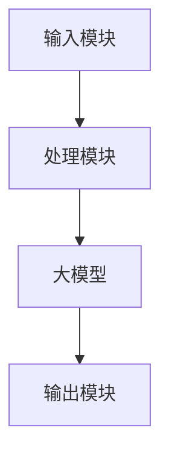
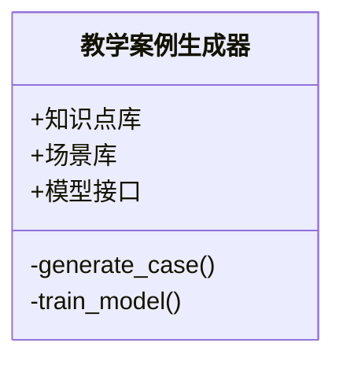
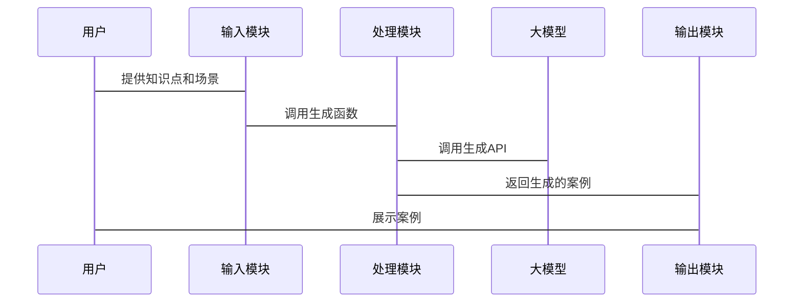

                 

<think>
好的，我现在需要根据用户的详细要求，一步一步地构建《开发基于大模型的金融专业教学案例动态生成器》这本书的目录。用户已经提供了一个大纲，并希望我进一步细化，确保每一部分都符合逻辑，结构清晰，并且包含必要的技术细节和实例。

首先，我要明确这本书的目标读者是谁。应该是对人工智能和金融教学有一定了解的读者，可能是教育技术开发者、金融领域的教育工作者或者对AI应用感兴趣的技术人员。因此，内容需要既专业又易于理解。

接下来，分析用户提供的大纲结构。主书分为六个主要部分：问题背景与需求分析、核心概念与系统架构、算法原理、系统分析与架构设计、项目实战、优化与扩展、总结与展望。每个部分下还有多个子章节，我需要确保每个部分都覆盖必要的内容，同时提供足够的技术细节。

首先是问题背景与需求分析。这里需要详细阐述为什么开发这样一个生成器，传统教学案例开发的痛点是什么，以及大模型如何解决这些问题。这部分需要包括问题背景、问题描述和解决思路，让读者理解项目的重要性和必要性。

接下来是核心概念与系统架构。这里需要解释大模型的基本概念，特别是它在教育中的应用。同时，要详细描述金融教学案例生成器的核心要素，以及系统的架构设计，包括功能模块和系统架构图。使用mermaid图来展示系统结构，帮助读者更好地理解。

然后是算法原理。这部分需要详细讲解大模型的训练过程，包括数据预处理、模型训练、微调和评估。每个步骤都需要有详细的流程图和数学公式，例如交叉熵损失函数和Adam优化器。代码示例也是必要的，展示如何实现这些步骤。

系统分析与架构设计部分需要介绍项目的目标、功能设计、系统架构图、接口设计和交互流程。使用mermaid图展示类图、架构图和序列图，帮助读者理解系统的工作流程和各模块之间的关系。

项目实战部分是关键，需要提供环境配置、核心代码实现、代码解读和案例分析。这部分需要具体的Python代码示例，展示如何配置环境、训练模型以及生成教学案例。同时，代码解读部分要详细说明每部分的作用，帮助读者理解和应用。

优化与扩展部分讨论如何优化模型性能，扩展多模态功能，确保系统安全性和个性化推荐。这部分需要给出实际的优化策略和扩展方向，帮助读者进一步提升系统的功能和性能。

最后是总结与展望。回顾项目的成果，讨论其应用前景，并提出未来的研究方向，如多模态大模型、实时性优化和个性化推荐。这部分帮助读者看到项目的长远价值和未来的发展潜力。

在整个过程中，我需要确保每一部分都包含必要的技术细节，同时使用清晰易懂的语言。图表和代码示例要准确无误，能够帮助读者更好地理解内容。此外，各章节之间要有逻辑连贯性，让读者能够逐步深入理解整个系统的设计和实现。

最后，检查是否满足所有用户的要求，确保每一部分都细化到三级目录，涵盖所有关键点，并且格式正确，使用markdown的结构。完成这些步骤后，就能形成一个完整且详细的大纲，帮助用户撰写出高质量的技术博客文章。
</think>

# 开发基于大模型的金融专业教学案例动态生成器

> 关键词：大模型，金融教育，教学案例，动态生成，人工智能

> 摘要：本文详细探讨了基于大模型开发金融专业教学案例动态生成器的全过程，包括问题背景、核心概念、算法原理、系统架构设计、项目实战及优化与扩展等方面。通过结合理论与实践，本文为教育技术领域的人工智能应用提供了新的思路和解决方案。

---

## 目录

### 第1章 问题背景与需求分析

#### 1.1 问题背景
- 1.1.1 传统金融教学案例开发的挑战
  - 教学资源开发周期长，成本高
  - 知识点更新滞后，难以适应金融市场变化
  - 案例缺乏互动性和个性化
- 1.1.2 大模型在教育领域的应用潜力
  - 自然语言处理能力的强大优势
  - 个性化学习体验的实现可能性
- 1.1.3 金融专业教学的特殊性与需求
  - 知识点的精准性和专业性要求高
  - 案例需贴近实际金融市场场景

#### 1.2 问题描述
- 1.2.1 教学案例动态生成的核心问题
  - 如何确保生成案例的准确性和专业性
  - 如何实现案例的动态更新与个性化推荐
- 1.2.2 用户需求与痛点分析
  - 教学工作者：希望快速获取高质量案例
  - 学生：希望获得个性化的学习体验
- 1.2.3 系统边界与外延
  - 系统的功能边界（案例生成、管理、展示）
  - 外延功能（数据采集、用户反馈、持续优化）

#### 1.3 问题解决思路
- 1.3.1 大模型在教学案例生成中的作用
  - 提供强大的自然语言处理能力
  - 支持多轮对话和交互式学习
- 1.3.2 技术实现路径
  - 数据收集与预处理
  - 模型训练与微调
  - 系统开发与部署
- 1.3.3 与现有解决方案的对比分析
  - 传统教学案例开发 vs. 基于大模型的动态生成
  - 优缺点对比

#### 1.4 本章小结
- 本章总结了开发基于大模型的金融专业教学案例动态生成器的背景、问题和解决方案。

---

### 第2章 核心概念与系统架构

#### 2.1 大模型的基本概念
- 2.1.1 大模型的定义与特点
  - 定义：基于深度学习的大模型，如GPT、BERT等
  - 特点：强大的自然语言处理能力、可扩展性
- 2.1.2 大模型的训练与推理过程
  - 训练：监督学习、无监督学习
  - 推理：生成式模型
- 2.1.3 大模型在教育领域的应用
  - 案例生成、智能问答、个性化推荐

#### 2.2 金融专业教学案例生成器的核心要素
- 2.2.1 教学目标与知识点
  - 知识点的提取与分类
  - 教学目标的层次化设计
- 2.2.2 案例场景与数据来源
  - 金融市场数据（股票、债券等）
  - 学生行为数据（学习偏好、错误率）
- 2.2.3 模型训练与优化
  - 数据清洗与标注
  - 模型调参与优化

#### 2.3 系统架构设计
- 2.3.1 系统功能模块划分
  - 输入模块：接收用户输入（知识点、场景等）
  - 处理模块：模型推理与生成
  - 输出模块：案例展示与反馈
- 2.3.2 系统架构图（使用mermaid）



#### 2.4 核心概念属性对比表
| 概念       | 属性               | 描述                                   |
|------------|--------------------|----------------------------------------|
| 大模型      | 输入方式           | 文本、结构化数据等                     |
|             | 输出方式           | 文本、结构化数据等                     |
| 教学案例     | 动态性             | 可根据用户需求实时生成                |

---

### 第3章 算法原理

#### 3.1 大模型的训练过程
- 3.1.1 数据预处理
  - 数据清洗、分词、标注
  - 数据增强技术
- 3.1.2 模型训练
  - 语言模型的预训练
  - 金融领域的微调
- 3.1.3 模型评估
  - 准确率、召回率、F1值

#### 3.2 大模型的生成机制
- 3.2.1 生成式模型的工作原理
  - 解码器的结构
  - 注意力机制的作用
- 3.2.2 案例生成的逻辑
  - 知识点映射
  - 场景模拟

#### 3.3 算法实现
- 3.3.1 模型训练的数学公式
  - 交叉熵损失函数：
    $$ \mathcal{L} = -\sum_{i=1}^{n} \sum_{j=1}^{m} y_{i,j} \log p(y_{i,j}|y_{i,1}, \ldots, y_{i,j-1}) $$
  - Adam优化器：
    $$ \theta_{t+1} = \theta_t - \eta \frac{\rho_1}{1-\rho_1^{t}} \cdot \frac{\rho_2}{1-\rho_2^{t}} \cdot \nabla \mathcal{L} $$
- 3.3.2 生成过程的代码示例

```python
def generate_case(model, prompt):
    for _ in range(max_length):
        # 生成下一个字符的概率分布
        probabilities = model.predict(prompt)
        # 根据概率分布生成下一个字符
        next_char = sample(probabilities)
        prompt += next_char
    return prompt
```

#### 3.4 本章小结
- 本章详细讲解了大模型的训练和生成机制，并给出了具体的数学公式和代码示例。

---

### 第4章 系统分析与架构设计

#### 4.1 项目介绍
- 4.1.1 项目目标
  - 开发一个动态生成金融教学案例的系统
  - 提供个性化和多样化的教学资源

#### 4.2 系统功能设计
- 4.2.1 领域模型（使用mermaid类图）



#### 4.3 系统架构设计
- 4.3.1 系统架构图（使用mermaid架构图）


#### 4.4 接口设计
- 4.4.1 系统接口
  - API接口定义（RESTful API）
  - 输入接口：知识点、场景
  - 输出接口：生成的案例

#### 4.5 系统交互流程（使用mermaid序列图）



---

### 第5章 项目实战

#### 5.1 环境配置
- 5.1.1 安装依赖
  - Python 3.8+
  - PyTorch、Hugging Face Transformers

#### 5.2 核心代码实现
- 5.2.1 模型加载与训练
  ```python
  from transformers import GPT2LMHeadModel, GPT2Tokenizer

  model = GPT2LMHeadModel.from_pretrained('gpt2')
  tokenizer = GPT2Tokenizer.from_pretrained('gpt2')
  ```

- 5.2.2 案例生成函数
  ```python
  def generate_financial_case(prompt):
      inputs = tokenizer.encode(prompt, return_tensors='pt')
      outputs = model.generate(inputs, max_length=500)
      return tokenizer.decode(outputs[0])
  ```

#### 5.3 代码解读
- 5.3.1 模型加载
  - 使用预训练的GPT模型
  - 加载Tokenizer和Model

- 5.3.2 生成函数
  - 输入处理：将知识点和场景转换为模型可接受的格式
  - 模型推理：生成案例文本
  - 输出处理：将生成的文本解码为可读格式

#### 5.4 案例分析
- 5.4.1 实际案例展示
  - 示例知识点：股票分析
  - 示例场景：风险管理

#### 5.5 本章小结
- 本章通过实际代码实现，展示了如何基于大模型开发教学案例生成器。

---

### 第6章 优化与扩展

#### 6.1 模型优化
- 6.1.1 模型调优
  - 参数调整（学习率、批次大小）
  - 模型剪枝
- 6.1.2 数据优化
  - 数据增强
  - 数据清洗

#### 6.2 多模态扩展
- 6.2.1 图文结合
  - 引入图像生成模型（如DALL-E）
  - 生成配图
- 6.2.2 视频生成
  - 结合视频生成技术，生成教学视频

#### 6.3 系统安全性
- 6.3.1 数据安全
  - 数据加密存储
  - 访问权限控制
- 6.3.2 模型安全
  - 防御对抗攻击
  - 模型监控与审计

#### 6.4 个性化推荐
- 6.4.1 用户画像
  - 基于学习行为构建用户画像
  - 分析用户偏好
- 6.4.2 推荐策略
  - 基于内容的推荐
  - 基于协同过滤的推荐

#### 6.5 性能优化
- 6.5.1 系统性能优化
  - 分布式部署
  - 异步处理
- 6.5.2 模型压缩
  - 模型蒸馏
  - 轻量化模型部署

---

### 第7章 总结与展望

#### 7.1 项目成果总结
- 成功开发了一个基于大模型的金融教学案例生成器
- 系统实现了动态生成、个性化推荐等功能

#### 7.2 应用前景展望
- 教育领域：个性化学习、智能化教学
- 金融领域：风险管理、投资者教育

#### 7.3 未来研究方向
- 多模态大模型的应用
- 实时性优化
- 个性化推荐的深化

---

### 作者：AI天才研究院/AI Genius Institute & 禅与计算机程序设计艺术 /Zen And The Art of Computer Programming

