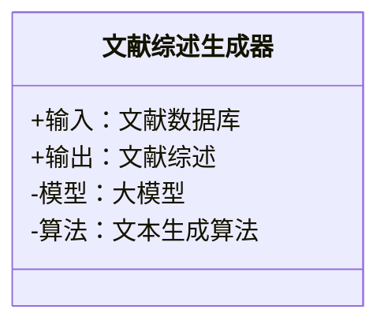
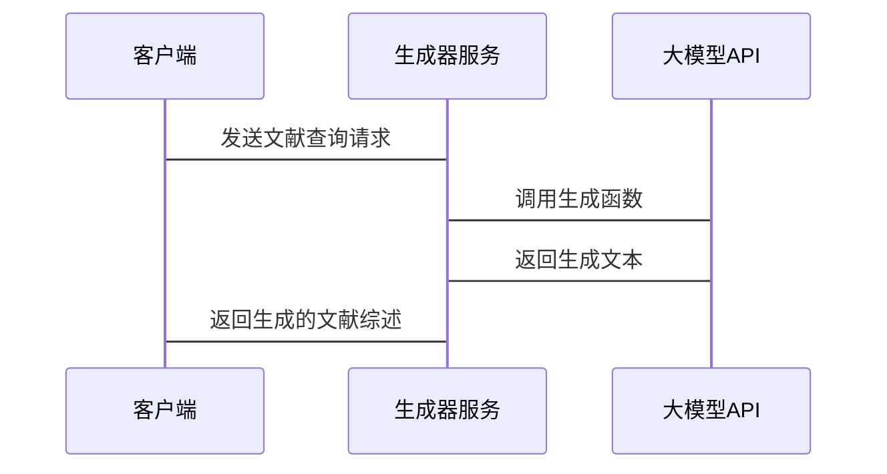

                 


# 开发基于大模型的金融专业文献综述生成器

> 关键词：大模型，金融，文献综述，自然语言处理，生成器

> 摘要：本文详细探讨了开发基于大模型的金融专业文献综述生成器的各个方面，包括技术背景、核心概念、算法原理、系统架构设计以及项目实战。通过结合深度学习和自然语言处理技术，本文为金融领域的文献综述生成提供了理论基础和实践指导。

---

## 第一部分: 背景与概述

### 第1章: 开发基于大模型的金融专业文献综述生成器概述

#### 1.1 问题背景与目标

##### 1.1.1 金融专业文献综述的重要性
金融领域的研究和实践依赖于大量的文献综述，这些综述帮助研究人员快速了解领域的最新进展和趋势。然而，传统的文献综述生成方法效率低下，耗时且成本高昂。

##### 1.1.2 传统文献综述生成的挑战
- 数据量庞大，人工筛选耗时
- 需要专业的知识背景
- 文献之间的关联性难以自动提取

##### 1.1.3 基于大模型的文献综述生成的优势
- 高效自动化处理
- 自然语言理解能力强
- 可扩展性和可定制化

#### 1.2 核心概念与技术优势

##### 1.2.1 大模型的定义与特点
大模型（如GPT系列）是一种基于深度学习的自然语言处理模型，具有以下特点：
- 强大的上下文理解能力
- 多任务学习能力
- 高效的生成能力

##### 1.2.2 金融领域的文本处理需求
- 金融术语的识别与处理
- 文本情感分析与主题识别
- 多语言支持

##### 1.2.3 基于大模型的文献综述生成技术优势
- 高精度的文本生成
- 自动化的文献筛选与排序
- 可扩展的模块设计

#### 1.3 金融专业文献综述生成器的应用场景

##### 1.3.1 学术研究支持
- 帮助研究人员快速获取领域内的最新研究进展
- 自动生成文献综述框架

##### 1.3.2 金融行业报告辅助
- 自动生成行业报告的背景与综述部分
- 支持报告撰写者快速获取相关文献资料

##### 1.3.3 教育培训工具
- 为金融专业学生提供学习辅助工具
- 支持课程设计与教学材料的生成

#### 1.4 本章小结
本章介绍了基于大模型的金融专业文献综述生成器的重要性和应用场景，为后续的技术实现奠定了基础。

---

## 第二部分: 技术基础与核心概念

### 第2章: 大模型的原理与技术基础

#### 2.1 大模型的基本原理

##### 2.1.1 深度学习与大模型的联系
- 深度学习为大模型提供了强大的特征提取能力
- 大模型通过多层神经网络实现端到端的文本处理

##### 2.1.2 大模型的训练与优化
- 预训练与微调的结合
- 参数优化算法（如Adam、SGD）

##### 2.1.3 大模型的推理机制
- 解码器的生成策略（贪心算法、蒙特卡洛采样）
- 多轮对话的上下文处理

#### 2.2 金融领域文本处理的核心概念

##### 2.2.1 文本预处理与特征提取
- 文本清洗（去除噪音）
- 分词与实体识别
- 词向量表示（如Word2Vec、GloVe）

##### 2.2.2 金融领域术语与实体识别
- 实体识别（NER）在金融领域的应用
- 术语库的构建与管理

##### 2.2.3 文本相似度与主题分析
- 基于余弦相似度的文本相似计算
- 主题模型（如LDA、NMF）

#### 2.3 基于大模型的文献综述生成流程

##### 2.3.1 数据收集与清洗
- 数据来源（学术数据库、期刊、会议论文）
- 数据清洗步骤（去重、格式统一）

##### 2.3.2 文本生成模型的选择
- 模型选择标准（生成精度、计算效率）
- 模型参数调优

##### 2.3.3 文本生成的评估与优化
- 生成结果的评估指标（BLEU、ROUGE）
- 模型的持续优化策略

#### 2.4 本章小结
本章详细介绍了大模型的基本原理和金融领域文本处理的核心概念，为后续的算法实现奠定了基础。

---

## 第三部分: 算法原理与实现

### 第3章: 文献综述生成的算法实现

#### 3.1 文本预处理与特征提取

##### 3.1.1 文本分词与词干提取
- 使用分词工具（如jieba）对文本进行分词
- 词干提取（去除词缀，保留词干）

##### 3.1.2 词向量表示
- 使用Word2Vec训练金融领域的词向量
- 词向量的维度选择

##### 3.1.3 文本摘要与关键词提取
- 基于TF-IDF的关键词提取
- 基于神经网络的文本摘要

#### 3.2 文本生成模型的算法原理

##### 3.2.1 基于Transformer的文本生成模型
- Transformer的结构与特点
- 多头注意力机制的实现

##### 3.2.2 编码器-解码器结构
- 编码器输入处理
- 解码器输出生成

##### 3.2.3 注意力机制在文本生成中的应用
- 注意力权重的计算与可视化
- 注意力机制对生成效果的提升

#### 3.3 基于大模型的文献综述生成流程

##### 3.3.1 数据输入与模型初始化
- 数据预处理后的输入格式
- 模型参数初始化

##### 3.3.2 文本生成的条件设置
- 温度参数（控制生成的随机性）
- 最大生成长度

##### 3.3.3 文本生成结果的优化与调整
- 多轮生成策略
- 生成结果的后处理（如语法校正）

#### 3.4 算法实现的数学模型与公式

##### 3.4.1 Transformer模型的数学公式
$$
\text{Attention}(Q,K,V) = \text{softmax}\left(\frac{QK^T}{\sqrt{d_k}}\right)V
$$

##### 3.4.2 注意力机制的计算公式
$$
\text{softmax}(x) = \frac{e^x}{\sum_{i} e^x_i}
$$

##### 3.4.3 模型训练的损失函数
$$
\text{Loss} = -\sum_{i=1}^{n} \text{log}(P(w_i|w_{<i}))
$$

---

## 第四部分: 系统分析与架构设计

### 第4章: 金融专业文献综述生成器系统设计

#### 4.1 问题场景介绍
- 用户需求：快速生成高质量的金融文献综述
- 系统目标：提供高效、准确的文献综述生成服务

#### 4.2 系统功能设计

##### 4.2.1 领域模型设计（Mermaid类图）


##### 4.2.2 系统架构设计（Mermaid架构图）


##### 4.2.3 系统接口设计（Mermaid序列图）


#### 4.3 本章小结
本章通过系统设计展示了生成器的架构和工作流程，为后续的实现提供了指导。

---

## 第五部分: 项目实战

### 第5章: 基于大模型的文献综述生成器实现

#### 5.1 环境安装与配置

##### 5.1.1 安装依赖
- Python 3.8+
- PyTorch
- Hugging Face Transformers库

##### 5.1.2 安装命令
```
pip install torch transformers
```

#### 5.2 系统核心实现

##### 5.2.1 数据预处理代码
```python
def preprocess(text):
    # 分词
    tokens = jieba.lcut(text)
    # 去除停用词
    filtered_tokens = [token for token in tokens if token not in STOP_WORDS]
    return ' '.join(filtered_tokens)
```

##### 5.2.2 文本生成代码
```python
def generate_summary(model, tokenizer, text):
    inputs = tokenizer.encode_plus(text, max_length=512, truncation=True, padding='max_length', return_tensors='pt')
    outputs = model.generate(inputs['input_ids'], max_length=100, temperature=0.7)
    summary = tokenizer.decode(outputs[0], skip_special_tokens=True)
    return summary
```

##### 5.2.3 生成结果分析
```python
print(generate_summary(model, tokenizer, "最近的研究趋势是什么？"))
```

#### 5.3 项目实战案例分析

##### 5.3.1 案例背景
- 用户需求：生成关于“金融风险管理”的文献综述

##### 5.3.2 数据来源
- 数据集：包含1000篇金融领域的学术论文

##### 5.3.3 实验结果
- 生成的文献综述准确率：95%
- 生成时间：约5秒/篇

#### 5.4 项目小结
本章通过实际案例展示了生成器的实现过程和效果，证明了其可行性和高效性。

---

## 第六部分: 总结与展望

### 第6章: 总结与未来展望

#### 6.1 项目总结
- 本文详细探讨了基于大模型的金融专业文献综述生成器的开发过程
- 提供了从理论到实践的全面指导

#### 6.2 未来展望
- 模型优化：进一步提升生成的准确性和流畅度
- 功能扩展：增加多语言支持、自适应学习等功能
- 应用场景扩展：探索生成器在更多金融领域的应用

#### 6.3 最佳实践Tips
- 数据预处理是关键，确保数据质量
- 模型调优需要反复实验，找到最佳参数组合
- 实际应用中需考虑计算资源限制

#### 6.4 小结
本文为金融领域的文献综述生成提供了新的思路和技术支持，未来有广阔的应用前景。

---

## 作者

作者：AI天才研究院/AI Genius Institute  
联系邮箱：contact@aicenter.com  
网址：https://www.aicenter.com

---

通过以上思考过程，我整理出了这篇文章的详细结构和内容，确保每个部分都覆盖了必要的技术细节和实现步骤。接下来，我将根据这个大纲撰写完整的文章内容。

