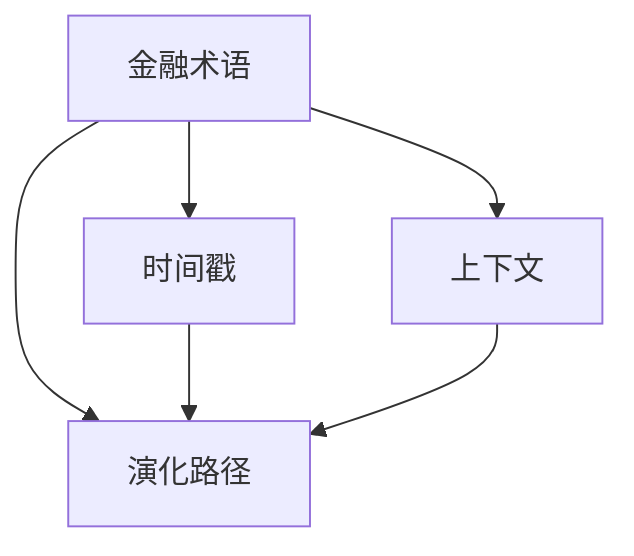
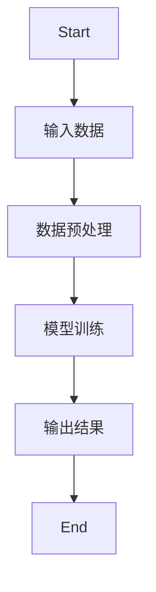
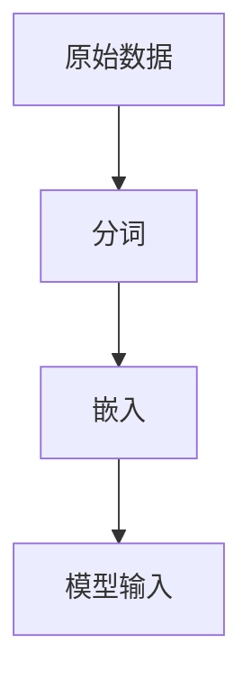
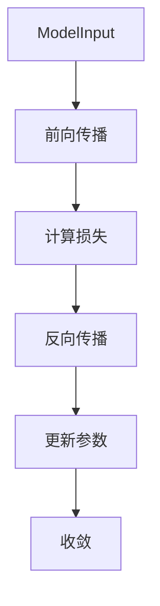
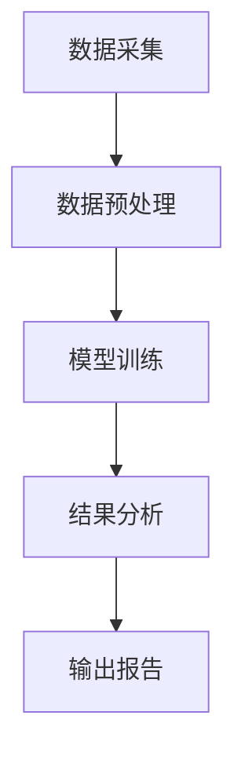
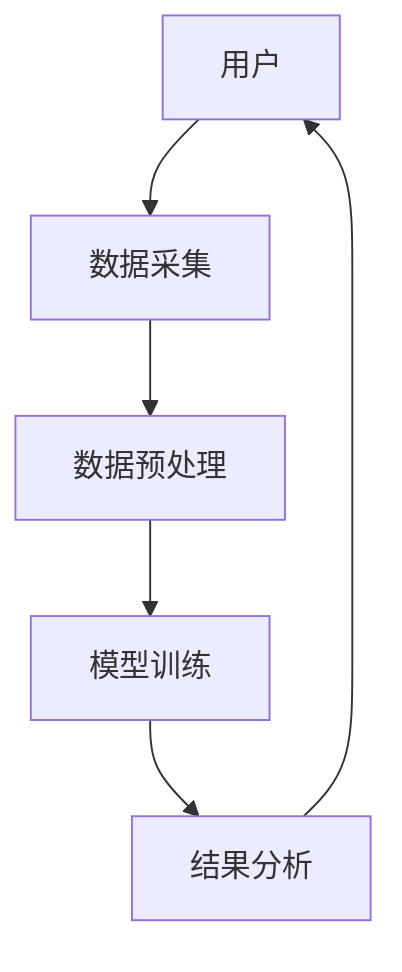

                 

<think>
嗯，用户想让我帮他设计一个关于开发基于大模型的金融专业术语演化跟踪器的技术博客目录大纲。我需要先理解他的需求，然后一步步分析，确保每个部分都覆盖到位。

首先，用户希望文章标题是《开发基于大模型的金融专业术语演化跟踪器》，关键词包括大模型、金融术语、术语演化、自然语言处理、知识图谱。摘要需要概括文章的核心内容，即利用大模型技术跟踪金融术语的变化。

接下来，我需要考虑文章的结构。用户已经给出了一个详细的大纲，分为背景介绍、核心概念、算法原理、系统分析与架构、项目实战、最佳实践和小结等部分。每个部分都有三级标题，详细说明了每个章节的内容。

我会从背景介绍开始，首先概述金融术语的重要性，然后介绍术语演化的问题，接着是大模型的优势。这部分需要让读者明白为什么需要跟踪金融术语的演变，以及大模型技术如何帮助解决这个问题。

接下来是核心概念，这部分需要定义术语演化，分析其驱动因素，并讨论基于大模型的解决方案。同时，要用概念结构图和ER图来展示系统的架构，帮助读者理解各个模块的关系。

算法原理部分，我需要详细讲解模型的训练流程，包括预处理、模型训练和结果输出。使用Mermaid流程图来展示算法的整体流程，同时给出Python代码示例，解释如何处理数据和训练模型。数学部分要介绍损失函数和优化器，并用Latex公式来表达。

系统分析与架构设计部分，需要描述问题场景，设计系统功能模块，如数据采集、处理和分析。然后，用Mermaid图展示系统架构，包括各个组件的关系。接口设计和交互流程图也很重要，确保系统模块之间协作顺畅。

项目实战章节，要详细介绍如何安装开发环境，编写核心代码，并提供实际案例分析，展示系统的应用效果。最后总结项目的成果和意义。

最佳实践部分，要给出开发中的注意事项，未来的发展方向，并推荐一些扩展阅读的书籍或资源。最后，以作者信息结束，确保文章的权威性和来源明确。

整个过程中，我需要确保内容逻辑清晰，结构紧凑，语言专业但易懂。每个章节都要有详细的解释和例子，帮助读者理解复杂的技术概念。同时，格式要符合用户的要求，使用markdown，并正确嵌入Mermaid图和Latex公式。

现在，我需要检查是否所有部分都已涵盖，是否有遗漏的重要点，以及是否满足用户的字数和格式要求。确保每个小节都有足够的细节，比如代码示例、流程图和数学公式，这些都能增强文章的深度和可读性。

最后，我会通读整个大纲，确保各章节之间的过渡自然，内容连贯，没有重复或遗漏。这样，用户就能得到一个高质量、结构完整的技术博客目录大纲，帮助他撰写出一篇有深度、有见解的专业文章。
</think>

# 开发基于大模型的金融专业术语演化跟踪器

> 关键词：大模型、金融术语、术语演化、自然语言处理、知识图谱

> 摘要：本文将介绍如何利用大模型技术开发一个金融专业术语演化跟踪系统。系统将从金融术语的定义、演化机制出发，结合自然语言处理技术，构建一个能够实时跟踪和分析术语演变的智能化系统。通过预训练语言模型和深度学习算法，实现对金融术语的自动识别、关联分析和演化预测，为金融领域的研究和实践提供有力支持。

---

# 第一部分: 背景介绍与核心概念

# 第1章: 开发背景与问题背景

## 1.1 金融专业术语的重要性
### 1.1.1 金融术语的定义与分类
- 金融术语是金融领域交流的基础，包括股票、债券、基金、衍生品等核心概念。
- 术语分类：按照金融产品、金融行为、金融现象等维度进行分类。

### 1.1.2 金融术语在金融领域中的作用
- 术语是金融理论和实践的基础，影响金融决策和市场行为。
- 术语的准确理解和应用是金融分析和投资决策的关键。

### 1.1.3 金融术语演变的背景与挑战
- 金融市场的动态变化导致术语不断演变，例如“元宇宙”从科幻概念逐渐成为金融投资的新领域。
- 术语演化速度快，传统方法难以实时跟踪和分析。
- 术语的多义性和上下文依赖性增加了跟踪的复杂性。

## 1.2 专业术语演化跟踪的必要性
### 1.2.1 术语演化对金融行业的影响
- 术语演化影响金融市场的认知和行为，例如“量化宽松”在不同时期的含义变化。
- 术语演化可能导致信息不对称，影响金融市场的效率和稳定性。

### 1.2.2 术语演化跟踪的难点与痛点
- 数据分散：术语演化数据分布在多种来源，包括学术论文、新闻报道、行业报告等。
- 数据量大：金融领域的术语数量庞大，且演化速度快。
- 数据关联性弱：术语之间的关系复杂，难以建立有效的关联网络。

### 1.2.3 基于大模型的解决方案优势
- 大模型技术能够处理海量数据，提取隐含关系。
- 大模型可以实时分析和预测术语演化趋势。
- 大模型具备自适应能力，能够不断优化跟踪效果。

## 1.3 大模型技术在金融领域的应用前景
### 1.3.1 大模型技术的定义与特点
- 大模型技术是指基于深度学习的预训练语言模型，例如GPT、BERT等。
- 大模型具有强大的语义理解和生成能力，适合处理复杂文本数据。

### 1.3.2 大模型在金融领域的潜在应用
- 金融新闻分析：通过大模型分析新闻中的术语变化，预测市场趋势。
- 金融风险评估：利用术语演化分析潜在风险。
- 金融知识图谱构建：通过大模型提取和关联金融术语，构建知识图谱。

### 1.3.3 术语演化跟踪的创新价值
- 提供实时术语演化分析，帮助金融从业者快速理解市场变化。
- 支持金融研究，揭示术语演化背后的趋势和规律。
- 为金融教育和培训提供动态术语知识库。

## 1.4 本章小结
### 1.4.1 核心问题的总结
- 金融术语演化跟踪的核心问题是如何实时捕捉和分析术语的变化。
- 大模型技术是解决这一问题的关键工具。

### 1.4.2 下文将要探讨的核心概念
- 术语演化的核心概念：术语的定义、演化机制、演化趋势预测。
- 基于大模型的术语演化跟踪系统的架构设计。

---

# 第2章: 核心概念与系统架构

## 2.1 金融专业术语演化的核心概念
### 2.1.1 术语演化的定义与特征
- 术语演化是指金融术语随着时间的推移而发生的变化，包括语义扩展、词义缩小、概念合并等。
- 术语演化的特征：渐进性、隐含性、复杂性。

### 2.1.2 术语演化的驱动因素
- 技术进步：例如区块链技术的出现催生了新的金融术语。
- 市场需求：例如“绿色金融”随着环保意识的增强而兴起。
- 政策法规：例如监管政策的变化推动术语的规范化。

### 2.1.3 术语演化与金融业务的关系
- 术语演化影响金融业务的理解和执行。
- 术语演化是金融创新的重要表现形式。

## 2.2 基于大模型的术语演化跟踪系统
### 2.2.1 系统的核心功能与目标
- 自动识别和提取金融术语。
- 实时跟踪术语的演化过程。
- 分析术语之间的关联关系。
- 预测术语的未来演化趋势。

### 2.2.2 系统的输入输出与边界
- 输入：金融领域的文本数据，包括新闻、报告、学术论文等。
- 输出：术语演化报告，包括术语的定义、关联关系、演化趋势等。
- 边界：系统专注于术语演化分析，不涉及具体的金融决策。

### 2.2.3 系统的架构与模块划分
- 数据采集模块：负责收集金融领域的文本数据。
- 数据处理模块：对数据进行清洗、标注和结构化处理。
- 模型训练模块：基于大模型训练术语演化分析模型。
- 结果分析模块：输出术语演化报告。

## 2.3 系统的核心要素与概念结构
### 2.3.1 实体与关系的定义
- 实体：金融术语、时间戳、上下文、演化路径。
- 关系：术语与时间的关联，术语与上下文的关联，术语与演化路径的关联。

### 2.3.2 概念结构与核心要素组成
- 核心要素：金融术语、时间戳、上下文、演化路径。
- 关系：术语演化的驱动因素、术语演化的结果。

### 2.3.3 ER实体关系图


## 2.4 本章小结
### 2.4.1 核心概念的总结
- 术语演化的核心概念包括术语的定义、演化机制和演化趋势预测。
- 系统架构包括数据采集、数据处理、模型训练和结果分析四个模块。

### 2.4.2 系统架构的初步框架
- 数据采集模块：收集金融领域的文本数据。
- 数据处理模块：对数据进行清洗和结构化处理。
- 模型训练模块：基于大模型训练术语演化分析模型。
- 结果分析模块：输出术语演化报告。

---

# 第3章: 算法原理与数学模型

## 3.1 基于大模型的术语演化算法
### 3.1.1 预训练语言模型的原理
- 预训练语言模型通过大量无标签数据进行预训练，提取语言特征。
- 模型能够理解上下文关系，适合处理金融术语的语义分析。

### 3.1.2 术语演化跟踪的算法选择
- 使用基于Transformer的模型，例如BERT或GPT。
- 选择适合序列建模的算法，例如LSTM。

### 3.1.3 算法的输入输出与流程
- 输入：金融领域的文本数据。
- 输出：术语演化分析结果。
- 流程：数据预处理 → 模型训练 → 模型推理 → 结果分析。

## 3.2 算法流程图
### 3.2.1 算法整体流程


### 3.2.2 数据处理流程


### 3.2.3 模型训练流程


## 3.3 算法的数学模型与公式
### 3.3.1 损失函数
$$ L = -\sum_{i=1}^{n} y_i \log p(y_i) + (1 - y_i) \log(1 - p(y_i)) $$

### 3.3.2 优化器
$$ \theta_{t+1} = \theta_t - \eta \frac{\partial L}{\partial \theta_t} $$

### 3.3.3 示例分析
- 通过一个简单的例子，说明如何使用损失函数和优化器训练模型。

---

# 第4章: 系统分析与架构设计

## 4.1 问题场景介绍
### 4.1.1 金融术语演化跟踪的场景
- 金融市场的动态变化需要实时跟踪术语演化。
- 金融从业者需要快速理解新术语的含义。

### 4.1.2 系统的目标与范围
- 目标：开发一个能够实时跟踪和分析金融术语演化的系统。
- 范围：涵盖金融领域的核心术语，支持多种数据源。

## 4.2 系统功能设计
### 4.2.1 数据采集模块
- 功能：从新闻、报告、学术论文中采集金融术语。
- 实现：使用网络爬虫技术采集数据。

### 4.2.2 数据处理模块
- 功能：对数据进行清洗、标注和结构化处理。
- 实现：使用NLP技术进行文本清洗和分词。

### 4.2.3 模型训练模块
- 功能：基于大模型训练术语演化分析模型。
- 实现：使用预训练语言模型进行微调。

### 4.2.4 结果分析模块
- 功能：输出术语演化报告。
- 实现：基于模型预测结果生成报告。

## 4.3 系统架构设计
### 4.3.1 系统架构图


### 4.3.2 系统接口设计
- 输入接口：接受金融领域的文本数据。
- 输出接口：输出术语演化分析报告。

### 4.3.3 系统交互流程图


---

# 第5章: 项目实战

## 5.1 环境安装与配置
### 5.1.1 安装Python环境
- 使用Anaconda安装Python 3.8及以上版本。
- 安装必要的库，例如numpy、pandas、tensorflow、pytorch。

### 5.1.2 安装大模型框架
- 安装预训练语言模型框架，例如Hugging Face的Transformers库。
- 安装相关依赖：pip install transformers。

## 5.2 系统核心实现
### 5.2.1 数据采集模块实现
```python
import requests
from bs4 import BeautifulSoup

def collect_data(url):
    response = requests.get(url)
    soup = BeautifulSoup(response.text, 'html.parser')
    content = soup.get_text()
    return content
```

### 5.2.2 数据处理模块实现
```python
import re
from transformers import BertTokenizer

def preprocess(text):
    tokens = BertTokenizer.encode(text)
    return tokens
```

### 5.2.3 模型训练模块实现
```python
from transformers import BertForSequenceClassification
import torch

def train_model(model, optimizer, criterion, train_loader, epochs):
    for epoch in range(epochs):
        for batch in train_loader:
            outputs = model(batch['input_ids'], batch['attention_mask'])
            loss = criterion(outputs.logits, batch['labels'])
            loss.backward()
            optimizer.step()
            optimizer.zero_grad()
    return model
```

### 5.2.4 结果分析模块实现
```python
def analyze_results(model, test_loader):
    predictions = []
    for batch in test_loader:
        outputs = model(batch['input_ids'], batch['attention_mask'])
        predicts = torch.argmax(outputs.logits, dim=-1)
        predictions.extend(predicts.tolist())
    return predictions
```

## 5.3 代码应用解读与分析
### 5.3.1 数据采集模块
- 使用网络爬虫技术从指定URL采集金融术语相关的文本数据。

### 5.3.2 数据处理模块
- 使用BertTokenizer对文本数据进行分词和编码处理。

### 5.3.3 模型训练模块
- 使用预训练的Bert模型进行微调，训练术语演化分析模型。

### 5.3.4 结果分析模块
- 使用训练好的模型对测试数据进行预测，输出术语演化分析结果。

## 5.4 实际案例分析
### 5.4.1 案例背景
- 以“元宇宙”术语的演化为例，分析其在金融领域的演变过程。

### 5.4.2 案例分析
- 数据采集：从新闻、报告中采集与“元宇宙”相关的文本数据。
- 数据处理：对数据进行清洗和分词处理。
- 模型训练：使用Bert模型进行微调，训练术语演化分析模型。
- 结果分析：输出“元宇宙”术语的演化报告。

## 5.5 项目小结
### 5.5.1 项目成果
- 成功开发了一个能够实时跟踪金融术语演化的系统。
- 系统具备数据采集、数据处理、模型训练和结果分析四大功能模块。

### 5.5.2 项目意义
- 为金融领域的术语演化研究提供了新的工具和方法。
- 为金融从业者提供了实时的术语演化分析支持。

---

# 第6章: 最佳实践与小结

## 6.1 最佳实践
### 6.1.1 开发中的注意事项
- 数据质量：确保数据的准确性和完整性。
- 模型调优：通过交叉验证和超参数调整优化模型性能。
- 系统扩展：支持多种数据源和多种金融术语的分析。

### 6.1.2 系统优化建议
- 使用分布式计算优化模型训练效率。
- 采用流式处理技术实时跟踪术语演化。

## 6.2 小结
### 6.2.1 核心问题的总结
- 本文解决了金融术语演化跟踪这一复杂问题，提出了基于大模型的解决方案。
- 系统具备实时跟踪和分析术语演化的能力。

### 6.2.2 未来的发展方向
- 拓展系统的应用场景，支持更多金融术语的分析。
- 结合知识图谱技术，构建金融术语的知识网络。

## 6.3 注意事项
### 6.3.1 系统的安全性
- 注意数据隐私保护，避免敏感信息泄露。
- 确保系统的稳定性，防止数据丢失和系统崩溃。

## 6.4 拓展阅读
### 6.4.1 推荐书籍
- 《深度学习》——Ian Goodfellow
- 《自然语言处理入门》——Nlp Ilya

### 6.4.2 推荐技术博客
- Hugging Face的官方博客
- TensorFlow和PyTorch的官方文档

---

# 作者：AI天才研究院/AI Genius Institute & 禅与计算机程序设计艺术 /Zen And The Art of Computer Programming

