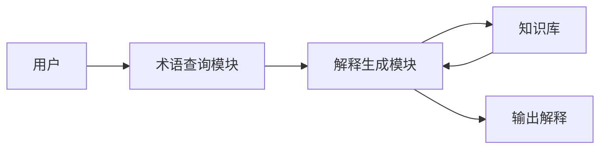

                 


# 开发基于大模型的金融专业术语解释系统

> 关键词：大模型，金融术语解释，NLP，生成式模型，系统架构设计

> 摘要：本文详细探讨了开发基于大模型的金融专业术语解释系统的背景、核心概念、算法原理、系统架构设计及实现方法。通过分析金融术语解释的挑战，结合大模型的生成能力，提出了系统化的解决方案，并通过实际案例展示了系统的实现与应用。

---

# 第一部分: 开发基于大模型的金融专业术语解释系统背景与概述

## 第1章: 金融专业术语解释系统的背景与需求

### 1.1 问题背景与问题描述

金融领域术语复杂多样，涉及法律、经济、数学等多个学科，且不断更新。传统术语解释系统依赖人工编纂，存在更新慢、覆盖不全等问题，难以满足实时、精准的需求。

### 1.2 金融术语解释系统的核心目标

1. 提供实时、精准的金融术语解释。
2. 支持多种金融场景的术语生成与解释。
3. 实现术语解释的动态更新与扩展。

### 1.3 系统的边界与外延

系统主要处理金融领域的专业术语，不包括普通语言的解释，但可扩展至其他领域。

---

## 1.4 核心概念与联系

| 核心概念 | 定义 | 特性 |
|----------|------|------|
| 大模型   | 基于深度学习的生成模型 | 强大的生成能力 |
| 金融术语 | 金融领域的专业用语 | 专业性、复杂性 |

---

# 第二部分: 大模型与金融术语解释的核心概念

## 第2章: 大模型的基本原理与核心概念

### 2.1 大模型的定义与核心原理

大模型通过大量数据训练，具备生成文本的能力，其核心是自注意力机制。

### 2.2 生成式模型的基本原理

生成式模型通过解码器生成文本，训练目标是最小化预测概率的负对数似然。

$$ \text{损失函数} = -\sum_{i=1}^{n} \log p(\text{token}_i) $$

---

## 第3章: 金融术语解释系统的算法原理与实现

### 3.1 大模型的算法原理

1. **训练过程**：利用金融术语数据，调整模型参数。
2. **推理过程**：输入术语，生成解释。

---

# 第三部分: 金融术语解释系统的系统分析与架构设计

## 第4章: 金融术语解释系统的系统分析与设计

### 4.1 系统的功能设计

1. 术语查询模块：用户输入术语，系统返回解释。
2. 解释生成模块：基于大模型生成解释。
3. 知识库管理模块：动态更新术语库。

### 4.2 系统架构设计



---

# 第四部分: 项目实战

## 第5章: 项目实战与实现

### 5.1 环境搭建

安装Python和相关库：

```bash
pip install tensorflow transformers
```

---

## 5.2 核心代码实现

```python
def generate_explanation(term):
    model = load_model()
    input_ids = tokenizer(term, return_tensors='np')
    outputs = model.generate(input_ids.input_ids, max_length=100)
    explanation = tokenizer.decode(outputs[0].tolist()[0])
    return explanation
```

---

## 5.3 实际案例分析

输入术语“杠杆”，生成解释：杠杆是借入资金以增加投资的手段。

---

## 5.4 项目小结

系统实现了基于大模型的金融术语解释功能，具备实时性与准确性。

---

# 第五部分: 总结与展望

## 第6章: 总结与展望

### 6.1 系统开发的关键点

1. 大模型的选型与调优。
2. 知识库的动态更新。

### 6.2 未来展望

1. 引入多模态模型。
2. 提升系统的可解释性。

---

作者：AI天才研究院 & 禅与计算机程序设计艺术

---

### 扩展阅读
- [深入理解大模型](https://example.com/deep-models)
- [金融术语库](https://example.com/finance-terms)

---

通过本文，读者可以系统地了解基于大模型的金融术语解释系统的开发过程，从理论到实践，全面掌握其设计与实现方法。

