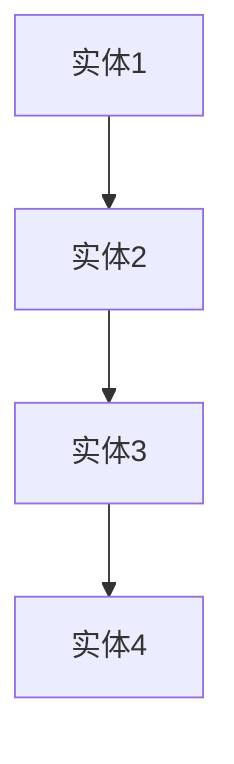

                 

<think>
嗯，我现在需要按照用户的要求，逐步构建《开发基于大模型的金融专业知识图谱动态更新系统》这篇文章的目录大纲。首先，我应该先理清用户的需求，确保每个部分都涵盖到位。

首先，用户希望文章有吸引人的章节标题，结构清晰，内容专业且详细。关键词包括金融、知识图谱、大模型、动态更新、系统架构、算法实现等。摘要需要简明扼要地概述文章的核心内容。

接下来，我要规划各章节的内容。第一章应该是背景与概述，介绍问题背景、目标和解决方案。第二章深入知识图谱和大模型的基础知识，探讨它们的结合。第三章详细讲解系统设计，包括功能模块和架构。第四章涉及算法原理，特别是知识抽取和动态更新的算法。第五章通过项目实战展示实现过程，第六章优化与扩展，最后总结与展望。

在构建过程中，我需要确保每个章节都有足够的细节，使用mermaid图表来辅助说明，比如系统架构图、算法流程图等。同时，数学公式要用latex格式，确保清晰易懂。代码示例部分需要详细解读，帮助读者理解实现过程。

可能会遇到的问题是如何平衡各部分的篇幅，确保整体结构紧凑，同时内容丰富。我需要多次调整章节顺序，确保逻辑流畅，每个部分之间衔接自然。此外，还要注意使用正确的markdown格式，确保目录的层级分明。

最后，检查是否有遗漏的部分，比如是否涵盖了所有关键点，如系统架构设计中的类图、架构图和序列图，以及算法部分的数学模型和代码示例。确保每个章节都有足够的细节，帮助读者全面理解开发过程。
</think>

# 开发基于大模型的金融专业知识图谱动态更新系统

> 关键词：金融，知识图谱，大模型，动态更新，系统架构，算法实现

> 摘要：本文详细探讨了开发基于大模型的金融专业知识图谱动态更新系统的各个方面。从背景介绍、核心概念到系统架构设计、算法实现，再到项目实战与优化扩展，文章全面解析了该系统的构建过程和实现细节。通过本文，读者将深入了解如何利用大模型技术实现知识图谱的动态更新，为金融领域的智能化应用提供有力支持。

---

## 第一部分: 开发背景与概述

### 第1章: 问题背景与目标

#### 1.1 问题背景
##### 1.1.1 金融领域的知识图谱需求
金融领域的复杂性要求我们能够高效地管理和利用大量的金融知识，包括公司信息、市场动态、法律法规等。知识图谱作为一种结构化的知识表示方法，能够帮助我们更好地理解和分析这些信息。

##### 1.1.2 大模型在金融领域的应用现状
近年来，大模型在金融领域的应用逐渐增多，尤其是在自然语言处理、风险评估和智能投资领域。大模型的强大能力为知识图谱的构建和更新提供了新的可能性。

##### 1.1.3 知识图谱动态更新的必要性
金融市场的动态变化要求知识图谱能够实时更新，以反映最新的市场信息和趋势。动态更新能够确保知识图谱的准确性和及时性，为金融决策提供可靠支持。

#### 1.2 问题描述
##### 1.2.1 知识图谱的定义与特点
知识图谱是一种以图结构形式表示知识的工具，节点表示实体或概念，边表示实体之间的关系。知识图谱具有语义丰富、结构清晰、易于推理等特点。

##### 1.2.2 动态更新的挑战
知识图谱的动态更新需要解决数据源的多样性、更新频率的控制以及更新后的验证与评估等问题。此外，如何高效地处理大规模数据也是一个重要挑战。

##### 1.2.3 系统目标与功能概述
本系统的目标是开发一个基于大模型的金融专业知识图谱动态更新系统，能够实时抽取、融合和更新金融领域的知识。系统功能包括知识抽取、知识融合、动态更新和查询推理等模块。

#### 1.3 系统解决方案
##### 1.3.1 基于大模型的知识抽取方法
利用大模型的强大自然语言处理能力，从金融文本中抽取实体、关系和事件等信息。

##### 1.3.2 动态更新机制的设计
设计高效的更新策略，如增量式更新和基于变化检测的更新，确保知识图谱的实时性和准确性。

##### 1.3.3 系统架构的整体思路
采用分层架构设计，将系统划分为知识抽取、知识融合、动态更新和查询推理等功能模块，各模块协同工作，实现知识图谱的动态更新。

---

## 第2章: 核心概念与联系

### 2.1 知识图谱基础
#### 2.1.1 知识图谱的定义
知识图谱是一种以图结构形式表示知识的工具，节点表示实体或概念，边表示实体之间的关系。

#### 2.1.2 知识图谱的构建过程
知识图谱的构建过程包括数据获取、实体识别、关系抽取、知识融合和存储等步骤。

#### 2.1.3 知识图谱的表示方法
常用的知识图谱表示方法包括RDF、RDFS、OWL和图嵌入等。

### 2.2 大模型基础
#### 2.2.1 大模型的定义与特点
大模型是指具有大量参数的深度学习模型，具有强大的自然语言处理能力，能够理解和生成人类语言。

#### 2.2.2 大模型在自然语言处理中的应用
大模型在文本生成、机器翻译、问答系统和情感分析等领域有广泛应用。

#### 2.2.3 大模型与知识图谱的结合
大模型可以作为知识图谱的知识库，利用知识图谱提升大模型的推理能力和上下文理解能力。

### 2.3 知识图谱与大模型的关系
#### 2.3.1 知识图谱作为大模型的知识库
知识图谱为大模型提供结构化的知识，帮助模型更好地理解和回答问题。

#### 2.3.2 大模型辅助知识图谱的构建与更新
大模型可以用于自动抽取知识图谱中的实体和关系，提高构建和更新的效率。

#### 2.3.3 两者的协同作用
知识图谱和大模型的结合能够实现更智能的知识管理和应用，如智能问答、智能投资决策等。

---

## 第3章: 系统设计与架构

### 3.1 系统功能模块
#### 3.1.1 知识抽取模块
知识抽取模块负责从金融文本中抽取实体、关系和事件等信息。

#### 3.1.2 知识融合模块
知识融合模块将抽取的信息进行清洗、合并和冲突处理，构建统一的知识图谱。

#### 3.1.3 动态更新模块
动态更新模块负责实时监控数据源的变化，触发知识图谱的更新。

#### 3.1.4 查询与推理模块
查询与推理模块支持用户对知识图谱进行复杂查询，并基于知识图谱进行推理。

### 3.2 系统架构设计
#### 3.2.1 分层架构设计
系统分为数据层、业务逻辑层和应用层，各层之间通过接口进行交互。

#### 3.2.2 微服务架构设计
采用微服务架构，将系统功能模块化，各服务独立运行，提高系统的扩展性和维护性。

#### 3.2.3 数据流与服务调用关系
数据流从数据源流向知识抽取模块，经过处理后存储在知识库中，最终通过查询与推理模块提供服务。

### 3.3 实体关系图架构

---

## 第4章: 算法原理与实现

### 4.1 知识抽取算法
#### 4.1.1 基于大模型的实体识别
使用大模型进行实体识别，通过预训练模型提取文本中的实体信息。

#### 4.1.2 关系抽取的实现
基于大模型的关系抽取，利用上下文信息判断实体之间的关系类型。

#### 4.1.3 实例抽取的流程
从文本中抽取实例，包括实体、关系和事件等信息。

### 4.2 知识图谱构建算法
#### 4.2.1 实体链接算法
通过实体链接算法将抽取的实体信息与知识图谱中的实体进行匹配。

#### 4.2.2 关系抽取的优化方法
优化关系抽取算法，提高抽取的准确性和召回率。

#### 4.2.3 知识融合策略
通过冲突检测和合并策略，将多个来源的信息融合到知识图谱中。

### 4.3 动态更新算法
#### 4.3.1 基于变化检测的更新方法
通过变化检测，识别数据源中的新增、删除和修改信息，触发知识图谱的更新。

#### 4.3.2 增量式更新算法
采用增量式更新算法，仅更新变化的部分，提高更新效率。

#### 4.3.3 更新后的验证与评估
对更新后的知识图谱进行验证和评估，确保其准确性和完整性。

---

## 第5章: 项目实战与实现

### 5.1 环境搭建与工具安装
#### 5.1.1 开发环境配置
安装Python、Jupyter Notebook、Git等开发工具，配置开发环境。

#### 5.1.2 大模型框架的安装与配置
安装大模型框架，如TensorFlow、PyTorch等，并配置相关库和依赖。

#### 5.1.3 数据库与存储的选型
选择合适的数据库和存储方案，如Neo4j用于存储知识图谱，MongoDB用于存储其他数据。

### 5.2 系统核心实现
#### 5.2.1 知识抽取模块的实现
使用大模型进行实体识别和关系抽取，实现知识抽取模块。

#### 5.2.2 知识图谱构建模块的实现
将抽取的信息进行清洗、合并和存储，构建知识图谱。

#### 5.2.3 动态更新模块的实现
设计动态更新算法，实现知识图谱的实时更新。

### 5.3 系统功能实现
#### 5.3.1 知识抽取功能
展示知识抽取模块的实现代码和运行结果。

#### 5.3.2 知识图谱构建功能
展示知识图谱构建模块的实现代码和构建后的知识图谱结构。

#### 5.3.3 动态更新功能
展示动态更新模块的实现代码和更新后的知识图谱。

---

## 第6章: 优化与扩展

### 6.1 系统优化
#### 6.1.1 性能优化
通过优化算法和架构设计，提高系统的处理效率和响应速度。

#### 6.1.2 可扩展性优化
设计模块化架构，方便系统的扩展和维护。

### 6.2 系统扩展
#### 6.2.1 新功能的添加
根据实际需求，添加新的功能模块，如高级查询功能。

#### 6.2.2 新数据源的接入
接入更多的数据源，丰富知识图谱的内容。

### 6.3 注意事项
#### 6.3.1 数据质量管理
确保数据的准确性和完整性，避免错误信息的传播。

#### 6.3.2 系统安全性
加强系统的安全性设计，防止数据泄露和攻击。

---

## 第7章: 总结与展望

### 7.1 总结
本文详细介绍了开发基于大模型的金融专业知识图谱动态更新系统的各个方面，从背景介绍到系统设计，再到实现与优化，全面解析了系统的构建过程。

### 7.2 展望
未来，随着大模型技术的不断发展，金融专业知识图谱动态更新系统将更加智能化和高效化。我们期待更多的创新和应用，为金融领域的智能化发展提供更有力的支持。

---

## 作者信息

作者：AI天才研究院/AI Genius Institute & 禅与计算机程序设计艺术 /Zen And The Art of Computer Programming

