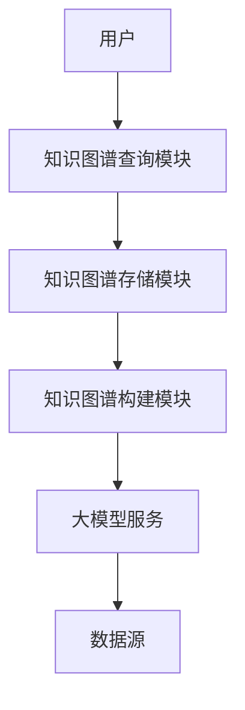

                 


# 开发基于大模型的金融专业知识图谱构建系统

> 关键词：知识图谱，大模型，金融领域，系统构建，算法原理

> 摘要：本文详细探讨了基于大模型的金融专业知识图谱构建系统的开发过程，从问题背景到系统设计，再到项目实战，全面解析了构建金融知识图谱的核心技术与实现方法。文章通过理论分析与实践案例相结合的方式，深入阐述了大模型在金融知识图谱构建中的应用价值，并提供了系统的架构设计与优化建议。

---

## 目录

1. [问题背景与目标](#问题背景与目标)
2. [知识图谱与大模型的核心原理](#知识图谱与大模型的核心原理)
3. [知识图谱构建的算法原理](#知识图谱构建的算法原理)
4. [系统架构与设计](#系统架构与设计)
5. [项目实战与实现](#项目实战与实现)
6. [最佳实践与注意事项](#最佳实践与注意事项)

---

## 1. 问题背景与目标

### 1.1 问题背景介绍

#### 1.1.1 知识图谱的概念与作用
知识图谱是一种以图结构形式表示知识的语义网络，通过实体和关系将分散的知识连接起来，形成一个可计算的、结构化的知识库。它能够帮助机器理解复杂的数据关系，广泛应用于搜索引擎优化、智能问答系统、推荐系统等领域。

在金融领域，知识图谱能够帮助我们更好地理解金融市场的结构、金融机构之间的关系、金融产品的特性以及金融事件的影响。例如，通过构建金融知识图谱，可以快速识别一家公司的供应链关系、关联企业、投资关系等，从而辅助风险评估和投资决策。

#### 1.1.2 大模型在知识图谱构建中的优势
大模型（如GPT、BERT等）具有强大的自然语言处理能力，能够从大量的文本数据中提取隐含的知识和关系。与传统的知识图谱构建方法相比，基于大模型的知识图谱构建方法具有以下优势：

- **自动化与智能化**：大模型可以自动从文本中抽取实体和关系，减少人工干预。
- **高精度**：大模型通过对上下文的理解，能够更准确地识别实体和关系。
- **可扩展性**：大模型可以处理多种语言和领域，适应性强。

#### 1.1.3 金融领域知识图谱的特殊性
金融领域的知识图谱具有以下特殊性：

- **术语复杂性**：金融领域涉及大量专业术语，如“杠杆率”、“市盈率”、“收益率曲线”等。
- **数据多样性**：金融数据包括文本、表格、图像等多种形式，需要综合处理。
- **实时性要求高**：金融市场的数据变化快，知识图谱需要实时更新。

### 1.2 问题描述与目标

#### 1.2.1 金融知识图谱的构建需求
- 构建覆盖金融领域的知识图谱，包括机构、人物、产品、事件等实体。
- 建立实体之间的关系，如“投资”、“控股”、“关联交易”等。
- 提供高效的查询和推理能力，支持复杂的金融问题解答。

#### 1.2.2 系统开发的核心目标
- 开发一套基于大模型的金融知识图谱构建系统，实现知识抽取、知识表示、知识推理等功能。
- 提供用户友好的接口，支持金融领域的应用开发。

#### 1.2.3 边界与外延
- 知识图谱的构建仅限于金融领域，不涉及其他领域。
- 系统的核心功能包括知识抽取、知识图谱构建、知识存储与管理、知识图谱查询与应用。

### 1.3 核心概念与联系

#### 1.3.1 知识图谱的核心要素
- 实体：金融领域的实体，如公司、机构、人物、产品等。
- 关系：实体之间的关系，如“控股”、“投资”、“交易”等。
- 属性：实体的属性，如公司名称、注册资本、成立时间等。

#### 1.3.2 大模型在知识图谱构建中的角色
- **知识抽取**：大模型从文本中抽取实体和关系。
- **知识表示**：大模型将抽取的知识表示为结构化的数据。
- **知识推理**：大模型通过推理能力，补充知识图谱中的缺失关系。

#### 1.3.3 金融领域的实体关系分析
- **公司关系**：如控股、参股、并购等。
- **产品关系**：如基金、股票、债券等之间的关系。
- **事件关系**：如收购、上市、破产等。

### 1.4 本章小结
本章从问题背景出发，介绍了知识图谱和大模型的基本概念，分析了金融领域知识图谱的特殊性，并明确了系统开发的核心目标和边界。

---

## 2. 知识图谱与大模型的核心原理

### 2.1 知识图谱构建原理

#### 2.1.1 知识图谱的构建流程
知识图谱的构建流程一般包括以下步骤：
1. 数据采集：从多种数据源采集金融领域的文本、表格、图像等数据。
2. 知识抽取：从数据中抽取实体、关系和属性。
3. 知识融合：将抽取的知识进行清洗、合并和优化。
4. 知识表示：将知识表示为结构化的数据，如RDF、图数据库等。
5. 知识推理：通过推理算法，补充知识图谱中的缺失知识。

#### 2.1.2 知识抽取与表示方法
- **知识抽取**：基于规则、统计和深度学习的方法。
- **知识表示**：使用图论中的节点和边表示实体和关系。

#### 2.1.3 知识融合与推理机制
- **知识融合**：通过冲突检测和解决算法，合并多个数据源的知识。
- **知识推理**：通过逻辑推理和关联规则挖掘，补充知识图谱中的关系。

### 2.2 大模型在知识图谱中的应用原理

#### 2.2.1 大模型的文本处理能力
- 大模型通过对大规模文本数据的学习，掌握了大量的金融术语和行业知识。
- 大模型可以理解上下文，准确识别实体和关系。

#### 2.2.2 大模型的知识表示与推理能力
- 大模型可以将抽取的知识表示为结构化的形式，并通过推理能力补充知识图谱中的缺失关系。
- 基于大模型的推理算法，可以实现复杂的逻辑推理。

#### 2.2.3 大模型的可扩展性与灵活性
- 大模型可以扩展到其他领域，适应不同的金融场景。
- 大模型的灵活性使其能够快速响应市场变化，实时更新知识图谱。

### 2.3 金融领域知识图谱的特殊性

#### 2.3.1 金融领域的术语与概念
- 金融领域涉及大量的专业术语，如“杠杆率”、“市盈率”、“收益率曲线”等。
- 需要对术语进行标准化处理，确保知识图谱的准确性。

#### 2.3.2 金融数据的复杂性与多样性
- 金融数据包括文本、表格、图像等多种形式，需要综合处理。
- 需要处理多语言数据，如中英文混合的金融文本。

#### 2.3.3 金融知识图谱的行业标准与规范
- 金融领域有严格的行业标准和规范，如会计准则、金融监管规定等。
- 知识图谱需要符合行业规范，确保数据的准确性和合法性。

### 2.4 本章小结
本章详细阐述了知识图谱和大模型的核心原理，并分析了金融领域知识图谱的特殊性。大模型的强大能力为金融知识图谱的构建提供了新的思路和方法。

---

## 3. 知识图谱构建的算法原理

### 3.1 知识抽取算法

#### 3.1.1 基于规则的抽取方法
- 使用正则表达式匹配特定的模式，抽取实体和关系。
- 适用于规则明确的场景，如公司名称、日期等。

#### 3.1.2 基于统计的抽取方法
- 使用统计模型，通过概率计算确定实体和关系。
- 常见的统计方法包括朴素贝叶斯、条件随机场（CRF）等。

#### 3.1.3 基于深度学习的抽取方法
- 使用深度学习模型，如LSTM、BERT等，进行端到端的知识抽取。
- 优点是能够捕捉上下文信息，准确识别实体和关系。

### 3.2 知识表示与推理算法

#### 3.2.1 知识图谱的表示方法
- 使用RDF（Resource Description Framework）表示知识，由主体、谓词、宾语组成。
- 使用图数据库（如Neo4j）存储知识图谱，支持高效的查询和推理。

#### 3.2.2 知识推理的逻辑框架
- 基于规则的推理：根据预定义的规则进行推理。
- 基于逻辑的推理：使用逻辑推理算法，如一阶逻辑推理。
- 基于概率的推理：使用贝叶斯网络等方法进行推理。

#### 3.2.3 基于大模型的推理算法
- 使用大模型进行推理，通过输入问题和知识图谱，生成答案。
- 可以结合知识图谱中的实体和关系，进行复杂的推理。

### 3.3 知识融合与优化算法

#### 3.3.1 知识冲突的检测与解决
- 检测知识图谱中的冲突，如同一实体的不同名称、矛盾的关系等。
- 使用冲突解决算法，如基于相似度的合并、基于规则的冲突消除等。

#### 3.3.2 知识图谱的优化策略
- 通过优化算法，如图嵌入、节点合并等，提升知识图谱的效率和准确性。
- 使用压缩算法，减少知识图谱的存储空间。

#### 3.3.3 基于大模型的自适应优化
- 使用大模型对知识图谱进行实时优化，适应数据的变化。
- 通过反馈机制，动态调整知识图谱的结构。

### 3.4 本章小结
本章详细介绍了知识图谱构建中的算法原理，包括知识抽取、知识表示、知识推理和知识优化的算法。大模型的应用为知识图谱的构建提供了新的思路和方法。

---

## 4. 系统架构与设计

### 4.1 系统架构设计

#### 4.1.1 系统整体架构图


#### 4.1.2 各模块的功能描述
- **知识图谱查询模块**：接收用户的查询请求，返回查询结果。
- **知识图谱存储模块**：存储知识图谱的数据，支持高效的查询和更新。
- **知识图谱构建模块**：负责知识的抽取、表示和推理，构建知识图谱。
- **大模型服务**：提供大模型的调用接口，支持知识抽取和推理。

#### 4.1.3 系统的可扩展性设计
- 系统支持多种数据源的接入，如文本、表格、图像等。
- 知识图谱构建模块支持多种算法的扩展，方便后续优化和升级。

### 4.2 系统功能设计

#### 4.2.1 数据采集模块
- **功能描述**：从多种数据源采集金融领域的数据，如新闻、公告、财务报表等。
- **实现方式**：通过爬虫、API接口等方式采集数据，并进行预处理。

#### 4.2.2 知识抽取模块
- **功能描述**：从采集的数据中抽取实体、关系和属性。
- **实现方式**：使用基于规则、统计或深度学习的方法进行抽取。

#### 4.2.3 知识图谱构建模块
- **功能描述**：将抽取的知识进行融合、表示和推理，构建知识图谱。
- **实现方式**：使用图数据库存储知识图谱，并通过算法优化知识图谱的结构。

#### 4.2.4 知识图谱存储与管理模块
- **功能描述**：存储知识图谱的数据，支持高效的查询和更新。
- **实现方式**：使用图数据库（如Neo4j）存储知识图谱，并提供管理接口。

#### 4.2.5 知识图谱查询与应用模块
- **功能描述**：提供用户友好的查询接口，支持复杂的金融问题解答。
- **实现方式**：通过自然语言处理技术，解析用户的查询请求，并返回结果。

### 4.3 系统接口设计

#### 4.3.1 系统内部接口
- **知识抽取模块与数据采集模块的接口**：数据抽取接口。
- **知识图谱构建模块与知识图谱存储模块的接口**：知识存储接口。

#### 4.3.2 系统外部接口
- **用户与知识图谱查询模块的接口**：用户查询接口。
- **大模型服务与知识图谱构建模块的接口**：大模型调用接口。

#### 4.3.3 接口的交互流程
1. 用户通过查询接口提交查询请求。
2. 查询模块调用知识图谱存储模块，获取相关知识。
3. 知识图谱存储模块返回结果。
4. 查询模块将结果返回给用户。

### 4.4 本章小结
本章详细设计了系统的架构和功能，明确了各模块之间的关系和接口设计。系统的可扩展性设计为后续优化和升级提供了基础。

---

## 5. 项目实战与实现

### 5.1 环境搭建与配置

#### 5.1.1 开发环境的选择与安装
- **开发工具**：建议使用Python、Jupyter Notebook、PyCharm等。
- **大模型服务**：可以选择开源的大模型框架，如Hugging Face的Transformers库，或者使用云服务（如阿里云的大模型服务）。
- **图数据库**：建议使用Neo4j作为知识图谱的存储工具。

#### 5.1.2 大模型的调用与配置
- 安装Transformers库：`pip install transformers`
- 加载预训练模型：`from transformers import AutoTokenizer, AutoModelForMaskedLM`
- 使用模型进行文本处理。

#### 5.1.3 知识图谱存储工具的安装与配置
- 下载Neo4j社区版：https://neo4j.com/download/
- 安装完成后，启动Neo4j服务。
- 使用Cypher语言进行图数据库的查询和管理。

### 5.2 核心代码实现

#### 5.2.1 知识抽取模块的实现
```python
from transformers import AutoTokenizer, AutoModelForMaskedLM
import torch

# 加载预训练模型
tokenizer = AutoTokenizer.from_pretrained('bert-base-chinese')
model = AutoModelForMaskedLM.from_pretrained('bert-base-chinese')

def extract_entities(text):
    inputs = tokenizer.encode_plus(text, return_tensors='pt', padding=True, truncation=True)
    with torch.no_grad():
        outputs = model(**inputs)
    # 提取实体
    return outputs
```

#### 5.2.2 知识图谱构建模块的实现
```python
import neo4j

# 连接Neo4j数据库
driver = neo4j.Driver('bolt://localhost:7687', auth=('neo4j', 'password'))

def create_node(label, properties):
    with driver.session() as session:
        session.write_transaction(
            lambda tx: tx.create(
                ('Node', {'label': label, **properties})
            )
        )

def create_relationship(start_node, end_node, relationship):
    with driver.session() as session:
        session.write_transaction(
            lambda tx: tx.create(
                (start_node, 'RELATIONSHIP', end_node),
                {'type': relationship}
            )
        )
```

#### 5.2.3 知识图谱查询与应用模块的实现
```python
def query_knowledge_graph(question):
    with driver.session() as session:
        result = session.read_transaction(
            lambda tx: tx.run(
                "MATCH (n) WHERE n.label = $label RETURN n",
                label=question
            )
        )
    return result.records
```

### 5.3 项目案例分析

#### 5.3.1 案例背景介绍
- 案例目标：构建一个小型的金融知识图谱，包含公司、人物、投资关系等实体。
- 数据来源：公开的公司公告、新闻报道等。

#### 5.3.2 案例实现过程
1. 采集数据：从新闻网站采集相关公司的信息。
2. 知识抽取：使用BERT模型抽取实体和关系。
3. 知识图谱构建：将抽取的知识存储到Neo4j数据库中。
4. 查询与应用：通过用户查询，返回相关的结果。

#### 5.3.3 案例结果与分析
- 成功构建了小型金融知识图谱，能够支持简单的查询和推理。
- 通过案例分析，验证了系统设计的可行性和有效性。

### 5.4 本章小结
本章通过实际案例，详细介绍了系统的实现过程，包括环境搭建、核心代码实现和案例分析。通过实践，验证了系统的可行性和实用性。

---

## 6. 最佳实践与注意事项

### 6.1 开发过程中的注意事项

#### 6.1.1 数据质量的重要性
- 数据的质量直接影响知识图谱的准确性，需要进行数据清洗和预处理。
- 数据来源的多样性和权威性是构建高质量知识图谱的关键。

#### 6.1.2 知识图谱构建的效率优化
- 通过并行计算和分布式处理，提升知识图谱的构建效率。
- 使用高效的算法和工具，优化知识图谱的构建过程。

#### 6.1.3 系统的可维护性
- 系统设计需要考虑可维护性，方便后续优化和升级。
- 通过模块化设计，降低系统的耦合度，提升系统的可维护性。

### 6.2 最佳实践 tips
- **数据处理**：在数据采集和处理阶段，尽量使用自动化工具，减少人工干预。
- **模型选择**：根据具体任务需求，选择合适的模型和算法，避免过度复杂化。
- **系统优化**：通过监控和日志分析，及时发现和解决问题，提升系统的稳定性和性能。

### 6.3 小结
本章总结了开发过程中需要注意的事项和最佳实践，为后续的系统优化和升级提供了参考。

---

## 作者：AI天才研究院/AI Genius Institute & 禅与计算机程序设计艺术/Zen And The Art of Computer Programming

---

通过以上内容，我们详细探讨了开发基于大模型的金融专业知识图谱构建系统的各个方面，从理论到实践，从设计到实现，为读者提供了全面的指导和参考。

