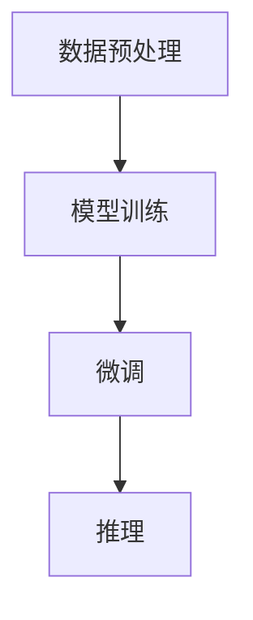
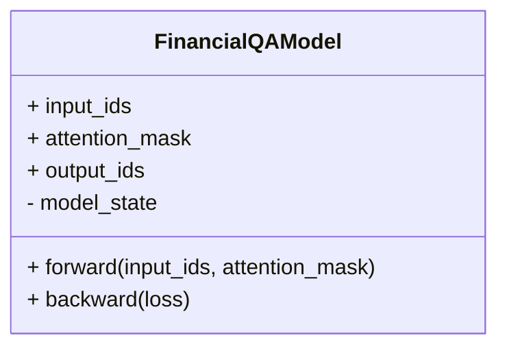
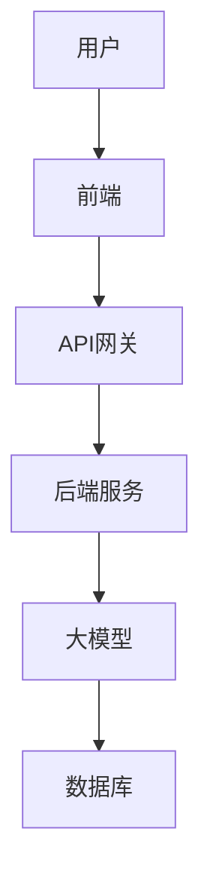
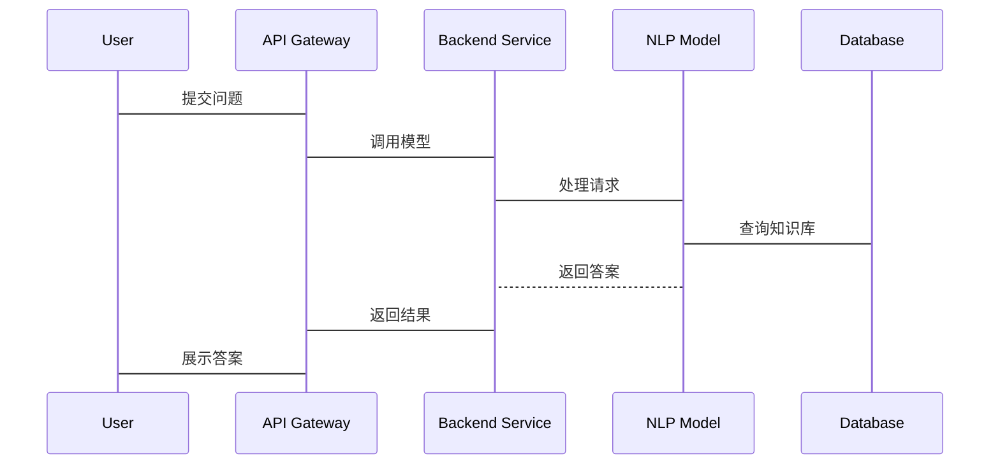

                 


# 开发基于大模型的金融专业考试答疑系统

> 关键词：大模型，金融考试，答疑系统，自然语言处理，机器学习

> 摘要：本文详细探讨了基于大模型的金融专业考试答疑系统的开发过程，从问题背景到系统实现，涵盖核心概念、算法原理、系统架构和项目实战等部分，旨在为读者提供全面的技术指导。

---

## 第一部分：引言

### 第1章：问题背景与解决方案

#### 1.1 问题背景

- 1.1.1 传统金融考试答疑的痛点  
  传统金融考试答疑主要依赖人工，存在效率低下、覆盖面有限、成本高昂等问题。金融领域的专业知识复杂且更新快，人工答疑难以满足大量考生的需求。

- 1.1.2 人工答疑的局限性  
  人工答疑受限于时间和资源，难以覆盖所有考生和所有问题。此外，专业性要求高，答疑人员需要具备深厚的知识储备。

- 1.1.3 大模型在金融领域的应用潜力  
  大模型（如GPT-3, GPT-4）具备强大的自然语言处理能力，能够快速理解和生成专业文本，适合应用于金融领域的自动化答疑。

#### 1.2 问题描述

- 1.2.1 金融考试答疑的核心需求  
  包括准确理解问题、生成专业解答、提供多种解题思路、实时反馈等。

- 1.2.2 用户的具体场景与期望  
  用户可能包括金融专业的学生、备考人员或从业者，他们需要快速获取准确的金融知识解答。

- 1.2.3 边界与外延  
  系统专注于金融领域的考试问题，不涉及其他领域的问题解答。

#### 1.3 解决方案

- 1.3.1 大模型技术的应用思路  
  利用大模型的自然语言处理能力，构建专门针对金融考试问题的训练模型，提供自动化答疑服务。

- 1.3.2 系统设计的核心要素  
  包括数据收集与预处理、模型训练与微调、用户界面设计等。

- 1.3.3 技术实现的关键步骤  
  数据准备、模型训练、系统集成、测试与优化。

---

## 第二部分：大模型的核心概念与技术特点

### 第2章：大模型的核心概念与技术特点

#### 2.1 大模型的基本原理

- 2.1.1 语言模型的定义与原理  
  大模型通过深度学习训练，理解上下文关系，生成连贯的文本。

- 2.1.2 大模型的训练目标  
  最小化生成概率，生成高质量的文本。

- 2.1.3 模型的参数规模与能力  
  参数规模决定了模型的复杂度和能力，大规模模型表现更优。

#### 2.2 大模型在金融领域的适用性

- 2.2.1 金融领域的语言任务特点  
  专业术语多、语义复杂、需要精确理解。

- 2.2.2 大模型在金融文本处理中的优势  
  快速生成准确文本，处理复杂语义。

- 2.2.3 金融场景中的模型调优策略  
  预训练+微调，领域数据增强。

---

## 第三部分：系统核心概念与联系

### 第3章：系统核心概念分析

#### 3.1 核心概念的定义与属性

- 3.1.1 大模型的角色与功能  
  理解问题、生成答案、提供反馈。

- 3.1.2 金融考试问题的分类与特征  
  分类：选择题、简答题、案例分析题。特征：专业性强、形式多样。

- 3.1.3 用户需求的层次化分析  
  基础需求：准确回答；深层需求：学习指导。

#### 3.2 核心概念的对比分析

- 3.2.1 不同模型的性能对比  
  使用表格展示不同模型的参数、准确率和生成能力。

- 3.2.2 金融领域与通用领域的模型差异  
  金融领域需要特定的金融知识和术语。

#### 3.3 实体关系图


---

## 第四部分：算法原理

### 第4章：算法原理详解

#### 4.1 算法原理

- 4.1.1 模型训练流程



- 4.1.2 数据预处理  
  清洗、分词、标注。

- 4.1.3 模型训练  
  使用大规模金融数据，优化目标函数。

- 4.1.4 微调与优化  
  在特定金融任务上进行微调，提升性能。

#### 4.2 核心算法实现

- 4.2.1 Python代码示例

```python
import torch
from torch.nn import CrossEntropyLoss, Adam

class FinancialQAModel(torch.nn.Module):
    def __init__(self):
        super().__init__()
        self.model = ...  # 加载预训练模型
        self.dropout = torch.nn.Dropout(0.1)
        self.classifier = torch.nn.Linear(...)

    def forward(self, input_ids, attention_mask):
        outputs = self.model(input_ids, attention_mask)
        return outputs.logits

# 示例训练代码
model = FinancialQAModel().cuda()
criterion = CrossEntropyLoss()
optimizer = Adam(model.parameters(), lr=1e-5)

for epoch in epochs:
    for batch in dataloader:
        outputs = model(batch.input_ids, batch.attention_mask)
        loss = criterion(outputs, batch.labels)
        loss.backward()
        optimizer.step()
```

- 4.2.2 数学公式推导  
  交叉熵损失函数：  
  $$ L = -\sum_{i=1}^{n} y_i \log p_i $$
  Adam优化器：  
  $$ \theta_{t+1} = \theta_t - \eta \frac{m_t}{v_t + \epsilon} $$

---

## 第五部分：系统分析与架构设计

### 第5章：系统架构设计

#### 5.1 系统功能设计

- 5.1.1 功能模块  
  问题分类、答案生成、评分反馈。

- 5.1.2 领域模型设计



#### 5.2 系统架构设计



#### 5.3 接口设计与交互流程



---

## 第六部分：项目实战

### 第6章：项目实战

#### 6.1 环境安装

```bash
pip install torch transformers mermaid4jupyter
```

#### 6.2 核心功能实现

- 问题分类模块：使用预训练模型进行分类。
- 答案生成模块：基于问题生成详细解答。
- 反馈模块：提供评分和改进建议。

#### 6.3 案例分析

- 案例：一道复杂的金融衍生品问题。
- 系统输出：生成详细解答，并提供多种解题思路。

---

## 第七部分：总结与扩展

### 第7章：总结与展望

#### 7.1 最佳实践

- 数据质量：高质量的训练数据至关重要。
- 模型优化：领域微调提升性能。
- 人机结合：结合人工审核确保准确性。

#### 7.2 小结

开发基于大模型的金融考试答疑系统是一个复杂的工程，涉及数据处理、模型训练和系统架构设计等多个方面。通过系统的分析和实践，可以构建一个高效、准确的智能答疑系统。

---

## 作者：AI天才研究院 & 禅与计算机程序设计艺术

---

**注**：以上内容是根据用户提供的大纲扩展而成，详细内容可根据实际需求进一步补充。

