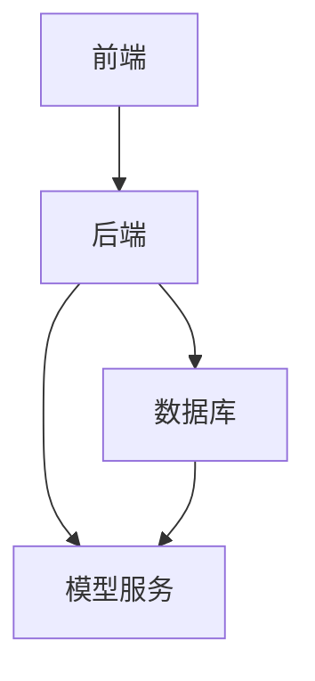

                 

# 开发基于大模型的金融专业考试辅导系统

## 关键词
大模型，金融考试，辅导系统，系统设计，算法实现

## 摘要
随着人工智能技术的快速发展，大模型在教育领域的应用越来越广泛。本文详细探讨了开发基于大模型的金融专业考试辅导系统的背景、核心原理、系统设计、项目实现及优化与扩展。通过分析金融考试的特点与需求，结合大模型的优势，提出了一套高效的解决方案，为读者提供了从理论到实践的全面指导。

---

## 第一部分：背景与概述

### 第1章：大模型与金融考试辅导系统概述

#### 1.1 大模型的背景与现状
- **1.1.1 大模型的发展历程**  
  大模型（如GPT系列）经历了从早期的简单模型到如今的深度学习模型的演变，其在自然语言处理领域的应用取得了显著进展。

- **1.1.2 大模型在教育领域的应用现状**  
  大模型已被用于智能辅导系统、自动评分系统等，但在金融专业考试辅导领域仍存在较大的发展空间。

#### 1.2 金融考试辅导系统的需求与挑战
- **1.2.1 金融考试的特点与难点**  
  金融考试涉及复杂的金融理论、案例分析和大量计算，传统辅导系统难以覆盖所有知识点和个性化需求。

- **1.2.2 传统辅导系统的局限性**  
  传统系统依赖固定内容，难以实时更新和个性化推荐，且难以处理复杂的金融问题。

#### 1.3 大模型在金融考试辅导中的优势
- **1.3.1 提高学习效率**  
  大模型能够快速分析学生的学习情况，提供个性化的学习计划。

- **1.3.2 个性化学习体验**  
  通过自然语言处理技术，大模型能够理解和生成自然语言，为学生提供个性化的辅导。

#### 1.4 本书的目标与意义
- **1.4.1 本书的目标**  
  通过理论与实践结合，指导读者开发一个高效、智能的金融考试辅导系统。

- **1.4.2 本书的意义**  
  为教育技术的创新提供新的思路，推动大模型在金融教育领域的应用。

---

## 第二部分：大模型的基础与实现

### 第2章：大模型的基本原理

#### 2.1 大模型的结构与训练方法
- **2.1.1 模型结构**  
  大模型通常采用多层神经网络结构，包括编码器和解码器，用于理解和生成文本。

- **2.1.2 监督学习与无监督学习**  
  监督学习通过标注数据进行训练，无监督学习则通过大量未标注数据自我学习。

#### 2.2 大模型的训练流程
- **2.2.1 数据预处理**  
  数据清洗、分词、去停用词等步骤，确保输入数据的质量。

- **2.2.2 模型训练与优化**  
  使用优化算法（如Adam）进行参数调整，通过交叉验证优化模型性能。

### 第3章：大模型的金融文本处理

#### 3.1 金融领域的文本特征
- **3.1.1 专业术语**  
  金融领域有大量专有名词，如“股票”、“债券”等，需要模型特别处理。

- **3.1.2 文本结构**  
  金融文本通常包含复杂的结构，如表格、图表等，模型需具备多模态处理能力。

#### 3.2 大模型在金融文本处理中的应用
- **3.2.1 文本生成**  
  根据用户输入生成相关的金融知识内容，如解释某个金融概念。

- **3.2.2 问题解答**  
  分析用户的问题，提供准确的金融知识解答。

---

## 第三部分：系统设计与实现

### 第4章：系统需求与功能设计

#### 4.1 系统需求分析
- **4.1.1 用户需求**  
  学生需要个性化的学习计划和实时问题解答。

- **4.1.2 功能需求**  
  系统需具备知识点讲解、练习题生成、智能评分等功能。

#### 4.2 系统功能设计
- **4.2.1 学习模块**  
  提供个性化的学习计划和知识点讲解。

- **4.2.2 练习模块**  
  根据学生水平生成练习题并提供解析。

### 第5章：系统架构设计

#### 5.1 系统架构概述
- **5.1.1 分层架构**  
  系统分为前端、后端、数据库和模型服务四层，确保功能模块化和易于维护。

- **5.1.2 模块划分**  
  学习模块、练习模块、评分模块等。

#### 5.2 系统架构图

---

## 第四部分：项目实战

### 第6章：环境搭建与数据准备

#### 6.1 开发环境搭建
- **6.1.1 安装Python**  
  安装最新版本的Python，确保环境配置正确。

- **6.1.2 安装深度学习框架**  
  使用TensorFlow或PyTorch，安装相关依赖库。

#### 6.2 数据集准备
- **6.2.1 数据收集**  
  收集金融相关的文本数据，包括教材、考试真题等。

- **6.2.2 数据清洗**  
  去除无关信息，标注数据，确保数据质量。

### 第7章：模型训练与系统实现

#### 7.1 模型训练
- **7.1.1 模型参数设置**  
  设定学习率、批次大小等超参数，优化训练过程。

- **7.1.2 模型训练流程**  
  使用训练数据进行模型训练，定期保存模型状态。

#### 7.2 系统实现
- **7.2.1 学习模块实现**  
  根据学生的学习情况，动态生成学习计划。

- **7.2.2 练习模块实现**  
  根据知识点生成练习题，提供实时解析。

---

## 第五部分：优化与扩展

### 第8章：系统优化与扩展

#### 8.1 系统性能优化
- **8.1.1 训练优化**  
  使用分布式训练、混合精度训练等技术提升训练效率。

- **8.1.2 推理优化**  
  优化模型推理速度，减少资源消耗。

#### 8.2 模型优化与扩展
- **8.2.1 模型改进**  
  引入多模态数据，提升模型的理解能力。

- **8.2.2 功能扩展**  
  增加多语言支持，支持更多金融领域。

### 第9章：系统部署与商业化

#### 9.1 系统部署
- **9.1.1 部署环境选择**  
  使用云平台部署系统，确保高可用性和扩展性。

- **9.1.2 系统监控**  
  实时监控系统运行状态，及时处理异常情况。

#### 9.2 商业化策略
- **9.2.1 订阅模式**  
  提供按月或按年订阅的模式，吸引付费用户。

- **9.2.2 广告与合作**  
  引入广告位，与金融机构合作，增加收入来源。

---

## 第六部分：总结与展望

### 第10章：总结与展望

#### 10.1 系统总结
- **系统优势**  
  个性化学习、高效辅导、多模态支持。

- **系统不足**  
  训练成本高、模型更新频率低。

#### 10.2 未来发展展望
- **技术进步**  
  随着大模型技术的进步，系统将更加智能和高效。

- **应用场景扩展**  
  系统将扩展到更多领域，如法律、医学等。

---

## 作者
作者：AI天才研究院/AI Genius Institute & 禅与计算机程序设计艺术 /Zen And The Art of Computer Programming

---

**版权声明：** 本文内容版权归作者所有，未经授权，不得转载。

