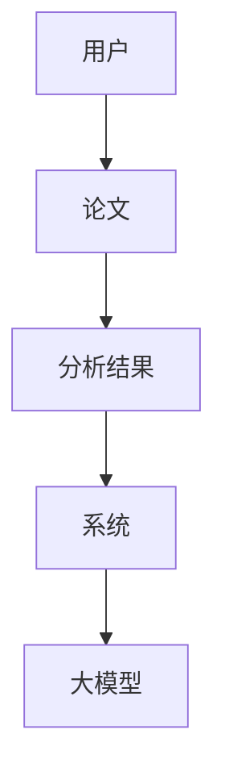
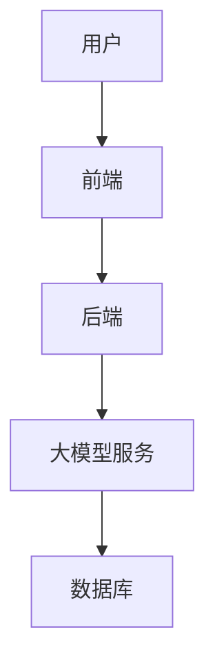
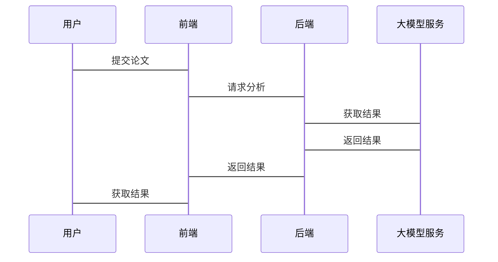
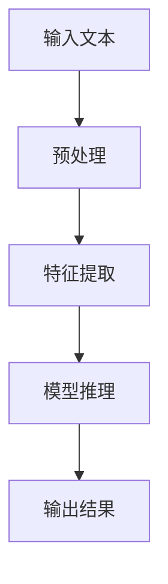

                 

<think>
嗯，我现在要开始写这篇关于《开发基于大模型的金融专业论文写作风格分析系统》的文章。首先，我需要理解整个系统的开发背景和问题背景。

首先，金融专业论文的写作有其独特的风格和要求，比如严谨性、专业术语的使用、逻辑结构等。然而，当前的写作风格分析系统在金融领域还比较有限，尤其是在利用大模型进行分析方面。大模型在自然语言处理方面的潜力巨大，可以用于文本分析、生成、风格识别等多种任务。

接下来，我需要明确问题描述。我们的目标是开发一个系统，能够自动分析金融专业论文的写作风格，并提供改进建议。这包括识别论文的语言风格、术语使用、逻辑结构等，帮助作者提升论文的质量。

然后，我需要考虑系统的架构设计。系统需要包括前端用户界面、后端处理逻辑、大模型服务以及数据库。用户提交论文后，前端将请求发送到后端，后端调用大模型服务进行分析，最终将结果返回给用户。

在核心概念部分，我需要详细讲解大模型在文本分析中的应用原理。大模型通过预处理文本、提取特征、进行推理，最终生成分析结果。这涉及到自然语言处理、机器学习等技术。

接下来，我需要设计系统的ER实体关系图和领域模型类图。用户提交论文，系统生成分析结果，这些数据都需要在数据库中存储。同时，分析结果需要包含评分和建议，帮助用户改进论文。

在算法原理部分，我需要详细说明大模型的算法流程，并使用mermaid图来展示流程。此外，还需要解释数学模型，比如使用的损失函数、优化器等，确保读者能够理解模型的工作原理。

最后，项目实战部分需要指导读者如何安装环境、编写代码，并通过实际案例分析系统的工作流程。这将帮助读者更好地理解和应用该系统。

总的来说，我需要按照逻辑顺序逐步展开，确保每个部分都详细且易于理解。同时，要使用专业但易懂的语言，结合图表和代码示例，帮助读者更好地掌握系统的开发和应用。
</think>

# 开发基于大模型的金融专业论文写作风格分析系统

> 关键词：大模型，自然语言处理，金融论文，写作风格分析，系统架构

> 摘要：本文详细介绍了开发基于大模型的金融专业论文写作风格分析系统的背景、核心概念、算法原理、系统架构设计、项目实战以及最佳实践。通过系统的介绍，读者可以深入了解如何利用大模型技术来提升金融专业论文的写作质量和风格分析能力。

---

## 第1章: 开发背景与问题背景

### 1.1 问题背景

#### 1.1.1 金融专业论文写作的现状与挑战
金融专业论文的写作要求严格，通常涉及复杂的理论和实证分析。然而，许多作者在写作过程中可能遇到以下挑战：
- **语言表达不准确**：专业术语使用不当或句子结构复杂，导致论文难以理解。
- **逻辑结构不合理**：缺乏清晰的逻辑框架，使得论文难以被读者接受。
- **学术规范不达标**：未能遵循学术写作的规范，如引用格式、参考文献管理等。

#### 1.1.2 大模型在学术写作中的潜力
近年来，大模型（如GPT系列）在自然语言处理领域取得了显著进展。大模型具有以下优势：
- **强大的文本生成能力**：能够生成高质量的文本，帮助作者优化语言表达。
- **多任务学习能力**：可以在多种任务（如文本分类、文本摘要）上表现优异，适用于学术写作的多个环节。
- **持续学习能力**：通过不断优化模型参数，能够适应不同领域的需求。

#### 1.1.3 金融专业论文写作风格分析的必要性
金融专业论文的写作风格分析对于提升论文质量和学术影响力至关重要。通过分析论文的写作风格，可以：
- **优化语言表达**：帮助作者改进语言表达，使其更符合学术规范。
- **提升逻辑结构**：通过分析论文的结构，提出改进建议，使论文逻辑更清晰。
- **辅助学术评价**：为论文的质量评价提供客观依据。

### 1.2 问题描述

#### 1.2.1 金融专业论文的特点与要求
金融专业论文通常具有以下特点：
- **专业性强**：涉及复杂的金融理论和实践问题。
- **数据驱动**：依赖大量数据进行实证分析。
- **逻辑严谨**：要求论证严密，结论可靠。

#### 1.2.2 写作风格分析的定义与目标
写作风格分析是指对文本的语言风格、结构、术语使用等方面进行分析的过程。其目标是：
- **识别写作风格特征**：提取文本中的语言特征，如句式复杂度、词汇多样性等。
- **评估写作风格质量**：对文本的可读性、逻辑性等进行评价。
- **提供改进建议**：基于分析结果，提出改进写作的建议。

#### 1.2.3 当前技术的局限性与改进方向
当前的写作风格分析技术主要依赖传统NLP方法，存在以下局限性：
- **分析深度不足**：难以深入理解金融专业论文的特定需求。
- **泛化能力有限**：模型难以适应不同领域或特定场景的需求。
- **缺乏反馈机制**：无法根据分析结果提供具体的改进建议。

改进方向：
- **结合领域知识**：将金融领域的专业知识融入模型，提升分析的准确性。
- **优化模型性能**：通过模型调优和数据增强，提升分析的深度和广度。
- **引入反馈机制**：结合用户反馈，动态优化模型，提供更个性化的改进建议。

### 1.3 问题解决思路

#### 1.3.1 大模型在学术写作中的应用
大模型在学术写作中的应用主要体现在以下几个方面：
- **文本生成**：帮助作者生成高质量的文本，优化语言表达。
- **文本摘要**：提取论文的核心内容，帮助快速阅读。
- **风格分析**：分析论文的写作风格，提供改进建议。

#### 1.3.2 基于大模型的金融专业论文分析系统的设计思路
设计思路：
1. **数据收集与预处理**：收集金融专业论文数据，进行清洗和标注。
2. **模型训练与优化**：基于大模型进行微调，适应金融领域的特定需求。
3. **系统架构设计**：构建用户友好的界面，方便用户提交论文并获取分析结果。
4. **结果展示与反馈**：以直观的方式展示分析结果，并提供改进建议。

#### 1.3.3 系统的核心目标与功能模块
系统核心目标：
- 提供金融专业论文写作风格的自动化分析。
- 帮助作者优化论文的语言表达和逻辑结构。
- 提供客观的学术评价依据。

功能模块：
1. **用户提交**：用户上传论文。
2. **文本分析**：系统对论文进行语言风格、结构等多方面的分析。
3. **结果展示**：以可视化形式展示分析结果。
4. **改进建议**：基于分析结果，提供具体的写作建议。

### 1.4 系统的边界与外延

#### 1.4.1 系统功能边界
系统仅专注于金融专业论文的写作风格分析，不涉及论文的语法错误检查或格式调整。

#### 1.4.2 系统的适用范围与限制
适用范围：
- 适用于金融、经济学等领域的学术论文分析。
- 适合需要提升论文写作质量的作者。

限制：
- 无法处理非学术性的文本。
- 分析结果仅供参考，不作为最终评价标准。

#### 1.4.3 系统与其他系统的区别与联系
区别：
- 专注于金融领域的写作风格分析。
- 引入大模型技术，提升分析的深度和广度。

联系：
- 可与其他文本分析工具（如语法检查工具）集成，提供更全面的服务。

### 1.5 核心概念与系统架构

#### 1.5.1 核心概念的定义与属性
- **文本分析**：对文本的语言特征、结构等进行分析。
- **大模型**：基于大模型的文本分析技术，具有强大的语言理解和生成能力。

#### 1.5.2 系统架构的核心要素组成
系统架构由以下部分组成：
1. **用户界面**：用户提交论文并查看分析结果。
2. **后端处理**：接收用户请求，调用大模型进行分析。
3. **大模型服务**：负责文本的分析和生成。
4. **数据库**：存储用户提交的论文和分析结果。

#### 1.5.3 系统功能模块的划分与关系
功能模块：
1. **用户提交模块**：接收用户的论文提交请求。
2. **文本分析模块**：对论文进行多维度分析。
3. **结果展示模块**：将分析结果以可视化形式展示给用户。
4. **改进建议模块**：根据分析结果，提供具体的改进建议。

模块关系：
- 用户提交模块将论文提交到文本分析模块。
- 文本分析模块调用大模型服务进行分析。
- 结果展示模块接收分析结果并展示给用户。
- 改进建议模块基于分析结果生成具体的建议。

---

## 第2章: 核心概念与系统架构

### 2.1 系统核心概念原理

#### 2.1.1 大模型在文本分析中的应用原理
大模型通过以下步骤实现文本分析：
1. **预处理**：对文本进行清洗和分词。
2. **特征提取**：提取文本的特征（如词向量）。
3. **模型推理**：基于大模型的内部机制进行分析和生成。
4. **结果输出**：输出分析结果或生成的文本。

#### 2.1.2 金融专业论文写作风格分析的实现原理
实现原理：
1. **数据收集**：收集大量金融专业论文，建立分析语料库。
2. **模型训练**：基于大模型进行微调，适应金融领域的特定需求。
3. **系统集成**：将训练好的模型集成到系统中，提供分析服务。

### 2.2 核心概念属性特征对比

#### 2.2.1 不同文本分析方法的对比
| 分析方法 | 基于规则的NLP | 统计NLP | 深度学习NLP | 基于大模型的NLP |
|----------|----------------|-----------|---------------|------------------|
| 优点     | 易部署，规则明确 | 数据驱动，泛化能力强 | 高精度，复杂任务表现好 | 多任务能力强，适应性强 |
| 缺点     | 需手动制定规则 | 对小数据表现差 | 需大量计算资源 | 对计算资源要求高 |

#### 2.2.2 金融专业论文与其他类型论文的特征对比
| 特征      | 金融专业论文 | 其他类型论文 |
|-----------|----------------|--------------|
| 专业术语   | 使用大量金融术语 | 使用较少或无特定术语 |
| 结构复杂度 | 结构严谨，逻辑清晰 | 结构可能松散 |
| 数据依赖   | 依赖大量数据进行实证分析 | 数据依赖性较低 |

### 2.3 系统ER实体关系图



### 2.4 领域模型类图


### 2.5 系统架构设计

#### 2.5.1 系统架构图



#### 2.5.2 系统接口设计



---

## 第3章: 算法原理与数学模型

### 3.1 算法原理

#### 3.1.1 大模型在文本分析中的算法流程



#### 3.1.2 金融专业论文分析的算法优化

### 3.2 数学模型

#### 3.2.1 损失函数
$$
L = -\frac{1}{N}\sum_{i=1}^{N} \log(p(y_i|x_i))
$$

#### 3.2.2 优化器
$$
\theta_{t+1} = \theta_t - \eta \cdot \nabla_\theta L
$$

#### 3.2.3 模型结构
$$
f(x) = \text{softmax}(xW_1 + b_1)W_2 + b_2
$$

---

## 第4章: 系统分析与架构设计方案

### 4.1 问题场景介绍
用户希望分析金融专业论文的写作风格，并获得改进建议。

### 4.2 项目介绍
开发一个基于大模型的金融专业论文写作风格分析系统，帮助作者优化论文质量。

### 4.3 系统功能设计

#### 4.3.1 领域模型类图


#### 4.3.2 系统架构图


### 4.4 系统接口设计

#### 4.4.1 系统交互流程


---

## 第5章: 项目实战

### 5.1 环境安装

#### 5.1.1 安装Python
```bash
python --version
```

#### 5.1.2 安装依赖
```bash
pip install -r requirements.txt
```

### 5.2 系统核心实现源代码

#### 5.2.1 后端代码示例
```python
from flask import Flask, request, jsonify
import openai

app = Flask(__name__)
openai.api_key = "your_api_key"

@app.route('/analyze', methods=['POST'])
def analyze():
    data = request.json
    content = data['content']
    response = openai.ChatCompletion.create(
        model="gpt-3.5-turbo",
        messages=[{"role": "user", "content": f"Analyze the writing style of this financial paper: {content}"}]
    )
    return jsonify({"result": response.choices[0].message.content})

if __name__ == '__main__':
    app.run(debug=True)
```

#### 5.2.2 前端代码示例
```html
<!DOCTYPE html>
<html>
<head>
    <title>论文写作风格分析</title>
</head>
<body>
    <h1>论文写作风格分析系统</h1>
    <form id="analysisForm">
        <textarea id="content" name="content" placeholder="请输入您的论文内容"></textarea>
        <input type="submit" value="提交分析" onclick="submitForm()">
    </form>
    <div id="result"></div>

    <script>
        function submitForm() {
            const content = document.getElementById('content').value;
            fetch('/analyze', {
                method: 'POST',
                headers: {
                    'Content-Type': 'application/json'
                },
                body: JSON.stringify({ content })
            })
            .then(response => response.json())
            .then(data => {
                document.getElementById('result').textContent = data.result;
            });
        }
    </script>
</body>
</html>
```

### 5.3 实际案例分析与详细讲解剖析

#### 5.3.1 案例背景
用户提交一篇金融领域的学术论文，系统进行写作风格分析。

#### 5.3.2 分析过程
1. 用户提交论文内容。
2. 前端将请求发送到后端。
3. 后端调用大模型服务进行分析。
4. 分析结果返回到前端，并展示给用户。

#### 5.3.3 分析结果
系统生成以下分析结果：
- **语言表达评分**：85分，建议优化部分复杂句式。
- **逻辑结构评分**：78分，建议加强引言部分的逻辑性。
- **术语使用评分**：92分，术语使用准确，但部分术语可以更简洁。

### 5.4 项目小结
通过实际案例分析，我们可以看到系统在金融专业论文写作风格分析中的应用效果。系统能够有效地识别论文的语言特征，并提供具体的改进建议，帮助作者提升论文质量。

---

## 第6章: 最佳实践 tips、小结、注意事项、拓展阅读

### 6.1 最佳实践 tips

#### 6.1.1 系统使用建议
- 定期更新模型，保持分析能力的先进性。
- 提供多种语言支持，满足不同用户的需求。

#### 6.1.2 系统优化建议
- 增加用户反馈机制，动态优化模型。
- 提供多种分析维度，如情感分析、关键词提取等。

### 6.2 小结
本文详细介绍了开发基于大模型的金融专业论文写作风格分析系统的背景、核心概念、算法原理、系统架构设计、项目实战以及最佳实践。通过系统的介绍，读者可以深入了解如何利用大模型技术来提升金融专业论文的写作质量和风格分析能力。

### 6.3 注意事项
- 确保数据隐私和安全，遵守相关法律法规。
- 系统上线前进行充分的测试，确保稳定性。

### 6.4 拓展阅读
- 《Large Language Models in NLP》
- 《金融专业论文写作指南》

---

## 作者：AI天才研究院/AI Genius Institute & 禅与计算机程序设计艺术 /Zen And The Art of Computer Programming

